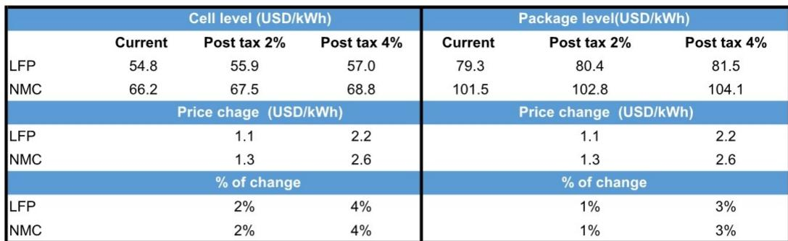
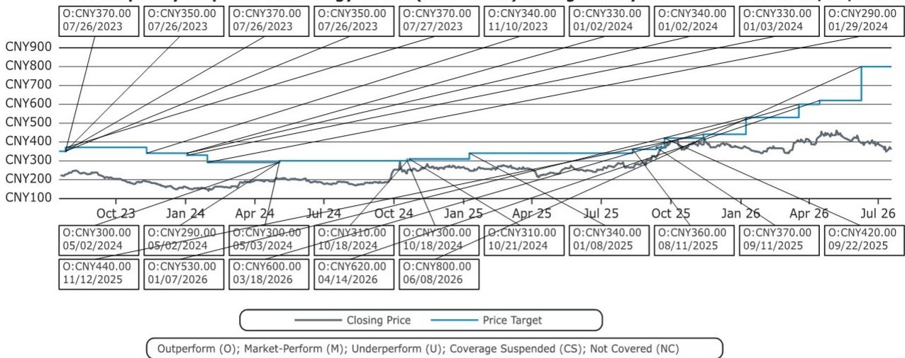
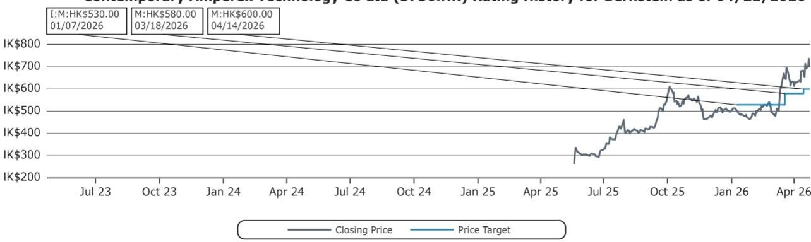

# China's New Battery Consumption Tax Is Not a Revenue Measure—It Is an Industrial Policy Signal to Consolidate Capacity and Accelerate Technology Transition

On July 16, 2026, China's Ministry of Finance, General Administration of Customs, and State Taxation Administration issued Announcement No. 20 of 2026, introducing a phased consumption tax on lithium-ion batteries after an eleven-year exemption. Starting September 1, 2026, a 2% consumption tax will be levied at the cell level, doubling to 4% from September 1, 2027. For a market accustomed to policy support for strategic industries, this marks a decisive shift.

The immediate financial impact is modest. At current LFP battery prices of USD 54.8/kWh, a 4% tax adds USD 2.2/kWh. At the pack level, the increase is 3% for both LFP and NMC chemistries. For energy storage systems, the total cost increase reaches just 1-2% by 2027. These numbers alone will not reshape demand curves. But the policy's purpose is not revenue generation.

This tax is a targeted industrial intervention. It is designed to accelerate two simultaneous outcomes: the consolidation of China's overcapacity-ridden battery manufacturing base, and the forced migration of production capacity toward next-generation battery technologies. The exemption for sodium-ion batteries, solid-state batteries, and fuel cells through at least December 2028 makes the directional signal unambiguous. The policy rewards technological discontinuity, not incremental improvement.

The timing is strategic. China's battery industry is in a paradoxical state: booming demand alongside wafer-thin margins for Tier 2 producers. Triple-digit growth in energy storage demand has triggered exuberant capacity expansion. The consumption tax introduces a structural cost penalty that will compress margins for marginal producers while leaving scale-efficient leaders relatively unscathed. This is not a tax on batteries. It is a tax on overcapacity.

## The Consumption Tax Creates a Structural Cost Disadvantage for Tier 2 Battery Makers That Are Already Operating at Negative Margins

The policy's most immediate and consequential effect will be felt not by end customers but by China's fragmented Tier 2 battery manufacturing base. Current battery pack prices for LFP stand at USD 79.3/kWh and for NMC at USD 101.5/kWh. A 3% increase at the pack level by 2027 represents roughly USD 2.2/kWh and USD 2.6/kWh respectively. For a Tier 2 producer operating on margins of 1-3%, this cost cannot be absorbed without turning cash-flow negative.

The critical distinction is between the ability to pass through costs and the ability to absorb them. CATL, with a 45% market share and pricing power derived from scale and technology leadership, can negotiate pass-through terms with OEMs. Tier 2 players cannot. They face a binary choice: raise prices and lose volume, or absorb the tax and destroy what little margin remains. The policy effectively creates a minimum efficiency threshold below which production becomes structurally unviable.

This mechanism is well understood in Chinese industrial policy. The consumption tax on batteries mirrors the logic of earlier environmental taxes on steel and cement—sectors where China used cost-based regulatory pressure to force capacity closure rather than direct capacity caps. The policy does not mandate factory closures. It creates an economic environment in which marginal capacity cannot survive. The outcome is the same, but the political optics are different.

The timing of the phased introduction—2% in September 2026, rising to 4% in September 2027—gives the market a 14-month adjustment window. This is deliberate. It allows Tier 2 producers to either achieve the scale and efficiency necessary to absorb the cost, or to exit the market in an orderly fashion. The policy avoids a disruptive shock while creating a clear trajectory toward consolidation.

## Exports Are Exempt, Meaning the Tax Is Designed to Reshape Domestic Supply Structure, Not to Penalize China's Global Battery Competitiveness

A crucial design feature of the consumption tax is its domestic-only scope. The policy applies to batteries produced, processed, sold, imported, or used domestically in China. Exports remain subject to the existing consumption-tax refund or exemption treatment, which is unchanged. Approximately 20% of China's total battery production is exported and will not be affected.

This distinction matters for two reasons. First, it confirms that the policy is not protectionist in intent. China is not using the tax to restrict battery exports or to create a price advantage for domestic buyers. The export channel remains fully competitive. Second, it means that the consolidation pressure will fall disproportionately on capacity that serves the domestic market—precisely where the overcapacity problem is most acute.

The export exemption also creates an interesting strategic dynamic for Chinese battery makers with significant international exposure. CATL, which generates a meaningful portion of its revenue from exports and from overseas production bases, faces a lower effective tax burden on its total output than a Tier 2 producer that sells exclusively into the domestic market. The policy thus reinforces the competitive advantages of scale and geographic diversification.

For global battery buyers, the implication is clear. Chinese battery exports will not become more expensive as a result of this policy. The cost impact is contained within China's domestic supply chain. International automakers and energy storage developers sourcing from China will not see price increases attributable to the consumption tax. The policy reshapes China's internal market structure without altering its external pricing dynamics.

## The Exemption for Sodium-Ion and Solid-State Batteries Creates a Regulatory Incentive Structure That Directs Capital Toward Next-Generation Technologies

The most strategically significant element of the policy is not the tax itself but the exemption structure. Sodium-ion batteries, solid-state batteries, fuel cells, and advanced photovoltaic cells remain entirely exempt from consumption tax through December 31, 2028. The announcement does not specify the tax treatment after this date, creating an implicit deadline for technology commercialization.

This exemption creates a regulatory arbitrage opportunity that is intentionally large. A battery manufacturer producing conventional LFP cells faces a 4% cost penalty by 2027. A manufacturer producing sodium-ion or solid-state cells faces zero. On a 100 GWh production base, this difference amounts to hundreds of millions of dollars in annual cost advantage. The signal to capital allocators is unambiguous: invest in next-generation battery technologies or accept a structural cost disadvantage.

The report estimates that by 2030, roughly 10-20% of total battery production in China will be solid-state or sodium-ion. This is a remarkably aggressive adoption timeline. For context, solid-state batteries today are at the pilot-line stage, and sodium-ion batteries are just entering early commercial production. The consumption tax effectively accelerates this timeline by making conventional lithium-ion production progressively more expensive relative to emerging alternatives.

The exemption also creates a natural hedge for leading players like CATL, which is at the forefront of commercializing both sodium-ion and solid-state batteries. For companies with diversified technology portfolios, the tax becomes a competitive weapon. For companies with legacy lithium-ion capacity and no next-generation pipeline, it becomes an existential threat. The policy rewards technological breadth and punishes single-technology concentration.

## The Policy Functions as an Anti-Involution Mechanism That Will Accelerate Industry Consolidation Around Scale Leaders Like CATL

The Chinese term "involution" describes a pattern of intense competition that drives down margins without producing industry consolidation or innovation. China's battery industry has been a textbook case of involution: rapid capacity expansion, price wars, and wafer-thin margins at the Tier 2 level, even as overall demand grows at triple-digit rates. The consumption tax is a direct policy response to this dynamic.

The mechanism is elegant in its simplicity. By introducing a fixed percentage cost that applies uniformly to all lithium-ion cell production, the tax creates a larger absolute cost burden for inefficient producers. A Tier 2 manufacturer with higher production costs, lower yield rates, and weaker pricing power faces a proportionally larger impact on its margin structure than a Tier 1 producer. The tax amplifies existing cost disadvantages rather than creating new ones.

This logic explains why CATL's stock has been weak in the month preceding the announcement despite strong industry fundamentals. The market likely anticipated that some form of regulatory intervention was coming, and the uncertainty around the mechanism weighed on sentiment. But the actual policy design is broadly supportive for CATL and negative for its smaller competitors. CATL's scale, technology leadership, export exposure, and next-generation battery pipeline all position it to benefit from the consolidation that the tax will accelerate.

The valuation context reinforces this argument. CATL trades at approximately 13x P/E on the A-share and 18x on the H-share, with revenue growing at a 20-30% CAGR over the next five years. The consumption tax introduces a modest headwind to near-term earnings but accelerates the structural tailwinds of industry consolidation and technology transition. For a company with CATL's competitive position, the risk-reward calculus remains favorable.

## A Decision Framework for Observers: Three Dimensions to Evaluate Exposure to China's Battery Consumption Tax

For those assessing exposure to China's battery supply chain, the consumption tax creates a new analytical dimension that must be integrated into decision-making. The following framework captures the three critical variables that determine which companies will be net beneficiaries and which will be net losers.

The first dimension is scale efficiency. The tax is a percentage of cell value, meaning its absolute impact scales with production volume. A company producing 200 GWh annually faces a USD 440 million annual cost at the 4% rate on LFP cells. A company producing 10 GWh faces USD 22 million. The larger producer has greater ability to absorb, pass through, or offset this cost through operational leverage. Observers should evaluate each company's cost position relative to the industry average and its ability to maintain margins under a 2-4% cost increase.

The second dimension is technology diversification. Companies with meaningful exposure to sodium-ion or solid-state batteries will benefit from the exemption window. This is not merely a defensive consideration. The exemption creates a pricing advantage that can be used to gain market share in domestic applications where battery cost is a key purchasing criterion. Companies with a single-technology focus on conventional lithium-ion face a structural disadvantage that will compound over time as the tax rate increases.

The third dimension is geographic revenue mix. Companies with significant export exposure face a lower effective tax burden on total output. The 20% of Chinese battery production that is exported is exempt. For a company where exports represent 40% of revenue, the effective tax rate on total production is meaningfully lower than for a company that sells exclusively domestically. Observers should calculate the effective tax rate on each company's total output, not just the headline rate on domestic sales.

These three dimensions interact. A company with scale efficiency, technology diversification, and export exposure is in a fundamentally different competitive position than a company that lacks all three. The consumption tax does not create these differences. It amplifies them. The policy's impact on any given company is a function of its pre-existing competitive position, not of the tax itself.

The policy also introduces a temporal dimension that must be tracked. The exemption for emerging technologies expires on December 31, 2028, with no specified treatment thereafter. If the exemption is extended, the competitive advantage for sodium-ion and solid-state producers persists. If it is not, the cost advantage disappears and the thesis for those technologies shifts. The December 2028 deadline creates a catalyst event that should be monitored closely.

*For informational purposes only. Portions may be generated, translated, summarized, or edited with AI assistance based on source materials and may contain omissions or errors. Please verify independently. This is not professional advice.*

For informational purposes only. Portions may be generated, translated, summarized, or edited with AI assistance based on source materials and may contain omissions or errors. Please verify independently. This is not professional advice.

