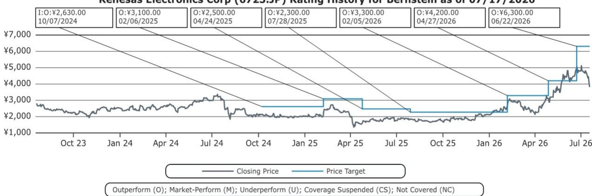
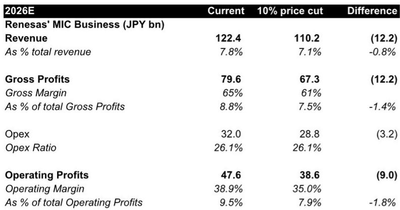
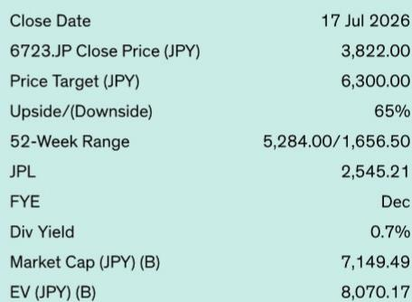

# Bernstein：瑞萨存储器接口调查影响可控

7月15日，韩国与美国对瑞萨电子、澜起科技和Rambus启动存储器接口产品潜在价格合谋调查，涉及DDR5寄存器时钟驱动器（RCD）和数据缓冲器。市场关注这一事件对瑞萨的利润冲击，但Bernstein最新报告给出一个与市场担忧相反的判断：即便在最差情景下，影响也极为有限。

报告的核心逻辑并非淡化调查本身，而是基于两个可验证的事实。其一，存储器接口业务仅占瑞萨2025年营收约6%，2026年预计升至7-8%。其二，该业务毛利率约65%，与领先的Fabless同行60-70%的毛利率水平相当，并非异常偏高。这意味着，即便调查导致价格调整，瑞萨的利润结构也不会发生根本性动摇。

> **KC评论：** 报告通过情景分析量化了不确定性。假设存储器接口产品价格下降10个百分点至55%毛利率，对瑞萨整体营收的影响仅为0.8%，对营业利润的影响为1.8%。这个数字来自报告中的Exhibit 1，是理解“影响有限”判断最直接的证据。

## 1. 高毛利率有结构性支撑，并非合谋结果

市场对“价格合谋”的担忧，往往源于对高毛利率的直觉怀疑。但Bernstein指出，瑞萨、澜起科技和Rambus在存储器接口领域60-70%的毛利率，主要由四个结构性因素驱动：IP授权壁垒、控制器/平台认证周期、稀缺供应以及有限的替代方案。这些因素共同构成了高利润的护城河，而非短期定价行为。

报告特别强调，任何法律行动都难以改变市场结构本身。这意味着，即便调查最终认定存在不当行为，处罚或和解方案也很难触及这些结构性优势，从而无法从根本上改变瑞萨在该领域的盈利能力。

## 2. 瑞萨的真正增长引擎不在存储器接口

报告重申了对瑞萨的积极看法，其核心依据并非存储器接口业务，而是AI电源需求的崛起。Bernstein认为，CPU的复兴正在成为电源半导体需求的第二增长引擎，其增速可能超过供应端扩张。瑞萨与英飞凌在这一领域均处于有利位置。

从估值角度看，瑞萨当前报价对应2026年预期市盈率约15.6倍，2027年降至12.8倍。在AI电源需求持续扩张的背景下，这一估值水平并未充分反映其增长潜力。

## 3. 一个可复用的观察框架：如何评估反垄断调查对半导体公司的影响

这份报告提供了一个简洁但有效的分析框架。评估类似事件时，可以关注三个维度：一是涉事业务在公司整体营收和利润中的占比；二是该业务高利润率的来源是结构性还是行为性；三是在最差情景下，利润冲击是否超过公司整体利润的5%。

以瑞萨为例，存储器接口业务贡献约9.5%的营业利润，即便最差情景下利润冲击也仅为1.8%。这个数字远低于触发公司战略调整或估值重估的门槛。对于读者而言，当类似调查出现时，先做这道算术题，往往比直接恐慌更有价值。

报告没有回避调查的不确定性，但通过量化分析给出了清晰的边界。在AI电源需求成为半导体行业新主线的背景下，瑞萨的核心叙事并未因这次调查而改变。

For informational purposes only. Portions may be generated,translated,summarized,or edited with AI assistance based on source materials and may contain omissions or errors. Please verify independently. This is not investment,legal,tax,accounting,or other professional advice.

For informational purposes only. Portions may be generated,translated,summarized,or edited with AI assistance based on source materials and may contain omissions or errors. Please verify independently. This is not investment,legal,tax,accounting,or other professional advice.

