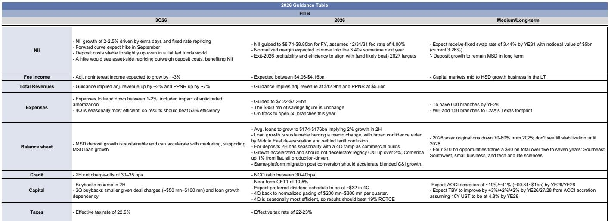
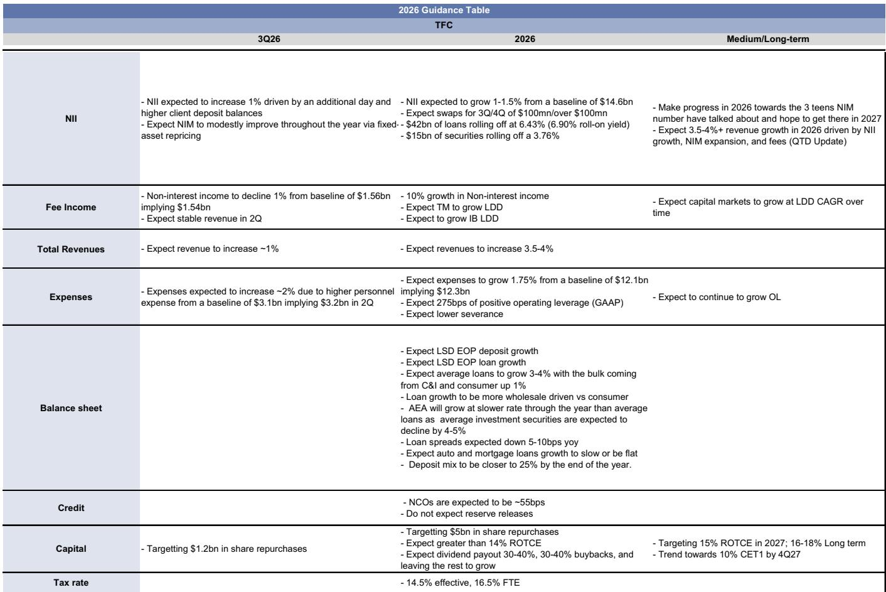
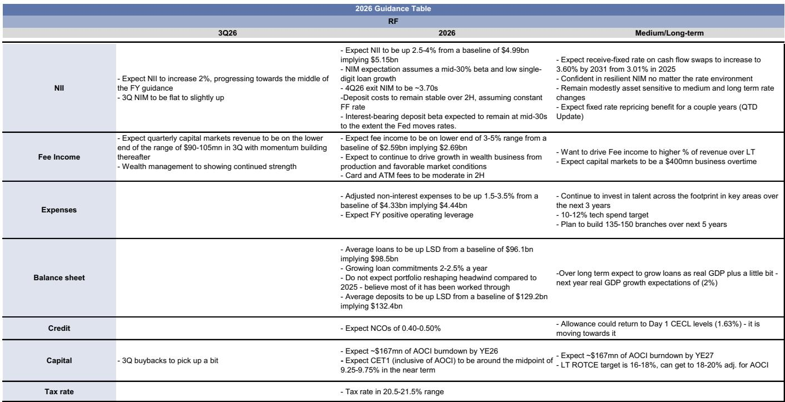

# Truist’s Guidance Reset Reveals a Critical Divergence: Regional Banks Are No Longer a Single Trade

The second-quarter 2026 earnings from Truist Financial, Fifth Third Bancorp, and Regions Financial did not produce a uniform signal. Truist lowered its full-year net interest income guidance and trimmed its revenue outlook, yet raised its return on tangible common equity target to above 14%. Fifth Third posted a slight pre-provision net revenue beat and signaled upside to 2027 loan growth expectations, while Regions delivered in-line results with a stable deposit cost message and a net interest margin path toward 3.70%. The three banks traded down on their respective earnings days, but for different reasons that reflect distinct strategic positions rather than a shared headwind.

The market has been treating regional banks as a beta play on rate expectations and loan growth. That framing is becoming obsolete. Each of these three institutions is navigating a fundamentally different mix of merger integration, balance sheet optimization, and fee income transformation. The investor who treats them as interchangeable will miss the specific catalysts and risks embedded in each name. The earnings calls revealed not just quarterly performance but a set of deliberate strategic choices that will determine which banks report over the next 12 to 18 months.

The core insight from this earnings cycle is that regional bank returns are becoming a function of management discretion, not macro tailwinds. Truist is choosing to shrink lower-returning consumer loan portfolios to improve profitability. Fifth Third is accelerating its merger synergies ahead of schedule and reinvesting the savings into growth. Regions is defending its funding cost advantage in a competitive Southeast deposit market. These are not passive responses to the rate cycle. They are active portfolio decisions that create measurable divergence in return trajectories.

## Truist’s Lowered Guidance Removes a Key Overhang, but the Path to 16-18% ROTCE Now Depends on the New CEO’s Strategy

Truist reported second-quarter core pre-provision net revenue that came in ahead of consensus expectations, driven by higher fees and lower expenses that more than offset weaker net interest income. The headline EPS beat was supported by net charge-offs of 50 basis points, five basis points below the consensus estimate of 55, and a lower provision. But the market focus was on the updated 2026 and third-quarter outlook, which pointed to lower full-year revenue growth of 3.5% to 4%, down from the prior expectation of approximately 4%, and a third-quarter guide that implies roughly 1% downside to street PPNR expectations.

The downward revision to net interest income is the most significant change. Truist had previously expected NII to be modestly up for the full year; the new guide implies flat to down. The driver is a lower net interest margin, reflecting tighter loan spreads, the impact of swaps coming onto the balance sheet, and lower deposit betas. The bank also reduced its loan growth expectations for consumer loans to flat to 1%, with the remainder of its 3% to 4% average loan growth coming from commercial and industrial lending.

What makes this guide constructive rather than alarming is the offset from fee income. Truist raised its fee income growth expectation to approximately 10% year-over-year, up from high single digits previously, led by investment banking and trading. This improved fee mix supports the revised ROTCE target of above 14%, up from approximately 14% previously. The bank also announced plans to reduce production in indirect auto lending and exit marine and RV lending entirely, reallocating capital toward higher-returning commercial loans and paying down high-cost funding.

The strategic implication is clear. Truist is deliberately shrinking its balance sheet in lower-returning segments to improve overall profitability. The reduction in consumer loans on an end-of-period basis will be accretive to ROTCE because it replaces low-yielding assets with a higher mix of commercial lending and reduces the need for expensive deposit funding. The bank now trades at approximately 1.6 times tangible book value, a discount to peers at 1.8 times, reflecting the market’s skepticism that Truist can close the profitability gap. The incoming CEO will need to articulate a credible path to the 16% to 18% long-term ROTCE target, and the flexibility Truist has retained to adjust the timing of that goal means the next 12 months will be a proving ground for management credibility.

## Fifth Third’s Merger Integration Is Outperforming Expectations, Creating a Pathway to Above-Consensus Loan Growth in 2027

Fifth Third reported a slight PPNR beat in the second quarter, with core fees coming in modestly higher than expected and core expenses lower, while net interest income was in line. Provisions were lower than consensus, and net charge-offs were a touch below expectations, contributing to the EPS beat. The market reaction was negative, with shares down 2.29% against the regional bank index decline of 1.58%, but the underperformance appears to be driven by the third-quarter PPNR guide, which points to downside due to the timing of cost saves rather than any fundamental deterioration.

The merger with Comerica is tracking ahead of initial expectations on multiple fronts. Consumer deposit campaigns in the Southwest and California generated $2.5 billion of growth, compared to the initial expectation of $1 billion. Expense synergies are running ahead of the original $850 million target, and management indicated that upside may be reinvested into the business. The Labor Day systems conversion remains on track, with the remainder of expense synergies expected to pull through in the fourth quarter.

The most important forward-looking signal is on loan growth. Fifth Third posted 1% end-of-period loan growth after three to four years of stability, with legacy Fifth Third commercial and industrial loans growing approximately 2% quarter-over-quarter and the Comerica franchise growing approximately 1%. Management described this growth as sustainable barring a macro change, and post-conversion, the bank expects an acceleration led by the Comerica franchise. The consensus estimate for approximately 4% end-of-period loan growth in 2027 appears achievable, and the bank’s expectation that deposit costs will remain stable to slightly up in a flat rate environment means it can fund this growth without diluting margin.

Fifth Third is targeting a 51% to 52% efficiency ratio in the fourth quarter of 2026 and a return on tangible common equity above 19% in 2027. The bank trades at 11.6 times 2027 estimated earnings, a premium to peers at 10.8 times, but this premium is justified by the visible momentum of the Comerica integration and the bank’s ability to sustain peer-leading returns and tangible book value growth. If Fifth Third continues to execute on the integration and delivers on its medium-term targets, the premium should expand rather than contract.

## Regions’ Deposit Cost Stability Provides a Foundation for Margin Expansion, but Loan Growth Must Accelerate to Justify the Valuation

Regions Financial reported second-quarter PPNR that was largely in line with expectations, with slightly higher net interest income offset by higher fees and expenses. The EPS beat came from stronger credit performance, with net charge-offs of 42 basis points versus the consensus estimate of 47, and a reserve release. The bank tweaked its fee income guidance to the low end of the 3% to 5% growth range due to softer capital markets activity, but left the rest of its outlook unchanged.

The key positive in the quarter was deposit cost stability. Despite fears of increasing competition for deposits in the Southeast, Regions held its interest-bearing deposit cost at 1.69%, down from 1.72% in the first quarter, and management expects continued stability through year-end. The benefit from CD repricing is diminishing as roll-on and roll-off rates converge, but the bank’s ability to maintain low funding costs supports its expectation for net interest margin expansion over time. The bank targets a fourth-quarter 2026 exit NIM of approximately 3.70%, up from 3.66% in the second quarter, with a further upward bias from fixed-rate repricing.

Loan growth in the second quarter was solid, with end-of-period loans increasing approximately 1.3%. The first half benefited from line draws that management does not expect to recur, but the bank kept its average loan growth guide unchanged. Average loans in the second quarter are already up 3% versus the 2025 average, and even with some moderation, Regions should be positioned for mid-single-digit-plus growth in 2027. Credit quality is improving, with nonperforming assets declining approximately 3% quarter-over-quarter, and management acknowledged that losses could fall below 40 basis points given the improvement in problem asset resolution and new pipeline quality.

Regions trades at 11.1 times 2027 estimated earnings, in line with the peer average of 11.0 times. The valuation does not yet reflect the potential for improving and sustainable balance sheet growth in the second half of 2026. If Regions can demonstrate that its loan growth is durable and maintain its peer-leading funding costs, the shares should re-rate higher. The risk is that the bank’s conservative guidance on fee income and buybacks tempers near-term enthusiasm, but the fundamental trajectory supports a constructive view.

## A Decision Framework for Regional Bank Investors: Focus on Management Discretion, Not Macro Sensitivity

The three banks in this earnings cycle illustrate a framework that investors can apply across the regional bank universe. The framework has four dimensions: balance sheet optionality, fee income momentum, merger execution credibility, and deposit franchise resilience.

Balance sheet optionality measures management’s ability to reallocate capital from low-returning to high-returning assets. Truist scores highest on this dimension because its decision to exit marine and RV lending and reduce indirect auto production is a clear, measurable action that will improve ROTCE without requiring loan growth. Fifth Third has less balance sheet optionality because its loan growth is tied to the Comerica integration, but the outperformance of deposit campaigns gives it flexibility. Regions has the least optionality because its loan growth is more dependent on the macro environment, but its low funding costs provide a buffer.

Fee income momentum is the second dimension. Truist’s 10% fee growth guidance, led by investment banking and trading, provides a direct offset to NII headwinds. Fifth Third’s capital markets business is expected to grow at mid- to high-single-digit rates over the long term, but the near-term contribution is smaller relative to Truist. Regions’ fee income is more dependent on wealth management and card fees, and the downward revision to the low end of its guidance range suggests less momentum.

Merger execution credibility applies specifically to Fifth Third, where the integration is tracking ahead of plan. The outperformance on deposit campaigns and expense synergies creates a path to above-consensus loan growth and efficiency improvements. No other bank in this group has a comparable catalyst.

Deposit franchise resilience is Regions’ strongest dimension. The ability to report deposit costs flat in a competitive Southeast market, with an interest-bearing deposit beta in the mid-30s, provides a foundation for margin expansion that peers may not have. Truist’s deposit mix is improving, but the bank is still working through the impact of lower betas. Fifth Third’s deposit costs are expected to remain stable, but the bank is relying on campaign-driven growth that may carry higher costs.

Investors should report banks that score highly on at least two of these four dimensions and avoid banks that score poorly on three or more. The regional bank sector is no longer a single trade. It is a collection of idiosyncratic stories where management decisions, not rate expectations, will determine relative performance.

*For informational purposes only. Portions may be generated, translated, summarized, or edited with AI assistance based on source materials and may contain omissions or errors. Please verify independently. This is not investment, legal, tax, accounting, or other professional advice.*

For informational purposes only. Portions may be generated, translated, summarized, or edited with AI assistance based on source materials and may contain omissions or errors. Please verify independently. This is not investment, legal, tax, accounting, or other professional advice.

