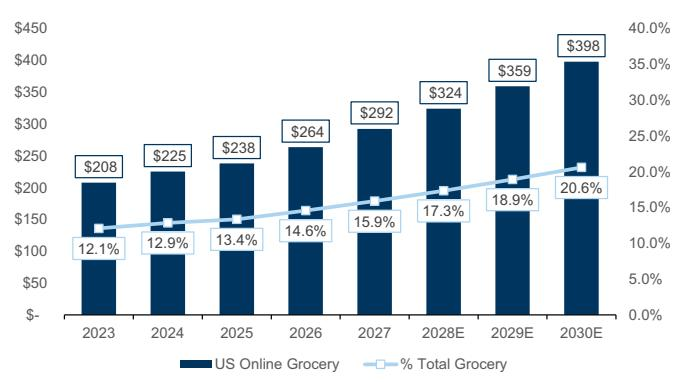
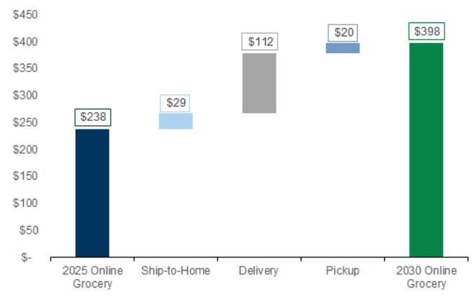
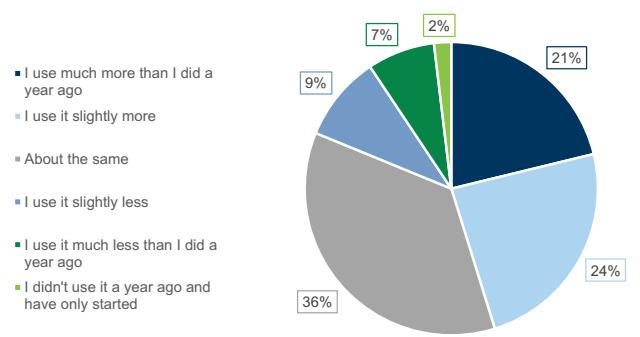
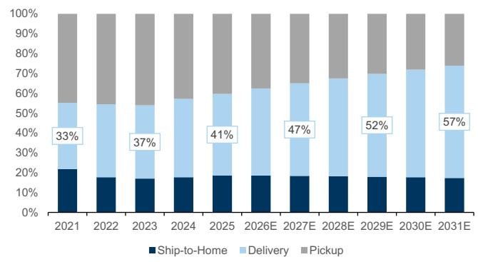
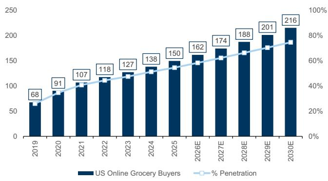
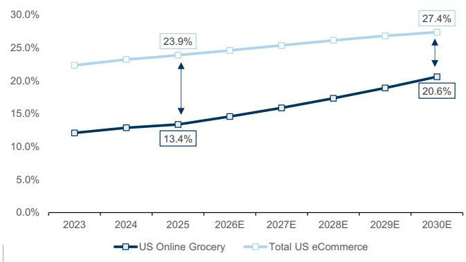
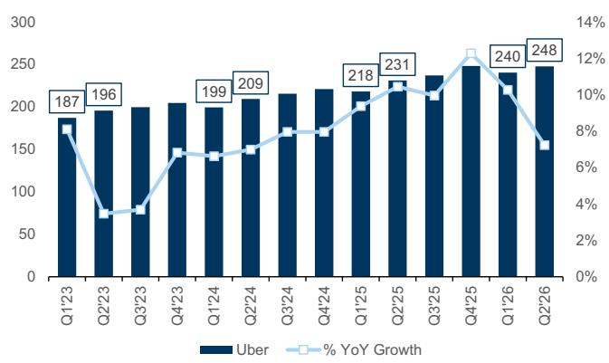
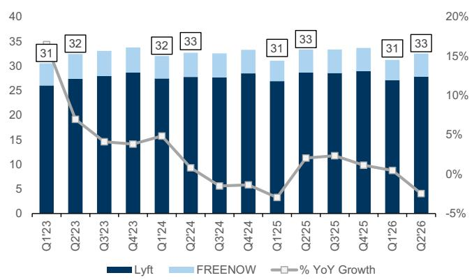

AMERICAS TECHNOLOGY: INTERNET

# Ridesharing & Delivery Q2'26 Preview: Analyzing the Industry Debates & Estimates

In previewing the upcoming earnings season for the Mobility/Delivery Internet sub-sector, we expect reported results to come in broadly inline to above investor expectations, with a relatively stable consumer backdrop (despite investor concerns) across our industry work and conversations. Within this note, we take the opportunity to update our US Grocery Industry model and operating estimates across the four companies in this sub-sector coverage universe. In our view, the online grocery category has one of the lowest online penetration rates today (across eCommerce) and we expect the industry to grow at a +11% 2025-2030 CAGR.

Specifically, within our industry model, we further break out the category between ship-to-home, delivery & pickup options – and believe that grocery delivery (similar to the food delivery industry) will see durable double-digit growth in the years to come. Despite several companies across our coverage universe investing to scale their presence within the industry (AMZN, DASH, UBER, CART) – we have not seen any evidence of growth rates being pressured. In our view, there remains a significant amount of white space for all players to grow into the market (as previously outlined here).

More broadly, the mobility landscape continues to benefit from rising utility trends across both higher HHI users (with an upward tilt to pricing – as seen with autonomous vehicles pricing power) & LHI users (driven by affordability initiatives). Given the widening array of product offerings – we view there to be a rising portion of users adopting rideshare services. In terms of industry debates within the sector, focus remains around: a) the state of the consumer; b) how autonomous vehicles could impact the industry (albeit with less concern around near-term disruption dynamics); & c) the broader competitive landscape – both across existing & new/emerging players aiming to take share within the market.

In the delivery landscape, the widening out of use cases from food delivery to grocery & local commerce initiatives remains one of the most compelling secular growth themes (and further outlined here). In terms of industry debates within the sector/industry, investor debates have been anchored around: a) the state of the consumer; b) the competitive landscape within online grocery delivery; & c) local commerce/grocery margin trajectory – both in the near & longer-term. Across the four companies with exposure to the local commerce/online grocery industry, we expect that investments into the physical infrastructure (e.g. AMZN fulfillment centers) and product improvements (e.g. driving a more comprehensive selection of items, greater affordability, improving delivery [both from a timing & accuracy perspective], etc.) will drive increased adoption & frequency in the coming years.

Exhibit 1: Summary of Estimate Changes & 12-Month Price Targets

<table><tr><td>Ticker</td><td>Company</td><td>Rating</td><td colspan="2">Price Target</td><td>% Upside / Downside</td><td>Summary of Estimate Changes</td></tr><tr><td></td><td></td><td></td><td>Old</td><td>New</td><td></td><td></td></tr><tr><td>UBER</td><td>Uber</td><td>Buy</td><td>$115</td><td>$115</td><td>59%</td><td>We adjust our take rate &amp; gross margin assumptions to more accurately reflect UK accounting changes. In addition, we also raise our longer-term CapEx assumptions to reflect AV investments</td></tr><tr><td>DASH</td><td>DoorDash</td><td>Buy</td><td>$280</td><td>$280</td><td>52%</td><td>We adjust our take rate/gross margin assumptions to better reflect geographic mix dynamics. In addition, we also adjust our share count assumptions on the back of disclosures within the most recently published 10Q</td></tr><tr><td>CART</td><td>Instacart</td><td>Buy</td><td>$66</td><td>$64</td><td>40%</td><td>Our updated price target is driven by an adjustment in our our share count assumptions given disclosures included within the most recently published 10Q</td></tr><tr><td>LYFT</td><td>Lyft</td><td>Buy</td><td>$24</td><td>$22</td><td>42%</td><td>We modify our price-target methodology, adjust our operating expense estimates (to better reflect seasonal spending trends)</td></tr></table>

Source: FactSet, GS Global Investment Research

## Key Debates, Trends and Company Commentary Heading Into 2H 2026

Heading into 2H 2026, we expect there to be a few key debates across the rideshare & delivery landscape:

How will the rise of autonomous vehicles impact industry growth rates? Given that there has been several recalls with Waymo over the last few months, paired with the redeployment of vehicles into existing markets, near-term disruption debates have faded. We believe that within the US, robotaxi supply remains constrained. This, paired with incremental investments being made by Uber (both internally within their Uber Autonomous Solutions service capability offerings, and external [incl. Rivian/Lucid/Nuro]), reinforces our view that traditional rideshare platforms will offer autonomous vehicle rides on their platform. Heading into 2H26, we continue to look toward London as a key market to further understand the competitive landscape, and the evolution of demand trends within new/emerging Waymo markets (in the US).

How should investors think about the competitive landscape within the grocery & retail industry? We believe that the industry itself remains in the early innings of scaling with a significant amount of white space for companies to operate within. Our industry work has not indicated any slowdown in growth attributed to the competitive environment/landscape. Additionally, within this report – we outline our views around the opportunity & would highlight that AMZN, DASH, UBER and CART remain positively levered to the broader industry.

What does the current state of the consumer look like and are there any pockets of weakness? Exiting Q1 earnings, investor concerns around the state of the consumer increased as a number of consumer companies highlighted softer trends during April (incl. Shake Shack, Planet Fitness, etc.). That said – we believe that consumer spend trends were more nuanced (and pockets of softness varied by subsector/industry), given that mobility/delivery companies in our coverage universe did not call out any signs of consumer softness (during their Q1 earnings call). In addition, our intra-quarter work has not pointed to any softening within our rideshare/delivery coverage – and NPI rates (on a T3M basis) have not seen any incremental/significant step-downs.

## Framing the Underappreciated Opportunity in Online Grocery

Given ongoing debates surrounding the competitive landscape of the industry, we take the opportunity to update our online grocery industry operating assumptions and highlight key secular trends/themes within the industry.

## The US online grocery industry can be segmented into three key categories:

\- Ship-to-Home. When grocery items are delivered to a consumer through contract carriers (i.e. FedEx, UPS, etc.). Unlike delivery orders, ship-to-home orders primarily consist of non-perishable goods given timing constraints.

\- Delivery. Consists of grocery orders delivered in less than a day. Within our coverage universe exposure to this category would include: a) DoorDash, Uber and Instacart's grocery offerings; & b) Amazon Fresh & same-day grocery services.

\- Pickup. Includes orders where customers pick up items directly from the store (rather than being delivered directly by a third party). Outside of Amazon (where grocery items can be picked up in physical stores [i.e. Whole Foods]), Instacart's Storefront Pro enables grocers the ability to offer white label delivery, pickup, and in-store fulfillment options.

Across all three of these categories, we forecast the total industry to grow at a +11% 2025-2030 CAGR. Our growth assumptions are predicated around a number of key themes: a) the continued shift from offline to online grocery sales (as grocery remains has one of the lowest online penetration rates in the US); b) shifting consumer spend habits (away from traditional eCommerce platforms to local commerce/delivery players); & c) rising premium placed on time & convenience.

Exhibit 2: We expect the industry to reach ~$400bn in sales by 2030...
US grocery spend ($bn)  
  
Source: Euromonitor, BrickMeetsClick, GS Global Investment Research

Exhibit 3: ... with delivery driving a majority of the growth 2025-2030 incremental grocery category spend ($bn)  
  
Source: Euromonitor, GS Global Investment Research

## Across the three key categories of online grocery spend, we forecast:

\- Ship-to-Home (+9% CAGR). As consumers increasingly look for ways to optimize efficiency and affordability, we expect the category to gain share of grocery retail sales. Relative to delivery grocery sales, ship-to-home orders do not involve tipping drivers - and recurring orders often include discounted options (incl. Amazon's “Subscribe & Save”).

\- Delivery (+16% CAGR). As previously highlighted (link | link), fast delivery speeds and wider selections have driven consumers into online delivery channels. With leisure time increasingly prioritized by consumers, we believe that the US grocery delivery category will see durable double digit growth over the next five years. In our view, lower delivery times will drive additional unlocks both in terms of: a) purchase frequency; & b) adoption of grocery delivery services by new consumers.

Pickup (+4% CAGR). While the category saw durable growth from 2020-2023 (largely due to COVID), we see the category as being less of a driver of online grocery sales going forward, primarily due to the expectation that consumers will continue pivot to more convenient channels (i.e. Delivery & Ship-to-Home). That said, we still expect for the category to outpace in-store grocery spend.

Exhibit 4: Nearly 50% of consumers have increased the number of rapid delivery orders placed over the last year...

  
Consumers reporting changes in frequency of rapid delivery grocery orders

Exhibit 5: ... and we expect this increase in frequency to drive further category share gains in the overall industry % of total US online grocery spend  
  
Source: BrickMeetsClick, GS Global Investment Research  
Source: Coresight Research, Data compiled by GS Global Investment Research

## Why Online Grocery Growth Rates Will Accelerate

Over the last few years, retailers and delivery platforms have made investments into: a) improving their fulfillment networks; b) digitizing inventory to drive a blurring of the lines between physical infrastructure & online channels; & c) driving adoption of the online grocery category through promotional activity & in-store price parity.

\- Fulfillment network improvements & automation. Companies with physical footprints (both in-person stores & fulfillment centers) such as Amazon & Walmart have made a number of investments to drive delivery times down - not only through expanding the number of fulfillment centers, but also through automation & delivery efforts. For example, in 2025, Walmart and Symbiotic entered into an agreement to enhance online pickup & delivery fulfillment systems (link). With regard to delivery methods - we see new fulfillment/delivery options to be in the early innings of scaling and expect these options to unlock a portion of the total addressable population (i.e. rural market adoption). In addition to a number of food delivery companies testing out drone delivery services, more scaled players including Amazon have begun to slowly scale out drone delivery services (Prime Air drone delivery - link).

\- Blurring the lines between physical stores & online purchasing channels. The early stages of eCommerce growth required companies to catalog inventory & integrate in-store offerings online - and we view there to be a similar dynamic occurring within the grocery sector (albeit with a few added variables such as timing constraints with perishable items). Instacart has increased its presence within physical stores (enabling for improved order accuracy, inventory tracking, etc.) through various products (Exhibit 6).

\- Promotional activity & price-parity with in-person stores. Promotional periods (e.g. Prime Day), subscription services (incl. Amazon Prime, DashPass, Uber One & Instacart+), merchant promotions (e.g. 20% off orders where a customer spends >$50) and free delivery are driving user acquisition today. Price-parity also remains an important driver - with Instacart noting that grocers who offer price parity (i.e. no markup vs. in store prices) are growing faster relative to grocers who do markup items.

Exhibit 6: Instacart is enabling the blurring of the lines between physical & online grocery

<table><tr><td colspan="2">Instacart Offerings</td></tr><tr><td>Technology</td><td>Offering</td></tr><tr><td>Store View</td><td>Improves inventory checks by combining AI &amp; computer vision to process inventory data tracking. Instacart shoppers can take videos of store shelves one aisle at a time, with the technology then analyzing videos to identify what products are in/out of stock</td></tr><tr><td>Caper Carts</td><td>Grocery carts which enable retailers to process data (incl. shelf intelligence, basket insights &amp; consumer interactions) while also expediting checkout times</td></tr><tr><td>Carrot Tags</td><td>Software connecting electronic shelf labels, enabling for a more efficient way to locate orders (and increasing found rates/order accuracy)</td></tr></table>

Source: Company data, GS Global Investment Research

We expect the investments made by delivery platforms & grocers to result in an increasing number of consumers purchasing groceries from online channels. While COVID acted as a stimulant for online grocery purchases (Exhibit 7) - we see a clear pathway for penetration to increase to ~75% of the addressable population over time. We also forecast that the gap between US online grocery penetration rates (vs. total spend) will close relative to overall eCommerce penetration rates. That said, our penetration rates remain well below US eCommerce penetration rates today (and longer-term).

While penetration rates will increase - we believe that different platforms have different consumer bases (and purchase habits) - and as a result, frequency and basket sizes will likely vary across the broader industry landscape. In our view, this enables multiple different players to operate within the broader industry (e.g. CART & AMZN with larger basket sizes, UBER/DASH smaller basket sizes today). That said, this dynamic could change over time as an increasing number of grocers look to offer their products on delivery platforms & specific delivery platforms look to drive increased penetration into larger basket sizes (through additional/incremental investments & increased promotional intensity).

Exhibit 7: We believe that the number of online grocery shoppers will increase...
mm  
  
Source: Statista, GS Global Investment Research

Exhibit 8: ... and for the spend gap between grocery & overall eCommerce to close
% retail penetration  
  
Source: Euromonitor, GS Global Investment Research

Even with the increased frequency & adoption of consumers purchasing groceries through online channels, our implied average spend per buyer per month remains well below what the average monthly grocery spend rate is today for shoppers

Autonomous Vehicle Operational Updates  
Exhibit 11: Autonomous Vehicle Operations  
  
Active cities defined as locations where operations are fully launched & available to the public. In development includes cities where testing & mapping operations are currently in progress. The partnerships listed are not exhaustive and reflect those involving companies within our Internet coverage. Nashville rides currently only accessible through Waymo App.  
Source: Company reports, GS Global Investment Research

We outline recent commentary surrounding autonomous vehicle operations within the US below. For additional commentary and announcements (since Q1'26 EPS) see our US AVs: Robotaxi Tracker report.

■ Uber. Since early June, Uber has made a several commercial launch announcements across both domestic & international markets.

Domestic markets. In June, Houston was named as the second planned deployment market for Uber/Nuro and Lucid's robotaxi program, with services expected to launch in mid-2027. To support their autonomous robotaxi operations, Uber has secured a 50k sqft facility in Houston – which will help support a fleet of Lucid Gravity robotaxis (powered by Nuro).

International markets. Across both Madrid and Zurich, Uber announced that operations are expected to begin later in 2026 - with rides accessible via the Uber app. Across both markets, Uber noted that it will be working closely/collaborating with government entities (incl. Madrid's regional government & Switzerland's Federal Roads Office [FEDRO]). Within Madrid, WeRide, AVOMO and Uber committed to adding 100s of Robotaxis (as key milestones are met). Similarly, in Zurich, the WeRide-Uber fleet is expected to scale progressively and in coordination with authorities (and scale as key milestones are met).

## Waymo.

☐ Expansion into new markets. On July 8th, Waymo announced that fully autonomous operations are being prepared to launch in four new markets: Denver, Las Vegas, San Diego and Tampa.

☐ Existing market operations. After initially launching in April 2026, the company announced that rides are now open to the public & that testing is currently underway at the Nashville International Airport. In Phoenix - Waymo (and Uber) confirmed that Waymo rides will no longer be accessible through the Uber application (link).

Vehicle recalls. During June, a recall was issued for Waymo's 5th Generation ADS (link, involving 3,871 vehicles). The recall came after several incidents across several markets & comes after a prior software recall related to a flooding issue in May 2026 (link).

## Key Industry Trends and High Frequency Data Heading Into Q2 Earnings

We leverage SensorTower data to analyze the competitive environment and highlight monthly active users across both iOS and Android. We believe that these data points are useful for flagging inflection points and mainly draw directional conclusions based on the rate of change in the data & market share dynamics (with less of a focus on absolute rates).

The data presented below is derived from third-party sources and might differ from official company-reported figures.

## Rideshare

■ Uber MAU growth decelerated during Q2'26. While MAU trends improved on a sequential basis, global MAU growth decelerated further in Q2 (+7% YoY). International market growth continued to outpace the US (+10% YoY), driven by emerging markets including Argentina (+40% YoY) and India (+13% YoY).

\- Lyft MAUs declined -2% YoY - marking a further deceleration to growth rates seen over the last few quarters. Despite seeing weakness within the US, Canada MAUs continued to grow >30% during the quarter.

Exhibit 12: Uber MAUs mm, % YoY

  
Source: SensorTower, Data compiled by GS Global Investment Research

Exhibit 13: Lyft MAUs mm, % YoY  
  
Source: SensorTower, Data compiled by GS Global Investment Research

Exhibit 14: Country Share of Global Uber App MAUs %

<table><tr><td>Country</td><td>2024</td><td>2025</td><td>2026</td><td>25 vs. '26 (bps)</td></tr><tr><td>United States</td><td>19.8%</td><td>18.1%</td><td>16.4%</td><td>-167bps</td></tr><tr><td>Brazil</td><td>14.0%</td><td>14.9%</td><td>15.8%</td><td>92bps</td></tr><tr><td>India</td><td>18.1%</td><td>16.3%</td><td>15.4%</td><td>-87bps</td></tr><tr><td>United Kingdom</td><td>5.6%</td><td>5.4%</td><td>5.5%</td><td>8bps</td></tr><tr><td>Mexico</td><td>3.4%</td><td>4.4%</td><td>5.3%</td><td>89bps</td></tr><tr><td>Argentina</td><td>5.2%</td><td>5.4%</td><td>5.2%</td><td>-21bps</td></tr><tr><td>Russia</td><td>3.1%</td><td>3.5%</td><td>3.4%</td><td>-9bps</td></tr><tr><td>Egypt</td><td>2.3%</td><td>2.3%</td><td>2.2%</td><td>-7bps</td></tr><tr><td>Canada</td><td>1.4%</td><td>1.7%</td><td>2.1%</td><td>38bps</td></tr><tr><td>France</td><td>2.3%</td><td>2.1%</td><td>2.2%</td><td>5bps</td></tr><tr><td>Spain</td><td>1.8%</td><td>1.9%</td><td>2.0%</td><td>5bps</td></tr><tr><td>Colombia</td><td>1.7%</td><td>1.9%</td><td>2.1%</td><td>17bps</td></tr><tr><td>Australia</td><td>1.9%</td><td>1.8%</td><td>1.6%</td><td>-18bps</td></tr><tr><td>Germany</td><td>1.3%</td><td>1.5%</td><td>1.5%</td><td>5bps</td></tr><tr><td>Chile</td><td>1.9%</td><td>1.7%</td><td>1.6%</td><td>-18bps</td></tr><tr><td>South Africa</td><td>1.3%</td><td>1.3%</td><td>1.4%</td><td>6bps</td></tr><tr><td>Saudi Arabia</td><td>1.2%</td><td>1.3%</td><td>1.3%</td><td>-1bps</td></tr><tr><td>Poland</td><td>0.9%</td><td>0.9%</td><td>1.0%</td><td>7bps</td></tr><tr><td>Taiwan</td><td>0.7%</td><td>0.8%</td><td>0.8%</td><td>2bps</td></tr><tr><td>Romania</td><td>0.5%</td><td>0.6%</td><td>0.7%</td><td>13bps</td></tr><tr><td>Peru</td><td>0.7%</td><td>0.7%</td><td>0.7%</td><td>-1bps</td></tr><tr><td>RoW</td><td>11.7%</td><td>12.1%</td><td>12.5%</td><td>43bps</td></tr></table>

<table><tr><td>Jul-25</td><td>Aug-25</td><td>Sep-25</td><td>Oct-25</td><td>Nov-25</td><td>Dec-25</td><td>Jan-26</td><td>Feb-26</td><td>Mar-26</td><td>Apr-26</td><td>May-26</td><td>Jun-26</td></tr><tr><td>17.8%</td><td>17.7%</td><td>17.0%</td><td>17.5%</td><td>17.1%</td><td>17.2%</td><td>16.8%</td><td>16.4%</td><td>16.7%</td><td>16.1%</td><td>16.1%</td><td>16.4%</td></tr><tr><td>14.7%</td><td>15.2%</td><td>14.8%</td><td>15.2%</td><td>15.0%</td><td>14.8%</td><td>15.6%</td><td>15.6%</td><td>15.7%</td><td>16.3%</td><td>16.3%</td><td>15.5%</td></tr><tr><td>15.9%</td><td>16.1%</td><td>16.2%</td><td>16.1%</td><td>15.9%</td><td>15.7%</td><td>15.6%</td><td>15.7%</td><td>15.7%</td><td>15.4%</td><td>15.1%</td><td>15.1%</td></tr><tr><td>5.3%</td><td>5.3%</td><td>5.5%</td><td>5.4%</td><td>5.5%</td><td>5.6%</td><td>5.5%</td><td>5.4%</td><td>5.6%</td><td>5.6%</td><td>5.4%</td><td>5.5%</td></tr><tr><td>4.4%</td><td>4.5%</td><td>4.7%</td><td>4.7%</td><td>5.0%</td><td>5.1%</td><td>5.0%</td><td>5.2%</td><td>5.4%</td><td>5.6%</td><td>5.4%</td><td>5.3%</td></tr><tr><td>5.7%</td><td>5.4%</td><td>5.7%</td><td>5.5%</td><td>5.6%</td><td>5.5%</td><td>5.2%</td><td>5.3%</td><td>5.2%</td><td>5.1%</td><td>5.2%</td><td>5.3%</td></tr><tr><td>3.9%</td><td>3.8%</td><td>3.7%</td><td>3.4%</td><td>3.4%</td><td>3.4%</td><td>3.6%</td><td>3.5%</td><td>3.5%</td><td>3.3%</td><td>3.2%</td><td>3.4%</td></tr><tr><td>2.2%</td><td>2.2%</td><td>2.2%</td><td>2.2%</td><td>2.3%</td><td>2.3%</td><td>2.2%</td><td>2.2%</td><td>2.1%</td><td>2.2%</td><td>2.3%</td><td>2.3%</td></tr><tr><td>1.8%</td><td>1.8%</td><td>1.9%</td><td>1.9%</td><td>1.8%</td><td>1.9%</td><td>1.9%</td><td>2.1%</td><td>2.1%</td><td>2.1%</td><td>2.3%</td><td>2.3%</td></tr><tr><td>2.3%</td><td>2.1%</td><td>2.2%</td><td>2.1%</td><td>2.1%</td><td>2.0%</td><td>2.1%</td><td>2.1%</td><td>2.1%</td><td>2.1%</td><td>2.3%</td><td>2.5%</td></tr><tr><td>1.8%</td><td>1.9%</td><td>1.8%</td><td>1.9%</td><td>2.0%</td><td>2.0%</td><td>1.9%</td><td>1.9%</td><td>2.0%</td><td>2.0%</td><td>1.9%</td><td>1.9%</td></tr><tr><td>2.1%</td><td>1.8%</td><td>2.0%</td><td>1.9%</td><td>2.0%</td><td>2.0%</td><td>2.0%</td><td>1.9%</td><td>2.0%</td><td>2.0%</td><td>2.3%</td><td>2.3%</td></tr><tr><td>1.8%</td><td>1.7%</td><td>1.7%</td><td>1.7%</td><td>1.9%</td><td>1.9%</td><td>1.7%</td><td>1.8%</td><td>1.7%</td><td>1.5%</td><td>1.5%</td><td>1.5%</td></tr><tr><td>1.5%</td><td>1.5%</td><td>1.6%</td><td>1.5%</td><td>1.5%</td><td>1.5%</td><td>1.5%</td><td>1.6%</td><td>1.6%</td><td>1.6%</td><td>1.5%</td><td>1.4%</td></tr><tr><td>1.7%</td><td>1.6%</td><td>1.7%</td><td>1.8%</td><td>1.7%</td><td>1.7%</td><td>1.7%</td><td>1.6%</td><td>1.6%</td><td>1.5%</td><td>1.5%</td><td>1.5%</td></tr><tr><td>1.4%</td><td>1.4%</td><td>1.3%</td><td>1.3%</td><td>1.4%</td><td>1.4%</td><td>1.5%</td><td>1.4%</td><td>1.3%</td><td>1.3%</td><td>1.4%</td><td>1.5%</td></tr><tr><td>1.3%</td><td>1.4%</td><td>1.4%</td><td>1.3%</td><td>1.4%</td><td>1.3%</td><td>1.4%</td><td>1.6%</td><td>1.3%</td><td>1.3%</td><td>1.2%</td><td>1.2%</td></tr><tr><td>0.9%</td><td>0.9%</td><td>0.9%</td><td>0.8%</td><td>0.9%</td><td>0.9%</td><td>0.9%</td><td>1.0%</td><td>0.9%</td><td>1.0%</td><td>0.9%</td><td>1.0%</td></tr><tr><td>0.7%</td><td>0.7%</td><td>0.7%</td><td>0.7%</td><td>0.7%</td><td>0.7%</td><td>0.8%</td><td>0.8%</td><td>0.8%</td><td>0.8%</td><td>0.7%</td><td>0.6%</td></tr><tr><td>0.5%</td><td>0.5%</td><td>0.6%</td><td>0.6%</td><td>0.6%</td><td>0.7%</td><td>0.7%</td><td>0.7%</td><td>0.7%</td><td>0.7%</td><td>0.7%</td><td>0.7%</td></tr><tr><td>0.8%</td><td>0.7%</td><td>0.7%</td><td>0.8%</td><td>0.7%</td><td>0.7%</td><td>0.7%</td><td>0.7%</td><td>0.7%</td><td>0.7%</td><td>0.7%</td><td>0.8%</td></tr><tr><td>12.3%</td><td>12.4%</td><td>12.4%</td><td>12.2%</td><td>12.1%</td><td>12.3%</td><td>12.6%</td><td>12.3%</td><td>12.2%</td><td>12.5%</td><td>12.6%</td><td>12.8%</td></tr></table>

Source: SensorTower, Data compiled by GS Global Investment Research

We look at quarterly download share data to help highlight emerging rideshare platforms - both within the US & globally.

Waymo now accounts for a LDD % share of US rideshare downloads. Over the last 12 months, the Waymo app has been downloaded >4mm times. That said - download growth on a YoY basis has decelerated (from 37% YoY in Q1'26 to 16% YoY in Q2).

Global download share dynamics remained stable. Uber remains a dominant player within the broader global rideshare industry - and accounted for 20%+ of rideshare downloads (of tracked mobile applications) during the quarter.

Exhibit 15: US Download Share %  
![](images/afe
