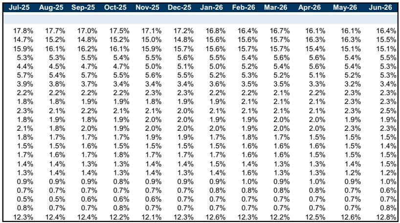
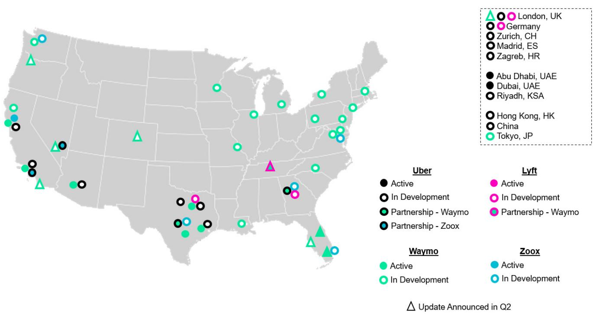
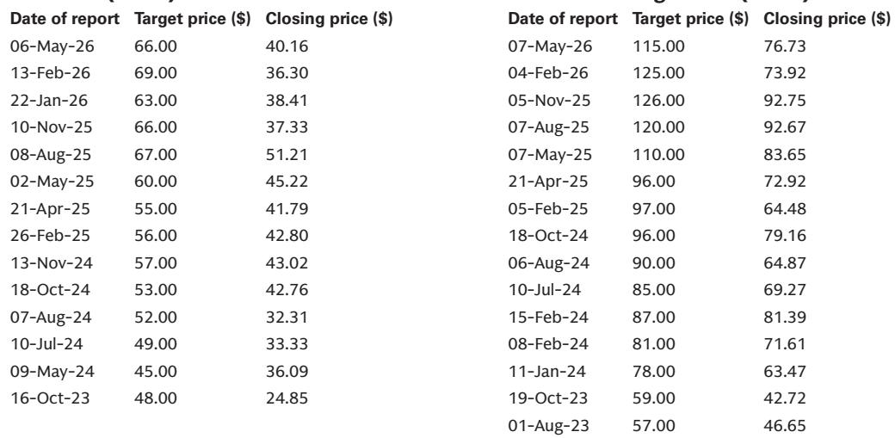

# 研究笔记：美洲科技-互联网-出行与配送行业观察

在线杂货配送正处在一个值得关注的阶段：行业增长不仅没有因竞争加剧而放缓，反而在加速。最新发布的出行与配送行业展望中，更新了美国杂货行业模型，核心观察是——线上杂货的渗透率仍处于低位，未来五年将以11%的年复合增速增长，到2030年市场规模接近4000亿美元。而驱动这一增长的核心动力，不是短期因素，而是消费者对时间与便利性的重新认识。

报告覆盖的四家公司——亚马逊、DoorDash、Uber和Instacart——均被更新公司观点。但比评级更重要的是，这些玩家并非在争夺同一块蛋糕，而是在一个足够大的“空白市场”中各自发展。

## 1. 配送是增长主力，但真正被低估的是“频率”而非“用户”

线上杂货可拆分为三个子类：送货到家、当日配送和到店自提。其中，当日配送被预测为增长最快的赛道，2025-2030年复合增速达16%，远超送货到家的9%和自提的4%。

这一判断的关键支撑并非新增用户数，而是现有用户的购买频率。消费者调研显示，过去一年近50%的消费者增加了快速配送订单的下单次数。随着配送时间进一步缩短，频率还有上升空间。这意味着，行业增长的主要驱动力正从“拉新”转向“复购”，而这一点在当前的讨论中尚未被充分认识。

> **观察：** 高频次配送的解锁，依赖于配送时效从“小时级”向“分钟级”的跨越。报告中特别提到了无人机配送和自动化履约中心的早期规模化，这些基础设施的投入才是频率提升的物理前提。

## 2. 竞争没有挤压增长，因为市场远未饱和

对线上杂货最大的担忧之一是竞争格局——亚马逊、DoorDash、Uber和Instacart都在加大投入，会不会导致价格竞争或增长停滞？目前的结论是：没有看到任何增长被压制的证据。

报告指出，不同平台服务的是不同的消费者画像和购物习惯。Instacart和亚马逊的客单价更高，而Uber和DoorDash目前以小额订单为主。这种差异化意味着，短期内玩家之间并非零和博弈。更重要的是，线上杂货在美国的整体渗透率仍远低于电商整体水平，这一差距预计将在未来几年逐步收窄，但仍有较大空间。

报告还特别提到，Instacart通过技术产品（如Caper智能购物车、Carrot Tags电子价签）帮助实体零售商实现线上线下融合，这实际上是在扩大整个行业的可触达市场，而非单纯争夺存量。

## 3. 消费者行为保持稳定，但市场对“软数据”反应过度

Q1财报季之后，部分消费类公司（如Shake Shack、Planet Fitness）提到4月出现一些变化，引发市场对消费者信心的关注。但出行和配送公司的Q1电话会并未提及任何消费走弱的信号，其内部跟踪的新用户注册率也未出现显著下滑。

报告对此的解读是：消费变化是分化的，而非全局性的。出行和配送服务正在从“可选消费”向“日常基础设施”转变，尤其是在高收入用户（受益于自动驾驶带来的定价权）和低收入用户（受益于可负担性举措）两端都呈现上升趋势。这种结构性变化，使得该赛道对宏观波动的韧性可能高于市场预期。

## 4. 自动驾驶的短期扰动已消退，但长期变量仍在积累

关于自动驾驶对出行行业的影响，近期的讨论热度已明显降温。Waymo在过去几个月经历了多次召回，但车辆已重新部署到现有市场。报告判断，美国Robotaxi的供给仍然受限，短期内不会对传统出行平台构成实质性影响。

更重要的是，Uber正在通过内部自研（Uber Autonomous Solutions）和外部合作（与Rivian、Lucid、Nuro）加速布局自动驾驶车队。报告将伦敦视为观察竞争格局演变的关键市场，同时也在关注Waymo在丹佛、拉斯维加斯等新市场的扩张节奏。

> **观察：** 对自动驾驶的判断是“长期乐观、短期谨慎”。真正值得关注的不是Robotaxi何时大规模上路，而是传统出行平台能否在过渡期内，通过合作模式将自动驾驶运力纳入自己的网络，从而保住平台的中介价值。

---

这份报告的核心启示在于：线上杂货不是一个“赢家通吃”的赛道，而是一个“多玩家共存、各自渗透”的早期市场。与其纠结于谁将胜出，不如先确认这个市场本身的增长斜率是否被低估。给出的答案是：是的，而且斜率正在变陡。

For informational purposes only. Portions may be generated,translated,summarized,or edited with AI assistance based on source materials and may contain omissions or errors. Please verify independently. This is not investment,legal,tax,accounting,or other professional advice.

For informational purposes only. Portions may be generated,translated,summarized,or edited with AI assistance based on source materials and may contain omissions or errors. Please verify independently. This is not investment,legal,tax,accounting,or other professional advice.

