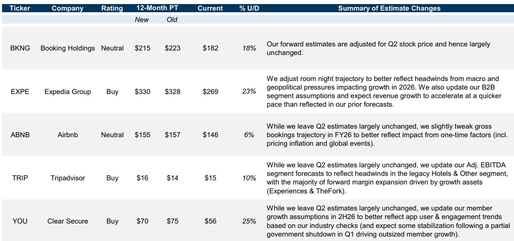
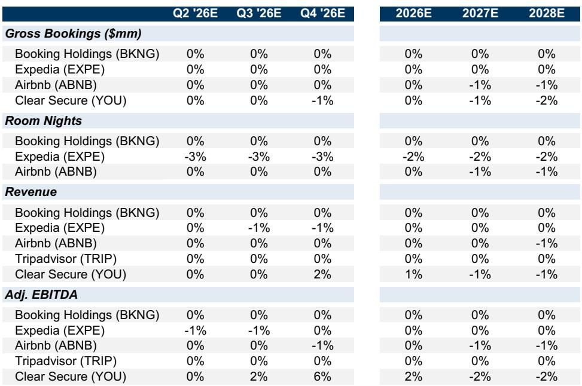
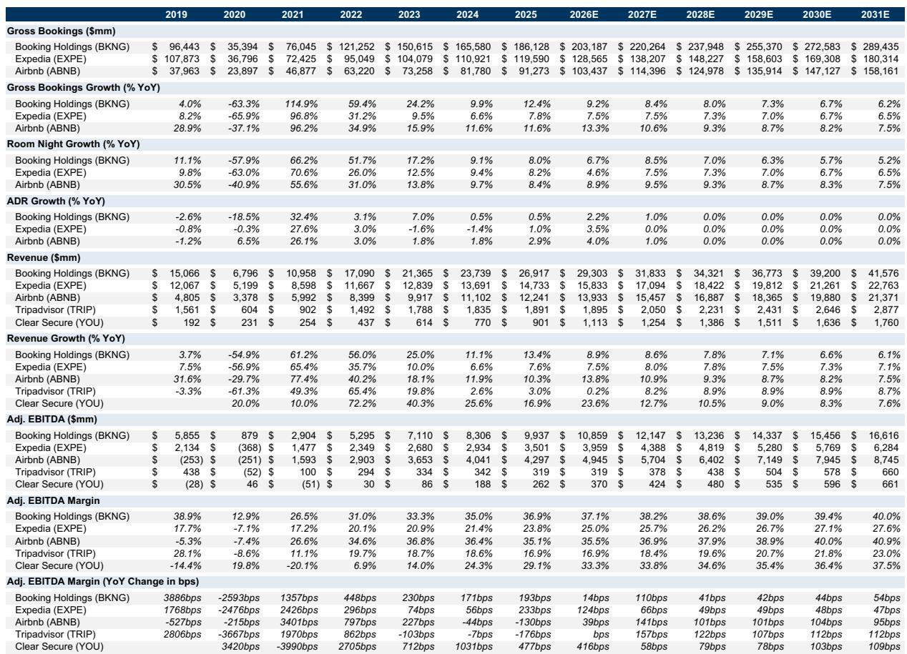

# 宏观环境观察：美洲科技互联网在线旅游Q2预览，行业讨论与估算分析

进入Q2业绩期，相关机构对在线旅游板块的行业讨论进行了系统梳理。这份报告的核心观察是：全球夏季出行需求整体稳定且健康，6月预订趋势甚至超出了市场在季初的预期。但真正值得关注的不是需求总量，而是需求结构的分化——高端市场定价持续上移，而大众消费者正在用削减其他开支的方式“挤出”旅行预算。这种K型消费格局，正在重塑各家公司的竞争逻辑。

报告覆盖了Booking Holdings、Expedia、Airbnb、Tripadvisor和Clear Secure五家公司。相关分析师指出，市场对Q2业绩的预期，很大程度上锚定在地缘政治波动最剧烈时期的管理层指引上。这意味着，实际数据超预期的概率并不低。

## 1. 夏季出行没有出现明显变化，但消费者在重新分配预算

报告援引相关调查数据指出，多数美国消费者（尤其是Z世代和千禧一代）今年仍计划出行。但约三分之一的受访者表示，他们正在削减外出就餐、线上购物和流媒体订阅等日常开支，来为旅行腾出预算。这不是消费升级，而是预算再分配。

报告同时观察到，虽然整体预订人数可能同比下降，但单次旅行支出仍在增加。相关旅行网络的高管反馈也印证了这一点：预订窗口呈现两极分化——既有提前9个月以上的远期预订，也有越来越多的临期预订。后者是疫情后持续增长的趋势，反映出消费者决策的灵活性和对价格的敏感度。

> **观察评论：** 这里的关键不是“出行需求好或需要继续观察”，而是消费者愿意为旅行牺牲其他消费。这对在线旅游平台意味着，谁能帮助用户找到“性价比更高的旅行方案”，谁就更有可能在预算再分配中拿到更大份额。

## 2. 世界杯的短期租赁效应：定价权强，但供给过剩也在发生

报告对正在北美举行的FIFA世界杯进行了详细的数据追踪。相关机构利用数据发现，世界杯比赛日期间，主办城市的短租预订价格同比上涨超过60%，部分供给受限的市场（如瓜达拉哈拉、蒙特雷、墨西哥城和堪萨斯城）涨幅更为显著。

但一个容易被忽视的细节是：大多数城市的短租房源供给增速超过了需求增速，导致入住率同比下降。纽约、旧金山等常规旅游城市在小组赛期间的需求甚至出现同比下滑，说明世界杯可能挤出了部分季节性游客。

这种“定价强、入住率承压”的格局，对Airbnb、Vrbo和Booking.com等平台意味着不同的经营策略。相关机构认为，世界杯对短租平台的整体影响是正面的，但高度碎片化——赢家是那些在供给受限市场有更多库存的平台，而供给过剩的城市则需要更精细的动态定价能力。

## 3. AI在旅行中的应用：规划阶段渗透快，但预订转化仍是瓶颈

报告引用了相关数据：2026年上半年，约56%的美国休闲旅行者在旅行中使用了AI，而一年前这一比例仅为33%。增长迅猛，但相关机构指出，AI工具的使用主要集中在行程规划、研究和发现阶段，实际通过AI完成预订的案例仍然有限。

Expedia在5月的相关会议上强调了信任和忠诚度作为AI应用的基础。Airbnb在夏季发布会上也推出了多项AI驱动的功能升级。但报告的核心判断是：AI目前更多是成本削减工具（软件开发、客服、运营），而非收入增长引擎。要让AI真正驱动预订转化，旅行公司需要先建立品牌信任。

> **观察评论：** 56%的AI使用率听起来很高，但报告明确区分了“使用AI规划”和“用AI下单”。后者才是变现的关键。目前看，行业仍处于“让用户习惯AI”的阶段，距离AI直接贡献收入还有距离。

## 4. 各家公司的差异化叙事：从供给扩张到回报表现

相关机构在报告中对覆盖公司进行了差异化分析，核心关注点各不相同：

- **Booking Holdings**：核心旅行产品的供给增长和Connected Trip计划的进展，以及全年研究节奏对利润率的影响。
- **Airbnb**：扩张市场的研究产出和回报，新业务线的收入贡献，以及运营利润率的上行信号。
- **Expedia**：Vrbo和Hotels.com的改善速度，固定成本与可变成本结构变化带来的利润率扩张，以及北美市场份额动态。
- **Tripadvisor**：资产价值释放逻辑，传统酒店及其他板块的流量不确定性，以及AI战略的执行力。
- **Clear Secure**：价格与会员增长的平衡，机场技术部署节奏，以及向医疗、劳动力和政府垂直领域的扩展。

这些差异化叙事背后，反映的是同一个行业命题：在需求稳定但结构分化的环境下，各家公司的增长质量比增长速度更重要。相关机构对Expedia、Tripadvisor和Clear Secure给出了公司观点，对Booking Holdings和Airbnb更新公司观点——这本身就是一个信号：市场正在从“谁增长快”转向“谁增长得有效率”。

For informational purposes only. Portions may be generated,translated,summarized,or edited with AI assistance based on source materials and may contain omissions or errors. Please verify independently. This is not investment,legal,tax,accounting,or other professional advice.

