# 亚洲宏观研究

## 韩国市场表现：家庭财富增长与消费制约

尽管7月出现调整，韩国主要指数年初至今仍上涨约60%，较去年同期上涨超过110%，家庭权益财富增加约相当于GDP的17%。虽然韩国家庭在主要经济体中仍持有最集中的房地产资产，但市场的显著上涨缩小了其权益资产相对于GDP与日本和欧洲的差距。

- 韩国家庭权益所有权高度集中于收入最高和资产最高的五分之一群体，分别占总权益资产的64%和72%，而50岁及以上的读者持有家庭总权益财富的73%。年长读者对国内权益的配置也显著更高，意味着他们从近期上涨中受益最多。

若干结构性因素可能制约权益财富向消费的传导。韩国家庭继续面临较高的杠杆和偿债负担，尤其是在高收入和高资产群体中。同时，年长家庭相对于海外同龄人仍保持较高的储蓄率，表明将资本收益转化为当前支出的意愿有限。最后，权益回报的波动性和近期市场调整可能导致家庭将市场收益视为暂时性的。

■ 综合来看，历史性市场上涨带来的消费提振总体可能温和。基于面板回归分析，我们估计权益财富每增加100韩元，约带动1.6韩元的额外消费，这与韩国央行近期研究结果基本一致。我们的发现表明，今年家庭权益财富的增加可能推动消费增长约GDP的0.3%。然而，考虑到韩国央行新一轮加息周期的开始，这一温和提振的一部分可能被更高的偿债成本所抵消。

---

## 背景：韩国市场的历史性上涨

韩国市场前所未有的上涨对家庭资产负债表和私人消费具有重要影响。尽管7月出现约20%的调整，韩国主要指数年初至今仍上涨约60%，较去年同期上涨超过110%，成为该地区和全球主要市场中表现较强劲的市场之一。这些显著收益带来了家庭金融财富的大幅增长，并引发了关于这些收益能在多大程度上支持更广泛经济活动的讨论。在本报告中，我们考察了市场上涨对家庭资产负债表的影响，并评估在结构性制约下权益收益能在多大程度上推动消费。

## 衡量2026年韩国家庭财富的增长

在去年底市场上涨之前，韩国家庭在主要经济体中拥有最偏重房地产的资产负债表。根据2024年最新的家庭财富数据，非金融资产占韩国家庭总净财富的76%（图表1），甚至高于澳大利亚（72%）和欧元区（65%）。值得注意的是，台湾的这一比例不到一半，仅为33%。相反，家庭净金融资产仍相对较小，仅为GDP的1.2倍——在主要经济体中最低，甚至低于英国和欧元区的1.5-1.6倍，仅约为台湾水平的四分之一。

图表1：2024年韩国家庭财富仍高度集中于非金融资产  
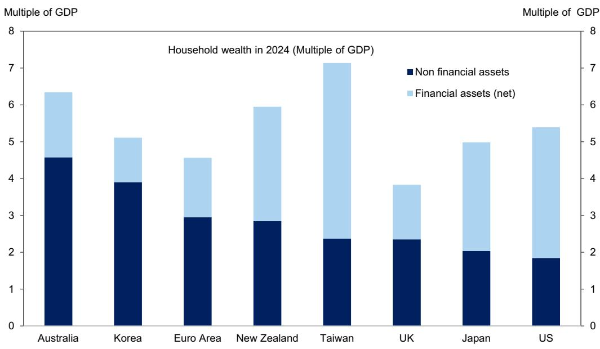  
来源：Haver Analytics、韩国央行、DGBAS、欧洲央行

历史性的市场上涨导致韩国家庭金融财富大幅增加。即使在7月约20%的调整之后，我们估计自2024年底以来，家庭权益资产增加了约相当于GDP的15%（图表2）。约80%的收益来自国内权益的直接持有，投资基金约占15%，其余为海外权益。这一增长足以显著改变韩国家庭的资产负债表构成：根据我们的估计，家庭权益资产相对于GDP现在可能接近日本和欧元区的水平（图表3）。

图表2：韩国家庭权益资产可能自去年底增加了GDP的15%

占GDP百分比

  
注：最后一列基于7月中旬水平  
来源：Haver Analytics、GS全球投资研究

图表3：2026年显著增长后，韩国家庭权益资产相对于GDP可能接近欧洲和日本水平  
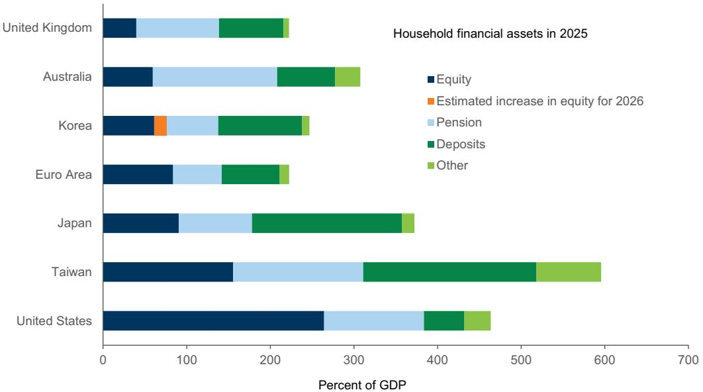  
来源：Haver Analytics、GS全球投资研究

韩国家庭通过职业和个人养老金储蓄对权益收益的间接敞口相对有限。根据经合组织的全球养老金统计，截至2024年底，现金和存款约占韩国养老金提供者（不包括国民养老金服务等公共养老金储备基金）资产的40%——在我们比较的主要经济体中占比最高——而通过包括权益基金在内的集体投资计划持有的资产仅约20%（图表4）。鉴于个人养老金的相对保守配置，我们估计市场上涨可能使家庭退休余额增加了GDP的2%。

图表4：韩国养老金资产集中于现金和存款

  
来源：经合组织

## 韩国家庭资产负债表和市场波动对消费的制约

近期市场上涨对国内消费的影响可能不仅取决于收益规模，还取决于权益所有权在家庭之间的分布。韩国的权益资产集中于高收入和高资产家庭，收入最高和资产最高的五分之一群体分别占总家庭权益持有量的64%和72%（图表5）。权益所有权也偏向年长家庭：50岁及以上的读者持有总权益资产的73%，并且由于他们对国内权益的敞口相对较高，可能从近期市场上涨中受益最多（图表6）。五十多岁及以上的读者将其权益投资组合的四分之三配置于国内公司，而年轻读者约为50%，这使他们能够从国内市场的强劲表现中获得更大份额的收益。

图表5：韩国权益资产高度集中于高收入和高资产家庭

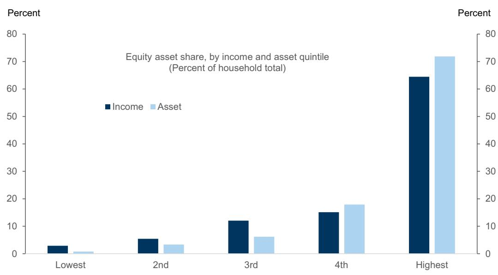  
来源：数据与统计部

图表6：国内市场的上涨可能使年长读者（50岁及以上）受益最多，因为他们对国内权益的敞口更高  
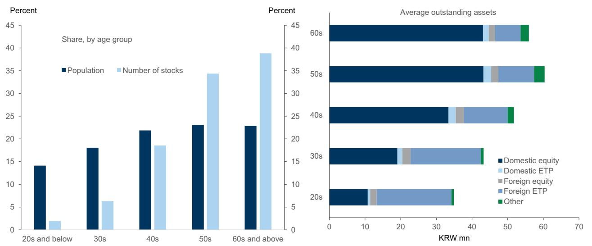  
来源：韩国证券存管院、韩国资本市场研究院

虽然权益资产集中于高收入家庭和年长读者并非韩国独有，但该国相对较高的家庭杠杆和偿债负担可能制约权益收益向消费的传导。在韩国，金融负债也集中于高收入和高资产家庭，最高五分之一群体约占家庭总债务的45%。偿债成本（包括本金偿还）在整个家庭部门中较高，平均略高于可支配收入的20%，而资产最高五分之一群体的负担最高，约为27%（图表7）。与其他主要经济体相比，韩国家庭相对于其资产持有量承担了较大的金融负债，尤其是在收入和财富分布的上端（图表8），这反映了房地产资产在家庭资产负债表中的突出作用。因此，更大份额的权益收益可能用于抵押贷款偿还、债务减少或资产负债表管理，而非消费。

图表7：高资产家庭的偿债负担最高，占可支配收入的27%  
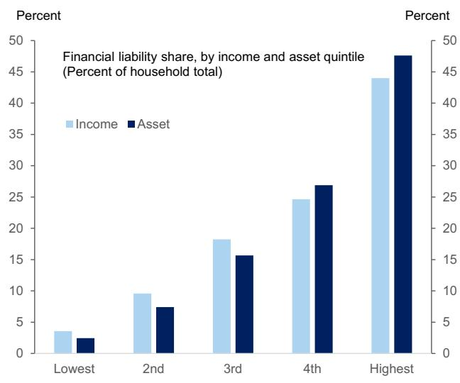  
来源：MODS

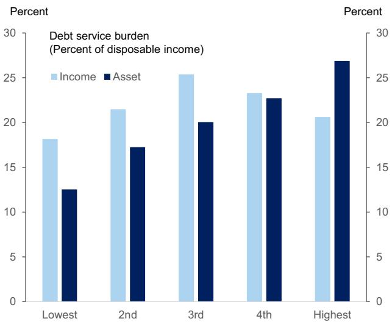

图表8：韩国家庭相对于资产有较高的金融负债，尤其是高收入家庭相对于其他国家  
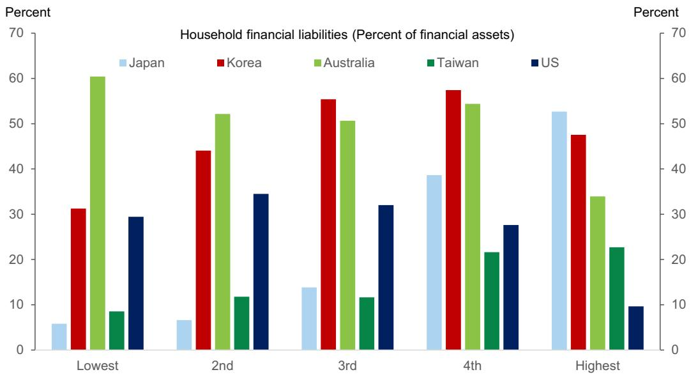  
来源：MODS、ABS、BLS、DGBAS、日本统计局

年长韩国家庭持续较高的储蓄率，以及他们从近期市场上涨中受益最多的事实，可能进一步削弱权益收益向消费的传导。韩国的家庭储蓄率仍然较高，尤其是在年长家庭中。户主年龄在六十多岁及七十岁以上的家庭储蓄率上升至37%——比我们比较的其他主要经济体高出7个百分点以上（图表9）。年轻韩国家庭的储蓄率与美国和台湾大致相当，表明韩国的独特之处可能在于退休后收入和财富的提取有限。这可能反映了预防性储蓄以及韩国家庭养老金持有量较低（图表3）。鉴于年长家庭也持有不成比例的权益资产，他们持续的储蓄偏好表明，即使是大规模的资本收益也可能保留在家庭资产负债表中，而不是迅速转化为当前消费。

图表9：韩国家庭储蓄率仍然较高，尤其是在年长家庭中  
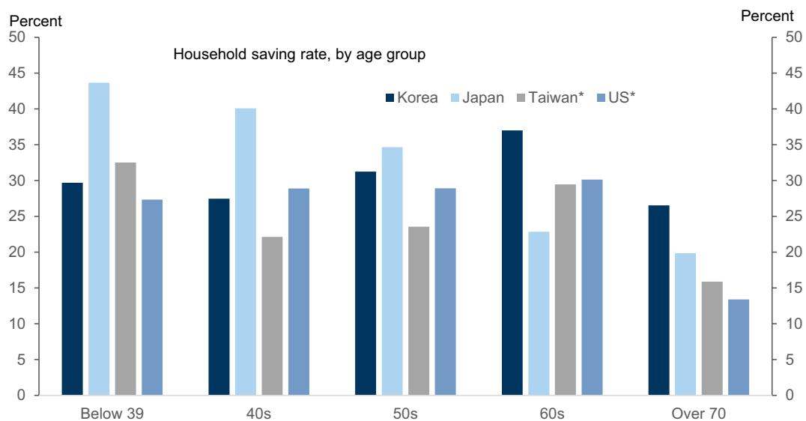  
对于台湾和美国，数据为2024年，年龄组为39岁以下（美国为35岁以下）、40-45岁、45-55岁、55-65岁和65岁以上；对于韩国和日本，数据为2025年。  
来源：MODS、ABS、BLS、DGBAS、日本统计局

来自权益的财富效应可能进一步减弱，因为权益收益通常被认为不太稳定和持久。自2018年以来，首尔房地产持续提供比韩国权益更强的风险调整后回报，首尔住房的五年滚动夏普比率在2022年达到峰值超过6。尽管此后住房的风险调整后表现显著恶化，夏普比率在最近几个月降至约0.5，但在2018年以来的大部分时间里，它一直高于韩国权益（图表10）。韩国主要指数的风险调整后回报历史上一直明显较弱，保持在0.5以下，尽管最近在去年以来强劲上涨的推动下已改善至约0.7-0.8。

图表10：首尔住宅房地产持续提供比韩国权益更强的风险调整后回报  
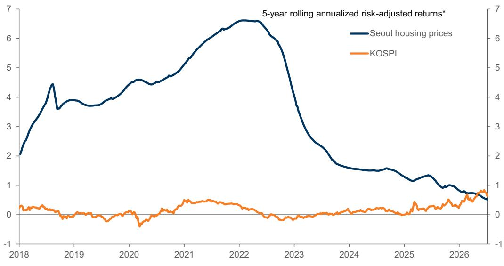  
\*基于周度价格

## 来源：Haver Analytics、GS全球投资研究

近期的市场发展可能强化了权益财富波动且可能是暂时性的看法。国内杠杆ETF的管理资产自年初以来急剧上升至超过30万亿韩元——几乎是2025年底水平的三倍——这在很大程度上受到2026年5月单只股票杠杆ETF推出的推动（图表11）。然而，随后的市场调整和经历的大幅价格波动，包括杠杆产品，可能凸显了权益投资相关的风险。杠杆投资的增加，如证券公司保证金贷款的大幅增加所示，也表明在市场上涨后期进入市场的家庭可能遭受重大损失。虽然这些杠杆敞口相对于总市值和读者存款总体仍然温和，但杠杆头寸的损失可能至少部分抵消早期的资本收益，进一步限制对家庭消费的提振。

图表11：2026年杠杆ETF和保证金贷款余额急剧上升  
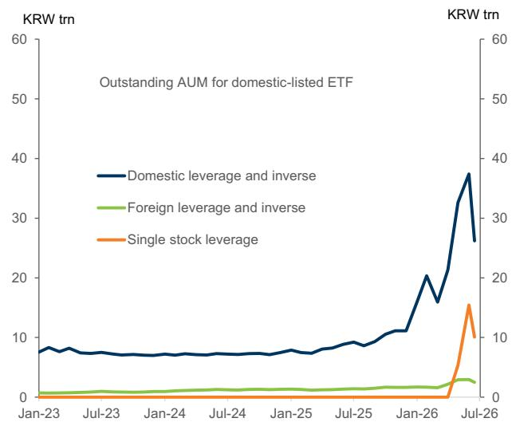  
来源：Quantiwise

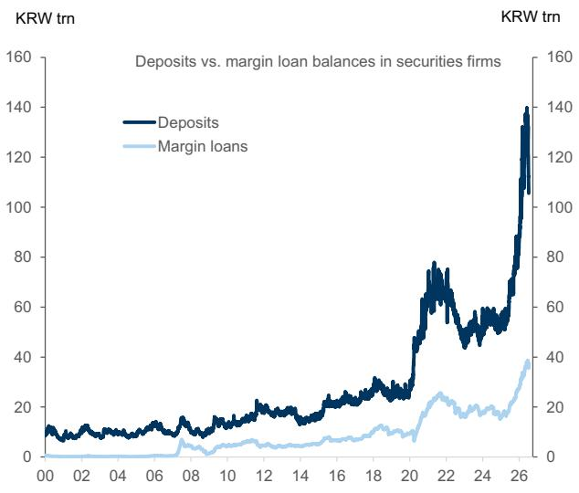

## 温和的消费提振被韩国央行紧缩所抵消

总体而言，我们预计今年市场上涨带来的提振将保持温和。基于2013年至2026年第一季度按收入五分之一分组的家庭消费和权益持有量的季度调查数据的面板回归，在控制可支配收入和家庭特征（如家庭规模和户主年龄）后，我们估计权益财富每增加100韩元，约带动每年1.63韩元的额外消费。这一估计与韩国央行近期研究结果基本一致，该研究表明权益财富每增加100韩元，约带动1.3韩元的额外消费。我们的估计表明，家庭权益财富的增加——自去年底以来相当于GDP的约17%——可能推动私人消费增长约GDP的0.3%。

然而，随着货币宽松周期逆转，积极的财富效应可能被更高的偿债成本所抵消。尽管韩国家庭自2021年以来经历了显著的去杠杆化，但家庭贷款仍占GDP的83%，且超过一半的未偿贷款与浮动利率挂钩（图表12）。根据我们的估计，韩国央行政策利率累计上调75个基点（如我们目前预期），将使家庭可支配收入在毛额基础上减少约GDP的0.3%，或在扣除家庭存款利息收入后净减少约GDP的0.06%。

图表12：家庭贷款仍占GDP的83%，且超过一半的未偿贷款与浮动利率挂钩  
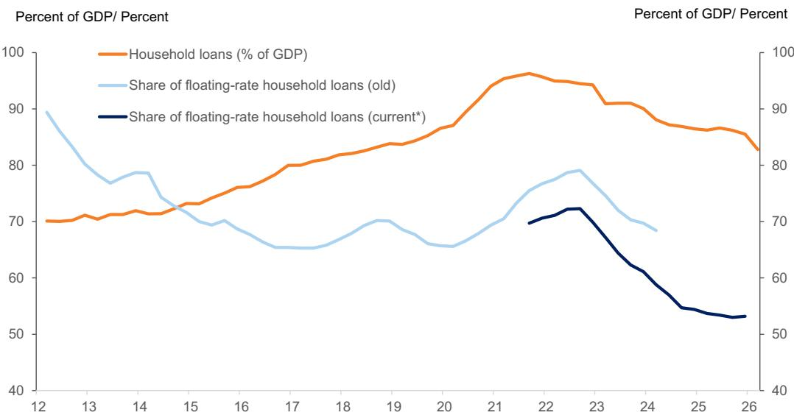  
\*注：韩国央行将利率固定五年或更长时间的贷款从浮动利率贷款重新分类为固定利率贷款

## 来源：Haver Analytics

综合来看，韩国的市场上涨为家庭财富带来了显著提振，但对私人消费的影响可能温和，原因在于若干结构性制约因素，包括权益收益的集中性、较高的家庭杠杆、高储蓄率以及市场回报的波动性。同时，当前上涨的规模前所未有，这提高了历史财富与消费关系可能低估消费上行潜力的可能性。更大的财富效应是否最终显现，将取决于市场上涨的持久性和广度，以及企业收益最终转化为更高家庭收入和更强消费者信心的程度。
