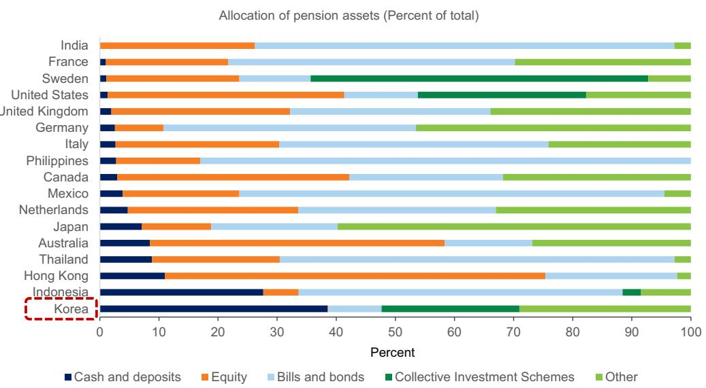
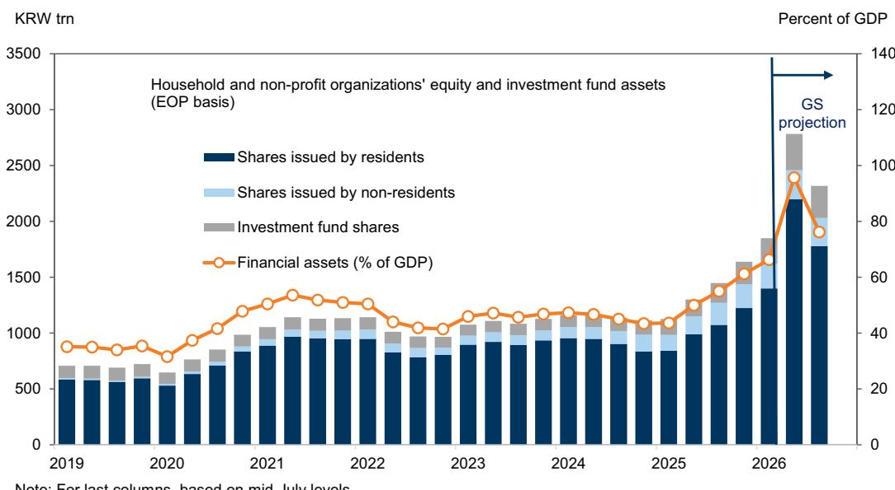

# GS：亚洲宏观环境分析，韩国市场上涨与家庭财富增长但消费受限

韩国综合报价指数年内上涨约60%，较去年同期涨幅超过110%，这一轮历史性上涨为韩国家庭带来了相当于GDP约17%的公司财富增值。然而，GS亚洲宏观环境团队在一份最新报告中指出，这笔巨额财富转化为消费的路径并不通畅。基于面板回归模型，每100韩元公司财富增值仅能带动约1.6韩元的额外消费，全年对GDP的消费拉动大约只有0.3个百分点。更值得关注的是，韩国央行已启动新一轮加息周期，增加的偿债成本可能基本抵消这一微弱的财富效应。

## 1. 公司财富高度集中，受益者并非消费主力

韩国家庭的公司资产分布极不均衡。报告数据显示，收入最高和资产最高的前20%家庭，分别持有全部公司资产的64%和72%。年龄50岁及以上的读者则掌握了73%的家庭公司财富，且其组合观察中约四分之三配置于国内公司，意味着他们从本轮国内市场上涨中获益最多。

问题在于，这些高资产、高年龄群体的消费倾向并不高。韩国老年家庭的储蓄率维持在37%左右，比可比地区高出超过7个百分点。报告认为，这反映了退休后收入与财富支取意愿的有限性，即便获得大额资本增值，这些资金也更可能沉淀在资产负债表内，而非快速进入消费环节。

> **KC评论：** 这张分布图揭示了财富效应传导的第一个断裂点。市场上涨的受益者与边际消费倾向较高的群体并不重合。如果财富集中在储蓄倾向较强的老年群体手中，那么即便名义财富大幅增长，对总消费的拉动也会被结构性削弱。

## 2. 高杠杆与浮动利率贷款构成第二道约束

韩国家庭的债务负担是制约消费的另一关键变量。报告指出，资金负债同样集中于高收入和高资产家庭，最高资产五分位家庭的偿债支出（含本金偿还）占可支配收入的比例高达27%。与主要地区相比，韩国家庭的资金负债相对于资产的比例偏高，这与房地产在家庭资产负债表中的主导地位密切相关。

更关键的是，超过一半的未偿贷款仍与浮动利率挂钩。GS预计韩国央行将累计加息75个基点，这会使家庭可支配收入减少约GDP的0.3%。换言之，加息带来的偿债不确定性，在规模上几乎与公司财富效应带来的消费增量相当。报告的分析框架暗示，市场收益的一部分很可能被用于偿还抵押贷款或进行资产负债表管理，而非增加日常支出。

## 3. 市场波动与杠杆产品放大了收益的不确定性

报告还注意到一个容易被忽视的不确定性信号：国内杠杆ETF的管理资产规模在2026年急剧攀升至超过30万亿韩元，较2025年底增长近三倍，其中单只公司杠杆ETF的推出是主要推动力。同时，标的公司保证金贷款余额也大幅增加。

7月约20%的市场回调，以及杠杆产品经历的大幅价格波动，可能强化了读者对公司财富“不稳定”和“暂时性”的认知。报告谨慎指出，虽然这些杠杆头寸相对于总市值和读者存款仍然有限，但后期入市者可能已遭受显著损失，这部分损失至少会部分抵消此前的资本增值。

从不确定性调整后的回报看，首尔住宅物业自2018年以来持续提供优于韩国公司的表现，5年滚动夏普比率一度超过6，而KOSPI的同类指标长期低于0.5。这种历史比较进一步削弱了公司财富被视作“永久性收入”的基础。

## 4. 一个可复用的观察框架：财富效应的三个传导条件

这份报告提供了一个简洁但完整的分析框架，可用于评估任何资产价格上涨对消费的拉动潜力。第一，财富的分布结构——受益者是否具备高消费倾向。第二，家庭资产负债表的状态——杠杆水平和债务结构是否允许财富向消费转化。第三，资产回报的稳定性——市场波动是否导致居民将收益视为暂时性收入。

在韩国案例中，三个条件均不充分。报告在结论中留下了一个开放但克制的判断：如果本轮上涨的持续性和广度能够超出历史经验，如果企业盈利最终转化为更高的家庭收入和更强的消费者信心，那么财富效应可能比模型预测的更大。但基于现有证据，GS的基准情景仍然是“温和”。

For informational purposes only. Portions may be generated,translated,summarized,or edited with AI assistance based on source materials and may contain omissions or errors. Please verify independently. This is not investment,legal,tax,accounting,or other professional advice.

