# AUSTRALIA METALS & MINING: GOLD

## GMD merger appears accretive vs. baseline ASPIRE 500 and VAU outlooks; Reinstate GMD at Buy, RRL at Neutral

Following GMD's 6-Jul proposal, and RRL electing not to match the offer, GMD and VAU have agreed to merge via a Scheme of Arrangement, with implementation targeted Oct/Nov-26. GMD reaffirmed the strategic rationale, though a strategic review and new plan is targeted for 1H CY27 to better outline a combined outlook, including production uplifts/LoM extensions, capex savings, mine plan optimisations, and potential non-core divestments. GMD noted they will also provide some FY27 guidance with the upcoming quarterly result.

We conduct an illustrative scenario analysis to assess the outlook for a MergeCo scenario vs. our assumptions around GMD's baseline ASPIRE 500 plan on our bottom up mine/mill/cost modeling within, all else equal. We see the merger as potentially accretive, with MergeCo lifting gold production by ~30-80kozpa to ~690-780kozpa over FY27-28E vs. a pro forma of our baseline GMD/VAU outlooks with a ~10% lower AISC of ~A$2,850/oz, with an EBITDA lift of ~15-25% over the same period (before any mine plan/cost optimisation). On a 10yr outlook, we see aggregate production broadly similar vs. the pro forma despite not having the Tower Hill mill/deferred Laverton mill expansion, while longer-term production declines may be deferred with LoM extension enabled by enhanced exploration spend medium-term.

Together with a more capital-light MergeCo pathway by avoiding construction of a mill at Tower Hill (and the associated capex/timing risks in the current project environment; See our buy vs. build analysis), and a ~1-2yr deferral of Laverton capacity expansion (with Hub/Bruno-Lewis/Admiral material processed through the KoTH mill adding incremental ounces vs. GMD's target and liberating capacity at Laverton), our analysis implies operating FCF yields increasing +5-10% to ~10-15% on average near-term with scope for growing capital returns (average ~4-5% DPS yield) from a further strengthened balance sheet/lowered cost of capital.

We reinstate ratings on GMD to Buy (~30% upside), Neutral on RRL (~15% upside), and remain Not Rated on VAU. Though we have historically been more cautious on GMD's outlook, we now see reasonable upside to our revised estimates (including further elevated capex), with the standalone business on our ASPIRE 500 outlook trading ~0.8x NAV. Separately, under our MergeCo scenario, we see the potential for the business to be more defensively positioned for ongoing gold price volatility, while trading at ~0.75x NAV or pricing ~US$3,190/oz.

Hugo Nicolaci
+61(2)9321-8323 |
hugo.nicolaci@gs.com
GS Australia Pty Ltd

Paul Young
+61(2)9321-8302 |
paul.young1@gs.com
GS Australia Pty Ltd

Marcus Dosanjh
+61(2)9321-8780 |
marcus.dosanjh@gs.com
GS Australia Pty Ltd

## High level merger summary

Following the 6-Jul proposal from Genesis Minerals (GMD.AX) to merge with Vault Minerals (VAU), and the subsequent expiration of Regis Resources' (RRL.AX) exclusive matching period, GMD and VAU have now agreed to merge via a Scheme of Arrangement, under which GMD will acquire 100% of the fully paid ordinary shares in VAU. The consideration remains unchanged from the initial proposal, with VAU shareholders to receive 0.7629 new fully paid ordinary shares in GMD plus A$0.475 in cash for each VAU share held (a cash/scrip mix with a mix-and-match facility, subject to the aggregate ~A$500mn cash and ~803.4mn GMD shares on offer). Based on GMD's closing share price of A$6.29/sh on the 3rd of July 2026 (being the last close prior to GMD's initial proposal), the offer values VAU at ~A$5.274/sh (~A$5.6bn fully diluted equity value), representing a ~15.7% premium to VAU's close price on the 3rd of July 2026, where upon Scheme Implementation, GMD/VAU shareholders would own ~59.8%/~40.2% of the combined entity respectively (fully diluted).

GMD have reaffirmed the strategic rationale, where the merger remains intended to create a new Australian gold major anchored in the Tier 1 Leonora-Laverton district. GMD expects MergeCo to have an immediate pro forma production of 600-700kozpa pre-optimisation (all 100%-owned in WA), underpinned by ~400-500kozpa from the Leonora-Laverton district. The combination consolidates total milling capacity to ~15.9Mtpa (~11.5Mtpa VAU post KOTH expansion to ~8Mtpa + ~4.4Mtpa GMD current capacity pre-Laverton expansion), with GMD noting this presents a capital-light pathway greater production by avoiding construction of a mill at Tower Hill and the associated capex/timing risks of executing in the current WA project pipeline (we see the number of expected projects tripling vs. CY25 levels on our buy vs. build analysis), whilst retaining organic expansion optionality through continued contractor support.

According to GMD, the transaction will bring together a combined mineral endowment of ~9.4Moz in Ore Reserves and ~33.6Moz in Mineral Resources, making it the dominant producer in the district. GMD expect the combined group would be underpinned by a stronger balance sheet with ~A$611mn in pro forma net cash (incl. bullion and investments, and excluding ~A$89mn GMD asset finance; GSe illustrative analysis ~A$490mn of cash including asset finance (GMD ~A$220mn and VAU ~A$820mn, less cash consideration (~A$500mn) and Regis break fee (~A$51mn)) and ~A$1.3bn in pro forma liquidity. GMD noted this positions the MergeCo as well-funded for both growth and shareholder returns (capital management program part of strategic review), with a pro forma market capitalisation of ~A$12.6bn (at announcement) providing enhanced scale, liquidity and global market relevance.

The Scheme is subject to various conditions including approval by VAU shareholders at a Scheme Meeting expected to be held in Sep/Oct (following scheme booklet in Aug/Sep), with implementation of the Scheme expected to occur in Oct/Nov 2026. The VAU Board has unanimously recommended that shareholders vote in favour of the Scheme, in the absence of a superior proposal and subject to the independent expert concluding that the Scheme is in the best interests of VAU shareholders. Following the strategic review, GMD plans to release a new strategic plan in 1H CY27, including a multi-year production, cost, capex, and exploration outlook, with revised capital management framework. GMD noted some FY27 guidance to be provided with the upcoming quarterly (previously planned with a Sep-Q multi-year outlook), with some reduced capex (i.e. Tower Hill spend) as a result of the merger.

Merger appears accretive based on our illustrative analysis vs. our baseline GMD ASPIRE 500 and VAU outlooks

## Synergies, and MergeCo scenario assumptions

On synergies, GMD continues to estimate potential post-tax, undiscounted synergies of ~A$2.0bn (net of transaction costs, stamp duty and the RRL break fee; Exhibit 55), including ~A$1.5bn in pre-tax, undiscounted synergies over ten years that are unique to a GMD/VAU combination and only available given the proximity of the two companies' operations at Leonora (within 35km) and Bardoc-Mt Monger (see our WA gold map), with additional, yet-to-be-quantified synergies and operational flexibility also continuing to be targeted. We outline GMD's key announced synergies and our MergeCo assumptions/comments in Exhibit 1 below, along with an illustrative MergeCo outlook vs. a baseline pro forma (including the detail of our ASPIRE 500 GMD standalone outlook). We further outline underlying peer comps beneath (including production and AISC, along with the trailing 12 month milling, and OP/UG mining costs by asset vs. peers in Exhibit 48 below (see our Gold Book for further industry comps)).

Post merger completion, GMD announced that it will look to conduct a strategic review to be released in 1H CY27 which will target a review of the MergeCo asset portfolio and the optimisation of ore and mills, including:

■ Processing of Tower Hill ore through the expanded KOTH mill;

■ Acceleration of development of Focus Laverton and Lady Julie deposits;

- Unlocking of free milling Bardoc ore at the ~1.3Mtpa Mount Monger Randalls mill;

Further resource to reserve conversion (~25Moz of resource currently not in reserves; Exhibit 60), where GMD noted VAU have historically maintained a ~3 year reserve life in recent years, with upside from resource conversion on increased drilling;

■ Acceleration of exploration across the portfolio, with initial opportunities identified within the Chatterbox Trend, Gwalia Uppers, and King of the Hills/Darlot undergrounds;

■ Potential for non-core divestments (where GMD highlighted the Leonora-Laverton region as the core asset) up to ~A$0.76bn on GSe including Deflector/Rothsay (~A$330mn; see our WA gold map) and Sugar Zone (~A$430mn) on our VAU base case outlook, where Mt. Monger could add ~A$0.9bn including our resource conversion (~A$0.8bn) and Bardoc free milling scenario (+ ~A$150mn).

Exhibit 1: We see a number of upfront and longer-term synergies supporting an accretive outlook, though see a shorter deferral of Laverton hub mill expansion

Summary of GMD Outlined Synergies vs. our assumptions for MergeCo in our illustrative analysis

<table><tr><td colspan="2">Summary of GMD Outlined Synergies vs. GSe</td><td>GMD Assumed Synergy Value (A$mn; undiscounted)</td><td>GSe Assumption / Comment</td></tr><tr><td rowspan="4">Infrastructure</td><td>Enabling Tower Hill ore to be processed through KOTH mill, avoiding construction of Tower Hill mill</td><td>350</td><td>We assume A$350mn total capex for the Tower Hill mill including supporting infrastructure (quoted A$229mn just for mill component), where we assume a ~A$25mn sunk cost in 1H FY27. We note this also avoids ongoing sustaining capex of the new mill.GMD noted on the target deal completion timeline of late Oct/Nov-26 this would time well with commissioning of the Stage 2 expansion at KoTH mill, with first ore from Tower Hill expected in early FY28 (reasonably ahead of schedule; first production from a Tower Hill mill was expected late FY28) accelerating production, where the ball mill enables maintaining grind size and avoiding recovery loss vs. the displaced ore.We note the Tower Hill mill contractor, GR Engineering outlined separately that they have already commenced engineering works and the procurement of long lead items for the Tower Hill mill (contract sum A$229mn), but will continue to work with GMD to optimise outcomes based on both the work scheduled and performed to date. GMD noted this may include fast tracking mill works at the Laverton hub.</td></tr><tr><td>Potential for liberation of Laverton mill capacity to accelerate development of Focus Laverton and Lady Julie assets (yet to be quantified), and defer expansion of Laverton mill capacity (capex saving)</td><td>365</td><td>On our ASPIRE 500 GMD baseline outlook, we assume expansion of Laverton hub milling capacity from ~3Mtpa to ~4.75Mtpa with mill capex of ~A$350mn, ramping up over FY30/31E and delivering a GMD group standalone ~500kozpa. We see this also potentially supported by upside to Lady Julie development vs. prior planning with an initial started pit while a larger mine incorporating prior GMD tennements goes through permit revisions.On a MergeCo scenario, while we assume further gold production uplift at the KoTH mill via additional low grade displacement from Hub/Bruno-Lewis/Admiral mines, liberating Laverton mill capacity, we assume an expansion of Laverton hub milling capacity is only deferred ~1-2yrs before making economic sense to proceed on available ore in the Laverton region.</td></tr><tr><td>Includes growth, non-process infrastructure, tailings storage facility and sustaining capital, for a total capital saving of A$715m</td><td>715</td><td></td></tr><tr><td>Subject to economic conditions, the Merged Group would have the flexibility to utilise or expand the operational 1.4Mtpa Gwalia Mill (Gwalia mill production of ~195koz based on Genesis' FY29 production outlook for Leonora)</td><td rowspan="14">~745+</td><td>We see the Gwalia and Ulysses mines ramping up to nearly fill the Gwalia mill for >10 years on ~80% existing resource conversion, averaging ~160-190kozpa over the period.</td></tr><tr><td rowspan="4">Mine optimisation</td><td>Introduction of Genesis ore to the KOTH mill may enable the KOTH open pit stages 2-5 to be re-optimised based on delivery of highest value for the combined portfolio (i.e. optimising for grade and cashflow), with potential upside from streaming high grade (0.9g/t) and low grade (0.3g/t) KoTH OP ore</td><td rowspan="2">We assume current mine plans, with stockpiling for future mill expansion optionality on higher gold prices (see below on operational optionality / "future proofing"), with mine optimisation further potential upside to our MergeCo scenario (including further upside from streaming high grade and low grade KoTH OP ore).We assume an ~A$0.5/t OP mining cost saving at the KoTH open pit, equating to a ~A$16mnpa saving, using GMS (and avoiding third party contractor margins).GMD noted the fleet ordered for Tower Hill mining are a larger size than initially contemplated, with these lowering unit costs of future stripping programs, including KoTH stage 4/5 cutbacks.We see net regional haulage savings as more modest, with lower haulage of Hub/Bruno-Lewis/Admiral to KoTH (vs. Laverton) partly offset by increased haulage of Tower Hill to KoTH.</td></tr><tr><td>Reduction in group open pit mining costs by embedding KOTH's owner-operator fleet into Genesis Mining Services (GMS) and utilising GMS across the enlarged Group, enabling optimisation of talent and equipment between sites, including KOTH and Tower Hill given their similar fleet size and location. GMD assume KOTH to commence owner-operator load and haul on 1 January 2027</td></tr><tr><td>Potential to defer or avoid costs associated with development and operation of the high strip ratio Westralia open pit (23:1 LOM strip ratio) in preference for higher-quality assets (e.g. Beasley Creek and Lady Julie)</td><td>We see the Westralia deferral taking place either way as part of the GMD base case ASPIRE 500 plan, with this largely deferred by the Lady Julie mine as part of the completed MAU acquisition. We factor in Westralia development from the mid-2030s, supporting stockpiles and filling the expanded Laverton hub milling capacity.</td></tr><tr><td>Optimisation of underground mining (fleet, personnel, technical expertise, infrastructure, etc) and shared technical expertise</td><td></td></tr><tr><td rowspan="5">Operational flexibility</td><td>Potential to use ore from the Tower Hill project to displace low grade open pit feed ore at KOTH which could:</td><td></td></tr><tr><td>• Materially increase production from KOTH1</td><td>The introduction of Tower Hill ore (~2-3Mtpa at ~2.0g/t) to the expanded KOTH mill, displacing low-grade KOTH open pit feed (~0.3g/t), and potentially adding an incremental ~100kozpa, taking KoTH production to ~300kozpa+ by ~FY29.</td></tr><tr><td>• Enable the building of sizeable stockpiles for operational optionality / "future proofing"1</td><td></td></tr><tr><td>• Lower processing costs by processing Genesis ore through the lower cost KOTH mill (net of additional haulage costs to KOTH vs. Tower Hill mill)3</td><td>We see a cost benefit of processing at the expanded ~8Mtpa KoTH mill atA$30/t (see exhibits below comparing gold asset processing costs).</td></tr><tr><td>Unlock GMD's Bardoc free-milling ore via processing at the ~1.3Mtpa Mount Monger Randalls Mill.Free-milling Resource within Bardoc tenure includes Mineral Resource from Zoroastrian (Resource: 7Mt @ 2.3g/t 520koz; Reserve: 0.79Mt @ 3.8g/t 97koz), Excelsior (Resource: 11Mt @ 1.0g/t 350koz) and Bulletin (Satellite open pits Resource 8.5Mt @ 1.5g/t 400koz), ~35m of UG development for Zoroastrian already completed, and approvals in place.</td><td>Our MergeCo scenario asusmes a ~A$150mn NPV uplift from incorporating ~800koz of Bardoc region ore from FY28E for a ~20kozpa average gold production uplift over ~10 years (~60-70% resource conversion of Zoroastrian/Excelsior UGs and ~50% of Bardoc Satelite OPs).We note other nearby mills have refractory capacity that may support future processing of GMD's ~1.6Moz of Aphrodite refractory ore, in our view. See Summary of GMD's refractory ore mix in exhibit below.</td></tr><tr><td rowspan="4">Other</td><td>Water supply flexibility at Leonora</td><td></td></tr><tr><td>Centralised supply chain hubs (spares, purchasing power, inventory optimisation, store and freight consolidation)</td><td>We do not include any procurement benefits in our MergeCo scenario.</td></tr><tr><td>Potential to unlock further resources in the region by re-prioritising or accelerating exploration</td><td>GMD noted VAU have historically maintained a ~3 year reserve life in recent years, with upside from resource conversion on increased drilling.Our standalone and MergeCo scenario both assume less than full resource conversion, with ~40-60% conversion for OPs and ~60-80% for UG on average.</td></tr><tr><td>Regional G&A savings associated with rationalising overheads and administration in the Leonora region</td><td>We assume aggregated site administration costs without savings as a baseline.</td></tr><tr><td rowspan="2">Corporate</td><td>Corporate cost savings estimated by Genesis at ~A$120mn, plus</td><td>120+</td><td>We assume GMD's ~A$12mnpa corporate cost saving, but from an above pro forma corporate cost base (assumes step up in costs through integration).</td></tr><tr><td>At least A$420mn of tax benefit, including the step-up in depreciable tax base (net of stamp duty (~A$230mn), Regis break fee (A$50.7mn), and the tax effect of the quantified unique synergies and corporate cost savings)4</td><td>420+</td><td>We note VAU had Australian tax losses at Dec-25 of A$289.6mn available and C$298.5mn of Canadian tax losses, while GMD noted they are now paying cash tax. We factor these into our MergeCo Scenario (previously included in our VAU outlook).</td></tr><tr><td>Total</td><td></td><td>2,000+</td><td></td></tr></table>

Notes (per GMD slides): Total synergies are shown on a post-tax, undiscounted basis across a 10-year period, and net of stamp duty and Regis break fee; 1. Potential for material increase in KOTH production subject to the outcome of further technical and operational studies, and stockpile operational optionality subject to prevailing economic conditions; 3. Lower cost compared to Genesis' proposed Tower Hill mill; 4. Corporate cost savings estimated by Genesis, assumes removal of duplicate corporate costs after a period of integration of the businesses. Tax benefit is expected undiscounted estimate of tax savings under a 10-year depreciable life from an uplift in the tax value of depreciable assets and inventory arising from the tax purchase price allocation, net of expected stamp duty for the transaction, Regis break fee payable and increased taxes attributable to the unique synergies.

Source: Company data, GS Global Investment Research

## MergeCo vs. pro forma ASPIRE 500 and VAU outlook

In the charts below, we outline our MergeCo scenario analysis vs. a baseline pro forma of our standalone outlooks across GMD' ASPIRE 500 and VAU's 3yr outlook and beyond on our bottom up mine/mill/cost modeling. We highlight that our MergeCo scenario is purely illustrative and a range of outcomes exist beyond what we present.

Based on our illustrative analysis, we see the merger as potentially accretive, with MergeCo lifting gold production by ~30-80kozpa to ~690-780kozpa over FY27-28E vs. a pro forma of our baseline GMD/VAU outlooks with a ~10% lower AISC of ~A$2,850/oz (Leonora Hub +50-100kozpa to ~430-500kozpa, AISC ~10% lower at ~A$2,650/oz), supporting a ~15-25% EBITDA uplift over the same period (before any mine plan/cost optimisation, including any KoTH mine grade streaming). On a 10yr timeline, we see aggregate gold production broadly similar vs. the pro forma despite not having the Tower Hill mill/deferred Laverton mill expansion (resulting in lower gold production between FY29-34E), while longer-term production declines may be deferred with LoM extension enabled by enhanced exploration spend medium-term (and Bardoc developments).

Together with a more capital-light pathway by avoiding construction of a mill at Tower Hill (and the associated capex/timing risks in the current project environment; See our buy vs. build analysis), and a ~1-2yr deferral of Laverton capacity expansion (with Hub/Bruno-Lewis/Admiral material processed through the KoTH mill adding incremental ounces vs. GMD's target and liberates capacity at Laverton), our illustrative MergeCo scenario implies operating FCF yields increasing +5-10% vs. the pro forma the baseline outlooks to ~10-15% on average near-term with scope for growing capital returns (average ~4-5% DPS yield) from a further strengthened balance sheet/lowered cost of capital, all else equal.

For simplicity, our charts below assume a MergeCo scenario from FY27, though with operational synergy benefits only beginning to flow through from CY27 onwards. We assume our standalone baseline mine development schedules under our MergeCo scenario, allowing for a stockpile build and drawdown at end of mine life to allow for potentially mill expansion/production acceleration in future on higher gold prices (GMD noted a history of building stockpiles for optionality/mitigating impacts from mine disruptions), but we see potential further margin upside to mine plan deferral without this optionality.

On this basis we see Hub/Bruno-Lewis/Admiral ore going to KoTH mill under MergeCo (with GMD guiding to liberating capacity at Laverton, as guided by GMD, vs. topping up the Laverton mill under our baseline ASPIRE 500 scenario). While this would liberate near to medium term mill capacity at Laverton, we see only a ~1-2yr deferral of Laverton capacity expansion with adequate ore to support project economics. At Mt. Monger, we also bring in development of the Bardoc free milling ore from FY28E for a ~20kozpa average gold production uplift over ~10 years.

We assume the maximum cash component of ~A$500mn in cash paid as part of transaction less a VAU final dividend of ~A$105mn (~A10cps unfranked on VAU limited cash tax on Australian tax credits), and capital gains tax (~A$230mn) paid ~12 months after transaction (in-line with recent transactions).

MergeCo production by asset (koz)

Exhibit 2: MergeCo scenario lifts gold production by ~30-80kozpa to ~690-780kozpa over FY27-28E vs. a pro forma of our baseline GMD/VAU outlooks (flat on a 10yr outlook, and up LoM)...

MergeCo vs. pro-forma GMD/VAU combination gold production (koz)

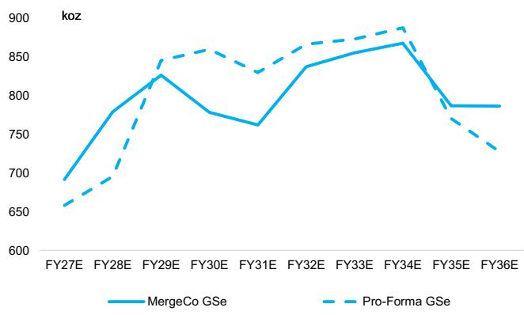  
Gold production only (ignores modest silver/copper by-products).  
Source: Company data, GS Global Investment Research

Exhibit 3: ...with the Leonora Hub adding 50-100kozpa to ~430-500kozpa  
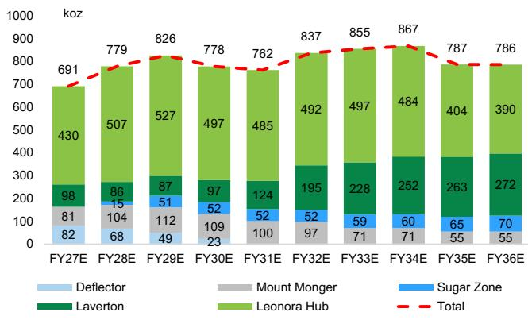  
Source: Company data, GS Global Investment Research

Exhibit 4: Increased production and reduced milling costs (with no Tower Hill mill) see costs fall near-term...
MergeCo vs. pro-forma cash costs (A$/oz sold)  
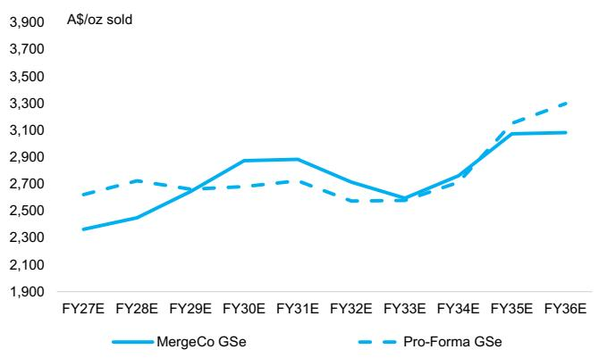  
Source: GS Global Investment Research  
Exhibit 5: ...with asset costs varying as new feed sources ramp up  
MergeCo cash costs by asset (A$/oz sold)

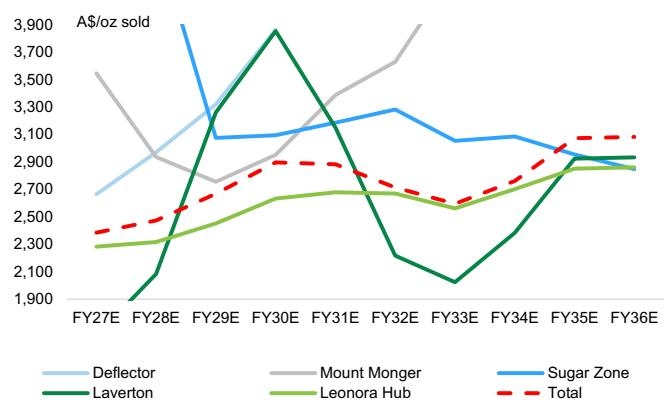  
Source: Company data, GS Global Investment Research

Exhibit 6: ...where AISC drops ~10% in FY27-28E to ~A$2,850/oz vs. a baseline pro forma...
MergeCo vs. pro-forma AISC (A$/oz sold)  
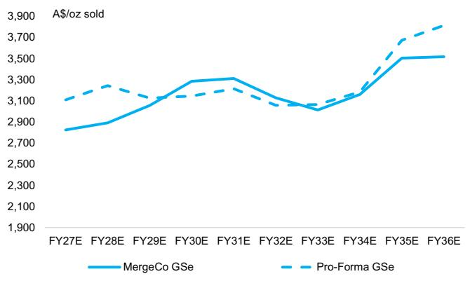  
Source: Company data, GS Global Investment Research

Exhibit 7: ...with Leonora hub AISC also dropping ~10% to ~A$2,650/oz  
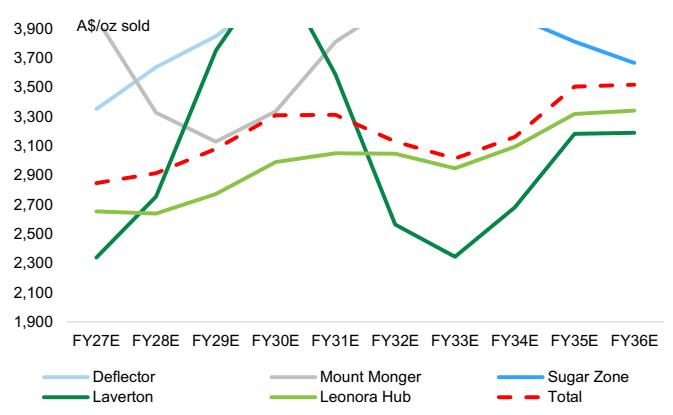  
Source: Company data, GS Global Investment Research  
Exhibit 8: Our illustrative analysis implies MergeCo having elevated scale, though with moderated growth vs. GMD's standalone ASPIRE 500 target...

Mid-cap gold Eq production (koz Au Eq; equity share)  
  
Source: Company data, GS Global Investment Research

Exhibit 9: ...though with lower near-term AISC vs. most peers supporting widening margins
All-in sustaining cost (A$/oz)  
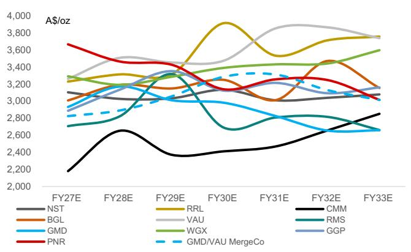  
Source: Company data, GS Global Investment Research  
Exhibit 10: Near-term our analysis suggests MergeCo supporting a ~15-25% EBITDA uplift...

MergeCo vs. pro-forma underlying EBITDA (A$mn) & underlying EBITDA margin (%; RHS)  
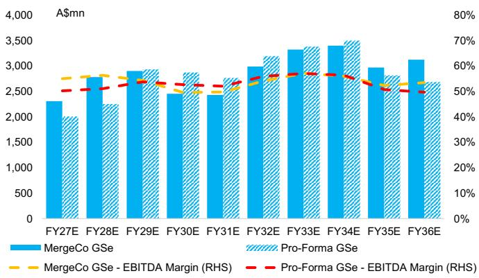  
Source: Company data, GS Global Investment Research

Exhibit 11: ...with an elevated EBITDA across Leonora and Mount Monger supporting improved margins
MergeCo underlying EBITDA by asset (A$mn)  
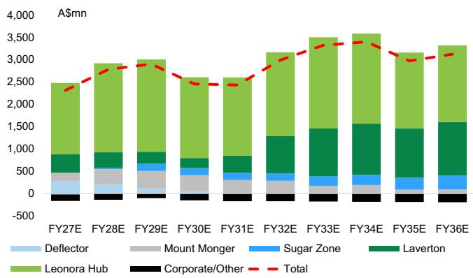  
Source: Company data, GS Global Investment Research

Exhibit 12: One of the larger benefits is the reduced upfront capex by avoiding a ~A$350mn mill construction at Tower Hill (though with some sunk cost)...
MergeCo vs. pro-forma total capex (A$mn)  
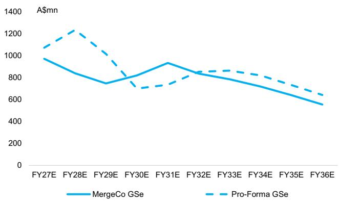  
Source: Company data, GS Global Investment Research  
Exhibit 13: ...where the combined entity supports increasing exploration spend to support life extension/resource upside
MergeCo vs. pro-forma total capex split (A$mn)

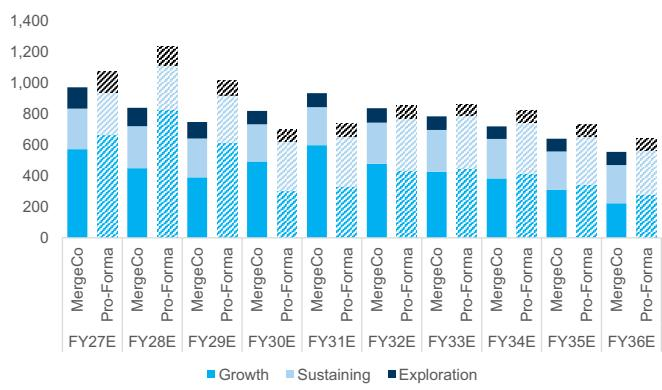  
Source: Company data, GS Global Investment Research  
MergeCo total capex by asset (A$mn)

Exhibit 14: We still see a MergeCo expanding mill capacity at Leonora (>A$350mn), though deferring this spend ~1-2 years...

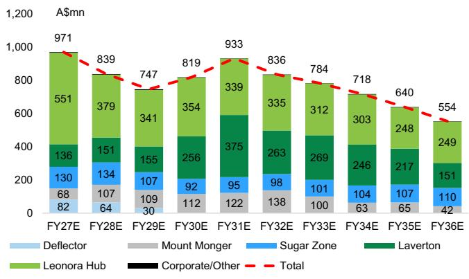  
Source: Company data, GS Global Investment Research

Exhibit 15: ...with redirected Hub/Bruno-Lewis/Admiral material liberating capacity at the existing mill near-term MergeCo Laverton capex split (A$mn)  
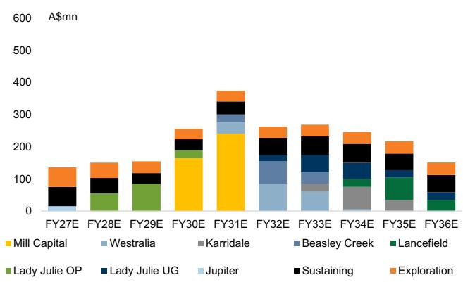  
Source: Company data, GS Global Investment Research  
MergeCo Leonora capex split (A$mn)

Exhibit 16: At Leonora, we see ~A$25mn of sunk Tower Hill mill spend, with flattening ongoing capex post TH mine development

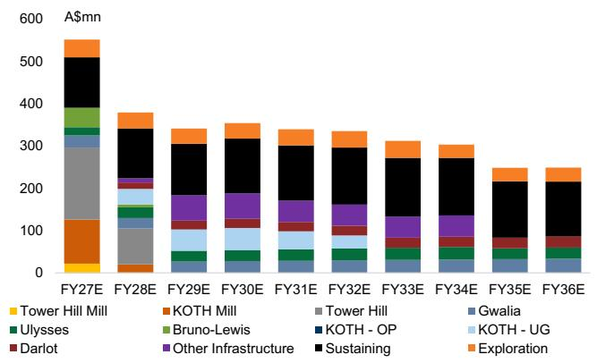  
Source: Company data, GS Global Investment Research

Exhibit 17: Together, we see operating FCF yields increasing +5-10% to ~10-15% on average near-term... MergeCo vs. pro-forma operating FCF (A$mn) & operating FCF yield (%; RHS)  
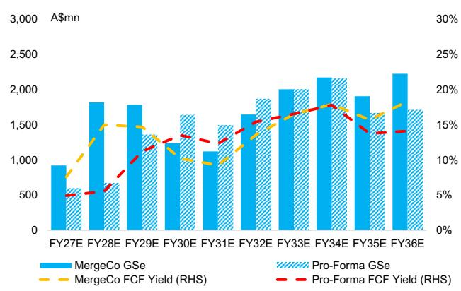  
Source: Company data, GS Global Investment Research

Exhibit 18: ...largely supported by the ~A$350mn Tower Hill mill capex saving
MergeCo operating FCF by asset (A$mn)  
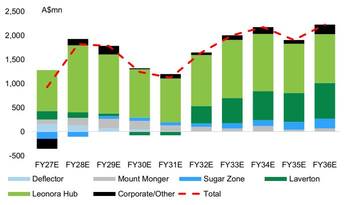  
Source: Company data, GS Global Investment Research

Exhibit 19: This sees MergeCo net cash outperform a baseline pro forma...
MergeCo vs. pro-forma net debt/(cash) (A$mn)  
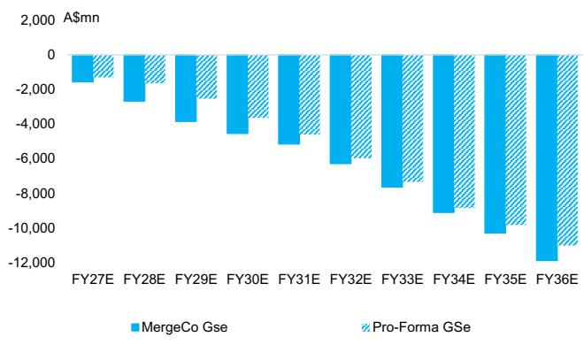  
Source: Company data, GS Global Investment Research  
Exhibit 20: ...with improved gearing metrics
MergeCo vs. pro-forma net debt/EBITDA (x)

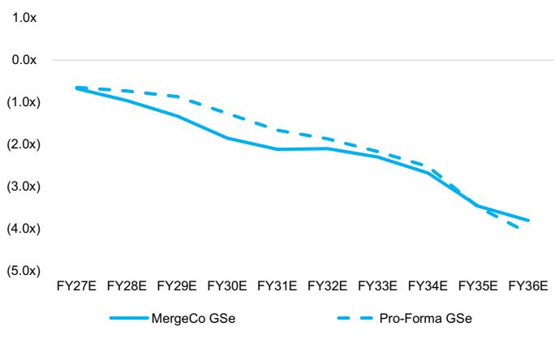  
Source: Company data, GS Global Investment Research

In the charts below, we outline the resulting operating build up of the Leonora and Laverton hubs under the MergeCo scenario (with our GMD standalone ASPIRE 500 hub build ups in the following section).

Exhibit 21: We assume Tower Hill, combined with Hub/Bruno-Lewis/Admiral supports prolonged elevated feed grades at KoTH mill, with Gwalia mill fed from the Gwalia/Ulysses UG mines...

MergeCo Leonora mining profile - ore mined (kt) vs. mined grade (g/t; RHS)

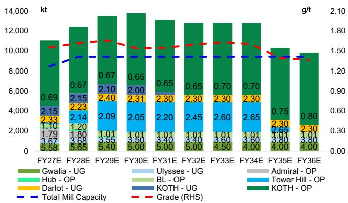  
Source: Company data, GS Global Investment Research  
Exhibit 22: ...with low grade KoTH OP stockpiled vs. combined ~9.4Mtpa milling capacity at the Leonora hub (~1.4Mtpa Gwalia mill and ~8Mtpa expanded KoTH mill)
MergeCo Leonora milling profile - ore processed (kt) vs. processed grade (g/t; RHS)

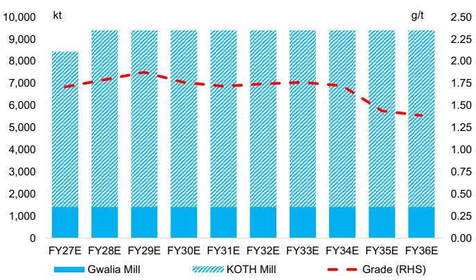  
Source: Company data, GS Global Investment Research  
Exhibit 23: We assume the Laverton hub deferring mill capacity expansion only ~1-2yrs, before Lady Julie provides excess, higher grade ore...  
MergeCo Laverton mining profile - ore mined (kt) vs. mined grade (g/t; RHS)

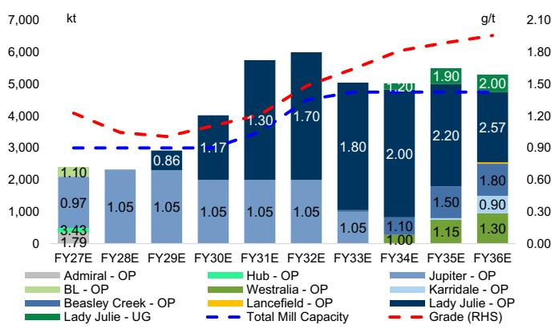  
Source: Company data, GS Global Investment Research  
Exhibit 24: ...with enough ore to support expanding the Laverton hub capacity from ~3Mtpa to ~4.75Mtpa
MergeCo Laverton milling profile - ore processed (kt) vs. processed grade (g/t; RHS)

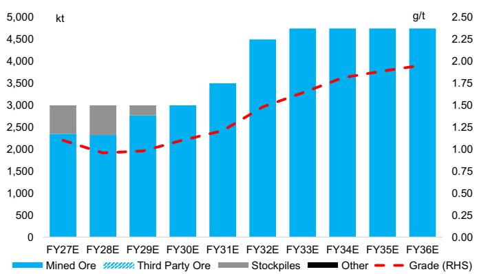  
Source: Company data, GS Global Investment Research

Exhibit 25: We assume significant milling unit cost benefits from larger/newer mills
MergeCo processing costs (A$/t)  
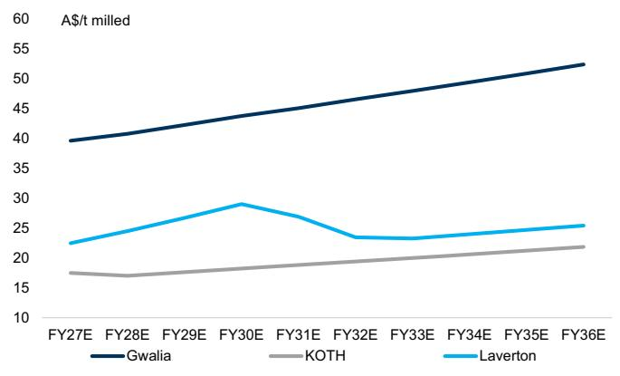  
Source: Company data, GS Global Investment Research

## Pro forma of baseline GMD ASPIRE 500 and VAU outlooks

In the charts below we outline the build up of the baseline outlooks across GMD's ASPIRE 500 and VAU's production profile building on their 3yr outlook.

Exhibit 28: Where GMD's costs average up on a straight baseline pro forma...
Pro-forma cash costs by company (A$/oz sold)  
Exhibit 26: Under a baseline pro forma, we see lower near-term production...
Pro-forma gold production by company (koz)  
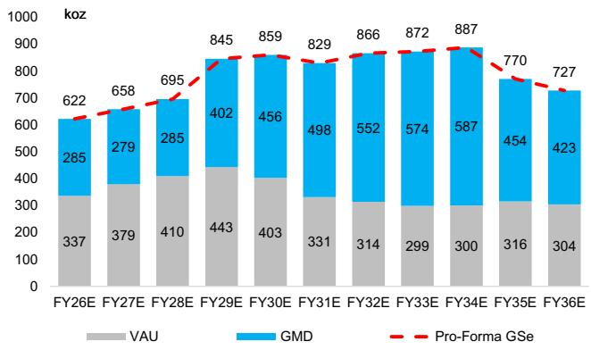  
Source: Company data, GS Global Investment Research  
Exhibit 27: ...though an elevated ~FY29-34E production on having additional mill capacity installed at Tower Hill
Pro-forma gold production by asset (koz)

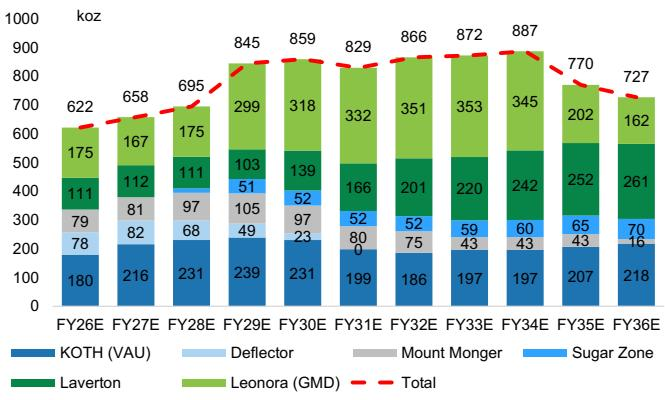  
Source: Company data, GS Global Investment Research

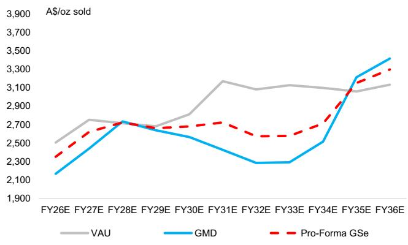  
Source: Company data, GS Global Investment Research

Exhibit 29: ...with VAU's generally lower grade/other smaller scale operations...
Pro-forma cash costs by asset
