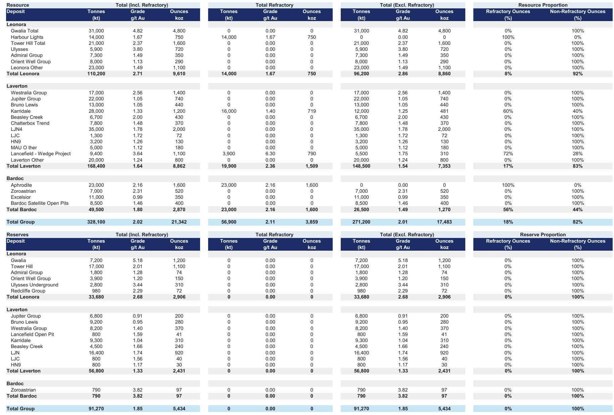
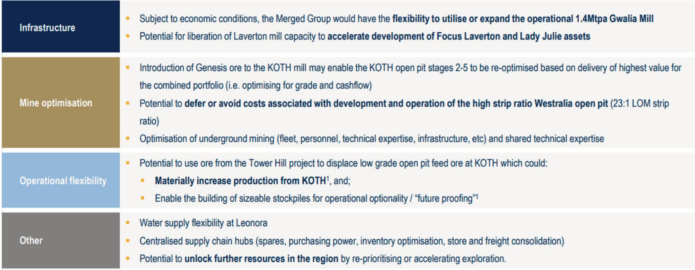
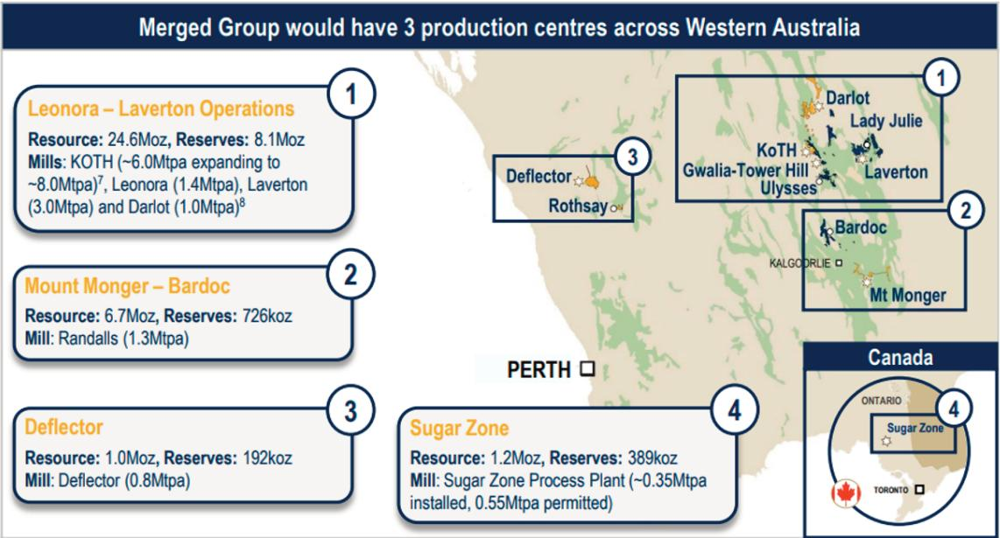

# The Genesis-Vault Merger Creates a Leaner, More Defensive Australian Gold Major—But the Real Test Is in Execution

The proposed merger between Genesis Minerals and Vault Minerals is not a simple consolidation play. It is a strategic reconfiguration designed to eliminate a costly greenfield mill build, defer a major capacity expansion, and unlock latent production from existing infrastructure that would otherwise remain underutilized. The combined entity, if executed as planned, could deliver gold production of 690,000 to 780,000 ounces per year over FY27-28E—roughly 30,000 to 80,000 ounces above the pro forma of the two standalone businesses—at a roughly 10 percent lower all-in sustaining cost of approximately A$2,850 per ounce. The EBITDA uplift of 15 to 25 percent over the same period comes before any mine plan optimisation or cost synergy realization. That is the headline. But the deeper story is about capital discipline, optionality, and positioning for gold price fluctuations in a project environment where building new processing capacity has become prohibitively risky.

The timing matters. The Western Australian project pipeline has tripled compared to CY25 levels, according to a report-versus-build analysis. In that environment, the decision to scrap the Tower Hill mill—a A$229 million construction contract already underway with GR Engineering—and instead process that ore through the expanded King of the Hills mill is not merely a cost saving. It is a deliberate avoidance of the execution risk that has plagued Australian gold projects in the current cycle. The merger therefore signals a shift in strategic logic: the cheapest ounce is not the one you mine, but the one you do not have to build a mill to produce.

## Avoiding the Tower Hill Mill Eliminates a Major Capex Risk and Accelerates Production by Nearly a Year

The most consequential synergy in the merger is the decision to process Tower Hill ore through the expanded KOTH mill rather than building a dedicated processing facility. GMD estimated this alone delivers A$350 million in undiscounted capital savings. But the real value lies in what it avoids: the construction timeline risk, contractor margin inflation, and the operational distraction of commissioning a new mill in a tight labor market. The KOTH Stage 2 expansion is already on track for late 2026 commissioning, meaning first ore from Tower Hill can enter the mill in early FY28—roughly a year ahead of the standalone Tower Hill mill schedule.

The arithmetic is straightforward. Tower Hill ore grades approximately 2.0 grams per tonne, while the low-grade KOTH open pit feed averages around 0.3 grams per tonne. By displacing low-grade stockpile material with higher-grade Tower Hill ore, the combined operation can lift KOTH production to over 300,000 ounces per year by FY29, adding roughly 100,000 incremental ounces annually. The ball mill at KOTH also maintains grind size, avoiding the recovery losses that would occur if lower-grade ore were processed through a different circuit. This is not a theoretical synergy; it is a direct production uplift enabled by infrastructure that already exists.

## Deferring the Laverton Hub Expansion Creates a Capital-Light Pathway with Growing Free Cash Flow

The standalone GMD ASPIRE 500 plan assumed a A$350 million expansion of the Laverton hub milling capacity from 3 million tonnes per annum to 4.75 million tonnes per annum, ramping up over FY30-31E. The merger allows that expansion to be deferred by one to two years. Instead, ore from the Hub, Bruno-Lewis, and Admiral mines can be processed through the KOTH mill, liberating capacity at Laverton and delaying the need for new capital.

The financial impact is measurable. Operating free cash flow yields increase by 5 to 10 percentage points to approximately 10 to 15 percent on average over the near term. That improvement flows directly to the balance sheet: pro forma net cash of approximately A$490 million (including asset finance) and total liquidity of roughly A$1.3 billion. With that balance sheet strength, the merged entity can sustain a dividend yield of 4 to 5 percent while still funding exploration and growth. The deferral does not eliminate the Laverton expansion—it pushes it out, preserving optionality for when ore availability and gold prices justify the spend.

## The Merger Creates a Decision Framework for Observers: Standalone Value versus MergeCo Upside

For observers evaluating the merged entity, the analytical challenge is to separate what is already priced into the standalone outlooks from what the combination uniquely enables. The baseline GMD standalone business, under the ASPIRE 500 plan, trades at approximately 0.8 times net asset value. Under the MergeCo scenario, the combined business trades at roughly 0.75 times NAV, or approximately US$3,190 per ounce of gold reserves. That discount implies the market has not fully priced in the synergy benefits.

The decision framework should focus on three variables. First, production uplift: the merger adds 30,000 to 80,000 ounces per year in the near term, but the longer-term production profile is broadly similar to the pro forma of the two standalone businesses. The value is in the timing, not the total. Second, cost advantage: a 10 percent lower AISC at A$2,850 per ounce provides a wider margin buffer against gold price declines, making the combined entity more defensively positioned. Third, capital efficiency: the avoidance of A$715 million in combined capital spending (Tower Hill mill plus Laverton expansion) reduces the risk of value destruction from overinvestment in a rising cost environment.

The key uncertainty is resource conversion. VAU has historically maintained only a three-year reserve life, with roughly 25 million ounces of mineral resources not yet converted to reserves. The merger accelerates exploration spending and provides the geological rationale for conversion. If even 40 to 60 percent of open pit resources and 60 to 80 percent of underground resources are converted, the combined life-of-mine extends meaningfully, deferring the production decline that would otherwise occur in the late 2030s.

## Non-Core Divestments Could Unlock Up to A$0.76 Billion, Refocusing the Portfolio on the Leonora-Laverton Core

GMD has signaled that the Leonora-Laverton district is the core asset, and that non-core divestments are under consideration. The report identifies potential proceeds of up to A$0.76 billion from assets including Deflector-Rothsay (A$330 million) and Sugar Zone (A$430 million), with the Mount Monger Randalls mill adding another A$0.9 billion if resource conversion and Bardoc free-milling scenarios are realized.

This is not a distressed sale. It is a deliberate portfolio optimization that simplifies the operating footprint and reduces corporate overhead. The proceeds can be deployed into higher-return exploration and development within the core district, or returned to shareholders through the capital management program that will be outlined in the strategic review planned for the first half of CY27. The merger therefore creates a self-funding mechanism for growth, without requiring equity issuance or additional debt.

The Bardoc free-milling ore is a particularly underappreciated asset. The Zoroastrian deposit has a resource of 7 million tonnes at 2.3 grams per tonne for 520,000 ounces, with 35 meters of underground development already completed and approvals in place. Processing this ore through the Mount Monger Randalls mill at 1.3 million tonnes per annum could add approximately 20,000 ounces per year over a ten-year period, with a net present value uplift of roughly A$150 million. That is a low-capital, high-return option that only exists because of the merger.

## The Combined Entity Is Better Positioned for Gold Price Fluctuations, But Execution Risk Remains

The merger does not eliminate gold price risk. But it does reduce the operational leverage to the downside. With a lower cost base, a stronger balance sheet, and a capital-light growth pathway, the merged entity can sustain profitability at gold prices well below current levels. The report notes that under the MergeCo scenario, the business trades at 0.75 times NAV, implying a valuation that already discounts some execution risk.

The main execution risk is integration. GMD has set an ambitious timeline: scheme implementation by October or November 2026, followed by a strategic review in the first half of CY27. That leaves limited time to align two different operating cultures, consolidate supply chains, and realize the cost synergies that have been quantified but not yet achieved. The assumption of A$12 million per year in corporate cost savings, for example, is modest relative to the total synergy target, but it requires actual headcount reduction and process standardization.

The second risk is the KOTH mill expansion itself. The Stage 2 expansion to 8 million tonnes per annum is the linchpin of the production uplift. Any delay or cost overrun there would cascade through the entire MergeCo production profile. The decision to use the Tower Hill mill contractor, GR Engineering, for fast-tracked works at Laverton rather than canceling the contract entirely is a pragmatic hedge, but it also introduces complexity into the project sequencing.

Finally, the market should watch the exploration conversion rate closely. VAU's three-year reserve life is a structural weakness that the merger is designed to address. But resource conversion takes time, and the initial production uplift from Tower Hill ore displacement may mask the underlying depletion rate. The strategic review in CY27 will need to provide a credible multi-year reserve replacement plan, not just a production target.

*For informational purposes only. Portions may be generated, translated, summarized, or edited with AI assistance based on source materials and may contain omissions or errors. Please verify independently. This is not investment, legal, tax, accounting, or other professional advice.*

For informational purposes only. Portions may be generated, translated, summarized, or edited with AI assistance based on source materials and may contain omissions or errors. Please verify independently. This is not investment, legal, tax, accounting, or other professional advice.

