# 基础金属追踪：铜：现货紧张 vs. 宏观环境变化

上周铜价走势反映了现货基本面收紧与宏观环境支撑减弱之间的张力。LME铜价升至周内高点约13,640美元/吨，因现货收紧迹象增强，中国库存大幅下降，LME注销仓单增加。随后，受中东局势再度紧张、美联储鹰派重新定价以及周五AI相关芯片股抛售引发的更广泛避险情绪影响，铜价于周五短暂跌至约13,400美元/吨，之后回升，最终收于13,526美元/吨。

- 我们的价格分解显示，AI相关板块已成为铜价日益重要的驱动因素（图表1），这并非因为当前数据中心对铜的相对需求量很大（约占铜总需求的1%），而更多是因为AI已成为塑造未来电力、电网和铜需求预期的关键叙事（图表2）。

在宏观环境支撑减弱的背景下，中国现货市场持续收紧。中国可见铜阴极库存降至16.7万吨，处于季节性区间的底部（图表3）。与台风“巴威”相关的囤货以及阴极到货延迟加剧了最新的库存下降，但这一干扰发生在一个本已缺乏库存缓冲的市场中。

我们认为近期收紧主要归因于废铜向阴极铜的替代，而非终端需求。中国对废铜更严格的增值税执法限制了国内废铜流通，并导致再生杆产量异常疲弱，促使加工企业转向阴极铜杆（图表4）。冶炼厂集中检修也影响了国内阴极铜供应，6月产量环比下降，同比基本持平（图表5）。

我们预计，短期内美国以外地区的铜市场将保持紧张，原因是：对关税的预期持续推动美国进口，从本已紧张的美国以外市场吸走资源；中国库存较低且废铜替代空间有限，为价格提供了下方支撑。我们认为，如果中东冲突进一步升级，加剧通胀和加息担忧，铜价短期内存在下行风险，不过，我们的经济学家并不将美联储再次加息作为基准情形。

Lavinia Forcellese +44(20)7774-9243 | lavinia.forcellese@gs.com GS International

Daan Struyven +1(212)357-4172 | daan.struyven@gs.com GS & Co. LLC

Samantha Dart +1(212)357-9428 | samantha.dart@gs.com GS & Co. LLC

## 目录

价格表 8
价格预测 9
铜：现货市场指标 10
铜：供需追踪 11
铜：预测追踪 12
铝：现货市场指标 13
铝：供需追踪 14
锌：现货市场指标 15
镍：现货市场指标 16
投机性持仓 17
GS高频工业金属指标方法论说明 18
披露附录 19

图表1：铜价与AI数据中心股票的相关性自2025年底以来显著上升  
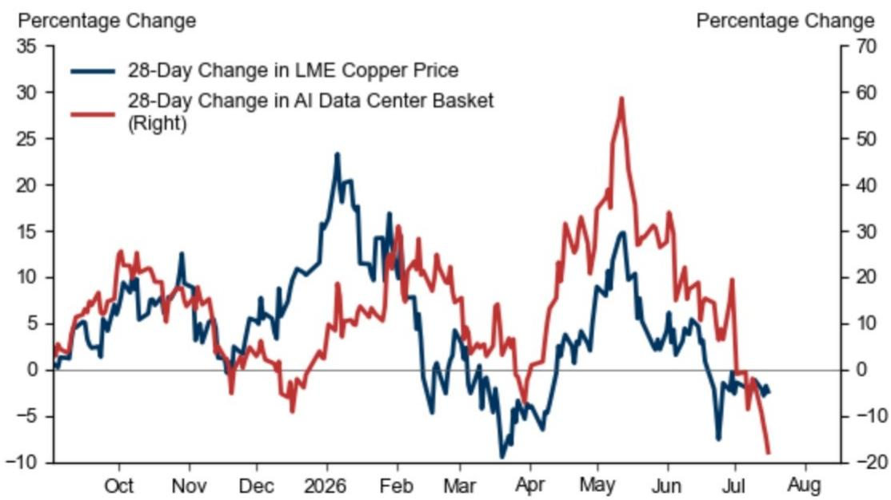  
来源：彭博，GS全球投资研究

图表2：AI预期已成为铜价日益重要的驱动因素  
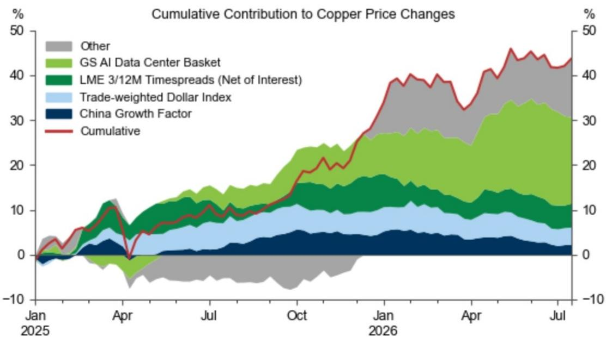  
模型分解：将周度铜价变化对GS替代中国增长因子、LME 3个月/12个月时间价差（扣除利率影响）、贸易加权美元指数（DXY）和GS AI数据中心篮子进行回归。GS替代中国增长因子（不含铜）由A股和H股的第一主成分，以及中国短期和长期利率的第一主成分构建。“其他”项捕捉回归残差和常数项。回归基于2024年至2026年截至7月17日当周的周度数据估计。贡献度从2025年1月起累计显示。

图表3：中国铜库存已降至季节性低位  
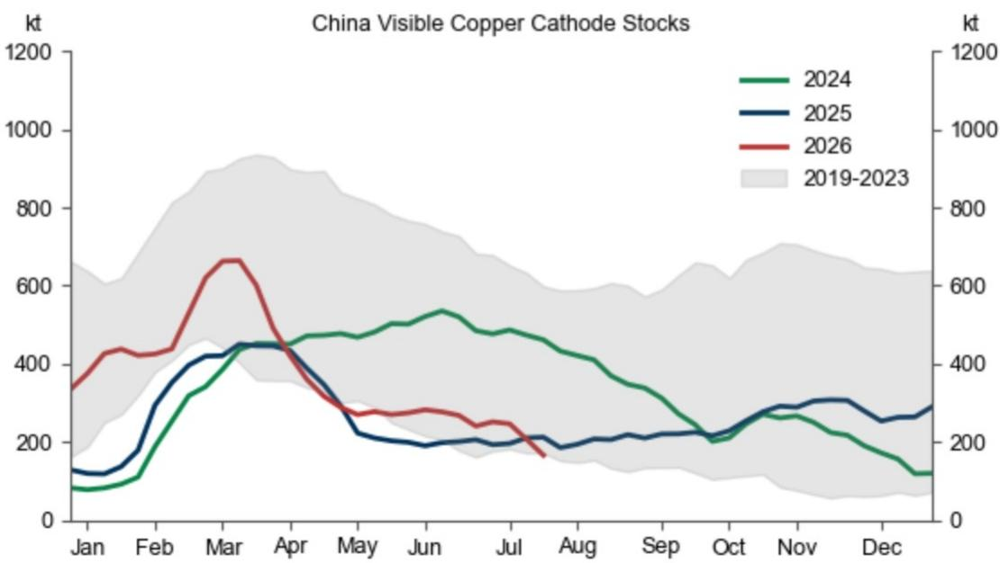  
来源：万得，SMM，GS全球投资研究

图表4：废铜紧张促使加工企业需求转向精炼阴极铜  
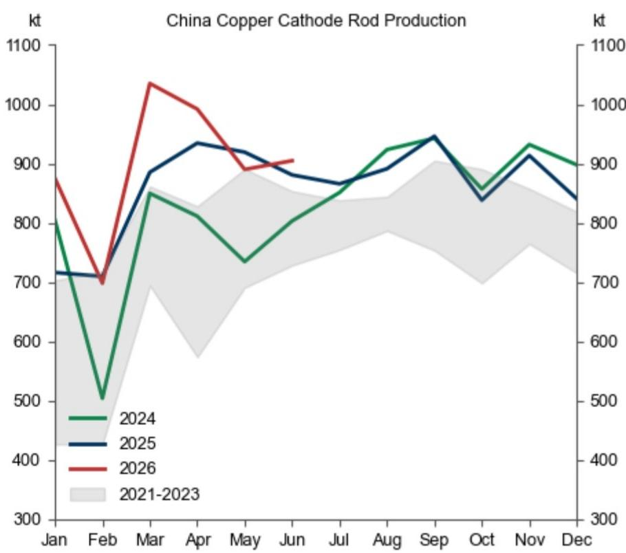  
来源：SMM，GS全球投资研究

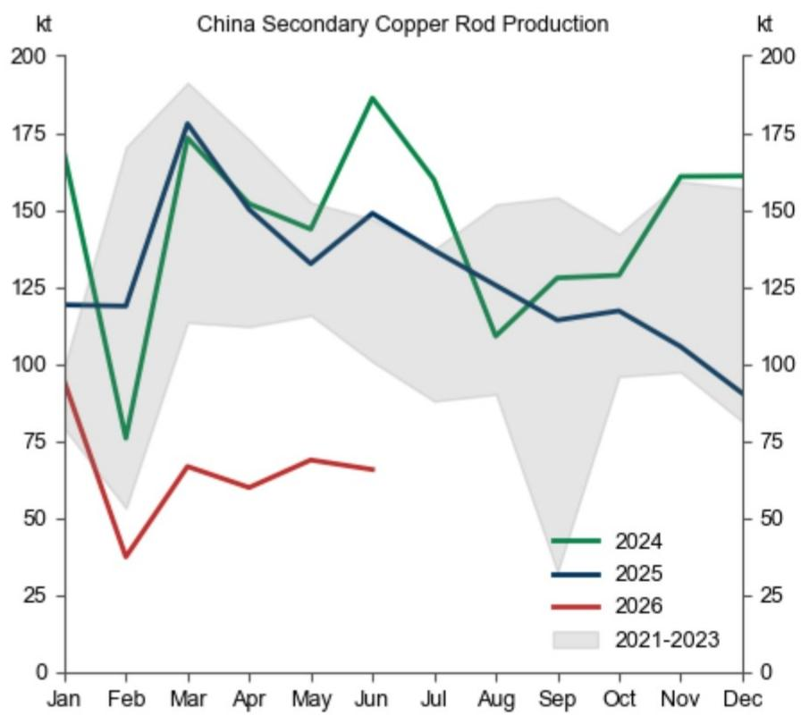

图表5：中国阴极铜产量6月再次下降  
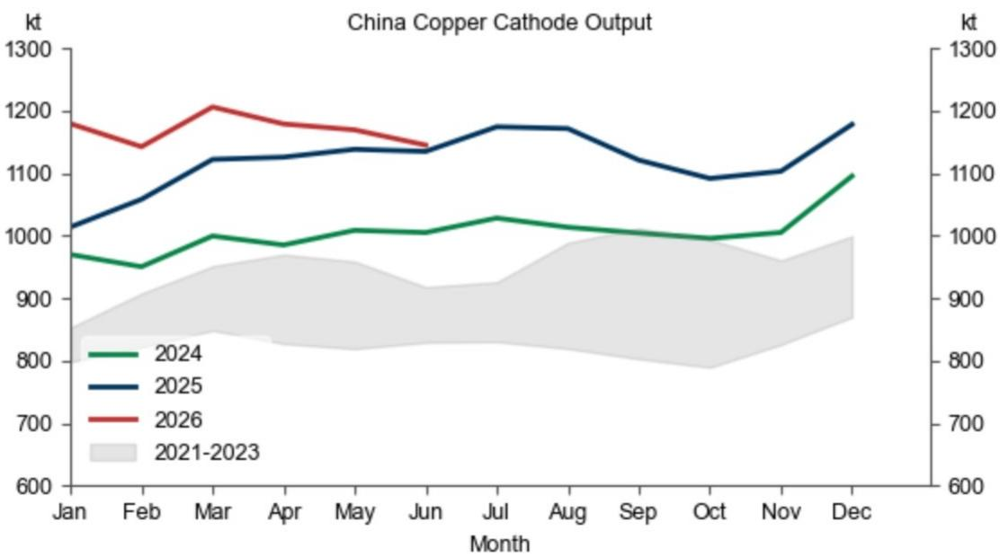  
来源：SMM，GS全球投资研究

## 价格表

图表6：过去一个月，基础金属价格全线下跌

<table><tr><td></td><td>单位</td><td>2026年7月17日</td><td>1周变化%</td><td>1个月变化%</td><td>3个月变化%</td><td>1年变化%</td><td>价差（现货-3个月）(%)</td><td>投机性多头百分位（5年）</td><td>价格百分位（5年）</td></tr><tr><td>COMEX铜</td><td>美元/吨</td><td>13812</td><td>-0</td><td>-3</td><td>1</td><td>12</td><td>-1</td><td>96</td><td>100</td></tr><tr><td>LME铜</td><td>美元/吨</td><td>13526</td><td>0</td><td>-1</td><td>1</td><td>38</td><td>-0</td><td>43</td><td>98</td></tr><tr><td>SHFE铜</td><td>人民币/吨</td><td>103810</td><td>-0</td><td>-1</td><td>2</td><td>33</td><td>0</td><td>61</td><td>97</td></tr><tr><td>LME铝</td><td>美元/吨</td><td>3150</td><td>0</td><td>-7</td><td>-12</td><td>20</td><td>0</td><td>80</td><td>88</td></tr><tr><td>SHFE铝</td><td>人民币/吨</td><td>23210</td><td>1</td><td>-3</td><td>-9</td><td>13</td><td>-0</td><td>36</td><td>89</td></tr><tr><td>铝中西部溢价</td><td>美分/磅</td><td>107</td><td>-3</td><td>-7</td><td>-1</td><td>57</td><td>-0</td><td>58</td><td>93</td></tr><tr><td>LME镍</td><td>美元/吨</td><td>16961</td><td>1</td><td>-5</td><td>-6</td><td>11</td><td>-1</td><td>61</td><td>35</td></tr><tr><td>SHFE镍</td><td>人民币/吨</td><td>130420</td><td>2</td><td>-4</td><td>-9</td><td>8</td><td>-0</td><td>37</td><td>33</td></tr><tr><td>LME锌</td><td>美元/吨</td><td>3526</td><td>-3</td><td>-3</td><td>2</td><td>25</td><td>1</td><td>84</td><td>87</td></tr><tr><td>SHFE锌</td><td>人民币/吨</td><td>24565</td><td>-1</td><td>-1</td><td>2</td><td>10</td><td>-0</td><td>71</td><td>76</td></tr><tr><td>LME锡</td><td>美元/吨</td><td>53230</td><td>0</td><td>-1</td><td>5</td><td>59</td><td>-1</td><td>50</td><td>97</td></tr><tr><td>LME铅</td><td>美元/吨</td><td>1883</td><td>-1</td><td>-5</td><td>-4</td><td>-6</td><td>-2</td><td>2</td><td>2</td></tr><tr><td>SHFE螺纹钢</td><td>人民币/吨</td><td>3121</td><td>2</td><td>1</td><td>1</td><td>1</td><td>0</td><td>23</td><td>20</td></tr><tr><td>LME螺纹钢</td><td>美元/吨</td><td>580</td><td>1</td><td>-1</td><td>-3</td><td>7</td><td>-0</td><td>43</td><td>40</td></tr><tr><td>SHFE热轧卷板</td><td>人民币/吨</td><td>3308</td><td>1</td><td>-1</td><td>-0</td><td>-1</td><td>-0</td><td></td><td>19</td></tr><tr><td>LME热轧卷板</td><td>欧元/吨</td><td>720</td><td>0</td><td>7</td><td>1</td><td>33</td><td>-2</td><td></td><td>64</td></tr><tr><td>COMEX热轧卷板</td><td>美元/短吨</td><td>1178</td><td>1</td><td>2</td><td>9</td><td>39</td><td>0</td><td>89</td><td>83</td></tr><tr><td>SGX铁矿石</td><td>美元/吨</td><td>100</td><td>1</td><td>0</td><td>-7</td><td>-0</td><td>-1</td><td></td><td>18</td></tr><tr><td>SHFE不锈钢</td><td>人民币/吨</td><td>14800</td><td>4</td><td>-2</td><td>-1</td><td>16</td><td>1</td><td></td><td>55</td></tr><tr><td>COMEX氢氧化锂</td><td>美元/吨</td><td>19370</td><td>-1</td><td>-3</td><td>-10</td><td>131</td><td>-2</td><td>98</td><td>47</td></tr><tr><td>COMEX碳酸锂</td><td>美元/吨</td><td>19980</td><td>-1</td><td>-6</td><td>-9</td><td>121</td><td>-2</td><td></td><td>74</td></tr><tr><td>COMEX钴</td><td>美元/磅</td><td>26</td><td>0</td><td>-0</td><td>-0</td><td>66</td><td>3</td><td>85</td><td>81</td></tr></table>

投机性持仓净多头百分位基于成交量（而非价值）。

来源：彭博，GS全球投资研究

## 价格预测

图表7：我们预计铝价在2027年将有所回落

<table><tr><td rowspan="2"></td><td rowspan="2">单位</td><td colspan="4">GS预测（均值）</td></tr><tr><td>2026年7月17日</td><td>2026年</td><td>2027年</td><td>2028年</td></tr><tr><td>LME铜</td><td>美元/吨</td><td>13,526</td><td>13,400</td><td>13,800</td><td>13,700</td></tr><tr><td>LME铝</td><td>美元/吨</td><td>3,150</td><td>3,200</td><td>2,700</td><td>2,600</td></tr><tr><td>LME镍</td><td>美元/吨</td><td>16,961</td><td>18,500</td><td>-</td><td>-</td></tr></table>

来源：彭博，GS全球投资研究

## 铜：现货市场指标

图表8：全球可见铜库存下降，但仍高于历史季节性区间  
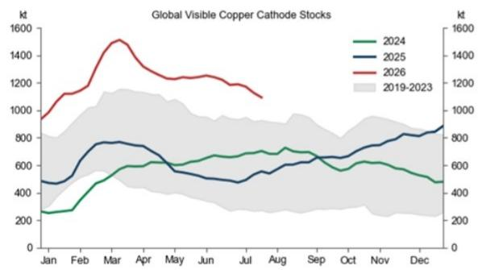  
来源：彭博，SMM，万得，GS全球投资研究  
图表9：美国以外地区可见铜库存下降，因金属持续流入美国

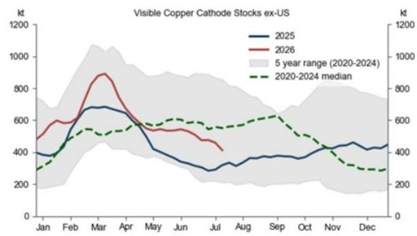  
来源：彭博，SMM，万得，GS全球投资研究  
图表10：市场定价显示，到2027年1月实施15%精炼铜关税的概率约为30%

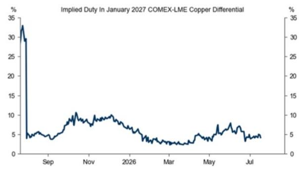  
来源：彭博，GS全球投资研究

图表11：受关税预期影响，美国铜库存持续增加  
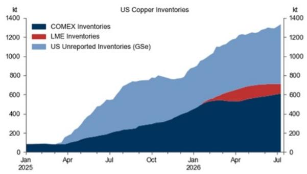  
来源：彭博，GS全球投资研究

图表12：过去一个月，LME铜价曲线整体下移  
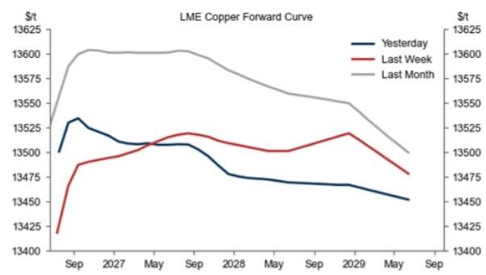  
第一个点为LME现货价。  
来源：彭博，GS全球投资研究

图表13：中国铜进口套利窗口在短暂开启后已关闭  
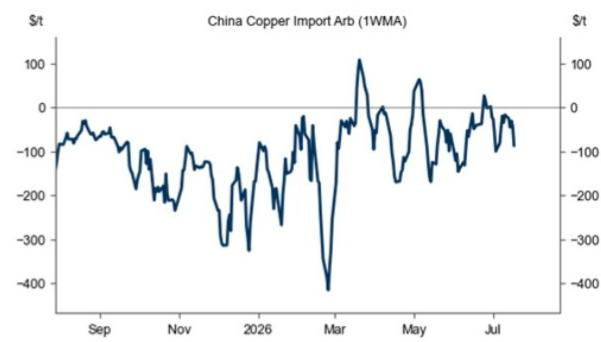  
高于零 = 激励中国进口铜阴极。铜套利通过SHFE价格与LME价格计算（考虑13%增值税及其他进口成本）。

## 铜：供需追踪

图表14：中国铜表观需求年初至今（1-5月）增长2.7%  
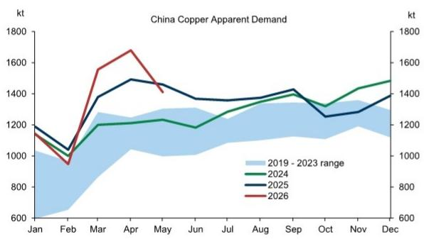  
来源：万得，SMM，GTT，GS全球投资研究

图表15：主要矿山供应增长国家的产量仍高于2025年水平  
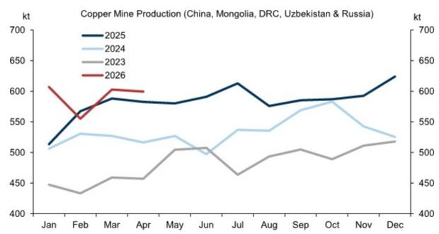  
来源：公司文件，ICSG，刚果中央银行，GTT，GS全球投资研究  
图表16：智利铜产量年初至今同比下降9%

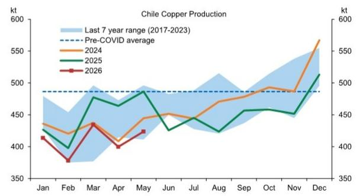  
来源：政府数据，Haver Analytics，GS全球投资研究

图表17：全球铜矿产量自3月以来有所减弱  
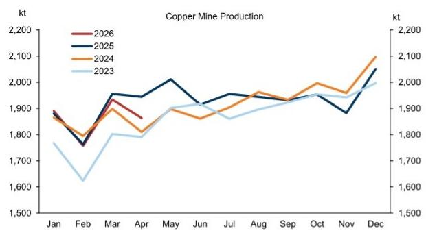  
来源：ICSG，GS全球投资研究

图表18：尽管矿山供应减弱，精炼铜产量仍保持强劲  
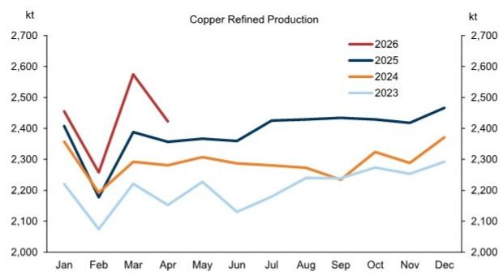  
来源：ICSG，GS全球投资研究

## 铜：预测追踪

图表19：我们的铜价预测略高于远期价格

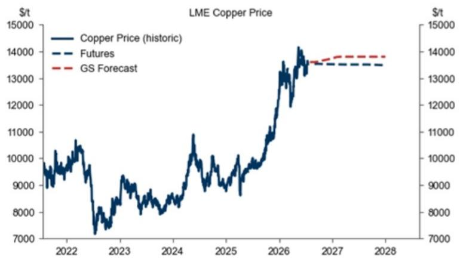  
来源：彭博，GS全球投资研究  
图表20：尽管铜价高企，全球废铜出口年初至今下降8%

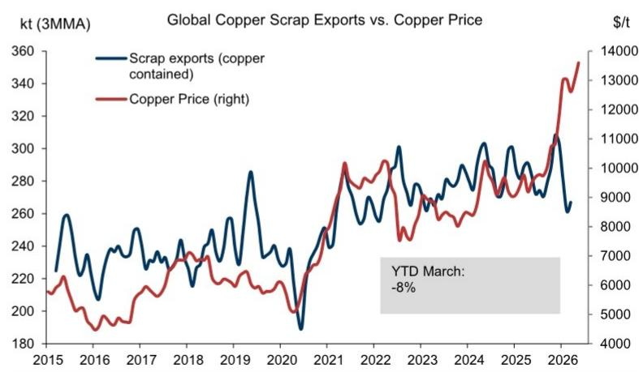  
来源：GTT，彭博，GS全球投资研究

## 铝：现货市场指标

图表21：全球可见铝库存自5月以来下降，但仍高于2025年水平

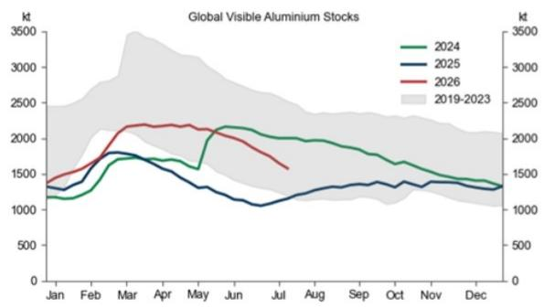  
来源：万得，SMM，彭博，GS全球投资研究  
图表22：过去一个月，LME铝远期曲线下移，现货溢价程度减弱

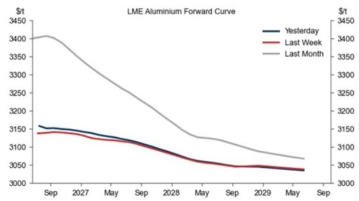  
第一个点为LME现货价。  
来源：彭博，GS全球投资研究

图表23：铝溢价已从近期高点回落  
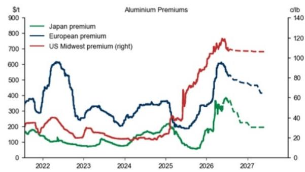  
虚线 = 期货曲线。溢价 = 在LME价格之上为现货交割支付的价格。  
来源：彭博，GS全球投资研究

图表24：中国铝进口套利窗口仍关闭  
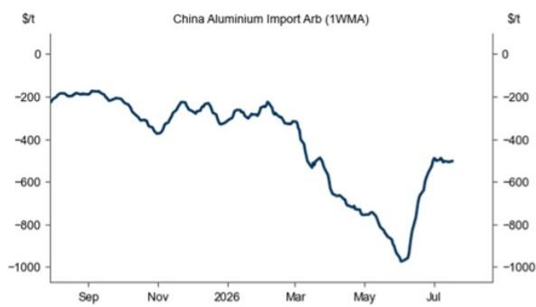

图表25：2026年美国废铝折扣显著扩大  
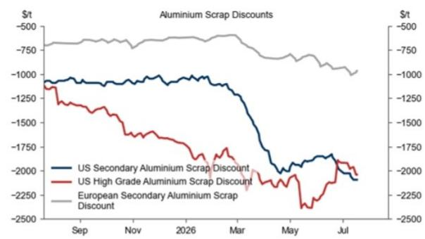  
高于零 = 激励中国进口原铝。铝套利通过SHFE价格与LME价格计算（考虑13%增值税及其他进口成本）。  
来源：彭博，GS全球投资研究  
高等级 = 高等级废铝相对于替代材料（非合金原铝）的折扣。低等级 = 低等级废铝相对于所生产产品（A380/DN226/ADC12）的折扣。欧洲二级 = 相对于DN226的折扣。

来源：S&P Global Market Intelligence，GS全球投资研究

## 铝：供需追踪

图表26：俄罗斯金属推动中国原铝进口增长  
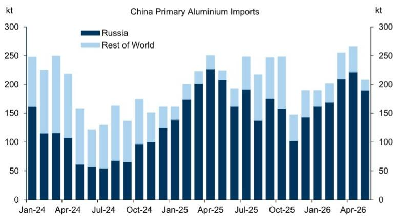  
来源：SMM，GS全球投资研究

图表27：印度尼西亚铝产量年初至今同比增长90%  
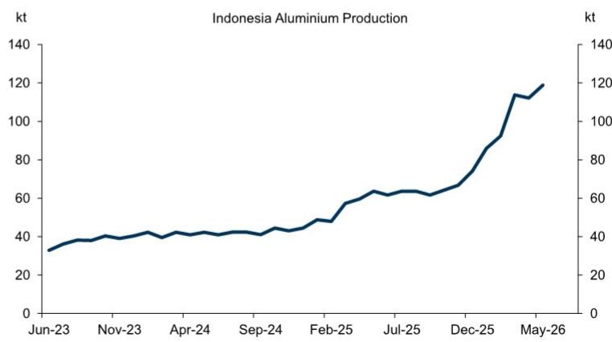  
来源：SMM，GS全球投资研究

图表28：5月中国铝半成品出口同比增长17%  
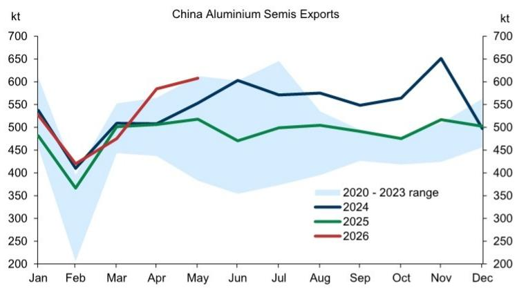  
来源：万得，GS全球投资研究

图表29：中国及中国以外地区的铝消费均在收缩  
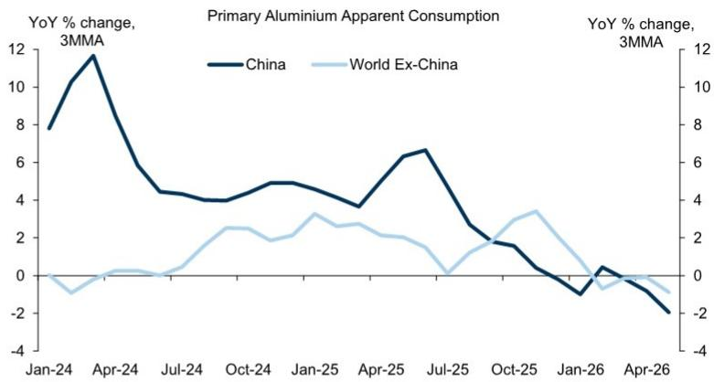  
来源：CRU，SMM，GTT，GS全球投资研究

## 锌：现货市场指标

图表30：过去一个月，全球可见锌库存上升  
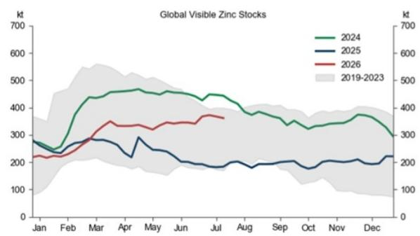  
来源：万得，SMM，彭博，GS全球投资研究

图表31：LME锌远期曲线仍呈现货溢价  
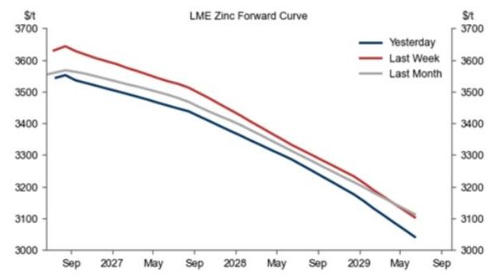  
第一个点为LME现货价。  
来源：彭博，GS全球投资研究  
图表32：中国锌出口套利窗口关闭

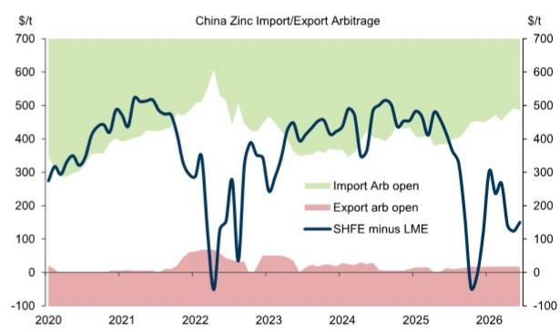  
高于零 = 激励中国进口锌。锌套利通过SHFE价格与LME价格计算（考虑13%增值税及其他进口成本）。

图表33：中国在短暂成为净出口国后，已恢复为锌净进口国  
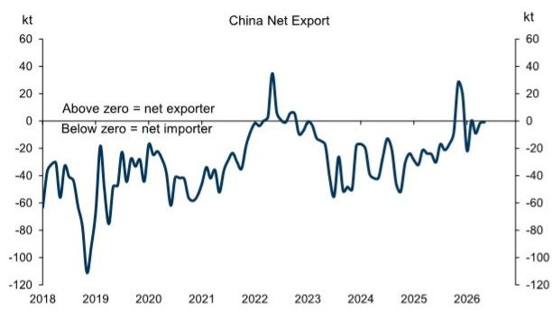  
来源：中国海关，彭博，GS全球投资研究

图表34：4月中国以外地区精炼锌产量降至2025年水平以下  
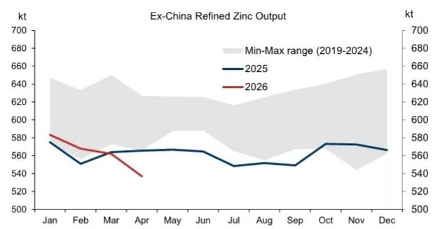  
来源：ILZSG，GS全球投资研究  
来源：彭博，GS全球投资研究

图表35：中国锌产量增加抵消了其他地区的产量下降  
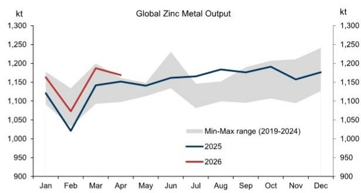  
来源：ILZSG，GS全球投资研究

## 镍：现货市场指标

图表36：全球可见镍库存仍高于历史季节性区间  
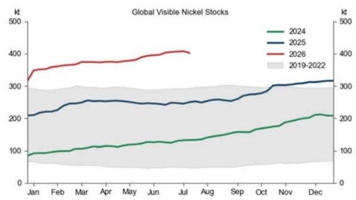  
来源：万得，SMM，彭博，GS全球投资研究  
图表37：过去一周LME镍远期曲线上移，但仍处于期货溢价状态

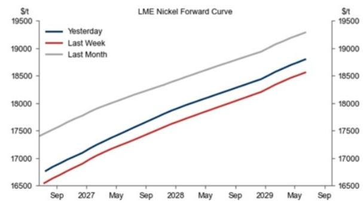  
第一个点为LME现货价。  
来源：彭博，GS全球投资研究

图表38：中国镍进口套利窗口于7月关闭  
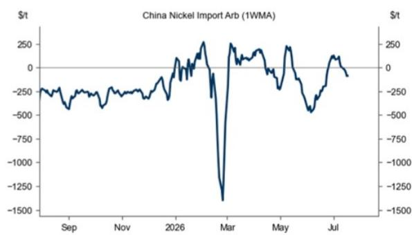  
高于零 = 激励中国进口镍。镍套利通过SHFE价格与LME价格计算（考虑13%增值税及其他进口成本）。  
来源：彭博，GS全球投资研究

图表39：印度尼西亚镍矿产量年初至今同比增长2%  
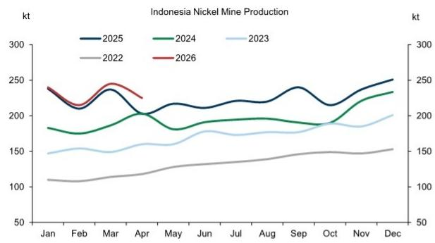  
来源：INSG，GS全球投资研究

图表40：全球不锈钢产量年初至今较2025年增长2%  
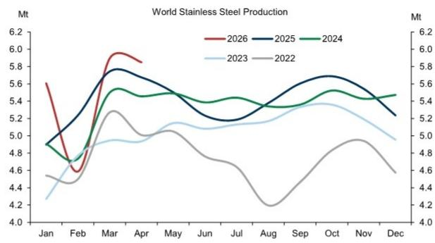  
来源：INSG，GS全球投资研究

图表41：上半年镍供应过剩幅度收窄  
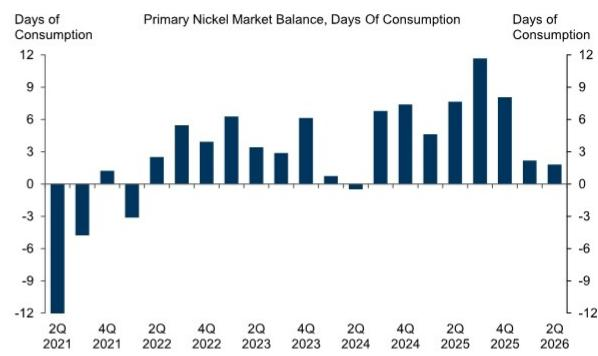  
来源：CRU，GS全球投资研究

## 投机性持仓

图表42：COMEX铜、锌、铝的投机性持仓处于高位  
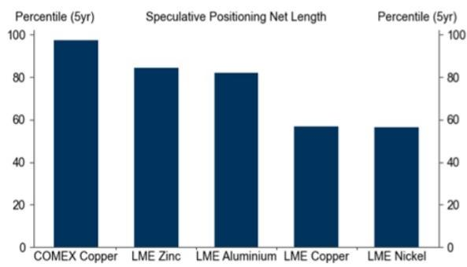  
来源：彭博，GS全球投资研究

图表43：过去三个月，铜和锌的表现优于铝和镍  
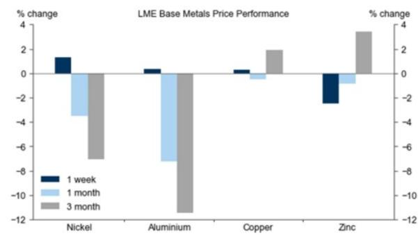  
来源：彭博，GS全球投资研究  
图表44：铜的投机性多头头寸有所缓解，但仍处高位

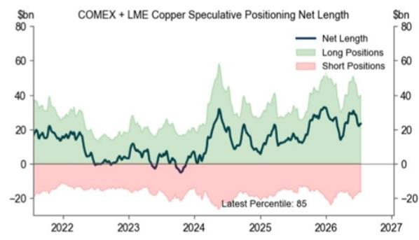  
来源：彭博，GS全球投资研究

图表45：过去几个月，LME铝投机性净多头头寸大幅下降  
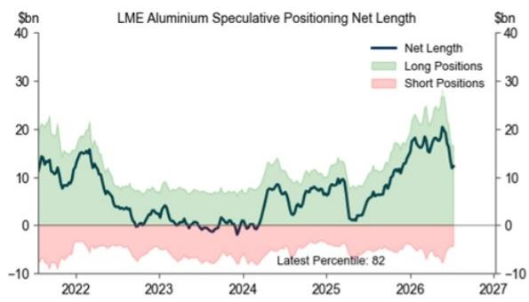  
来源：彭博，GS全球投资研究

图表46：LME镍投机性持仓回落至第56百分位  
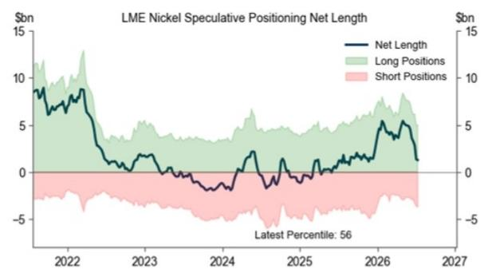  
来源：彭博，GS全球投资研究  
图表47：最近几周，LME锌净多头头寸显著增加

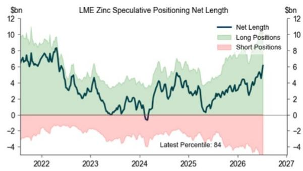  
来源：彭博，GS全球投资研究

## GS高频工业金属指标方法论说明

1. 全球铜库存：当美国月度海运阴极铜进口量超过/低于5万吨时，美国未报告库存增加/减少，并根据美国交易所库存变化进行调整。中国铜冶炼厂收入图表：

2. 低成本中国冶炼厂的盈亏平衡成本：2025年TCRC加权50%基准和50%现货。进口套利是所含金属支付价格与销售价格（扣除增值税）之间的差额。我们假设回收率：铜96%/98.5%，金银90%/98%。

3. 中国增长因子（不含铜）：A股和H股PC1，以及中国短期和长期利率PC1的第一主成分。该方法论详见我们的跨资产策略师报告：https://publishing.gs.com/content/research/en/reports/2020/05/13/6a00d7af-7f5a-4a91-993f-41aa73963068.html。

4. 铜铝转换：转换指数源自低压电缆出口价值相对于铜铝价格。转换为铝，指的是我们在出口数据中看到铝低压电缆的隐含份额更高。我们展示铜铝之间的相对差值，而非典型的铜铝比率，因为我们的分析表明，买家对价格差而非价格比的敏感度更高。

## 披露附录

## Reg AC

我们，Lavinia Forcellese、Daan Struyven和Samantha Dart，特此证明本报告中表达的所有观点准确反映了我们的个人观点，这些观点未受公司业务或客户关系考虑的影响。

除非另有说明，本报告封面所列人员为GS全球投资研究部分析师。

撰稿作者：Lavinia Forcellese GS International，Daan Struyven GS & Co. LLC，Samantha Dart GS & Co. LLC。

除非另有说明，本报告撰稿作者披露中列出的个人为GS全球投资研究部分析师。

## 披露信息

## 监管披露

## 美国法律法规要求的披露

请参见上述公司特定监管披露，了解本报告提及的公司所需的任何以下披露：待定交易中的经理或联合经理；1%或其他所有权；特定服务的报酬；客户关系类型；前期管理/联合管理的公开发行；董事职位；对于股权证券，做市和/或专家角色。GS作为本金交易或可能交易本报告讨论的发行人债务证券（或相关衍生品）。

以下是额外要求的披露：所有权和重大利益冲突：GS政策禁止其分析师、向分析师汇报的专业人员及其家庭成员持有分析师覆盖范围内任何公司的证券。分析师薪酬：分析师的薪酬部分基于GS的盈利能力，其中包括投资银行收入。分析师作为高管或董事：GS政策通常禁止其分析师、向分析师汇报的人员或其家庭成员担任分析师覆盖范围内任何公司的高管、董事或顾问。非美国分析师：非美国分析师可能不是GS & Co. LLC的关联人员，因此可能不受FINRA规则2241或FINRA规则2242关于与主题公司沟通、公开露面以及交易分析师所覆盖证券的限制。

## 美国以外司法管辖区法律法规要求的额外披露

以下披露是相关司法管辖区要求的，除非已根据美国法律法规在上文作出。澳大利亚：GS Australia Pty Ltd及其关联公司不是澳大利亚《1959年银行法》定义的授权存款机构，在澳大利亚不提供银行服务，也不从事银行业务。除非GS另有约定，本研究及其任何访问仅面向澳大利亚《公司法》定义的“批发客户”。在制作研究报告时，GS Australia全球投资研究部门的成员可能会参加由其研究报告主题公司和实体主办或组织的现场访问和其他会议。在某些情况下，如果GS Australia认为在特定情况下适当且合理，此类现场访问或会议的费用可能部分或全部由相关发行人承担。如果本文档内容包含任何金融产品建议，则仅为一般性建议，由GS在未考虑客户目标、财务状况或需求的情况下编制。客户在根据任何此类建议采取行动前，应考虑该建议是否适合其自身目标、财务状况和需求。GS Australia和New Zealand的某些利益披露以及GS澳大利亚卖方研究独立性政策声明副本可在以下网址获取：https://www.goldmansachs.com/disclosures/australia-new-zealand/index.html。巴西：有关CVM第20号决议的披露信息可在https://www.gs.com/worldwide/brazil/area/gir/index.html获取。在适用情况下，根据CVM第20号决议第20条定义，对本研究报告内容负主要责任的巴西注册分析师为本报告开头指定的第一作者，除非文本末尾另有说明。加拿大：此信息仅供您参考，在任何情况下均不应被解释为GS & Co. LLC为在加拿大购买证券而向加拿大证券购买者发布的广告、要约或招揽。GS & Co. LLC未根据适用的加拿大证券法在任何加拿大司法管辖区注册为交易商，通常不允许在加拿大交易证券，并可能被禁止在加拿大的某些司法管辖区销售某些证券和产品。如果您希望在加拿大交易任何加拿大证券或其他产品，请联系GS Group Inc.的关联公司GS Canada Inc.或其他注册的加拿大交易商。香港：可向GS (Asia) L.L.C.索取本研究中提及的所覆盖公司证券的进一步信息。印度：可从GS (India) Securities Private Limited获取本研究中提及的主题公司或公司的进一步信息，研究分析师 – SEBI注册号INH000001493，地址：10th Floor, Ascent-Worli, Sudam Kalu Ahire Marg, Worli, Mumbai-400 025, India，企业识别号U74140MH2006FTC160634，电话+91 22 6616 9000，传真+91 22 6616 9001。GS可能实益拥有本研究报告提及的主题公司或公司1%或以上的证券（定义见印度《证券合约（监管）法》1956年第2(h)条）。SEBI的注册和NISM的认证绝不保证中介机构的业绩，也不向读者提供任何回报保证。GS (India) Securities Private Limited的合规官和读者投诉联系方式、年度合规审计报告副本以及其他相关信息和披露可在此链接找到：https://www.goldmansachs.com/worldwide/india/research-analyst。日本：见下文。韩国：除非GS另有约定，本研究及其任何访问仅面向《金融服务和资本市场法》定义的“专业读者”。可从GS (Asia) L.L.C.首尔分行获取本研究中提及的主题公司或公司的进一步信息。新西兰：GS New Zealand Limited及其关联公司不是新西兰《1989年新西兰储备银行法》定义的“注册银行”或“存款接受者”。除非GS另有约定，本研究及其任何访问面向《2008年金融顾问法》定义的“批发客户”。GS Australia和New Zealand的某些利益披露副本可在以下网址获取：https://www.goldmansachs.com/disclosures/australia-new-zealand/index.html。俄罗斯：在俄罗斯联邦分发的研究报告不属于俄罗斯立法定义中的广告，而是信息和分析，其主要目的不是推广产品，也不提供俄罗斯评估活动立法意义上的评估。研究报告不构成俄罗斯法律法规定义的个人化研究交流，不针对特定客户，且未分析客户的财务状况、投资概况或风险概况。GS不对客户或任何其他人基于本研究报告可能做出的任何投资决策承担责任。

新加坡：GS (Singapore) Pte.（公司编号：198602165W），受新加坡金融管理局监管，对本研究承担法律责任，如有任何与本研究报告相关的事宜，请联系该公司。台湾：此材料仅供参考，未经许可不得转载。读者应仔细考虑自身的投资风险。投资结果由个人读者自行负责。英国：在英国被归类为零售客户（定义见金融行为监管局规则）的人士，应结合先前GS关于本报告所提及公司的研究报告阅读本研究，并应参考GS International已发送给他们的风险警告。这些风险警告的副本以及本报告中使用的某些金融术语的词汇表，可向GS International索取。

欧盟和英国：关于欧盟委员会授权条例(EU) (2016/958)第6(2)条（包括该授权条例在英国脱离欧盟和欧洲经济区后转化为英国国内法律和法规的部分）补充欧洲议会和理事会条例(EU) No 596/2014关于研究交流或建议投资策略的其他信息客观呈现的技术安排以及特定利益或利益冲突披露的技术标准的披露信息，可在https://www.gs.com/disclosures/europeanpolicy.html获取，其中载明了与投资研究相关的利益冲突管理欧洲政策。

日本：GS Japan Co., Ltd.是在关东财务局注册的金融工具交易商，注册号金商第69号，是日本证券业协会、日本金融期货协会、第二类金融工具业协会和日本投资管理协会的成员。股票买卖需支付与客户预先确定的佣金加消费税。有关日本证券交易所、日本证券业协会或日本证券金融公司要求的任何适用披露，请参见公司特定披露。

## 全球产品；分销实体

GS全球投资研究为GS客户在全球范围内制作和分发研究产品。全球GS办公室的分析师对行业和公司，以及宏观经济、货币、大宗商品和投资组合策略进行研究。本研究在澳大利亚由GS Australia Pty Ltd (ABN 21 006 797 897)分发；在巴西由GS do Brasil Corretora de Títulos e Valores Mobiliários S.A.分发；GS巴西公共沟通渠道：0800 727 5764 和/或 contatogoldmanbrasil@gs.com。工作日（节假日除外），上午9点至下午6点。在加拿大由GS & Co. LLC分发；在香港由GS (Asia) L.L.C.分发；在印度由GS (India) Securities Private Ltd.分发；在日本由GS Japan Co., Ltd.分发；在韩国由GS (Asia) L.L.C.首尔分行分发；在新西兰由GS New Zealand Limited分发；在俄罗斯由OOO GS分发；在新加坡由GS (Singapore) Pte.（公司编号：198602165W）分发；在美国由GS & Co. LLC分发。GS International已批准本研究在英国的分发。

GS International (“GSI”)，由审慎
