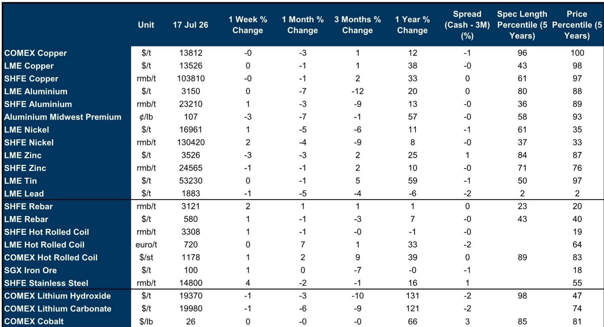

# GS：铜实物紧张与宏观退潮——AI叙事正重塑定价

上周铜价在每吨13,400至13,640美元之间波动，背后是两股力量的角力。一边是中国库存跌至季节性低位、LME注销仓单上升所代表的实物收紧；另一边是中东局势、美联储重新定价以及AI芯片股抛售所触发的不确定性偏好变化。GS这份周度跟踪报告的核心判断是：铜的实物基本面正在收紧，但宏观和情绪层面的支撑正在变化，两者之间的裂口在扩大。

报告用价格分解模型展示了一个值得注意的结构性变化：AI数据中心主题已成为铜价波动日益重要的驱动力。模型显示，AI相关因子对铜价变化的解释力在2025年以来持续上升。这并非因为数据中心本身的铜需求体量有多大——目前仅占全球铜总需求的约1%——而是因为AI已成为塑造市场对未来电力、电网和铜需求预期的核心叙事。铜价正在被一个尚在早期、但预期极强的需求故事所定价。

> **KC评论：** GS模型揭示了一个容易被忽视的传导链条。铜价与AI数据中心公司的相关性在2025年底以来急剧上升，这意味着铜的定价逻辑正在从“中国需求+美元”的传统框架，向“AI叙事+实物库存”的新双轨切换。读者需要同时跟踪这两个维度，而非只看库存或宏观数据。

## 1. 中国库存骤降，但驱动因素并非终端需求

中国可见铜阴极库存已降至16.7万吨，处于季节性区间的底部。台风“巴威”带来的提前备货和到港延迟放大了这一轮去库，但冲击发生在一个本已缺乏库存缓冲的市场。

GS将近期收紧主要归因于废铜向阴极铜的替代，而非终端需求的变化。中国对废铜增值税征管的收紧，限制了国内废铜流通，使得废铜杆产出异常仍在调整，迫使加工企业转向阴极铜杆。与此同时，冶炼厂集中检修也压制了国内阴极铜供应——6月产量环比下降，同比基本持平。这意味着中国市场的紧张更多是供给结构性问题，而非需求扩张的信号。

## 2. 美国关税预期正在重塑全球铜的物理流向

报告提供了一个关键的地域错配视角。美国对铜关税的预期——市场目前定价2027年1月前实施15%精炼铜关税的概率约为30%——正在持续吸引非美市场的铜流入美国。这导致美国铜库存不断累积，而非美市场（尤其是中国和欧洲）的可见库存则加速下降。

GS认为，这种由关税预期驱动的库存再分配，将在短期内维持非美铜市场的紧张格局。中国低库存和有限的废铜替代空间，为铜价提供了节奏变化缓冲。但报告也提醒，如果中东冲突进一步升级并加剧通胀和加息担忧，铜价仍面临短期节奏变化不确定性——尽管GS宏观环境学家并不认为美联储会重新加息。

## 3. 铝的叙事与铜截然不同：库存上升、消费调整、价格预期走弱

与铜的紧张形成对比，铝的基本面正在变化。全球可见铝库存自5月以来虽有所下降，但仍高于2025年水平。更重要的是，铝消费在中国和海外均出现仍在调整。中国铝半成品出口虽在5月同比增长17%，但这更多反映的是出口转移而非终端需求强劲。

GS对铝的价格预测：2026年均价预计为每吨3,200美元，但2027年将降至2,700美元，2028年进一步降至2,600美元。铝的远期曲线已经下移，且现货升水收窄，表明市场对远期供应宽松的预期正在强化。印尼铝产量同比增长90%，俄罗斯金属持续流入中国，这些供给端的增量正在改变全球铝的供需平衡。

> **KC评论：** 铜和铝的分化提供了一个观察框架：当宏观环境变化时，真正决定价格方向的是各自的实物基本面。铜有AI叙事和废铜替代的故事支撑，铝则面临消费调整和供给增量的双重不确定性。这种品种间的分化，比单纯看工业金属整体方向更有信息量。

## 4. 一个可复用的观察框架：价格分解模型的启示

GS这份报告最有价值的分析工具，是它对铜价变化的多因子分解。模型将铜价周度变动拆解为：中国增长因子、LME期限价差（扣除利率影响）、美元指数、以及AI数据中心公司篮子。结果显示，AI因子的贡献在2025年以来持续上升，而传统宏观因子的解释力在下降。

这个框架的启示在于：对于铜这类兼具商品属性和资金属性的品种，传统的“看中国需求+看美元”的分析框架可能正在变化。市场定价的重心正在从宏观周期叙事转向结构性需求叙事——尽管后者目前更多是预期而非现实。对于产业决策者而言，这意味着需要同时跟踪两个时间维度：短期看库存和废铜替代的实物逻辑，中期看AI和电力研究能否兑现为实际的铜消费增量。

For informational purposes only. Portions may be generated,translated,summarized,or edited with AI assistance based on source materials and may contain omissions or errors. Please verify independently. This is not investment,legal,tax,accounting,or other professional advice.

