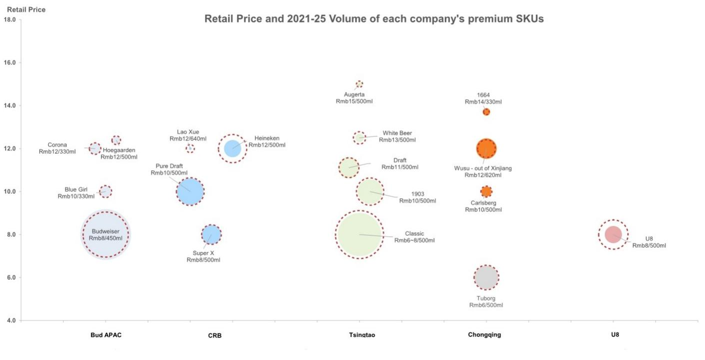
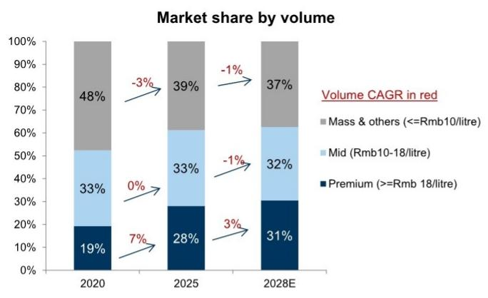
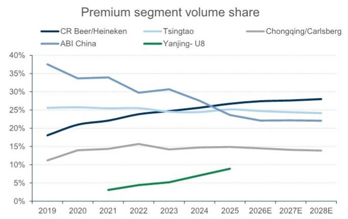
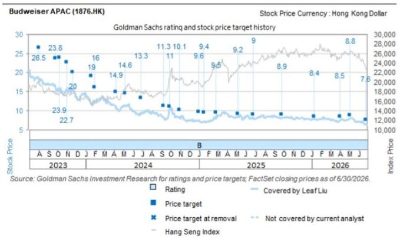
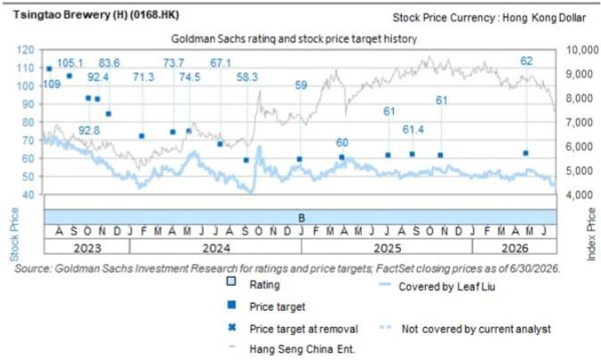
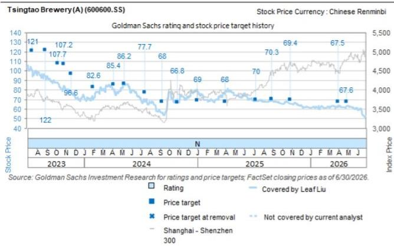
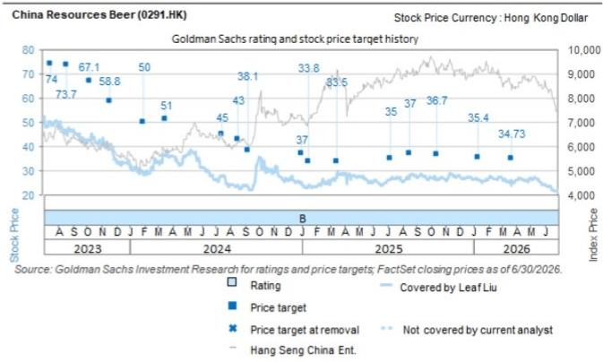

# 行业观察：从燕京啤酒读者会议看啤酒市场结构性分化

我们观察到，2026年第二季度啤酒行业内部持续呈现结构性分化趋势。预计青岛啤酒/重庆啤酒的销量同比下降约4%，百威中国销量下降约10-12%，而华润啤酒则保持了低个位数的增长（图表4）。在整体宏观环境趋于平稳的背景下，部分核心单品/区域化产品组合展现出较强的韧性，通过更深入的渠道渗透、有效的激励措施和扎实的执行力，市场份额持续提升。具体来看，华润啤酒的喜力品牌和燕京啤酒的旗舰产品U8在高端/中高端细分市场，在2025年至2026年至今的表现持续优于同行。根据燕京啤酒近期公开的读者会议信息，U8在2025年达到约90万千升的销量后，2026年第一季度仍保持了接近30%的销量增长；同时，A10产品组合自2026年3月底推出后，战略推广已初步取得进展。展望2026年下半年，我们认为天气变化和餐饮渠道复苏是关键的变量因素。基于华润啤酒强大的产品组合和扎实的执行力带来的增长可见性，我们对其持积极看法，尤其是在其进入2026年下半年较低基数的情况下。

## 燕京啤酒7月16日读者会议要点

1. **U8在8-10元中高端市场持续强劲增长**：U8自2020年推出后，销量从约10万千升增长至2025年的90万千升（约55%的年复合增长率），这一强劲势头延续至2026年第一季度，同比增长接近30%，并在7月份进一步加速。U8自2019年上市以来持续快速扩张，2023-2025年保持了约30%的销量年复合增长率，表明其全国化/渠道渗透仍处于高速增长阶段，品牌持续从同价位竞品（如青岛经典/雪花清爽/哈尔滨核心+等）中获取市场份额。

2. **高端产品组合持续强化**：燕京啤酒已正式推出定价在12-15元区间的A10全麦啤酒，定位为公司第一季度高端化的核心单品，并正在积极扩大分销覆盖范围，下半年还将推出罐装/小包装等适合夜场渠道的规格。

3. **区域产品组合保持韧性**：尽管2026年第二季度广西地区天气条件不利，燕京啤酒的区域旗舰产品漓泉1998在2026年上半年仍实现了同比销量增长。基于漓泉成功的区域扩张经验，燕京啤酒计划今年将惠泉1983的扩张策略复制至福建/江西市场。

## 对啤酒行业研究的启示

1. **中高端市场仍是消费升级中的关键区间**：燕京U8战略定位于零售价8-10元区间，这一价格带因其大众升级路径清晰、可全国化拓展的潜在市场规模较大，似乎仍是啤酒高端化的关键区间；而超高端啤酒/精酿啤酒（12-15元以上）则面临分销瓶颈和受众相对有限的问题。

2. **“大单品”策略仍是有效的增长路径**：燕京U8的成功表明，在销量趋于平稳的成熟市场中，将营销/渠道资源和品牌价值集中投入到一个辨识度高的中高端产品上，可能仍是实现规模化扩张的更高效方式。

## 相关阅读：

- 重庆啤酒（600132.SS）：NDR要点：6月压力较4-5月环比缓解；O2O竞争/成本趋势值得关注
- 华润啤酒：亚太消费与休闲企业日2026要点——全年目标维持，6月环比改善，高端化趋势不变；喜力保持20%以上增长
- 百威亚太：亚太消费与休闲企业日2026要点——中国市场复苏有所延迟；O2O/高端化/新产品仍是关键增长策略
- 百威亚太（1876.HK）：2026年第二季度预览——中国市场受天气/渠道结构影响有所承压，韩国在低基数上复苏，印度保持强劲

## 竞争格局

图表1：高端啤酒SKU分布图

来源：公司数据，GS全球投资研究

图表2：预计2025-2028年高端化趋势将持续

来源：公司数据，GS全球投资研究

图表3：燕京啤酒过去五年凭借U8的成功在高端市场显著提升份额

来源：公司数据，GS全球投资研究

## 中国啤酒企业2026年第二季度/2026年全年业绩预测摘要

图表4：2026年第二季度预测详情——按公司/区域

<table><tr><td>2026年第二季度预测</td><td>均价增长</td><td>销量增长</td><td>销售增长</td><td>单位成本增长</td><td>毛利率同比变化</td><td>高端销量增长</td><td>经常性EBITDA增长</td><td>经常性EBITDA利润率</td><td>经常性EBIT增长</td><td>经常性净利润增长</td></tr><tr><td>华润啤酒-啤酒（2026年上半年）</td><td>0.8%</td><td>3.0%</td><td>3.8%</td><td>0.5%</td><td>0.2个百分点</td><td>7.0%</td><td>5.6%</td><td>35.7%</td><td>7.1%</td><td></td></tr><tr><td>华润啤酒-整体（2026年上半年）</td><td></td><td></td><td>3.4%</td><td></td><td>-0.4个百分点</td><td></td><td>-5.4%</td><td>35.0%</td><td>6.4%</td><td>7.0%</td></tr><tr><td>百威中国</td><td>-1.0%</td><td>-10.0%</td><td>-10.9%</td><td></td><td></td><td></td><td>-25.0%</td><td>31.6%</td><td></td><td></td></tr><tr><td>百威西部</td><td>-0.2%</td><td>-6.5%</td><td>-6.7%</td><td></td><td></td><td></td><td>-20.0%</td><td>26.5%</td><td></td><td></td></tr><tr><td>百威东部</td><td>-0.7%</td><td>6.2%</td><td>5.5%</td><td></td><td></td><td></td><td>19.0%</td><td>28.5%</td><td></td><td></td></tr><tr><td>百威亚太</td><td>0.6%</td><td>-5.0%</td><td>-4.4%</td><td></td><td>-1.0个百分点</td><td></td><td>-13.7%</td><td>26.9%</td><td>-16.7%</td><td>-15.3%</td></tr><tr><td>青岛啤酒</td><td>0.5%</td><td>-4.6%</td><td>-4.1%</td><td>-0.2%</td><td>0.4个百分点</td><td>3.0%</td><td></td><td></td><td>-3.6%</td><td>-4.7%</td></tr><tr><td>重庆啤酒</td><td>0.1%</td><td>-4.5%</td><td>-4.4%</td><td>-1.2%</td><td>0.9个百分点</td><td></td><td></td><td></td><td>-4.8%</td><td>-4.4%</td></tr></table>

注：1）百威的有机均价、销量、销售和EBITDA增长已剔除汇率影响，但经常性EBIT/报告净利润增长受汇率影响；2）青岛啤酒毛利率：扣除销售税+成本后。其余公司毛利率为扣除成本后。
来源：GS全球投资研究

图表5：2026年全年预测详情——按公司/区域

<table><tr><td>2026年预测</td><td>均价增长</td><td>销量增长</td><td>销售增长</td><td>单位成本增长</td><td>毛利率同比变化</td><td>高端销量增长</td><td>经常性EBITDA增长</td><td>经常性EBITDA利润率</td><td>经常性EBIT增长</td><td>经常性净利润增长</td></tr><tr><td>华润啤酒-啤酒</td><td>3.2%</td><td>0.1%</td><td>3.3%</td><td>3.2%</td><td>-0.1个百分点</td><td>6.5%</td><td>4.0%</td><td>26.5%</td><td>4.4%</td><td></td></tr><tr><td>华润啤酒-整体</td><td></td><td></td><td>2.8%</td><td></td><td>-0.1个百分点</td><td></td><td>6.2%</td><td>26.9%</td><td>3.8%</td><td>4.3%</td></tr><tr><td>百威中国</td><td>-0.2%</td><td>-1.6%</td><td>-1.8%</td><td></td><td></td><td></td><td>-9.2%</td><td>31.7%</td><td></td><td></td></tr><tr><td>百威西部</td><td>0.7%</td><td>0.4%</td><td>1.1%</td><td></td><td></td><td></td><td>-7.3%</td><td>25.2%</td><td></td><td></td></tr><tr><td>百威东部</td><td>0.9%</td><td>-0.4%</td><td>0.5%</td><td></td><td></td><td></td><td>2.0%</td><td>30.1%</td><td></td><td></td></tr><tr><td>百威亚太</td><td>0.7%</td><td>0.3%</td><td>1.0%</td><td></td><td>-0.1个百分点</td><td></td><td>-5.0%</td><td>26.3%</td><td>-2.9%</td><td>-5.9%</td></tr><tr><td>青岛啤酒</td><td>0.9%</td><td>-1.9%</td><td>-1.0%</td><td>-0.1%</td><td>0.6个百分点</td><td>2.0%</td><td>2.6%</td><td>20.7%</td><td>3.4%</td><td>1.5%</td></tr><tr><td>重庆啤酒</td><td>0.1%</td><td>-1.2%</td><td>-1.1%</td><td>0.6%</td><td>-0.1个百分点</td><td>1.1%</td><td>-1.4%</td><td>25.1%</td><td>-2.1%</td><td>-1.2%</td></tr></table>

注：1）百威的有机均价、销量、销售和EBITDA增长已剔除汇率影响，但经常性EBIT/报告净利润增长受汇率影响；2）青岛啤酒毛利率：扣除销售税+成本后。其余公司毛利率为扣除成本后。
来源：GS全球投资研究

## 啤酒月度追踪

图表6：2024-2026年月度销量表（GS预测）

<table><tr><td></td><td>1月</td><td>2月</td><td>3月</td><td>4月</td><td>5月</td><td>6月</td><td>2025年7月</td><td>8月</td><td>9月</td><td>10月</td><td>11月</td><td>12月</td><td>2026年1月</td><td>2月</td><td>3月</td><td>4月</td><td>5月</td><td>6月</td></tr><tr><td>华润啤酒</td><td colspan="2">中个位数增长</td><td>正增长</td><td>正增长，略快于一季度</td><td>低个位数增长</td><td>小幅正增长</td><td>增长4-5%</td><td>低个位数增长</td><td>低个位数增长</td><td>小幅正增长</td><td>持平至小幅正增长</td><td>持平</td><td>正增长</td><td>正增长；1-2月喜力增长两位数</td><td>小幅增长</td><td>低个位数增长，与2026年一季度相似</td><td>慢于4月趋势</td><td>环比逐月加快</td></tr><tr><td>百威亚太中国</td><td colspan="2">中个位数下降</td><td>下降</td><td>低个位数下降</td><td>中高个位数下降</td><td>中高个位数下降</td><td>下降约10-12%</td><td>下降约15%左右</td><td>个位数下降</td><td>小幅下降</td><td>下降7-8%</td><td>下降两位数</td><td>可能为负</td><td>销量承压</td><td>增长3-4%</td><td>销量下降约10-12%（超高端增长约10-12%，高端下降约10-12%，核心下降约15%左右）</td><td>下降12-13%</td><td>中高个位数下降</td></tr><tr><td>青岛啤酒</td><td colspan="2">中个位数下降</td><td>中个位数增长</td><td>两位数增长</td><td>低个位数下降</td><td>中个位数增长</td><td>持平</td><td>持平</td><td>增长1.5%</td><td>增长3%</td><td>中高个位数下降</td><td>增长1.1%</td><td>增长12%</td><td>销量下降约中个位数</td><td>下降9.5%</td><td>增长5-6%</td><td>销量下降7.5%</td><td>下降9%</td><td>基本持平，较4月/5月改善</td></tr><tr><td>重庆啤酒</td><td colspan="2">正增长</td><td>低个位数增长</td><td>基本稳定</td><td>持平至小幅下降</td><td>低个位数下降</td><td>小幅下降</td><td>低个位数下降</td><td>中个位数增长</td><td>小幅下降</td><td>小幅增长</td><td>小幅增长</td><td>1-2月</td><td>在较高基数上为负</td><td>正增长</td><td>销量下降低个位数</td><td>中高个位数下降</td><td>个位数下降</td></tr><tr><td>百润</td><td colspan="2">RTD鸡尾酒下降约10%</td><td></td><td></td><td>RTD鸡尾酒销售下降约10-15%</td><td></td><td>RTD鸡尾酒下降约15-20%</td><td>RTD饮品因低基数实现两位数增长</td><td>持平</td><td></td><td>线下出货增长30%</td><td></td><td>因日历效应增长两位数以上</td><td></td><td></td><td></td><td></td><td></td></tr><tr><td>燕京啤酒</td><td></td><td></td><td></td><td></td><td></td><td></td><td></td><td></td><td></td><td></td><td></td><td></td><td></td><td></td><td></td><td>个位数正增长</td><td></td></tr><tr><td>行业</td><td colspan="2">-4.90%</td><td>1.90%</td><td>4.80%</td><td>1.30%</td><td>-0.20%</td><td>1.90%</td><td>-1.80%</td><td>3.10%</td><td>-1.00%</td><td>-5.80%</td><td>-8.70%</td><td colspan="2">6.50%</td><td>0.20%</td><td>-0.10%</td><td>-6.20%</td><td></td></tr></table>

来源：GS全球投资研究

## 估值比较

图表7：中国啤酒企业估值比较

<table><tr><td rowspan="2"></td><td rowspan="2">公司</td><td rowspan="2">评级</td><td rowspan="2">货币</td><td rowspan="2">价格 2026/7/16</td><td rowspan="2">12个月目标价</td><td rowspan="2">+/-</td><td colspan="3">市盈率</td><td colspan="3">目标价隐含市盈率</td><td rowspan="2">26-28年营收年复合增长率</td><td rowspan="2">26-28年净利润年复合增长率</td><td colspan="3">EV/EBITDA</td><td rowspan="2">净资产回报表现 2026年</td><td rowspan="2">股息率 2026年</td><td rowspan="2">年初至今表现 %</td></tr><tr><td>2026年</td><td>2027年</td><td>2028年</td><td>2026年</td><td>2027年</td><td>2028年</td><td>2026年</td><td>2027年</td><td>2028年</td></tr><tr><td colspan="21">啤酒</td></tr><tr><td>1876.HK</td><td>百威亚太</td><td>买入</td><td>港元</td><td>6.49</td><td>7.60</td><td>17%</td><td>18倍</td><td>16倍</td><td>14倍</td><td>21倍</td><td>19倍</td><td>17倍</td><td>4%</td><td>12%</td><td>6倍</td><td>5倍</td><td>5倍</td><td>6%</td><td>5.1%</td><td>-14%</td></tr><tr><td>0291.HK</td><td>华润啤酒</td><td>买入</td><td>港元</td><td>23.74</td><td>36.45</td><td>54%</td><td>11倍</td><td>10倍</td><td>10倍</td><td>17倍</td><td>16倍</td><td>15倍</td><td>2%</td><td>7%</td><td>6倍</td><td>5倍</td><td>4倍</td><td>17%</td><td>5.5%</td><td>-9%</td></tr><tr><td>0168.HK</td><td>青岛啤酒（H）</td><td>买入</td><td>港元</td><td>44.92</td><td>54.00</td><td>20%</td><td>12倍</td><td>11倍</td><td>10倍</td><td>14倍</td><td>13倍</td><td>12倍</td><td>2%</td><td>6%</td><td>6倍</td><td>6倍</td><td>5倍</td><td>14%</td><td>6.3%</td><td>-8%</td></tr><tr><td>600600.SS</td><td>青岛啤酒（A）</td><td>中性</td><td>人民币</td><td>52.86</td><td>58.70</td><td>11%</td><td>16倍</td><td>15倍</td><td>14倍</td><td>17倍</td><td>16倍</td><td>15倍</td><td>2%</td><td>6%</td><td>9倍</td><td>8倍</td><td>8倍</td><td>14%</td><td>4.6%</td><td>-14%</td></tr><tr><td>600132.SS</td><td>重庆啤酒</td><td>中性</td><td>人民币</td><td>43.70</td><td>43.00</td><td>-2%</td><td>17倍</td><td>17倍</td><td>16倍</td><td>17倍</td><td>16倍</td><td>15倍</td><td>2%</td><td>5%</td><td>6倍</td><td>6倍</td><td>5倍</td><td>35%</td><td>5.7%</td><td>-16%</td></tr><tr><td>002568.SZ</td><td>上海百润</td><td>中性</td><td>人民币</td><td>18.18</td><td>18.60</td><td>2%</td><td>25倍</td><td>21倍</td><td>不适用</td><td>25倍</td><td>22倍</td><td>不适用</td><td>不适用</td><td>不适用</td><td>16倍</td><td>14倍</td><td>不适用</td><td>14%</td><td>2.0%</td><td>-17%</td></tr><tr><td>平均</td><td></td><td></td><td></td><td></td><td></td><td></td><td>16倍</td><td>15倍</td><td>13倍</td><td>19倍</td><td>17倍</td><td>15倍</td><td>3%</td><td>6%</td><td>8倍</td><td>7倍</td><td>5倍</td><td>17%</td><td>4.8%</td><td>-13%</td></tr><tr><td>ABI.BR</td><td>百威英博</td><td>买入</td><td>欧元</td><td>70.72</td><td>85.00</td><td>20%</td><td>18倍</td><td>16倍</td><td>14倍</td><td>22倍</td><td>19倍</td><td>17倍</td><td>3%</td><td>0%</td><td>10倍</td><td>10倍</td><td>9倍</td><td>11%</td><td>1.7%</td><td>29%</td></tr><tr><td>CARLb.CO</td><td>嘉士伯</td><td>买入</td><td>丹麦克朗</td><td>934.80</td><td>1100.00</td><td>18%</td><td>14倍</td><td>13倍</td><td>12倍</td><td>16倍</td><td>15倍</td><td>14倍</td><td>3%</td><td>8%</td><td>10倍</td><td>9倍</td><td>8倍</td><td>27%</td><td>3.3%</td><td>12%</td></tr><tr><td>HEIN.AS</td><td>喜力</td><td>买入</td><td>欧元</td><td>76.64</td><td>90.00</td><td>17%</td><td>14倍</td><td>13倍</td><td>12倍</td><td>17倍</td><td>16倍</td><td>15倍</td><td>3%</td><td>6%</td><td>8倍</td><td>8倍</td><td>8倍</td><td>14%</td><td>2.6%</td><td>10%</td></tr><tr><td>2503.T</td><td>麒麟控股</td><td>卖出</td><td>日元</td><td>2862.50</td><td>2400.00</td><td>-16%</td><td>12倍</td><td>14倍</td><td>13倍</td><td>10倍</td><td>12倍</td><td>11倍</td><td>1%</td><td>-7%</td><td>9倍</td><td>9倍</td><td>9倍</td><td>12%</td><td>2.6%</td><td>22%</td></tr><tr><td>2587.T</td><td>三得利饮料食品</td><td>买入</td><td>日元</td><td>4660.00</td><td>5300.00</td><td>14%</td><td>17倍</td><td>16倍</td><td>15倍</td><td>19倍</td><td>18倍</td><td>17倍</td><td>2%</td><td>5%</td><td>5倍</td><td>5倍</td><td>4倍</td><td>6%</td><td>2.6%</td><td>-1%</td></tr><tr><td>平均</td><td></td><td></td><td></td><td></td><td></td><td></td><td>15倍</td><td>14倍</td><td>13倍</td><td>17倍</td><td>16倍</td><td>15倍</td><td>2%</td><td>2%</td><td>9倍</td><td>8倍</td><td>8倍</td><td>14%</td><td>2.6%</td><td>14%</td></tr></table>

来源：公司数据，GS全球投资研究

## 披露附录

## Reg AC

我们，Leaf Liu、Christina Liu和Valerie Zhou，特此证明本报告中表达的所有观点准确反映了我们个人对相关公司或其证券的看法。我们还证明，我们的薪酬中没有任何部分直接或间接地与报告中表达的具体建议或观点相关。

除非另有说明，本报告封面所列人员为GS全球投资研究部分析师。

撰稿作者：Leaf Liu GS（亚洲）有限责任公司，Christina Liu GS（亚洲）有限责任公司，Valerie Zhou GS（亚洲）有限责任公司。

除非另有说明，本报告撰稿作者披露中列出的人员为GS全球投资研究部分析师。

## GS因子概况

GS因子概况通过将股票的关键属性与市场（即我们评级的股票池）及其行业同行进行比较，提供投资背景。所描绘的四个关键属性是：增长、财务回报、倍数（例如估值）和综合（增长、财务回报和倍数的综合）。增长、财务回报和倍数是通过使用每只股票特定指标的标准化排名计算得出的。然后将各指标的标准化排名进行平均，并转换为相关属性的百分位数。每个指标的具体计算可能因财年、行业和地区而异，但标准方法如下：

增长基于股票的前瞻性销售增长、EBITDA增长和每股收益增长（对于金融股，仅基于每股收益和销售增长），较高的百分位数表示增长较快的公司。财务回报基于股票的前瞻性净资产回报表现、已动用资本回报率和现金回报率（对于金融股，仅基于净资产回报表现），较高的百分位数表示财务回报较高的公司。倍数基于股票的前瞻性市盈率、市净率、价格/股息、EV/EBITDA、EV/自由现金流和EV/债务调整后现金流（对于金融股，仅基于市盈率、市净率和价格/股息），较高的百分位数表示交易倍数较高的股票。综合百分位数计算为增长百分位数、财务回报百分位数和（100% - 倍数百分位数）的平均值。

财务回报和倍数使用GS分析师对未来至少三个季度后的财年末预测。增长使用对未来至少七个季度后的财年与至少三个季度后的财年相比的输入（所有指标均基于每股）。

有关我们如何计算GS因子概况的更详细说明，请联系您的GS代表。

## M&A排名

在我们的全球覆盖范围内，我们使用M&A框架审视股票，同时考虑定性因素和定量因素（可能因行业和地区而异），以纳入某些公司可能被收购的潜在可能性。然后我们分配一个M&A排名，作为对我们评级覆盖范围内的公司进行评分的方法，从1到3，其中1表示公司成为收购目标的可能性较高（30%-50%），2表示中等可能性（15%-30%），3表示较低可能性（0%-15%）。对于排名为1或2的公司，按照我们的标准部门指南，我们在目标价中纳入M&A组成部分。M&A排名为3被视为不重要，因此不计入我们的目标价，并且可能在研究中讨论或不讨论。

## Quantum

Quantum是GS的专有数据库，提供详细的财务报表历史、预测和比率的访问。它可用于对单个公司进行深入分析，或比较不同行业和市场的公司。

## 披露

百威亚太、华润啤酒、青岛啤酒（A）和青岛啤酒（H）的评级是相对于其覆盖范围内的其他公司：安徽古井贡酒、百威亚太、忙碌明集团、中国飞鹤、华润啤酒、华润饮料、重庆啤酒、东鹏饮料（A）、佛山海天味业（A）、佛山海天味业（H）、福建万辰食品、江苏今世缘、江苏洋河、酒鬼酒、中炬高新、贵州茅台、泸州老窖、蒙牛乳业、农夫山泉、千禾味业、上海百润、山西汾酒、四川水井坊、四川天味食品、康师傅、青岛啤酒（A）、青岛啤酒（H）、统一企业中国、宜宾五粮液、颐海国际控股、伊利实业、珍酒李渡

## 公司特定监管披露

以下披露涉及GS集团及其关联公司与GS全球投资研究所涵盖的公司之间的关系。

GS在过去12个月内因投资银行服务获得报酬：青岛啤酒（A）（人民币52.51元）和青岛啤酒（H）（港币44.90元）

GS预计在未来3个月内将寻求因投资银行服务获得报酬：百威亚太（港币6.54元）、华润啤酒（港币23.70元）、青岛啤酒（A）（人民币52.51元）和青岛啤酒（H）（港币44.90元）

GS在过去12个月内与以下公司存在投资银行服务客户关系：百威亚太（港币6.54元）、华润啤酒（港币23.70元）、青岛啤酒（A）（人民币52.51元）和青岛啤酒（H）（港币44.90元）

GS在过去12个月内与以下公司存在非投资银行证券相关服务客户关系：百威亚太（港币6.54元）

GS在过去12个月内与以下公司存在非证券服务客户关系：百威亚太（港币6.54元）

GS做市或提供流动性于以下证券或其衍生品：百威亚太（港币6.54元）和华润啤酒（港币23.70元）

## 评级/投资银行关系分布

GS投资研究全球股票覆盖范围

<table><tr><td colspan="3">评级分布</td></tr><tr><td>买入</td><td>持有</td><td>卖出</td></tr><tr><td>50%</td><td>34%</td><td>16%</td></tr></table>

<table><tr><td colspan="3">投资银行关系</td></tr><tr><td>买入</td><td>持有</td><td>卖出</td></tr><tr><td>65%</td><td>59%</td><td>43%</td></tr></table>

截至2026年7月1日，GS全球投资研究对3,104只股票有投资评级。GS将股票指定为买入和卖出，纳入各区域投资清单；未如此指定的股票被视为中性。此类指定等同于FINRA规则要求的上述披露目的中的买入、持有和卖出。请参阅下面的“评级、覆盖范围和相关定义”。投资银行关系图表反映了GS在过去十二个月内为每个评级类别中的标的公司提供投资银行服务的百分比。

## 目标价和评级历史图表

所示目标价应结合所有先前发布的GS报告（可能包含或不包含目标价）以及公司、行业和金融市场的发展情况来考虑。

所示目标价应结合所有先前发布的GS报告（可能包含或不包含目标价）以及公司、行业和金融市场的发展情况来考虑。

所示目标价应结合所有先前发布的GS报告（可能包含或不包含目标价）以及公司、行业和金融市场的发展情况来考虑。

所示目标价应结合所有先前发布的GS报告（可能包含或不包含目标价）以及公司、行业和金融市场的发展情况来考虑。

## 目标价历史表格

## 华润啤酒（0291.HK）

<table><tr><td>报告日期</td><td>目标价（港币）</td><td>收盘价（港币）</td></tr><tr><td>2026年7月10日</td><td>36.45</td><td>22.20</td></tr><tr><td>2026年3月23日</td><td>34.73</td><td>24.02</td></tr><tr><td>2026年1月12日</td><td>35.40</td><td>26.48</td></tr><tr><td>2025年10月15日</td><td>36.70</td><
