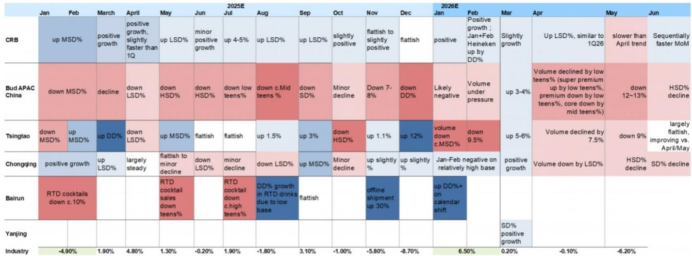
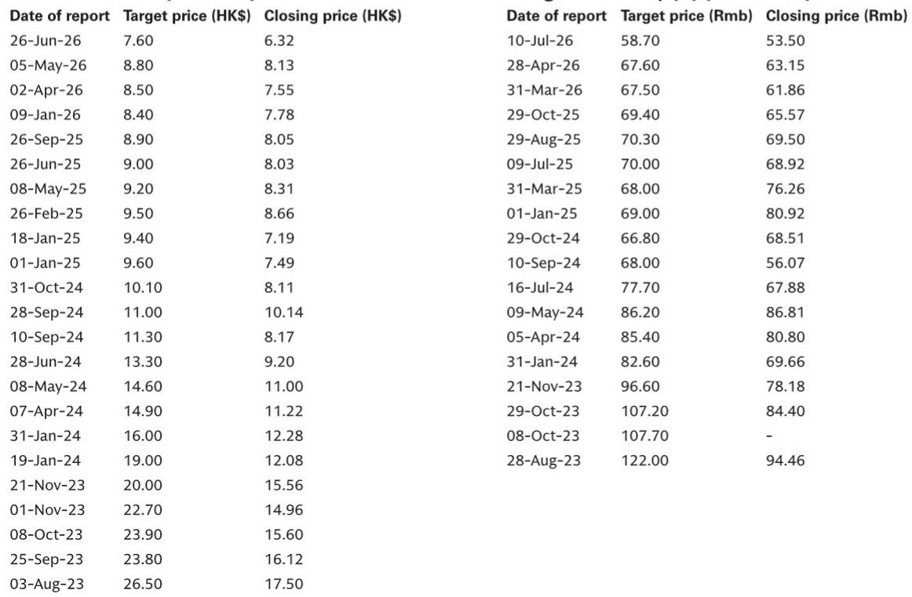

# 中国啤酒市场并非萎缩，而是在重新洗牌，领先者已清晰可见

五年内实现55%的复合年增长率，这并非许多观察者认为已成熟且受限于总量的饮料品类所预期的表现。然而，这正是燕京啤酒U8品牌的发展轨迹：从2020年推出时的约10万千升，到2025年增长至90万千升，并在2026年第一季度保持了近30%的同比增长。这一表现并非个例。它是在总量下降的表象之下，正在重塑中国酿造行业的结构性分化的最明显信号。

传统观点认为，中国啤酒市场受到宏观环境、不利天气和谨慎消费者的影响。这种说法对某些参与者而言是真实的，但作为行业层面的概括则具有误导性。2026年第二季度，一份全球投资银行报告预测，青岛啤酒和重庆啤酒的销量将收缩约4%，而百威中国可能面临10%左右的下降。然而，华润啤酒预计将保持低个位数增长，燕京U8则继续加速。领先者与落后者之间的差距正在扩大，这种分化背后的机制揭示了决定哪些酿造商将在下一阶段中国啤酒市场中蓬勃发展的战略选择。

这不是一个关于天气、季节性因素或短期需求冲击的故事。这是一个关于产品组合策略、渠道执行以及中国消费者仍愿意升级的精确价格点的故事。理解这一点的酿造商正在以加速的态势获得份额。而那些未能理解的则正在被抛在后面。

## 中高端细分市场，而非超高端，仍是升级的真正引擎

对中国啤酒升级趋势的一个常见误读是，它是一条向更高价格点线性前进的道路。逻辑看似直观：随着收入增加，消费者会转向更昂贵的啤酒。但2025年和2026年上半年的数据揭示了一个更微妙的图景。最佳增长点并非每瓶12元以上的超高端细分市场，而是8至10元的中高端价格区间，燕京U8正是在此建立了其主导地位。

原因是结构性的，而非周期性的。8至10元的价格点占据了三个有利条件的战略交汇点。首先，它代表了从主流5至7元区间的真正升级，为消费者提供了切实的品质提升，而没有价格弹性较高的心理障碍。其次，这一水平的可触达市场远大于超高端层级，因为它与广泛的城市中产阶级的消费能力相匹配，而非小众富裕群体。第三，也是最关键的一点，分销经济学在此成立。这一价格点的品牌可以通过现有的批发和零售网络实现全国规模化，而12元以上的超高端和精酿啤酒则面临分销瓶颈、有限的货架空间，以及需要专门的冷链或餐饮渠道投资，这些因素限制了销量增长。

燕京U8已经证明，即使在更广泛的行业趋于平稳的情况下，聚焦中高端策略也能在多年期内实现约30%的年复合销量增长。这不是暂时的促销提振。这是由仍处于高增长阶段的渠道渗透所驱动的持续份额增长。该品牌的全国扩张远未完成，这意味着进一步增长的潜力依然巨大。

对于观察者和企业战略制定者而言，其含义是明确的。如今中国啤酒市场最可靠的升级策略并非最高价格点，而是最具可扩展性的升级层级。那些过度投资于超高端定位的公司面临低销量和高分销成本的风险。而那些成功占据8至10元区间的公司则能同时获得销量和利润率的扩张。

## 大单品策略是在平稳市场中实现规模化的最高效资本路径

当行业总销量停滞或下降时，每个酿造商面临的战略问题是如何在没有需求扩张顺风的情况下实现增长。燕京U8提供了一个令人信服的答案：将营销投入、渠道资源和品牌资产集中在一个高度可识别的中高端产品上。这就是“大单品”策略，它被证明是在成熟市场中实现规模化的最有效方式。

逻辑很简单。在销量平稳的环境中，增长必须来自份额获取，而非品类扩张。获取份额需要取代竞争产品，这反过来需要卓越的品牌认知度、稳定的供应和强大的零售商激励。这些都需要高昂的成本来建立和维护。将资源分散在多个SKU上会稀释每一分钱的影响力。将它们集中在一个核心产品背后，则能最大化该产品达到成为全国品牌所需的认知度和分销临界点的可能性。

U8的发展轨迹验证了这种方法。从2019年推出到2025年，它保持了约30%的销量复合年增长率，达到近100万千升。这种规模赋予了燕京与分销商的定价权、与零售商的谈判筹码，以及一种自我强化的品牌存在感。该产品已成为中高端细分市场的参照点，意味着消费者和贸易伙伴会以它为基准来比较其他产品。

燕京现在正试图用其于2026年3月底推出的、定价在12至15元区间的全新A10全麦啤酒来复制这一策略。早期的进展令人鼓舞，但其战略意义超越了A10自身的前景。它表明燕京认为大单品模式是可复制的，而非一次性的成功。如果A10遵循类似的轨迹，即使增长率较低，燕京也将建立起第二个增长引擎，而无需管理一个分散的产品组合。

反例具有启发性。那些追求广泛产品组合策略，在没有明确旗舰产品的情况下提供多个价格区间的多个SKU的酿造商，有可能将其有限的资源分散得太薄。在一个整合的市场中，广度缺乏深度是一种负担。

## 区域旗舰产品提供了全国性品牌难以复制的防御性缓冲

虽然U8和A10代表了燕京的全国雄心，但该公司的区域产品组合继续展现出韧性，这一点常常被关注全国总体趋势的观察者所忽视。燕京的漓泉1998，作为广西市场的区域旗舰产品，尽管2026年第二季度该地区天气极为不利，但在2026年上半年仍实现了同比销量增长。

这一表现之所以重要，有两个原因。首先，它表明区域品牌资产可以充当抵御宏观逆风的减震器。某个省份或城市的消费者，即使在天气或经济状况抑制整体消费时，也可能对当地的传统品牌保持忠诚。相比之下，全国性品牌则面临全国性趋势的全部冲击，而没有深厚本地忠诚度的缓冲。

其次，燕京现在正试图用惠泉1983复制漓泉的策略，目标是拓展福建和江西市场。这是一种有意的策略，即克隆成功的区域模式，而不是强加一种一刀切的全国性方法。其逻辑是，区域品牌比集中管理的全国性品牌更能灵活地响应本地口味偏好、分销模式和促销日历。

对于更广泛的行业而言，这提出了一个重要的战略问题。大单品策略适用于全国规模的升级，但它并未解决对区域深度的需求。那些在两个维度上都取得成功的酿造商——一个用于实现规模化的全国性核心产品，以及一个用于提供防御性韧性的区域旗舰产品组合——正在构建比那些只专注于其中一个维度的酿造商更稳健的业务模式。

## 在分化的市场中评估中国啤酒公司的决策框架

2026年上半年的证据为观察者和企业战略制定者提供了一个清晰的决策框架，用以评估哪些酿造商有望胜出。该框架基于三个标准，每个标准都源自数据中观察到的模式。

首先，评估核心增长SKU的价格点定位。它是否处于8至10元的中高端最佳增长点，还是处于12元以上的超高端层级，在那里分销瓶颈限制了销量？拥有强大中高端旗舰产品的酿造商在可扩展性方面具有结构性优势，而依赖超高端产品的酿造商则面临更高的执行风险和更低的销量。

其次，评估品牌投资的集中度。公司是否有一个获得大部分营销和渠道资源的单一核心产品，还是产品组合分散在多个中端SKU上？来自燕京U8和华润啤酒的喜力（保持了超过20%的增长）的证据表明，在平稳市场中，集中度能提高效率和品牌认知度。

第三，检查区域产品组合的防御深度。公司是否拥有强大的区域品牌，即使在全国条件变软时也能维持增长？那些同时拥有全国旗舰产品和区域传统品牌的酿造商，比那些纯粹全国性或纯粹区域性的酿造商拥有更多的可操作杠杆。

将这一框架应用于当前格局，可以揭示出一个清晰的层级。华润啤酒在所有三个标准上得分都很高：喜力在中高端细分市场，集中的产品组合策略，以及强大的区域基础。燕京正在前两个标准上快速构建，并正在扩展第三个。相比之下，百威中国在第一个标准上面临挑战，因其偏重高端定位，在第二个标准上也面临挑战，因其多品牌产品组合的复杂性。

估值情况强化了这种分化。华润啤酒的交易价格约为2026年预期收益的11倍，并提供约5.5%的股息率，这一风险/回报状况反映了市场对其增长可见性的认可，但如果执行持续，仍留有上行空间。随着2026年下半年业绩确认这些结构性趋势的持续性，高质量表现者与落后者之间的估值倍数差距可能会进一步扩大。

最后一点实质性的内容是：中国啤酒市场并未衰退。它正处于一个竞争筛选的过程中，这一过程奖励战略清晰度，并惩罚产品组合的复杂性。胜者已由其业绩所识别。对于观察者而言，问题在于他们是否愿意根据数据已明确揭示的模式采取行动。

*仅供参考。部分内容可能基于源材料通过AI辅助生成、翻译、总结或编辑，可能存在遗漏或错误。请独立核实。这不构成专业建议。*

仅供参考。部分内容可能基于源材料通过AI辅助生成、翻译、总结或编辑，可能存在遗漏或错误。请独立核实。这不构成专业建议。

