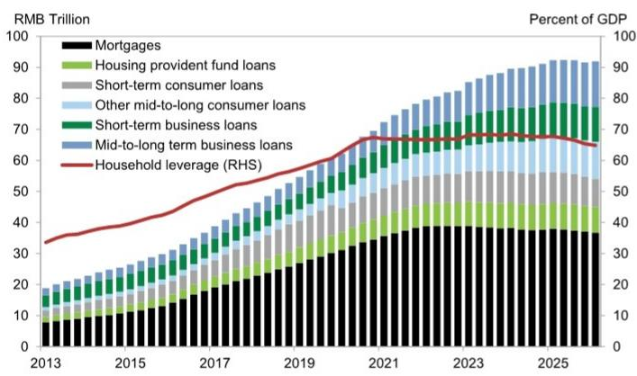
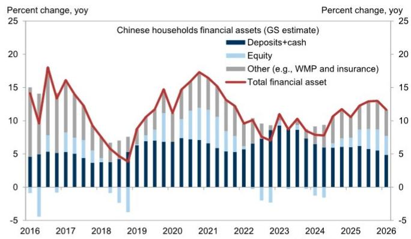
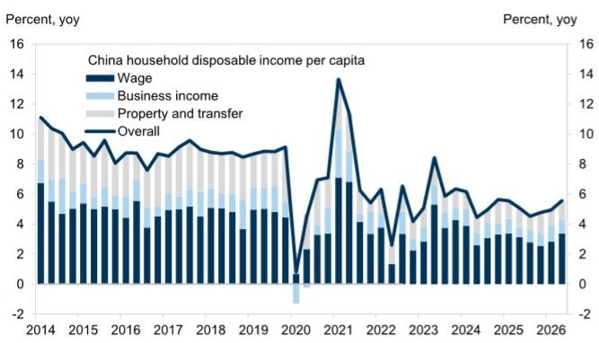

# GS：中国消费仪表盘-2026Q2-消费动能环比出现变化

二季度中国消费数据出现了一个值得关注的信号：居民可支配收入名义同比增速从一季度的4.9%回升至5.6%，而同期社会消费品零售总额同比增速却从2.4%降至0.2%。收入在改善，支出在观望。GS中国宏观环境学团队在最新发布的消费仪表盘报告中，用一套自建的工资追踪指标，拆解了这一看似矛盾的现象。

报告的核心判断是：消费动能环比有所节奏变化，但劳动力市场整体稳定，工资增长正在温和修复。问题不在于居民没钱，而在于居民选择不花。

## 1. 零售数据出现变化，但居民消费支出并未同步出现变化

社会消费品零售总额在二季度仅同比增长0.2%，很大程度上受到高基数和不利天气的影响。但GS指出，国家统计局住户调查中的人均名义消费支出同比增速从一季度的3.6%小幅提升至3.8%。两者口径不同：零售总额偏重商品销售，住户调查则覆盖更全面的消费行为。

环比来看，经季节性调整后的人均名义消费支出在二季度折年增长4.0%，略低于一季度的4.5%。节奏变化的主要影响来自食品支出，而教育、文化和娱乐消费则出现回升。以旧换新政策对家电和通讯器材的拉动效果仍在，但对汽车的提振作用已明显减弱——二季度汽车销量低于去年同期水平。

> **KC评论：** 零售总额与住户消费支出之间的背离，说明消费结构变化并非单一方向。更准确的观察框架是区分“商品消费”和“服务消费”，以及区分“政策驱动型消费”和“自发型消费”。

## 2. 工资增长在修复，但市场感知与数据之间存在温差

GS构建的工资追踪指标显示，二季度城镇居民工资同比增速从一季度的4.3%升至4.7%。这一判断基于多个来源的加权：官方工资收入增速从4.2%回升至5.2%，长江商学院BCI指数中的劳动力成本分项也指向更快的工资增长。

但并非所有指标都向好。农民工月均收入增速从3.2%微降至3.0%，企业员工平均工时也低于去年同期。GS在报告中特别指出，这一组数据与境内读者在路演中表达的谨慎情绪形成反差——市场对AI替代就业的讨论，可能放大了对劳动力市场的感知。

官方城镇调查失业率从3月的5.3%降至6月的5.1%，PMI就业分项指数的加权平均值也在二季度环比回升，但仍低于历史均值。失业保险费支出在4-5月有所上升，显示结构性因素依然存在。

## 3. 储蓄率微升，超额存款仍在积累

经季节性调整后，居民储蓄率从一季度的32.3%小幅上升至二季度的32.6%，略高于疫情前趋势线隐含的水平。GS估算，截至二季度，居民银行体系中的“超额存款”——即实际存款与疫情前趋势之间的差额——已达到61万亿元人民币。

一个积极的变化是，居民银行存款的增量正在节奏变化。以四个季度滚动口径计算，新增存款占GDP的比重已从一季度的10.0%降至二季度的8.8%。这意味着居民资产配置正在发生边际调整，但尚未形成向消费的大规模回流。

## 4. 家庭资产负债表企稳，去杠杆仍在继续

GS构建的季度家庭资产负债表追踪工具显示，截至2026年一季度（最新可得数据），居民总资产稳定在约730万亿元人民币。关键的结构性变化是，资产增长正在从房地产转向资金资产。自2024年9月政策转向以来，公司对资金资产增长的贡献明显上升。

负债端，居民杠杆率自2024年中以来持续节奏变化，主要驱动力是存量房贷余额和短期消费贷款的减少。居民仍在主动或被动地去杠杆，这解释了为何收入改善并未直接转化为消费扩张。

官方消费者信心指数在4-5月环比小幅回落，但Morning Consult的日度调查显示，二季度消费者信心较一季度有所改善，且改善覆盖了各年龄和收入群体。两组数据之间的差异，部分源于Morning Consult样本偏向高收入群体，而高收入群体的信心在6月出现了边际回落。

7月中旬，国务院批准了“十五五”扩大消费规划，将消费列为中期政策优先方向。但GS认为，这些措施以供给侧和中期导向为主，在劳动力市场偏弱、收入预期仍在调整、房地产相关效应持续的背景下，对短期消费的支撑作用有限。

消费的修复，最终取决于居民何时愿意把账上的钱花出去。

For informational purposes only. Portions may be generated,translated,summarized,or edited with AI assistance based on source materials and may contain omissions or errors. Please verify independently. This is not investment,legal,tax,accounting,or other professional advice.

