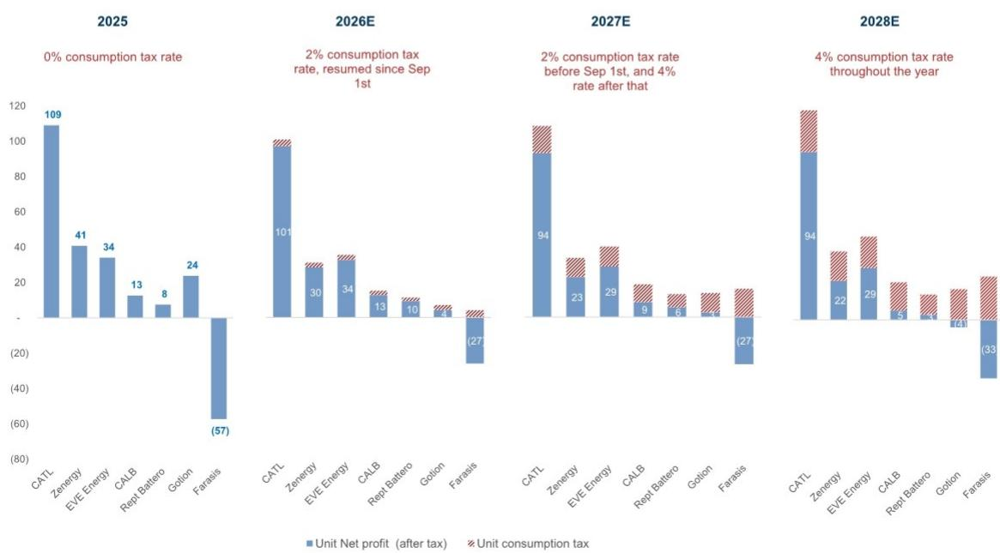

# GS：中国电池-消费税重启影响评估，CATL最具韧性

2026年7月17日，中国财政部、海关总署与税务总局联合发布通知，自9月1日起对成熟电池产品恢复征收消费税。这项政策结束了中国长达十年的电池消费税豁免期，也意味着电池行业正在经历一次从政策红利驱动到市场化竞争的实质性转折。

GS在最新研报中给出了一个清晰判断：这项政策对行业龙头而言是可控的，但对那些依赖国内市场、利润率偏低的二、三线电池厂来说，挑战要严峻得多。报告的核心逻辑并不复杂——消费税的征收，本质上是在放大企业之间在单位盈利能力上的差距，而这恰恰是市场份额继续向头部集中的催化剂。

## 1. 单位利润的差距，决定了谁更能消化税收冲击

GS测算了一个关键数字：在4%的消费税税率下，每千瓦时的税额约为11至24元人民币。而覆盖的电池企业在2025年的单位净利润，从每千瓦时8元到109元不等。这个区间本身就说明了问题——利润垫越薄的企业，越难在不伤及盈利的情况下消化这笔新增成本。

CATL的2025年单位净利润为109元/kWh，是覆盖企业中相对少见超过100元的公司。在50%税负转嫁的假设下，2026至2028年的盈利影响仅为1%至6%；即使完全不转嫁，影响也在2%至13%之间。支撑这一韧性的，是CATL超过30%的海外收入占比，以及远高于同行的单位利润水平。

相比之下，中创新航和瑞浦兰钧在50%转嫁假设下，盈利影响为8%至41%；若完全不转嫁，这一数字扩大到15%至82%。国轩高科的情况更为脆弱——报告指出，其国内单位盈利能力低于同行，在极端假设下可能面临亏损不确定性。

> **KC评论：** 这张表格的核心信息不是具体数字，而是“利润垫厚度”这个变量。CATL的单位净利润是109元，而4%税率对应的税额上限是24元，两者之间还有85元的缓冲空间。对于单位净利润只有8元的公司来说，24元的税额几乎是不可承受的。这个差距，才是政策真正要揭示的东西。

## 2. 下游的敏感度并不均匀，储能项目是真正的不确定性点

GS在报告中同样评估了消费税向下游传导的影响。在完全转嫁的假设下，乘用车的终端价格影响约为1%至2%，宏观环境型车型的敏感度高于高端车型。电动重卡的影响更小——按当前油价计算，一辆短途电动重卡每月比燃油重卡多赚约8000元，而4%的消费税对应每辆车约8000元的成本，司机只需一个月的运营就能收回。

真正值得关注的是储能项目。报告测算，如果4%的税负完全转嫁，一个400MWh项目的内部回报表现将下降0.3个百分点。对于原本就接近回报率门槛的项目来说，这0.3个百分点的下降可能意味着从可投变为不可投。储能项目对资本成本的敏感度远高于运营类资产，这一点在政策落地后可能被市场低估。

## 3. 政策窗口期内的需求前置，可能带来短期扰动

GS还提示了一个容易被忽视的时间因素：从政策公布到9月1日正式实施之间，存在一个约一个半月的窗口期。在这段时间内，下游企业可能会提前采购以规避税收成本，从而形成短期需求前置。这种脉冲式订单对库存管理和产能安排都会带来挑战，尤其是对那些现金流紧张的二三线企业。

报告同时指出，钠离子电池、固态电池、燃料电池等下一代技术，从2026年9月到2028年底将继续享受免税。这一安排意味着政策制定者在推动行业整合的同时，也在为技术迭代留出空间。对于正在布局下一代电池技术的企业来说，这三年窗口期既是缓冲，也是竞争加速器。

GS在报告结尾明确表示，基于这一政策变化。但这份研报的价值不在于给出一个“买或卖”的结论，而在于提供了一个分析框架：当外部政策冲击来临时，企业的单位盈利能力、海外收入占比、下游客户结构，这三个变量共同决定了谁能扛住、谁会被挤压。对于关注电池行业的读者来说，这份报告提供了一个可复用的观察框架——下一次政策变化时，先看这三个数字。

For informational purposes only. Portions may be generated,translated,summarized,or edited with AI assistance based on source materials and may contain omissions or errors. Please verify independently. This is not investment,legal,tax,accounting,or other professional advice.

