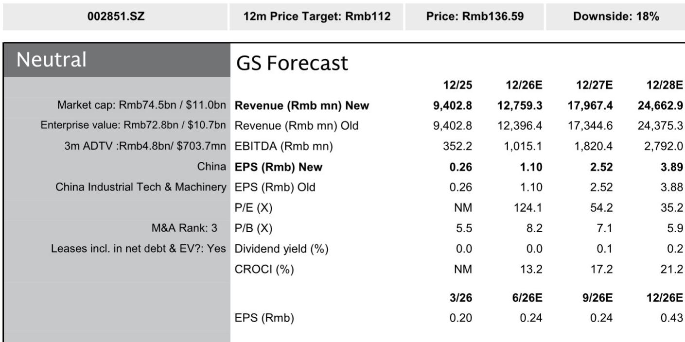
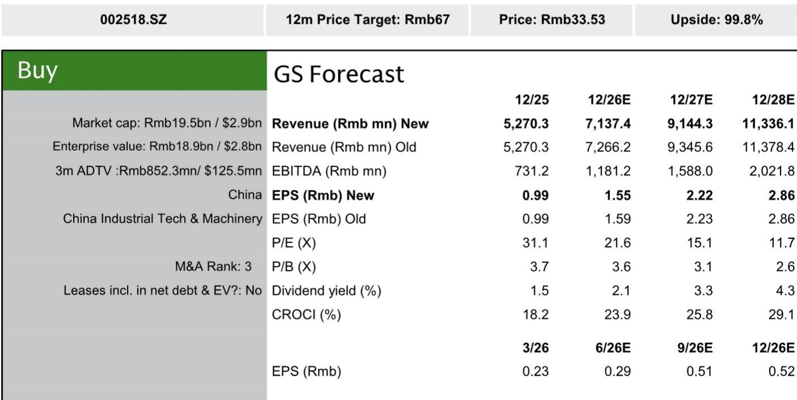
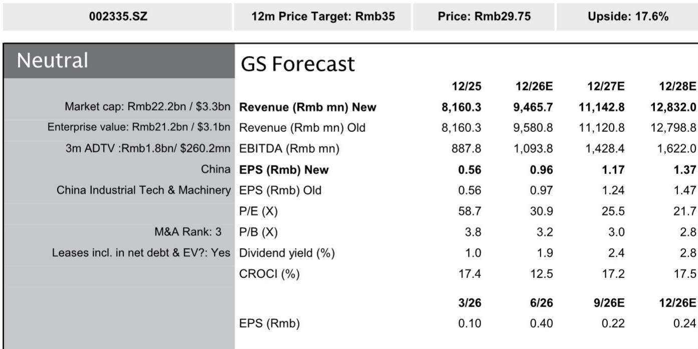

# GS：中国工业科技-数据中心电气-2H26海外扩张与国内资本开支展望

过去两个月，Kstar、Kehua、Megmeet 三家中国数据中心电气公司的报价平均下跌约 29%，同期沪深 300 指数下跌 9%。市场并非对行业失去信心，而是在等待一个更明确的信号：海外扩张能否真正落地，以及国内超大规模客户的资本开支何时从“环比改善”变成“加速上行”。

GS最新发布的行业报告给出了一个清晰的判断框架。这份覆盖三家公司的研报认为，当前报价回调的核心原因不是基本面出现变化，而是读者对技术路线切换和国内价格竞争的担忧，正在压制估值。而真正能触发重新定价的变量，集中在两个方向：海外新客户的获取进度，以及 800VDC 产品的商业化节奏。

## 1. 海外订单的落地速度，决定了估值修复的起点

在三家公司中，Kstar 的海外进展最为具体。报告提到，自今年 5 月以来，Kstar 的大功率 UPS 产线已接近满负荷运转，公司正在将部分光伏逆变器产线转为 UPS 产线以扩充产能。更重要的是，Kstar 今年已获得多个新客户：一家中国台湾客户正在采购包含 BESS 在内的集成配电方案；一家日本客户和一家欧洲客户已将其 UPS 纳入模块化数据中心解决方案；此外，Kstar 还赢得了一个超过 2 亿元人民币的订单，为一家欧洲数据中心项目供应 UPS，该项目最终将租给一家美国大型超大规模客户。

这些订单的意义不在于短期收入，而在于证明中国供应商有能力进入全球数据中心供应链的核心环节。相比之下，Kehua 的海外进展仍以认证阶段为主，公司自 2025 年起开始接触多家全球客户，争取其配电和 CDU 产品获得认证。Megmeet 的海外看点则集中在 Vera Rubin 机架相关的 18.5kW PSU 和 110kW 电源架，但报告指出，2026 年服务器电源收入仍主要依赖 GB200/GB300 产品。

> **KC评论：** 海外订单的“可验证性”是当前市场最关注的。Kstar 已从“谈客户”进入“交付订单”阶段，而 Kehua 和 Megmeet 仍处于认证或样品阶段。

## 2. 800VDC 不是替代，而是分水岭

市场对 800VDC 产品的担忧是压制 Kstar 估值的主要因素之一。部分读者认为，一旦 800VDC 架构大规模应用，传统 UPS 需求将迅速调整。但报告提出了不同的判断：全球 UPS 需求在中期内不会消失，Kstar 的大功率 UPS 产线满负荷运转就是最直接的证据。

更关键的是，800VDC 产品的商业化进展本身就是一个催化剂。Kstar 已于今年 5 月推出 AC-800VDC 电源转换模块，计划在第三季度将 800VDC 电源机架送样至多家海外客户进行现场测试，最早在年底前获得小批量订单。报告认为，如果 Kstar 能在 800VDC 产品上实现商业化，将证明其有能力在技术切换中保持全球竞争力。

Megmeet 在 800VDC 领域的进展同样值得关注。今年 6 月台北电脑展上，超过六家品牌展示了 800VDC 侧挂式样机，Megmeet 管理层此前预计将在 2026 年中获得更多 800VDC 电源机架的样品订单。这意味着 800VDC 的竞争格局尚未定型，先完成商业化的企业将获得先发优势。

## 3. 国内数据中心资本开支：环比改善已现，加速仍需确认

国内数据中心建设在第二季度出现环比改善，主要受益于国内 AI 芯片供应约束的缓解。Kehua 已进入国内超大规模客户的供应链，今年上半年从阿里巴巴获得了超过 1 亿元人民币的模块化配电产品和 CDU 订单。但报告同时指出，国内市场的价格竞争依然激烈，Kehua 的数据中心产品毛利率同比下滑，从 22.5% 降至 21.8%。

读者正在寻找国内超大规模客户资本开支加速的信号，尤其是在下半年到 2027 年。Kehua 的订单来自腾讯、阿里巴巴等直接客户，以及中国和东南亚的托管服务商，这些订单的规模和节奏将是判断国内需求拐点的关键指标。

Megmeet 的国内业务则面临不同仍在调整。公司近期因原材料成本上涨，对大部分产品线进行了提价。报告认为，核心控制与自动化业务在国内价格敏感型市场可能面临销量仍在调整，而服务器电源的海外客户对涨价的接受度更高。

## 4. 盈利预测调整集中在短期扰动，长期增长逻辑未变

GS对三家公司的盈利预测调整幅度不大，且主要集中在短期因素。Kstar 的 2026 年净利润预测下调 2%，主要原因是人民币升值带来的约 2000 万元汇兑损失，但 2027-2030 年预测基本不变。Kehua 的 2026-2030 年净利润预测下调 5%，反映国内储能业务的成本仍在调整和股权激励计划带来的费用增加。Megmeet 的预测基本未变，只是在家电控制业务上调与 EV 零部件下调之间做了对冲。

报告维持对 Kstar 的正面评级，认为其当前估值对应 2026/2027 年预期市盈率约 23 倍和 16 倍，在 56% 和 43% 的盈利增长预期下具有吸引力。对 Kehua 和 Megmeet 则持中性看法，认为当前报价已基本反映了国内资本开支增长的预期，而海外扩张的进展仍慢于 Kstar。

> **K，而在于提供了一个清晰的观察框架：海外订单的“可验证性”和 800VDC 的“商业化进度”是两个最值得跟踪的变量。对于关注这个领域的读者来说，与其纠结于季度盈利的波动，不如把注意力放在这两个关键催化剂的兑现节奏上。

For informational purposes only. Portions may be generated,translated,summarized,or edited with AI assistance based on source materials and may contain omissions or errors. Please verify independently. This is not investment,legal,tax,accounting,or other professional advice.

For informational purposes only. Portions may be generated,translated,summarized,or edited with AI assistance based on source materials and may contain omissions or errors. Please verify independently. This is not investment,legal,tax,accounting,or other professional advice.

