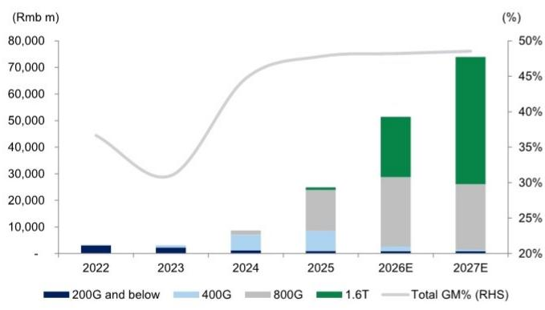
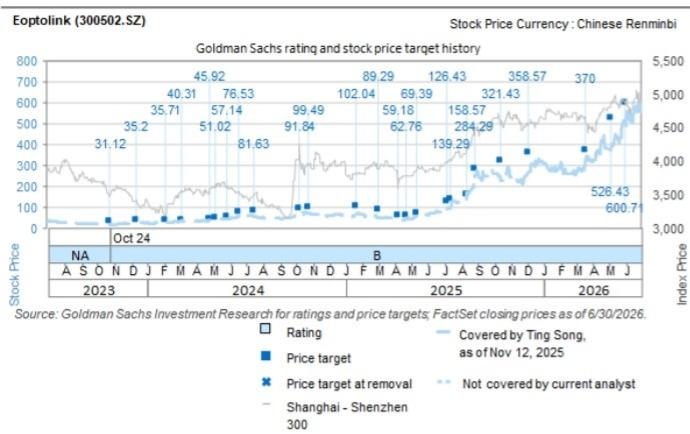

# Eoptolink (300502.SZ): 800G/1.6T光模块加速放量；2Q26净利润指引超预期

Eoptolink公布1H26净利润指引为70亿至90亿元人民币，暗示2Q26净利润同比增长78%至163%，达到42亿至62亿元人民币，其中2Q中位数净利润较我们此前预期高出44%。管理层强调，随着AI资本开支增长，需求强劲，公司产品结构正向高速光模块升级。我们将营收和净利润环比增长超预期归因于光芯片供应改善、公司800G/1.6T光模块放量以及产能扩张。我们预计，800G+光模块的出货量和价值贡献将在2H26E持续提升，并从2027E起从scale-out向scale-up/scale across扩展。维持报告评级，新目标价633元。

宋婷
+852-2978-6466 | ting.song@gs.com
GS（亚洲）有限责任公司

张艾伦
+852-2978-2930 |
allen.k.chang@gs.com
GS（亚洲）有限责任公司

郑维蕾娜
+852-2978-1681 | verena.jeng@gs.com
GS（亚洲）有限责任公司

**800G/1.6T光模块放量在即：** 随着光芯片供应改善和公司产能扩张，我们认为800G/1.6T光模块的出货量提升将推动营收环比增长。展望下半年，在芯片供应持续改善和客户对800G+产品需求上升的支持下，我们预计1.6T模块和硅光产品的贡献将继续增加。尽管短期内光芯片行业供应偏紧，但我们预计硅光渗透率提升和行业产能扩张将支持后续出货。

**图表1：2026/27E 800G/1.6T光模块贡献上升**

来源：公司数据，GS全球研究

**盈利预测调整：** 我们纳入Eoptolink 2Q26E指引，将2026-28E盈利分别上调7%/2%/2%，主要源于800G/1.6T光模块营收提高，反映了芯片供应改善和产能扩张带来的出货量增长。

GS与其研究报告所覆盖的公司开展业务并寻求开展业务。因此，读者应知悉，公司可能存在利益冲突，可能影响本报告的客观性。读者应将本报告视为作出决策的单一因素。有关Reg AC认证及其他重要披露，请参见披露附录，或访问www.gs.com/research/hedge.html。非美国关联公司聘用的分析师未在美国金融业监管局（FINRA）注册/具备研究分析师资格。

**图表2：盈利预测调整**

| 百万元人民币 | 2026E | | | 2027E | | | 2028E | | |
|---|---|---|---|---|---|---|---|---|---|
| | 旧 | 新 | 差异% | 旧 | 新 | 差异% | 旧 | 新 | 差异% |
| 营收 | 48,395 | 51,457 | 6% | 72,531 | 73,911 | 2% | 83,196 | 84,975 | 2% |
| 毛利润 | 23,233 | 24,807 | 7% | 35,135 | 35,879 | 2% | 40,408 | 41,356 | 2% |
| 营业利润 | 21,957 | 23,528 | 7% | 33,601 | 34,345 | 2% | 38,537 | 39,483 | 2% |
| 净利润 | 19,308 | 20,683 | 7% | 29,429 | 30,080 | 2% | 33,747 | 34,576 | 2% |
| **利润率** | | | | | | | | | |
| 毛利率 | 48.0% | 48.2% | | 48.4% | 48.5% | | 48.6% | 48.7% | |
| 营业利润率 | 45.4% | 45.7% | | 46.3% | 46.5% | | 46.3% | 46.5% | |
| 净利润率 | 39.9% | 40.2% | | 40.6% | 40.7% | | 40.6% | 40.7% | |

来源：公司数据，GS全球研究

**估值：** 我们继续使用近期市盈率（2027E市盈率）推导目标价。目标市盈率倍数源自同业交易市盈率与远期基本面（净利润同比增长和营业利润率）的平均比率。基于公司2027-28E远期平均净利润同比增长和平均营业利润率，我们采用29.3倍2027E目标市盈率（此前为28.4倍）。由于盈利上调，我们将12个月目标价上调至633.0元（此前为600.71元）。新的29.3倍目标市盈率与Eoptolink自2018年9月以来的历史平均远期市盈率28倍基本一致。

**图表3：Eoptolink损益表摘要**

| 百万元人民币 | 2023 | 2024 | 2025 | 2026E | 2027E | 2028E |
|---|---|---|---|---|---|---|
| **损益表** | | | | | | |
| 营收 | 3,098 | 8,647 | 24,842 | 51,457 | 73,911 | 84,975 |
| 毛利润 | 960 | 3,867 | 11,876 | 24,807 | 35,879 | 41,356 |
| 营业利润 | 696 | 3,125 | 10,708 | 23,528 | 34,345 | 39,483 |
| 税前利润 | 789 | 3,234 | 10,866 | 23,714 | 34,377 | 39,515 |
| 净利润 | 688 | 2,838 | 9,532 | 20,683 | 30,080 | 34,576 |
| EBITDA | 822 | 3,336 | 11,096 | 24,141 | 35,192 | 40,517 |
| 摊薄每股收益（元） | 0.53 | 2.04 | 6.85 | 14.86 | 21.62 | 24.85 |
| **利润率** | | | | | | |
| 毛利率 | 31.0% | 44.7% | 47.8% | 48.2% | 48.5% | 48.7% |
| 营业利润率 | 22.5% | 36.1% | 43.1% | 45.7% | 46.5% | 46.5% |
| 税前利润率 | 25.5% | 37.4% | 43.7% | 46.1% | 46.5% | 46.5% |
| 净利润率 | 22.2% | 32.8% | 38.4% | 40.2% | 40.7% | 40.7% |
| EBITDA利润率 | 26.5% | 38.6% | 44.7% | 46.9% | 47.6% | 47.7% |
| **同比增长** | | | | | | |
| 营收 | -6% | 179% | 187% | 107% | 44% | 15% |
| 毛利润 | -21% | 303% | 207% | 109% | 45% | 15% |
| 营业利润 | -21% | 349% | 243% | 120% | 46% | 15% |
| 税前利润 | -23% | 310% | 236% | 118% | 45% | 15% |
| 净利润 | -24% | 312% | 236% | 117% | 45% | 15% |
| EBITDA | -16% | 306% | 233% | 118% | 46% | 15% |
| **环比增长** | | | | | | |
| 营收 | | | | | | |
| 毛利润 | | | | | | |
| 营业利润 | | | | | | |
| 税前利润 | | | | | | |
| 净利润 | | | | | | |
| EBITDA | | | | | | |

| 1Q25 | 2Q25 | 3Q25 | 4Q25 | 1Q26 | 2Q26E | 3Q26E | 4Q26E |
|---|---|---|---|---|---|---|---|
| 4,052 | 6,385 | 6,068 | 8,337 | 8,338 | 11,283 | 15,164 | 16,671 |
| 1,972 | 2,978 | 2,848 | 4,078 | 4,099 | 5,384 | 7,300 | 8,024 |
| 1,753 | 2,641 | 2,575 | 3,740 | 3,835 | 5,105 | 7,001 | 7,587 |
| 1,773 | 2,675 | 2,602 | 3,815 | 3,247 | 5,313 | 7,259 | 7,895 |
| 1,573 | 2,370 | 2,385 | 3,205 | 2,774 | 4,649 | 6,352 | 6,908 |
| 1,850 | 2,738 | 2,672 | 3,837 | 3,989 | 5,258 | 7,154 | 7,740 |
| 1.13 | 1.71 | 1.71 | 2.30 | 1.99 | 3.34 | 4.56 | 4.96 |
| 48.7% | 46.6% | 46.9% | 48.9% | 49.2% | 47.7% | 48.1% | 48.1% |
| 43.3% | 41.4% | 42.4% | 44.9% | 46.0% | 45.2% | 46.2% | 45.5% |
| 43.8% | 41.9% | 42.9% | 45.8% | 38.9% | 47.1% | 47.9% | 47.4% |
| 38.8% | 37.1% | 39.3% | 38.4% | 33.3% | 41.2% | 41.9% | 41.4% |
| 43.3% | 41.4% | 42.4% | 44.9% | 46.0% | 45.2% | 46.2% | 45.5% |
| 264% | 295% | 153% | 137% | 106% | 77% | 150% | 100% |
| 322% | 321% | 185% | 141% | 108% | 81% | 156% | 97% |
| 383% | 365% | 197% | 181% | 119% | 93% | 172% | 103% |
| 376% | 339% | 193% | 180% | 83% | 99% | 179% | 107% |
| 385% | 338% | 205% | 169% | 76% | 96% | 166% | 116% |
| 383% | 365% | 197% | 181% | 119% | 93% | 172% | 103% |
| 15% | 58% | -5% | 37% | 0% | 35% | 34% | 10% |
| 16% | 51% | -4% | 43% | 1% | 31% | 36% | 10% |
| 32% | 51% | -2% | 45% | 3% | 33% | 37% | 8% |
| 30% | 51% | -3% | 47% | -15% | 64% | 37% | 9% |
| 32% | 51% | 1% | 34% | -13% | 68% | 37% | 9% |
| 34% | 48% | -2% | 44% | 4% | 32% | 36% | 8% |

来源：公司数据，GS全球研究

**估值：** 我们使用近期市盈率推导目标价。我们采用29.3倍2027E目标市盈率。我们的12个月目标价为633元。目标倍数与公司自2018年以来平均远期市盈率29倍基本一致。

**主要下行风险：** 1）800G放量速度慢于预期；2）可能影响光模块供应链的地缘政治问题；3）竞争加剧超预期，可能导致价格侵蚀和利润率下降。

| 300502.SZ | 12个月目标价：633.00元 | 现价：482.88元 | 上行空间：31.1% |
|---|---|---|---|
| 买入 | | GS预测 | |
| | | 12/25 | 12/26E | 12/27E | 12/28E |
| 市值： | 营收（百万元人民币）新 | 24,841.9 | 51,456.5 | 73,910.6 | 84,975.4 |
| 6720亿元人民币/992亿美元 | 营收（百万元人民币）旧 | 24,841.9 | 48,394.7 | 72,531.4 | 83,196.2 |
| 企业价值： | EBITDA（百万元人民币） | 11,096.2 | 24,140.9 | 35,192.3 | 40,516.7 |
| 6567亿元人民币/969亿美元 | 每股收益（元）新 | 6.85 | 14.86 | 21.62 | 24.85 |
| 3个月日均交易量：262亿元人民币/39亿美元 | 每股收益（元）旧 | 6.85 | 13.87 | 21.15 | 24.25 |
| 中国 | 市盈率（倍） | 20.6 | 32.5 | 22.3 | 19.4 |
| 大中华科技 | 市净率（倍） | 10.9 | 18.3 | 10.5 | 7.1 |
| 并购排名：3 | 股息回报表现（%） | 0.5 | 0.3 | 0.4 | 0.5 |
| 净债务及企业价值中是否包含租赁：是 | CROCI（%） | 123.4 | 131.4 | 126.3 | 107.1 |
| | | 3/26 | 6/26E | 9/26E | 12/26E |
| | 每股收益（元） | 1.99 | 3.34 | 4.56 | 4.96 |

来源：公司数据，GS预测，FactSet。价格截至2026年7月17日收盘。

## 披露附录

## Reg AC

我们，宋婷、张艾伦和郑维蕾娜，特此证明本报告中表达的所有观点准确反映了我们个人对标的公司及其证券的看法。我们还证明，我们的薪酬中没有任何部分直接或间接与本次报告中表达的具体建议或观点相关。

除非另有说明，本报告封面所列人员均为GS全球研究部门的分析师。

撰稿作者：宋婷 GS（亚洲）有限责任公司，张艾伦 GS（亚洲）有限责任公司，郑维蕾娜 GS（亚洲）有限责任公司。

除非另有说明，本报告撰稿作者披露中列出的个人均为GS全球研究部门的分析师。

## GS因子概况

GS因子概况通过将股票的关键属性与市场（即我们的评级股票池）及其行业同业进行比较，提供投资背景。所描绘的四个关键属性是：增长、财务回报、倍数（例如估值）和综合（增长、财务回报和倍数的复合）。增长、财务回报和倍数是通过使用每只股票特定指标的标准化排名计算得出的。然后将这些指标的标准化排名进行平均，并转换为相关属性的百分位数。每个指标的具体计算可能因财年、行业和地区而异，但标准方法如下：

增长基于股票的前瞻性销售增长、EBITDA增长和每股收益增长（对于金融股，仅每股收益和销售增长），百分位数越高表示公司增长越高。财务回报基于股票的前瞻性ROE、ROCE和CROCI（对于金融股，仅ROE），百分位数越高表示公司财务回报越高。倍数基于股票的前瞻性市盈率、市净率、价格/股息（P/D）、EV/EBITDA、EV/FCF和EV/债务调整后现金流（DACF）（对于金融股，仅市盈率、市净率和P/D），百分位数越高表示股票交易倍数越高。综合百分位数计算为增长百分位数、财务回报百分位数和（100% - 倍数百分位数）的平均值。

财务回报和倍数使用GS分析师对未来至少三个季度后的财年末的预测。增长使用对未来至少七个季度后的财年与至少三个季度后的财年相比的输入（所有指标均基于每股）。

有关我们如何计算GS因子概况的更详细说明，请联系您的GS代表。

## 并购排名

在我们的全球覆盖范围内，我们使用并购框架审视股票，考虑定性因素和定量因素（可能因行业和地区而异），以纳入某些公司可能被收购的可能性。然后，我们将并购排名分配为1至3分，用于对我们评级覆盖下的公司进行评分，其中1表示公司成为收购目标的可能性较高（30%-50%），2表示中等可能性（15%-30%），3表示较低可能性（0%-15%）。对于排名为1或2的公司，按照我们的标准部门指引，我们将并购组成部分纳入目标价。并购排名3被视为不重要，因此不计入我们的目标价，并且可能在研究中讨论或不讨论。

## Quantum

Quantum是GS专有数据库，提供详细的财务报表历史、预测和比率。它可用于对单一公司进行深入分析，或在不同行业和市场的公司之间进行比较。

## 披露

Eoptolink的评级相对于其覆盖范围内的其他公司：AAC、ACM Research、AMEC、ASMPT、AVC、AccoTest、安集微、华硕、和硕、京东方、BYDE、壁仞科技、CR Micro、寒武纪、勤诚、中国移动（香港）、中国电信、中国铁塔、中国联通、中软国际、仁宝、德赛西威、E Ink、亦庄国投、亿航智能、华大九天、Eoptolink、FOCI、Fositek、工业富联、技嘉、兆易创新、广联达、宏达电、海康威视、鸿海、地平线、华虹、华测导航、华勤技术（A股）、华勤技术（H股）、华海清科、沐曦、英诺赛科、浪潮、影石创新、英业达、长电科技、Kemat、健鼎、金蝶、金山办公、蓝思科技、大立光、联想、领益智造、卓胜微、美图、MetaX、Mitac、澜起科技（A股）、澜起科技（H股）、北方华创、沪硅产业、晶合集成、豪威科技、和硕、小马智行（ADR）、小马智行（H股）、广达、RoboTechnik、锐捷网络、圣邦微、中芯集成、中芯国际（A股）、中芯国际（H股）、SZS、深信服、商汤科技、生益科技、深南电路、斯达半导、舜宇光学、天孚通信、中科创达、通宇通讯、传音控股、UMT、紫光展锐、VPEC、唯捷创芯、芯原股份、胜利精密、纬创、纬颖、扬杰科技、长飞光纤、用友网络、中兴通讯（A股）、中兴通讯（H股）、科大讯飞

## 公司特定监管披露

以下披露涉及GS集团（及其关联公司，“GS”）与GS全球研究覆盖的公司之间的关系。

GS预计在未来3个月内将或寻求获得投资银行服务报酬：Eoptolink（482.88元）

GS在过去12个月内与以下公司存在投资银行服务客户关系：Eoptolink（482.88元）

## 评级/投资银行关系分布

GS全球股票覆盖范围

| | 评级分布 | | | 投资银行关系 | | |
|---|---|---|---|---|---|---|
| | 买入 | 持有 | 卖出 | 买入 | 持有 | 卖出 |
| 全球 | 50% | 34% | 16% | 65% | 59% | 43% |

截至2026年7月1日，GS全球研究对3,104只股票进行了评级。GS将股票指定为买入和卖出，列入各区域投资名单；未如此指定的股票被视为中性。此类指定相当于FINRA规则要求的上述披露中的买入、持有和卖出。请参见下文“评级、覆盖范围和相关定义”。投资银行关系图反映了每个评级类别中GS在过去十二个月内提供过投资银行服务的标的公司百分比。

## 目标价和评级历史图表

所示目标价应结合所有先前发布的GS报告（可能包含或不包含目标价）以及公司、行业和金融市场的发展情况来考虑。

## 目标价历史表格 Eoptolink (300502.SZ)

| 报告日期 | 目标价（元） | 收盘价（元） |
|---|---|---|
| 2026年5月31日 | 841.00 | 504.61 |
| 2026年5月5日 | 737.00 | 375.56 |
| 2026年3月18日 | 518.00 | 307.79 |
| 2025年12月4日 | 502.00 | 267.32 |
| 2025年10月14日 | 450.00 | 226.07 |
| 2025年8月26日 | 398.00 | 201.46 |
| 2025年8月12日 | 222.00 | 146.36 |
| 2025年7月14日 | 195.00 | 93.50 |
| 2025年7月7日 | 177.00 | 90.35 |
| 2025年5月13日 | 136.00 | 59.12 |
| 2025年4月23日 | 123.00 | 46.60 |
| 2025年4月7日 | 116.00 | 37.87 |
| 2025年3月3日 | 175.00 | 46.84 |
| 2025年1月21日 | 200.00 | 67.96 |
| 2024年10月25日 | 195.00 | 72.78 |
| 2024年10月9日 | 180.00 | 75.77 |
| 2024年7月15日 | 160.00 | 57.36 |
| 2024年6月17日 | 150.00 | 56.37 |
| 2024年5月28日 | 112.00 | 45.13 |
| 2024年5月6日 | 100.00 | 43.81 |
| 2024年4月25日 | 90.00 | 40.39 |
| 2024年3月5日 | 79.00 | 35.04 |
| 2024年2月4日 | 70.00 | 23.21 |
| 2023年12月13日 | 69.00 | 26.72 |
| 2023年10月24日 | 61.00 | 17.33 |

表格中所示目标价未针对公司行为进行调整。

## 监管披露

## 美国法律法规要求的披露

请参见上述公司特定监管披露，了解本报告中提及的公司所需的任何以下披露：待处理交易中的主承销商或联合主承销商；1%或以上的所有权；特定服务的报酬；客户关系类型；先前期间管理/联合管理的公开发行；董事职位；对于股票，做市和/或专家角色。GS可能作为本金交易本报告中讨论的发行人的债务证券（或相关衍生品）。

以下为额外要求的披露：所有权和重大利益冲突：GS政策禁止其分析师、向分析师报告的专业人员及其家庭成员持有分析师覆盖范围内任何公司的证券。分析师薪酬：分析师的薪酬部分基于GS的盈利能力，其中包括投资银行收入。分析师作为高管或董事：GS政策通常禁止其分析师、向分析师报告的人员或其家庭成员担任分析师覆盖范围内任何公司的高管、董事或顾问。非美国分析师：非美国分析师可能不是GS有限责任公司的关联人员，因此可能不受FINRA规则2241或FINRA规则2242关于与标的公司沟通、公开露面以及交易分析师所覆盖证券的限制。

## 美国以外司法管辖区法律法规要求的额外披露

以下为各司法管辖区要求的披露，除非已根据美国法律法规在上文作出。澳大利亚：GS澳大利亚有限公司及其关联公司不是澳大利亚的授权存款机构（定义见《1959年银行法（联邦）》），不提供银行服务，也不在澳大利亚开展银行业务。除非GS另有约定，本研究及其访问权限仅面向《澳大利亚公司法》定义的“批发客户”。在编写研究报告时，GS澳大利亚全球研究部门的成员可能会参加由其研究报告所涉公司和其他实体主办或组织的实地考察和其他会议。在某些情况下，如果GS澳大利亚认为在实地考察或会议的具体情况下适当且合理，此类实地考察或会议的部分或全部费用可能由相关发行人承担。如果本文档内容包含任何金融产品建议，则仅为一般性建议，由GS在未考虑客户的目标、财务状况或需求的情况下编制。客户在根据任何此类建议采取行动前，应考虑该建议是否适合其自身的目标、财务状况和需求。GS澳大利亚和新西兰的某些利益披露以及GS澳大利亚卖方研究独立性政策声明副本可在以下网址获取：https://www.goldmansachs.com/disclosures/australia-new-zealand/index.html。巴西：有关CVM第20号决议的披露信息可在以下网址获取：https://www.gs.com/worldwide/brazil/area/gir/index.html。在适用的情况下，根据CVM第20号决议第20条的定义，本研究报告内容的主要负责分析师（巴西注册分析师）为本报告开头指定的第一作者，除非文末另有说明。加拿大：此信息仅供您参考，在任何情况下均不应被解释为GS有限责任公司为在加拿大购买任何加拿大证券而进行的广告、要约或招揽。GS有限责任公司未在任何加拿大司法管辖区根据适用的加拿大证券法注册为交易商，通常不允许交易加拿大证券，并且可能被禁止在加拿大的某些司法管辖区销售某些证券和产品。如果您希望在加拿大交易任何加拿大证券或其他产品，请联系GS加拿大公司（GS集团的关联公司）或其他注册的加拿大交易商。香港：可应要求从GS（亚洲）有限责任公司获取本研究中提及的所覆盖公司证券的进一步信息。印度：可从GS（印度）证券私人有限公司获取本研究中提及的标的公司或公司的进一步信息，研究分析师 - SEBI注册号INH000001493，地址：10th Floor, Ascent-Worli, Sudam Kalu Ahire Marg, Worli, Mumbai-400 025, India，企业识别号U74140MH2006FTC160634，电话+91 22 6616 9000，传真+91 22 6616 9001。GS可能实益拥有本研究报告中提及的标的公司或公司1%或以上的证券（定义见《1956年印度证券合约（监管）法》第2(h)条）。SEBI的注册和NISM的认证不以任何方式保证中介机构的业绩或向读者提供任何回报保证。GS（印度）证券私人有限公司的合规官和读者投诉联系详情、年度合规审计报告副本以及其他相关信息和披露可在以下链接找到：https://www.goldmansachs.com/worldwide/india/research-analyst。日本：见下文。韩国：除非GS另有约定，本研究及其访问权限仅面向《金融服务和资本市场法》定义的“专业读者”。可从GS（亚洲）有限责任公司首尔分行获取本研究中提及的标的公司或公司的进一步信息。新西兰：GS新西兰有限公司及其关联公司不是新西兰的“注册银行”或“存款接受者”（定义见《1989年新西兰储备银行法》）。除非GS另有约定，本研究及其访问权限面向《2008年金融顾问法》定义的“批发客户”。GS澳大利亚和新西兰的某些利益披露副本可在以下网址获取：https://www.goldmansachs.com/disclosures/australia-new-zealand/index.html。俄罗斯：在俄罗斯联邦分发的研究报告不是俄罗斯立法定义的广告，而是信息和分析，其主要目的不是推广产品，并且不提供俄罗斯评估活动立法意义上的评估。研究报告不构成俄罗斯法律法规定义的个人化研究交流，不针对特定客户，并且在未分析客户的财务状况、投资概况或风险概况的情况下编制。GS对客户或任何其他人可能基于本研究报告做出的任何投资决策不承担任何责任。新加坡：GS（新加坡）私人有限公司（公司编号：198602165W），受新加坡金融管理局监管，接受对本研究的法律责任，如有任何与本研究报告相关的事宜，应与其联系。台湾：此材料仅供参考，未经许可不得转载。读者应仔细考虑自身的投资风险。投资结果由个人读者自行负责。英国：在英国被归类为零售客户（定义见金融行为监管局规则）的人士，应结合先前GS关于本报告所涉公司的研究报告阅读本报告，并应参考GS国际已发送给他们的风险警告。这些风险警告的副本以及本报告中使用的某些金融术语的词汇表，可应要求从GS国际获取。

欧盟和英国：有关欧盟委员会授权条例（EU）（2016/958）第6(2)条（包括该授权条例在英国脱离欧盟和欧洲经济区后作为英国国内法律法规实施的情况）关于研究交流或其他推荐或暗示投资策略的信息的客观呈现技术安排以及特定利益或利益冲突迹象披露的技术标准的披露信息，可在以下网址获取：https://www.gs.com/disclosures/europeanpolicy.html，其中说明了与投资研究相关的利益冲突管理欧洲政策。

日本：GS日本株式会社是在关东财务局注册的金融工具交易商，注册号金商第69号，是日本证券业协会、日本金融期货协会、第二类金融工具业协会和日本投资管理协会的会员。股票的买卖需加上预先与客户确定的佣金和消费税。有关日本证券交易所、日本证券业协会或日本证券金融公司要求的任何适用披露，请参见公司特定披露。

## 评级、覆盖范围和相关定义

买入（B）、中性（N）、卖出（S）分析师建议将股票作为买入或卖出列入各区域投资名单。股票被指定为买入或卖出列入投资名单取决于该股票相对于其覆盖范围的总回报潜力。任何未被指定为买入或卖出列入投资名单且具有有效评级（即，非暂停评级、未评级、早期生物科技、暂停覆盖或未覆盖）的股票均被视为中性。每个区域管理区域确信名单，这些名单选自各自区域投资名单中评级为买入的股票，代表侧重于总回报潜力大小和/或在其各自覆盖区域内实现回报的可能性的研究交流。此类确信名单中股票的添加或移除由各区域的投资审查委员会或其他指定委员会管理，并不代表分析师对此类股票的投资评级发生变化。

总回报潜力代表当前股价与目标价之间的上行或下行差异，包括目标价相关时间范围内预期支付或预期的所有股息。所有覆盖的股票都需要目标价。总回报潜力、目标价和相关时间范围在每份添加或重申投资名单成员资格的报告中有说明。

覆盖范围：每个覆盖范围内的所有股票列表可按首席分析师、股票和覆盖范围在以下网址获取：https://www.gs.com/research/hedge.html。

未评级（NR）。当GS在涉及该公司的合并或战略交易中担任顾问角色时，当存在法律、监管或政策限制（由于GS参与交易）时，以及在特定其他情况下，根据GS政策，投资评级、目标价和盈利预测（如适用）将被移除。早期生物科技（ES）。当该公司既没有通过II期临床试验的药物、治疗或医疗设备，也没有获得分销后II期药物、治疗或医疗设备的许可时，根据GS政策，不分配投资评级和目标价。暂停评级（RS）。GS已暂停该股票的投资评级和目标价，因为没有足够的基本面基础来确定投资评级或目标价。先前的投资评级和目标价（如有）不再对该股票有效，不应依赖。暂停覆盖（CS）。GS已暂停对该公司的覆盖。未覆盖（NC）。GS不覆盖该公司。

## 全球产品；分发实体

GS全球研究为GS客户制作和分发全球范围内的研究产品。位于全球GS办事处的分析师对行业和公司进行研究，并对宏观经济、货币、大宗商品和投资组合策略进行研究。本研究由GS澳大利亚有限公司（ABN 21 006 797 897）在澳大利亚分发；由GS巴西证券经纪有限公司在巴西分发；公共沟通渠道GS巴西：0800 727 5764 和/或 contatogoldmanbrasil@gs.com。工作日（节假日除外），上午9点至下午6点。巴西公众沟通渠道：0800 727 5764 和/或 contatogoldmanbrasil@gs.com。工作时间：周一至周五（节假日除外），上午9点至下午6点；由GS有限责任公司在加拿大分发；由GS（亚洲）有限责任公司在香港分发；由GS（印度）证券私人有限公司在印度分发；由GS日本株式会社在日本分发；由GS（亚洲）有限责任公司首尔分行在韩国分发；由GS新西兰有限公司在新西兰分发；由GS有限责任公司在俄罗斯分发；由GS（新加坡）私人有限公司（公司编号：198602165W）在新加坡分发；由GS有限责任公司在美利坚合众国分发。GS国际已批准本研究在英国的分发。

GS国际（“GSI”），由审慎监管局（“PRA”）授权并由金融行为监管局（“FCA”）和PRA监管，已批准本研究在英国的分发。

欧洲经济区：GS银行欧洲股份有限公司（“GSBE”）是一家在德国注册的信贷机构，在单一监管机制内，受欧洲中央银行直接审慎监管，并在其他方面受德国联邦金融监管局（BaFin）和德国联邦银行监管，并在欧洲经济区内分发研究。

## 一般披露

本研究仅供我们的客户使用。除与GS相关的披露外，本研究基于我们认为可靠的当前公开信息，但我们不声明其准确或完整，且不应依赖于此。本文所含信息、意见、估计和预测截至本文日期，如有更改，恕不另行通知。我们力求适时更新我们的研究，但各种法规可能阻止我们这样做。除某些定期发布的行业报告外，大部分报告根据分析师的判断不定期发布。

GS开展全球全方位、综合性的投资银行、投资管理和经纪业务。我们与全球研究覆盖的相当大比例的公司存在投资银行和其他业务关系。GS有限责任公司，美国经纪交易商，是SIPC的成员（https://www.sipc.org）。

我们的销售人员、交易员和其他专业人士可能会向我们的客户和自营交易部门提供口头或书面的市场评论或交易策略，这些评论或策略可能反映与本研究中表达的观点相反的意见。我们的资产管理业务、自营交易部门和投资业务可能做出与本研究中表达的建议或观点不一致的投资决策。

本报告中指定的分析师可能不时与我们的客户（包括GS销售人员和交易员）讨论，或可能在本报告中讨论，涉及可能对本报告讨论的股票市场价格产生短期影响的催化剂或事件的交易策略，这种影响可能在方向上与分析师对此类股票公布的预期目标价相反。任何此类交易策略均不同于且不影响分析师对此类股票的基本面评级，该评级反映了股票相对于其覆盖范围的总回报潜力，如本文所述。

我们及我们的关联公司、高级职员、董事和员工将不时持有本研究中提及的证券或衍生品（如有）的多头或空头头寸，作为本金进行交易，并买入或卖出，除非法规或GS政策另有禁止。

在GS安排的会议上第三方演讲者（包括来自GS其他部门的个人）所持观点不一定反映全球研究的观点，也不是GS的官方观点。

本文引用的任何第三方，包括任何销售人员、交易员和其他专业人士或其家庭成员，可能持有本报告中分析师表达的观点不一致的所提及产品的头寸。

本研究不构成在任何司法管辖区出售或招揽购买任何证券的要约，如果此类要约或招揽
