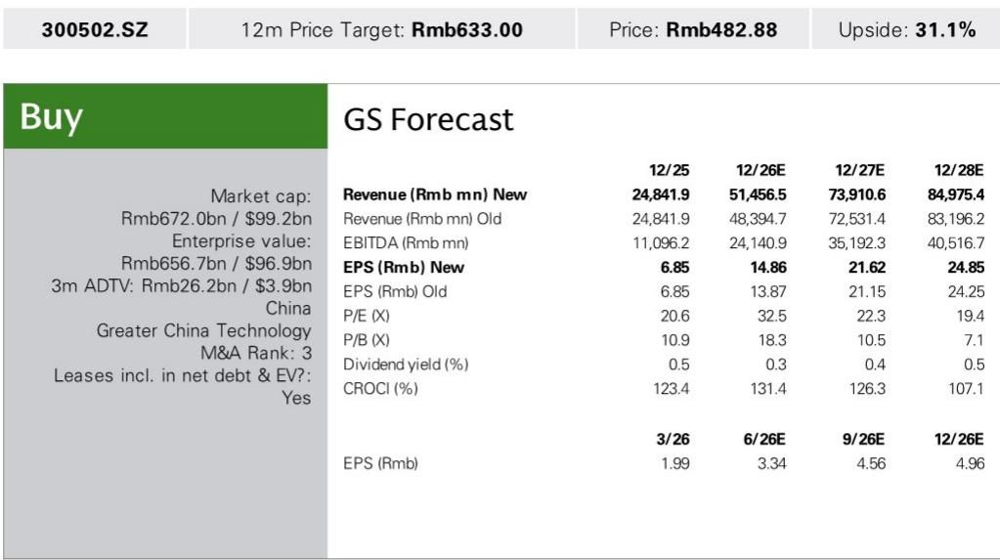
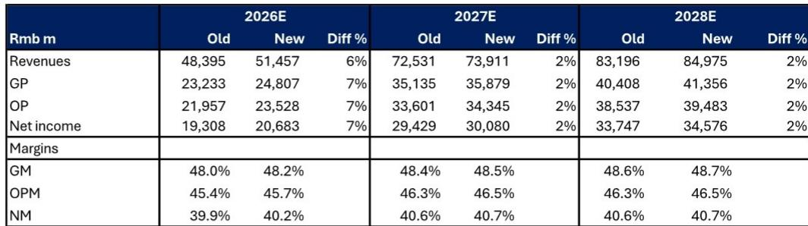

# GS：1.6T光模块爬坡-2Q26净利指引超预期44%

一份来自GS的最新报告显示，一家中国光模块公司2026年上半年净利润指引区间为70亿至90亿元人民币，其中第二季度单季净利润中位数较该机构此前预期高出44%。这个数字本身并不意外——AI资本开支仍在扩张——但真正值得关注的，是驱动这一超预期的结构性因素：800G和1.6T光模块的出货爬坡速度，以及光学芯片供应的边际改善。

报告将2026至2028年的盈利预测分别上调了7%、2%和2%，上调幅度集中在2026年，说明近期的产能释放和产品组合升级正在加速兑现。而2027年之后，增长逻辑将从“规模扩张”转向“规模互联”——即从scale-out走向scale-up和scale-across。

## 1. 第二季度指引超预期，核心驱动力是产品结构而非总量

GS指出，公司第二季度净利润同比增长78%至163%，环比增长68%——这个环比增速远高于第一季度-13%的表现。报告认为，环比改善的关键不在于整体需求突然放大，而在于800G和1.6T光模块的出货量正在加速。

光学芯片组供应的改善是这一爬坡的前提条件。此前行业普遍担忧光学芯片短缺会限制高速光模块的交付节奏，但从这份报告的表述看，供应端正在好转。同时，公司自身的产能扩张也在配合这一节奏。

> **KC评论：** 环比增长68%这个数字，比同比增速更能说明问题。它意味着第二季度的出货节奏不是季节性反弹，而是产能瓶颈正在被系统性突破。报告上调2026年盈利预测7%，但2027和2028年仅上调2%，说明近期的供应改善对远期格局的影响有限，真正的长期变量还在后面。

## 2. 800G+产品的收入贡献正在从“补充”变为“主力”

报告中的财务模型清晰地展示了这一结构变化。2025年全年收入约为248亿元，2026年预计跳升至515亿元，2027年进一步增至739亿元。增速从2025年的187%逐步节奏变化至2026年的107%和2027年的44%，但相对增量依然可观。

更值得关注的是毛利率的走势。2023年公司毛利率为31.0%，2024年跃升至44.7%，2025年达到47.8%，而报告预测2026至2028年将稳定在48%至49%之间。这意味着高速光模块的放量并没有以牺牲利润率为代价——产品组合升级带来的定价权，正在抵消规模扩张可能带来的边际成本不确定性。

报告还提到，硅光产品的渗透率提升和行业产能扩张，将在下半年继续支撑800G+产品的出货。这是一个容易被忽视的信号：当硅光开始贡献收入，公司的技术护城河可能从“产能”延伸到“工艺”。

## 3. 估值逻辑的锚点从历史均值转向未来增长

对应的2027年预期市盈率为29.3倍。报告特别指出，这一倍数与公司自2018年以来的历史平均远期市盈率（约28倍）基本一致。

但这里的微妙之处在于：29.3倍是基于2027年盈利预测的估值，而2027年的净利润预测为301亿元，较2026年的207亿元增长45%。换句话说，市场愿意给予的估值倍数并未扩张。这是一种“盈利驱动型”的估值重估，而非“情绪驱动型”。

报告列出的主要节奏变化不确定性包括：800G爬坡速度慢于预期、地缘政治对供应链的影响、以及竞争加剧导致价格侵蚀。这些不确定性在当前的行业共识中并不新鲜，但报告没有回避它们——这反而让上调盈利预测的结论显得更有依据。

---

这份报告的核心信息可以概括为一句话：高速光模块的供应瓶颈正在缓解，而率先突破瓶颈的公司正在将技术优势转化为收入和利润的双重增长。对于关注AI基础设施产业链的读者来说，接下来需要观察的不是需求是否持续——需求已经足够明确——而是供应端能否持续兑现，以及硅光等新技术路径何时开始贡献实质性增量。

For informational purposes only. Portions may be generated,translated,summarized,or edited with AI assistance based on source materials and may contain omissions or errors. Please verify independently. This is not investment,legal,tax,accounting,or other professional advice.

For informational purposes only. Portions may be generated,translated,summarized,or edited with AI assistance based on source materials and may contain omissions or errors. Please verify independently. This is not investment,legal,tax,accounting,or other professional advice.

