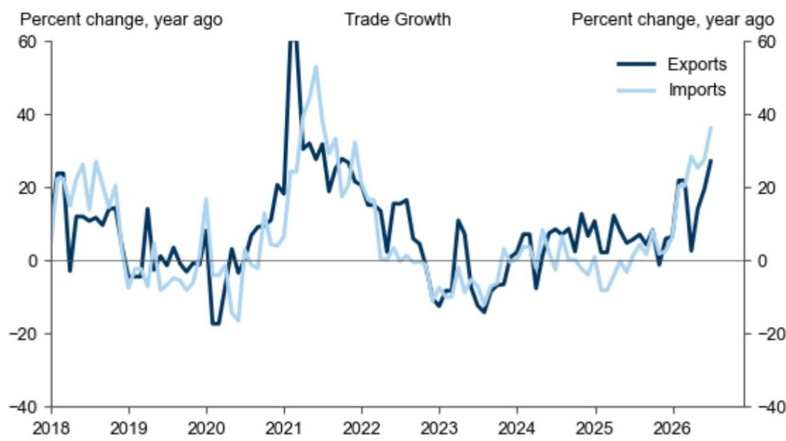

# 关于近期宏观环境的三点观察

近期宏观环境中有三个值得关注的要点：

**GDP数据表现：** 第二季度实际GDP同比增速从第一季度的5.0%放缓至4.3%，低于市场预期的4.5%。6月份数据显示经济分化态势延续：工业增加值同比增速升至5.3%，社会消费品零售总额同比增速为1.0%，年初至今固定资产投资同比增速为-5.7%。鉴于当前GDP增速低于全年目标区间4.5-5%的下限，预计政策层面可能在第三季度加快财政支出节奏。

  
数据来源：国家统计局

**贸易数据：** 6月份进出口数据再次超出预期，以美元计价的进口和出口同比分别增长36%和27%。人工智能相关资本开支在其中发挥了重要作用：半导体进口和出口同比分别增长72%和122%。不过，增长主要受价格因素推动，半导体进口和出口数量同比仅增长6.6%和-0.5%。6月份月度贸易顺差达到1256亿美元的历史新高。

  
数据来源：中国海关总署

**7月重要会议前瞻：** 预计高层将在月底前召开7月重要会议，为下半年宏观政策定调。在第二季度GDP数据低于预期后，预计政策层面将强化宽松表述，并加快已规划的需求侧措施落地，包括8000亿元人民币的新政策性金融工具。同时，在中美科技竞争背景下，预计政策层面将继续聚焦高科技发展。

## 近期相关研究

## 主题研究与市场交流要点：

- 亚洲聚焦：中国高科技愿景的新资金来源，2026年7月12日
- 中国：本地客户如何看待当前经济？市场交流要点，2026年6月，2026年6月30日

## 数据评论与跟踪：

- 亚太周报：中国7月重要会议、韩国GDP及相关会议，2026年7月17日
- 中国：外汇数据显示6月部分资金流入，2026年7月17日
- 中国经济活动与政策跟踪：7月17日，2026年7月17日
- 中国7月重要会议前瞻：宽松表述可能加强，需求侧刺激仍是关键，2026年7月16日
- 中国6月货币信贷数据低于预期；相关会议表态显示宽松仍有条件，2026年7月15日
- 中国70城平均新房价格降幅6月进一步收窄，一线城市环比上涨，2026年7月15日
- 中国第二季度实际GDP增速明显放缓，6月活动数据表现分化，2026年7月15日
- 中国6月贸易增速进一步加快，2026年7月14日
- 中国第15个扩大消费五年规划：供给侧推动，需求侧约束，2026年7月14日
- 中国CPI通胀从5月到6月有所回落，PPI通胀可能已见顶，2026年7月9日
- 中国相关机构在第二季度会议上重申稳健宽松立场；相关人士在香港推出支持离岸市场的一揽子措施，2026年7月9日

## 团队演示材料与网络研讨会回放：

- 宏观与策略 | 全球宏观、中国汇率与利率、市场观点（中文），2026年7月13日
- 中国：中国经济展望：2026年7月 [演示材料]，2026年7月3日

## 研究团队

Andrew Tilton  
+852-2978-1802  
andrew.tilton@gs.com

Hui Shan  
+852-2978-6634  
hui.shan@gs.com

Xinquan Chen  
+852-2978-2418  
xinquan.chen@gs.com

Lisheng Wang  
+852-3966-4004  
lisheng.wang@gs.com

Yuting Yang  
+852-2978-7283  
yuting.y.yang@gs.com

Chelsea Song  
+852-2978-0106  
chelsea.song@gs.com

## 附录

## 分析师声明

本人特此证明，本报告中表达的所有观点均准确反映本人个人观点，未受公司业务或客户关系的影响。

除非另有说明，本报告封面所列人员均为全球研究部门的分析师。

## 披露信息

## 监管披露

## 美国法律法规要求的披露

有关本报告中提及公司的具体监管披露信息，请参见上述公司特定披露部分。本报告讨论的发行人相关债务证券（或相关衍生品），可能由相关机构作为自营交易或进行交易。

以下为额外要求的披露内容：所有权和重大利益冲突：公司政策禁止分析师、向分析师汇报的专业人员及其家庭成员持有分析师覆盖范围内的任何公司证券。分析师薪酬：分析师的薪酬部分基于公司盈利能力，其中包括投行业务收入。分析师作为高管或董事：公司政策通常禁止分析师、向分析师汇报的人员或其家庭成员在分析师覆盖范围内的公司担任高管、董事或顾问。非美国分析师：非美国分析师可能不是相关机构的关联人员，因此可能不受相关规则对与目标公司沟通、公开露面及交易分析师覆盖证券的限制。

## 其他司法管辖区法律法规要求的额外披露

以下为相关司法管辖区要求的披露内容，除非已根据美国法律法规在上述部分作出披露。澳大利亚、巴西、加拿大、香港、印度、韩国、新西兰、俄罗斯、新加坡、台湾、英国、欧盟及日本等地区的具体披露信息可参见相关链接。

## 全球产品；分发实体

全球研究部门为全球客户制作和分发研究产品。分布在各地办公室的分析师对行业和公司以及宏观经济、货币、大宗商品和组合策略进行研究。本研究在澳大利亚由相关机构分发；在巴西由相关机构分发；在加拿大由相关机构分发；在香港由相关机构分发；在印度由相关机构分发；在日本由相关机构分发；在韩国由相关机构分发；在新西兰由相关机构分发；在俄罗斯由相关机构分发；在新加坡由相关机构分发；在美国由相关机构分发。相关机构已批准本研究在英国的分发。

## 一般披露

本研究仅供我们的客户使用。除与相关机构相关的披露外，本研究基于我们认为可靠的当前公开信息，但我们不保证其准确或完整，也不应依赖于此。本文所含信息、意见、估计和预测截至当前日期，如有变更恕不另行通知。我们力求适时更新研究，但各种法规可能阻止我们这样做。

相关机构开展全球全方位、综合性的投行、投资管理和经纪业务。我们与全球研究覆盖的相当比例公司存在投行及其他业务关系。

我们的销售人员、交易员和其他专业人员可能向客户和自营交易部门提供口头或书面市场评论或交易策略，这些评论或策略可能反映与本研究报告中所表达观点相反的意见。我们的资产管理领域、自营交易部门和投资业务可能做出与本研究中建议或观点不一致的投资决策。

除非法规或公司政策禁止，我们及我们的关联公司、高管、董事和员工可能不时持有本研究中提及的证券或衍生品的多头或空头头寸，作为自营交易，或买卖这些证券或衍生品。

本研究中归因于第三方演讲者的观点，包括来自其他部门的个人，不一定反映全球研究部门的观点，也不是相关机构的官方观点。

本研究聚焦于跨市场、行业和板块的投资主题。它不试图区分我们描述的任何行业或板块内个别公司的前景或表现，也不提供对个别公司的分析。

本研究中的任何交易建议均反映所讨论的投资主题，并非对任何此类证券的单独推荐。

本研究不构成在任何司法管辖区出售或购买任何证券的要约或要约邀请。它不构成个人推荐，也未考虑个别客户的具体投资目标、财务状况或需求。客户应考虑本研究中的任何建议或推荐是否适合其特定情况，并在适当时寻求专业建议，包括税务建议。本研究中提及的投资的价格和价值以及从中获得的收入可能波动。过往表现并非未来表现的指引，未来回报不保证，可能发生原始资本损失。汇率波动可能对某些投资的价值或价格或从中获得的收入产生不利影响。

某些交易，包括涉及期货、期权和其他衍生品的交易，会带来重大风险，不适合所有读者。读者应查阅当前期权和期货披露文件。

全球研究提供的服务水平和类型可能因各种因素而有所不同，包括您个人的沟通频率和方式偏好、风险偏好和投资视角、您与相关机构整体客户关系的规模和范围，以及法律和监管限制。

所有研究报告通过电子方式同时向所有有权接收此类报告的客户发布。并非所有研究内容都会重新分发给我们的客户或提供给第三方聚合商，相关机构也不对第三方聚合商重新分发我们的研究负责。

披露信息也可从相关合规部门获取。

## © 2026 相关机构

您仅可为自己使用而存储、显示、分析、修改、重新格式化及打印通过本服务获得的信息。未经相关机构明确书面同意，您不得转售或逆向工程此信息以计算或开发任何指数用于披露和/或营销，或创建任何其他衍生作品或商业产品、数据或服务。未经相关机构明确书面同意，您不得以任何格式向任何第三方发布、传输或以其他方式复制此信息的全部或部分。上述限制包括但不限于使用、提取、下载或检索此信息的全部或部分来训练或微调机器学习或人工智能系统，或向任何此类系统提供或复制此信息的全部或部分作为提示或输入。
