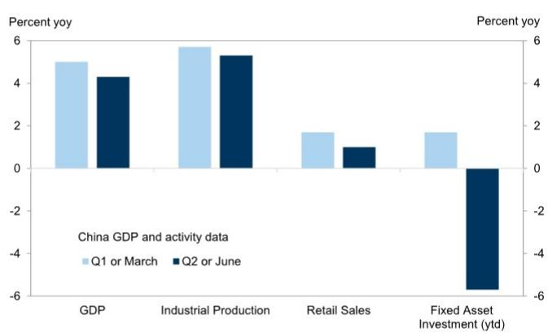

# GS：中国二季度GDP增速出现节奏变化

中国二季度实际GDP同比增速从一季度的5.0%变化至4.3%，低于市场预期的4.5%。这一数据落在全年4.5%-5%目标区间的下沿之下。GS在最新发布的宏观快评中表示，这意味着三季度财政支出需要加速，以维持增长动能。报告同时关注到两个信号：贸易数据因AI资本开支而大幅上升，但量价拆分后显示“含金量”有限；以及即将召开的7月政治局会议，可能成为政策基调调整的关键节点。

## 1. 增长节奏变化的结构性特征比数字本身更值得关注

二季度GDP增速节奏变化并非意外，但变化的幅度和内部结构的分化超出了市场预期。6月单月的数据进一步印证了这种分化：工业增加值同比增速回升至5.3%，而零售销售同比仅增长1.0%，固定资产研究（年初至今）同比降幅扩大至-5.7%。生产端与需求端的裂口在扩大。

报告没有直接给出结论，但数据本身指向一个清晰的逻辑：供给侧的韧性更多来自出口和部分高技术制造业的拉动，而内需——尤其是居民消费和民间研究——仍然缺乏自发修复的动力。这种“生产强、消费弱”的组合，意味着单纯靠货币宽松难以扭转局面，财政端的直接需求刺激变得更为紧迫。

> **KC评论：** GS对GDP数据的解读，关键不在于4.3%这个数字本身，而在于它低于政府目标下限这一事实。这为政策制定者提供了一个明确的“触发条件”——三季度财政加速不再是可选项，而是维持全年目标所必需的选项。

## 2. 贸易顺差创纪录，但AI资本开支的“量价真相”需要拆解

6月中国进出口数据再次超预期：以美元计，出口同比增长27%，进口同比增长36%。月度贸易顺差达到创纪录的1256亿美元。报告特别指出，AI资本开支热潮在其中扮演了重要角色——半导体进口和出口分别同比增长72%和122%。

但GS做了一个关键的拆分：半导体进口和出口的数量增速分别仅为6.6%和-0.5%。这意味着，绝大部分增长来自价格上涨，而非实际出货量的扩张。这一拆解揭示了一个容易被市场忽略的事实：当前贸易数据的强劲，更多反映的是全球AI产业链的“价格重估”和库存行为，而非中国半导体出口能力的实质性跃升。对于观察中国出口竞争力的读者而言，量价拆分比总量数字更有参考价值。

## 3. 7月政治局会议：政策基调可能转向“更强宽松”，但战略定力不变

报告预计，7月政治局会议将在月底前召开，为下半年宏观政策定调。在二季度GDP数据弱于预期的背景下，GS认为决策层将“加强宽松措辞”，并加速落实已规划的需求侧措施，包括8000亿元人民币的政策性资金工具。报告估算，这一工具单独可拉动GDP约0.5个百分点。

但报告同时提醒，在中美AI竞争的背景下，决策层仍将保持对高科技发展的“战略定力”。这意味着，政策宽松的加码是有边界的：需求侧刺激会加速，但不会以牺牲长期产业升级目标为代价。对于市场参与者而言，理解这一“宽松但有限度”的政策框架，比押注全面刺激更为重要。

> **KC评论：** GS对政治局会议的预判，核心不是“会不会放松”，而是“放松的节奏和边界在哪里”。8000亿工具是已知的，但加速执行意味着三季度财政支出的节奏会明显快于上半年。同时，战略定力四个字提醒市场：不要期待地产或基建的全面刺激回归。

## 4. 一个可复用的观察框架：从“量价拆分”看出口数据的真实含金量

GS对半导体贸易数据的处理方式，提供了一个可复用的分析框架：当出口或进口数据出现大幅上升时，先问“量价拆分”的结果是什么。如果价格贡献远大于数量贡献，那么数据的可持续性和对宏观环境的实际拉动效果都需要重新评估。这一框架同样适用于观察其他受全球价格波动影响较大的行业，如能源、化工和部分大宗商品。对于产业决策者而言，关注“量”的变动比关注“价”的波动更能反映真实需求变化。

For informational purposes only. Portions may be generated,translated,summarized,or edited with AI assistance based on source materials and may contain omissions or errors. Please verify independently. This is not investment,legal,tax,accounting,or other professional advice.

