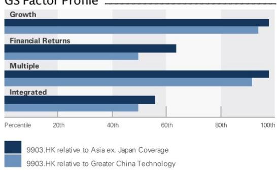
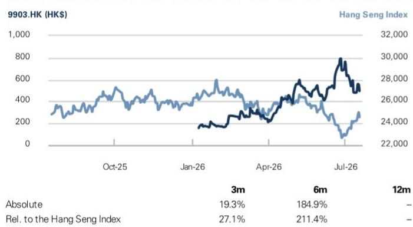
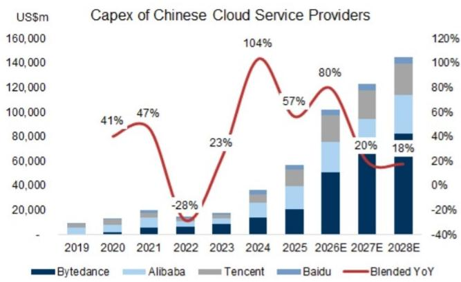
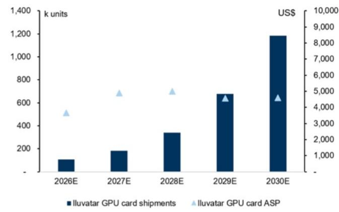
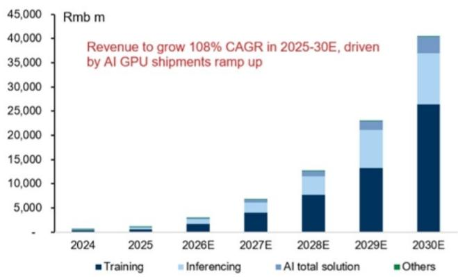
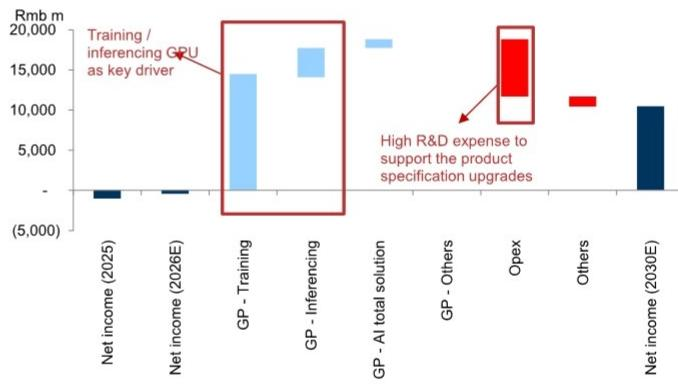
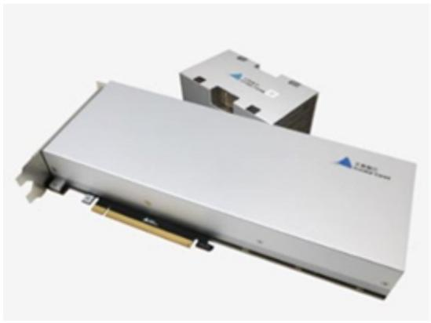
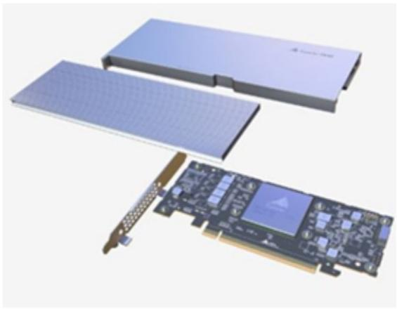

# Iluvatar (9903.HK)

# China AI Capex Upcycle to Drive Growth Ahead; Initiate Coverage

9903.HK 12m Price Target: HK\$1,000.00 Price: HK\$495.20

Iluvatar is a leading General-Purpose Graphics Processing Units (GPGPU) fabless chip company in China, serving more than 300 clients across various industries. We expect net income to grow at a +119% CAGR in 2027E-29E driven by three key factors: (1) China AI capex upcycle: as we highlighted in our June report (Global Server TAM), we raised our China CSP AI capex forecasts by 37%/44%/55% for 2026E/2027E/2028E, respectively, reflecting strong AI investment momentum in China. We expect the growing adoption of AI applications in China to drive further AI infrastructure investment; (2) Expansion of the local ecosystem across GPUs, servers, networking, foundation models, AI application, etc., which is encouraging local customers to reduce reliance on a single supplier and creating opportunities for the domestic supply chain; and (3) Product mix upgrade: continuous upgrades in AI chip specifications across training and inferencing workloads to cover a broader range of AI scenarios and computing requirements. We initiate coverage on Iluvatar with a 12-month target price of HK\$1,000.

Key debates: We expect market concerns to likely center on fierce competition across local AI chip suppliers; however, we argue that the China market is in a strong growth phase, evidenced by rising AI capex from China CSPs, increasing token consumption and growing adoption of China AI models, along with local customers diversifying toward domestic suppliers. In 2025, global-tier AI chip suppliers still held more than a $50\%$ market share in China, per IDC (link), implying significant upside for local AI chip suppliers to grow their businesses. Iluvatar's comprehensive customer coverage and leading position among local suppliers (ranking in the top 7 across local suppliers by shipments in 2025, per IDC) reflect its solid product quality and strong execution. The company's AI chips feature: (1) performance that meets complex computing demands while minimizing efficiency losses, (2) high compatibility, making it easier for customers to integrate them within their existing environments, and (3) strong

## Verena Jeng
+852-2978-1681 | verena.jeng@gs.com
GS (Asia) L.L.C.

Allen Chang
+852-2978-2930 | allen.k.chang@gs.com
GS (Asia) L.L.C.

Yifan Hu
+852-2978-0996 | yifan.hu@gs.com
GS (Asia) L.L.C.

## Key Data

Market cap: HK\$128.7bn / \$16.4bn
Enterprise value: HK\$119.1bn / \$15.2bn
3m ADTV: HK\$979.2mn / \$124.9mn
China
Greater China Technology
M&A Rank: 3
Leases incl. in net debt & EV?: Yes

GS Forecast

<table><tr><td colspan="5">GS Forecast</td></tr><tr><td></td><td>12/25</td><td>12/26E</td><td>12/27E</td><td>12/28E</td></tr><tr><td>Revenue (Rmb mn)</td><td>1,033.6</td><td>2,970.0</td><td>6,683.0</td><td>12,579.2</td></tr><tr><td>EBITDA (Rmb mn)</td><td>(894.0)</td><td>(292.5)</td><td>1,110.7</td><td>2,888.8</td></tr><tr><td>EPS (Rmb)</td><td>(5.31)</td><td>(1.67)</td><td>4.37</td><td>10.68</td></tr><tr><td>P/E (X)</td><td>NM</td><td>NM</td><td>97.9</td><td>40.1</td></tr><tr><td>P/B (X)</td><td>NM</td><td>9.3</td><td>8.9</td><td>7.3</td></tr><tr><td>Dividend yield (%)</td><td>NM</td><td>0.0</td><td>0.0</td><td>0.0</td></tr><tr><td>N debt/EBITDA (ex lease,X)</td><td>-</td><td>-</td><td>(7.8)</td><td>(3.1)</td></tr><tr><td>CROCI (%)</td><td>(38.8)</td><td>(9.3)</td><td>25.1</td><td>45.0</td></tr><tr><td>FCF yield (%)</td><td>-</td><td>(1.5)</td><td>0.3</td><td>0.3</td></tr><tr><td></td><td>12/25</td><td>6/26E</td><td>12/26E</td><td>6/27E</td></tr><tr><td>EPS (Rmb)</td><td>(1.84)</td><td>(1.69)</td><td>0.02</td><td>0.37</td></tr></table>

GS Factor Profile

  
Source: Company data, GS estimates. See disclosures for details.

Iluvatar (9903.HK) Rating since Jul 19, 2026

Ratios & Valuation

<table><tr><td></td><td>12/25</td><td>12/26E</td><td>12/27E</td><td>12/28E</td></tr><tr><td>P/E (X)</td><td>NM</td><td>NM</td><td>97.9</td><td>40.1</td></tr><tr><td>P/B (X)</td><td>NM</td><td>9.3</td><td>8.9</td><td>7.3</td></tr><tr><td>FCF yield (%)</td><td>-</td><td>(1.5)</td><td>0.3</td><td>0.3</td></tr><tr><td>EV/EBITDAR (X)</td><td>-</td><td>NM</td><td>92.4</td><td>35.4</td></tr><tr><td>EV/EBITDA (excl. leases) (X)</td><td>-</td><td>NM</td><td>92.4</td><td>35.4</td></tr><tr><td>CROCI (%)</td><td>(38.8)</td><td>(9.3)</td><td>25.1</td><td>45.0</td></tr><tr><td>ROE (%)</td><td>(66.0)</td><td>(6.0)</td><td>9.5</td><td>20.0</td></tr><tr><td>Net debt/equity (%)</td><td>(19.3)</td><td>(73.2)</td><td>(69.3)</td><td>(58.7)</td></tr><tr><td>Net debt/equity (excl. leases) (%)</td><td>(19.3)</td><td>(73.2)</td><td>(69.3)</td><td>(58.7)</td></tr><tr><td>Interest cover (X)</td><td>(51.0)</td><td>(14.4)</td><td>31.4</td><td>87.8</td></tr><tr><td>Days inventory outst, sales</td><td>185.8</td><td>188.8</td><td>164.2</td><td>156.1</td></tr><tr><td>Receivable days</td><td>168.4</td><td>100.0</td><td>70.0</td><td>60.0</td></tr><tr><td>Days payable outstanding</td><td>201.2</td><td>200.0</td><td>200.0</td><td>200.0</td></tr><tr><td>DuPont ROE (%)</td><td>(42.7)</td><td>(3.6)</td><td>9.1</td><td>18.2</td></tr><tr><td>Turnover (X)</td><td>0.3</td><td>0.2</td><td>0.4</td><td>0.6</td></tr><tr><td>Leverage (X)</td><td>1.7</td><td>1.2</td><td>1.3</td><td>1.4</td></tr><tr><td>Gross cash invested (ex cash) (Rmb)</td><td>2,486.4</td><td>3,784.7</td><td>4,696.2</td><td>7,283.4</td></tr><tr><td>Average capital employed (Rmb)</td><td>1,456.4</td><td>2,466.9</td><td>3,430.6</td><td>5,057.4</td></tr><tr><td>BVPS (Rmb)</td><td>12.46</td><td>46.27</td><td>47.96</td><td>58.64</td></tr></table>

Income Statement (Rmb mn)

<table><tr><td colspan="5">Income Statement (Rmb mn)</td></tr><tr><td></td><td>12/25</td><td>12/26E</td><td>12/27E</td><td>12/28E</td></tr><tr><td>Total revenue</td><td>1,033.6</td><td>2,970.0</td><td>6,683.0</td><td>12,579.2</td></tr><tr><td>Cost of goods sold</td><td>(475.6)</td><td>(1,391.4)</td><td>(3,135.8)</td><td>(5,949.0)</td></tr><tr><td>SG&amp;A</td><td>(633.4)</td><td>(735.4)</td><td>(808.9)</td><td>(889.8)</td></tr><tr><td>R&amp;D</td><td>(974.2)</td><td>(1,296.1)</td><td>(1,749.7)</td><td>(2,974.5)</td></tr><tr><td>Other operating inc./(exp.)</td><td>-</td><td>-</td><td>-</td><td>-</td></tr><tr><td>EBITDA</td><td>(894.0)</td><td>(292.5)</td><td>1,110.7</td><td>2,888.8</td></tr><tr><td>Depreciation &amp; amortization</td><td>(155.6)</td><td>(160.4)</td><td>(122.1)</td><td>(123.0)</td></tr><tr><td>EBIT</td><td>(1,049.5)</td><td>(452.9)</td><td>988.6</td><td>2,765.9</td></tr><tr><td>Net interest inc./(exp.)</td><td>2.2</td><td>43.7</td><td>202.1</td><td>220.5</td></tr><tr><td>Income/(loss) from associates</td><td>-</td><td>-</td><td>-</td><td>-</td></tr><tr><td>Pre-tax profit</td><td>(1,003.7)</td><td>(409.2)</td><td>1,190.7</td><td>2,986.3</td></tr><tr><td>Provision for taxes</td><td>0.0</td><td>0.0</td><td>(54.7)</td><td>(209.0)</td></tr><tr><td>Minority interest</td><td>-</td><td>-</td><td>-</td><td>-</td></tr><tr><td>Preferred dividends</td><td>-</td><td>-</td><td>-</td><td>-</td></tr><tr><td>Net inc. (pre-exceptionals)</td><td>(1,003.7)</td><td>(409.2)</td><td>1,136.1</td><td>2,777.3</td></tr><tr><td>Post-tax exceptionals</td><td>-</td><td>-</td><td>-</td><td>-</td></tr><tr><td>Net inc. (post-exceptionals)</td><td>(1,003.7)</td><td>(409.2)</td><td>1,136.1</td><td>2,777.3</td></tr><tr><td>EPS (basic, pre-except) (Rmb)</td><td>(5.31)</td><td>(1.67)</td><td>4.37</td><td>10.68</td></tr><tr><td>EPS (diluted, pre-except) (Rmb)</td><td>(5.31)</td><td>(1.67)</td><td>4.37</td><td>10.68</td></tr><tr><td>EPS (basic, post-except) (Rmb)</td><td>(5.31)</td><td>(1.67)</td><td>4.37</td><td>10.68</td></tr><tr><td>EPS (diluted, post-except) (Rmb)</td><td>(5.31)</td><td>(1.67)</td><td>4.37</td><td>10.68</td></tr><tr><td>DPS (Rmb)</td><td>-</td><td>-</td><td>-</td><td>-</td></tr><tr><td>Div. payout ratio (%)</td><td>0.0</td><td>0.0</td><td>0.0</td><td>0.0</td></tr></table>

Growth & Margins (%)

<table><tr><td colspan="5">Growth &amp; Margins (%)</td></tr><tr><td></td><td>12/25</td><td>12/26E</td><td>12/27E</td><td>12/28E</td></tr><tr><td>Total revenue growth</td><td>91.6</td><td>187.3</td><td>125.0</td><td>88.2</td></tr><tr><td>EBITDA growth</td><td>(19.6)</td><td>67.3</td><td>479.7</td><td>160.1</td></tr><tr><td>EPS growth</td><td>2.5</td><td>68.6</td><td>361.6</td><td>144.5</td></tr><tr><td>DPS growth</td><td>NM</td><td>NM</td><td>NM</td><td>NM</td></tr><tr><td>EBIT margin</td><td>(101.5)</td><td>(15.2)</td><td>14.8</td><td>22.0</td></tr><tr><td>EBITDA margin</td><td>(86.5)</td><td>(9.8)</td><td>16.6</td><td>23.0</td></tr><tr><td>Net income margin</td><td>(97.1)</td><td>(13.8)</td><td>17.0</td><td>22.1</td></tr></table>

Price Performance  
  
Source: FactSet. Price as of 17 Jul 2026 close.

Balance Sheet (Rmb mn)

<table><tr><td></td><td>12/25</td><td>12/26E</td><td>12/27E</td><td>12/28E</td></tr><tr><td>Cash &amp; cash equivalents</td><td>1,504.7</td><td>9,344.6</td><td>9,691.2</td><td>10,004.4</td></tr><tr><td>Accounts receivable</td><td>576.6</td><td>1,050.8</td><td>1,512.5</td><td>2,623.1</td></tr><tr><td>Inventory</td><td>709.8</td><td>2,362.8</td><td>3,651.0</td><td>7,106.1</td></tr><tr><td>Other current assets</td><td>641.0</td><td>641.0</td><td>641.0</td><td>641.0</td></tr><tr><td>Total current assets</td><td>3,432.0</td><td>13,399.2</td><td>15,495.8</td><td>20,374.5</td></tr><tr><td>Net PP&amp;E</td><td>187.7</td><td>207.2</td><td>254.9</td><td>291.5</td></tr><tr><td>Net intangibles</td><td>189.9</td><td>124.0</td><td>84.4</td><td>60.6</td></tr><tr><td>Total investments</td><td>0.0</td><td>0.0</td><td>0.0</td><td>0.0</td></tr><tr><td>Other long-term assets</td><td>102.4</td><td>102.4</td><td>102.4</td><td>102.4</td></tr><tr><td>Total assets</td><td>3,912.0</td><td>13,832.7</td><td>15,937.5</td><td>20,829.0</td></tr><tr><td>Accounts payable</td><td>291.0</td><td>1,233.9</td><td>2,202.6</td><td>4,316.9</td></tr><tr><td>Short-term debt</td><td>684.2</td><td>684.2</td><td>684.2</td><td>684.2</td></tr><tr><td>Short-term lease liabilities</td><td>-</td><td>-</td><td>-</td><td>-</td></tr><tr><td>Other current liabilities</td><td>137.3</td><td>137.3</td><td>137.3</td><td>137.3</td></tr><tr><td>Total current liabilities</td><td>1,112.4</td><td>2,055.3</td><td>3,024.0</td><td>5,138.3</td></tr><tr><td>Long-term debt</td><td>365.4</td><td>365.4</td><td>365.4</td><td>365.4</td></tr><tr><td>Long-term lease liabilities</td><td>-</td><td>-</td><td>-</td><td>-</td></tr><tr><td>Other long-term liabilities</td><td>81.1</td><td>81.1</td><td>81.1</td><td>81.1</td></tr><tr><td>Total long-term liabilities</td><td>446.5</td><td>446.5</td><td>446.5</td><td>446.5</td></tr><tr><td>Total liabilities</td><td>1,558.9</td><td>2,501.8</td><td>3,470.5</td><td>5,584.8</td></tr><tr><td>Preferred shares</td><td>-</td><td>-</td><td>-</td><td>-</td></tr><tr><td>Total common equity</td><td>2,353.1</td><td>11,330.9</td><td>12,466.9</td><td>15,244.2</td></tr><tr><td>Minority interest</td><td>--</td><td>--</td><td>--</td><td>--</td></tr><tr><td>Total liabilities &amp; equity</td><td>3,912.0</td><td>13,832.7</td><td>15,937.5</td><td>20,829.0</td></tr><tr><td>Net debt, adjusted</td><td>(455.1)</td><td>(8,295.0)</td><td>(8,641.6)</td><td>(8,954.8)</td></tr></table>

<table><tr><td colspan="5">Cash Flow (Rmb mn)</td></tr><tr><td></td><td>12/25</td><td>12/26E</td><td>12/27E</td><td>12/28E</td></tr><tr><td>Net income</td><td>(1,003.7)</td><td>(409.2)</td><td>1,136.1</td><td>2,777.3</td></tr><tr><td>D&amp;A add-back</td><td>155.6</td><td>160.4</td><td>122.1</td><td>123.0</td></tr><tr><td>Minority interest add-back</td><td>-</td><td>-</td><td>-</td><td>-</td></tr><tr><td>Net (inc)/dec working capital</td><td>(410.7)</td><td>(1,184.4)</td><td>(781.2)</td><td>(2,451.4)</td></tr><tr><td>Other operating cash flow</td><td>97.2</td><td>-</td><td>-</td><td>-</td></tr><tr><td>Cash flow from operations</td><td>(1,161.6)</td><td>(1,433.1)</td><td>476.9</td><td>448.9</td></tr><tr><td>Capital expenditures</td><td>(102.5)</td><td>(104.0)</td><td>(120.3)</td><td>(125.8)</td></tr><tr><td>Acquisitions</td><td>-</td><td>-</td><td>-</td><td>-</td></tr><tr><td>Divestitures</td><td>-</td><td>-</td><td>-</td><td>-</td></tr><tr><td>Others</td><td>(29.7)</td><td>(10.0)</td><td>(10.0)</td><td>(10.0)</td></tr><tr><td>Cash flow from investing</td><td>(132.3)</td><td>(114.0)</td><td>(130.3)</td><td>(135.8)</td></tr><tr><td>Repayment of lease liabilities</td><td>-</td><td>-</td><td>-</td><td>-</td></tr><tr><td>Dividends paid (common &amp; pref)</td><td>-</td><td>-</td><td>-</td><td>-</td></tr><tr><td>Inc/(dec) in debt</td><td>409.9</td><td>-</td><td>-</td><td>-</td></tr><tr><td>Other financing cash flows</td><td>2,075.0</td><td>9,387.0</td><td>0.0</td><td>0.0</td></tr><tr><td>Cash flow from financing</td><td>2,485.0</td><td>9,387.0</td><td>0.0</td><td>0.0</td></tr><tr><td>Total cash flow</td><td>1,191.1</td><td>7,839.9</td><td>346.6</td><td>313.1</td></tr><tr><td>Free cash flow</td><td>(1,264.1)</td><td>(1,537.1)</td><td>356.6</td><td>323.1</td></tr></table>

Source: Company data, GS estimates.

adaptability as the architecture is built on a widely compatible instruction set and modular software stack. We expect its AI chip shipments to grow at a 92% CAGR in 2025-30E and surpass 1mn units by 2030E.

Valuation: Our target price is based on a discounted 2030E EV / EBITDA, with our target multiple derived from peers' trading EV / EBITDA relative to their forward-year EBITDA growth. Our TP implies 21x 2030E P/E, or 0.3x P/E to forward-year NI YoY growth (41% in 2031E) and OPM (30% in 2031E). Key downside risks: fiercer-than-expected market competition, geopolitical tensions that constrain the company's ability to use global-tier foundries, and slower-than-expected AI infrastructure spending in China.

## Iluvatar in six charts

Exhibit 1: China CSP capex trend  
  
Data include Bytedance, Tencent, Alibaba, Baidu. We calculate Bytedance (private) relevant operating metrics by analyzing the industry and companies that our China Internet team cover, and then extrapolating them to Bytedance.

Exhibit 2: Iluvatar's GPU card shipments to ramp in 2025-30E at $+92\%$ CAGR Iluvatar's GPU card shipment and ASP trends  
  
Source: Company data, GS Global Investment Research  
Source: Company data, GS Global Investment Research

Exhibit 3: Iluvatar's revenue by products  
  
Source: Company data, GS Global Investment Research

Exhibit 4: AI GPU board as key driver
Waterfall chart 2025-30E  
  
Source: Company data, GS Global Investment Research

Exhibit 5: Iluvatar CoreX TG Series products  
  
Source: Company data

Exhibit 6: Iluvatar CoreX KY Series products  
  
Source: Company data

## Financial highlights

Revenues: We forecast revenues to grow at a +108% CAGR over 2025-30E driven by the ramp-up in GPU board shipments underpinned by: (1) product migration toward AI GPUs with stronger computing performance, such as TG Gen 5 (expected to be launched in 2027E), to meet rising computing power demand in the China market; (2) continued client base expansion, from 22 clients in 2022 to 340 clients by end of 2025, covering internet, AI LLM, research, finance, education, and other verticals; (3) the uptrend in cloud capex by China's major CSPs, along with the AI chip localization trend, driving shipment growth for local AI chip suppliers; (4) Iluvatar's total AI computing solutions, including GPGPU servers and clusters, which integrates the AI chipset, software stack, storage, and networking infrastructure to support clients' large-scale model deployments; and (5) expansion into local CSP clients that typically have large computing board procurement volumes. We expect the company's GPU board shipments to grow at +92% CAGR in 2025-30E, reaching over 1mn units in 2030E from 45k units in 2025, leading to Iluvatar's strong revenue growth.

TG Series: Iluvatar's flagship AI training chip, the TG series, is designed with performance-optimized compute cores, memory components, and optimized architecture to deliver high-efficiency large-scale model training. The TG series has been adopted by research institutions, cloud computing centers, foundational model developers, research laboratories, and enterprise clients, leveraging its comprehensive framework compatibility to meet the rapid growth in AI computing demand.

ZK Series: The ZK Series focuses on cloud and edge inferencing demand, supports comprehensive connectivity through the cost-effective PCIe standard delivering low latency, high throughput, and strong power efficiency for LLM inferencing workloads. The ZK series has been deployed across diversified AI computing applications, including enterprise AI, production-scale serving of LLMs, video-processing and analysis, and medical imaging analysis, among others, reflecting the strength in Iluvatar's designs and large-scale delivery capability in AI inferencing products.

Software stack: In addition to hardware solutions, Iluvatar also provides a software stack with comprehensive compatibilities and an optimization approach that supports x86 and ARM architectures. The software stack enables lower cost migration from mainstream ecosystems to clients, while maintaining strong model performance and computing power utilization. It also enhances GPGPU performance, expands application scenarios, and bolsters Iluvatar's client base expansion in the local market.

Exhibit 7: Iluvatar's product pipeline

<table><tr><td>Product</td><td>Expected launch time</td><td>Remarks</td></tr><tr><td>TG Gen 3</td><td>3Q24</td><td>1. Improvement in large-scale cluster efficiency and connectivity2. Supports advanced precision requirements for large AI model computing3. Adopts the latest international standard interfaces including PCIe Gen5</td></tr><tr><td>ZK Gen 2</td><td>4Q25</td><td>1. Inferencing and general purpose computing chip2. Supports high parameter count models with large on-board memory3. Low power double data rate memory solution</td></tr><tr><td>ZK Gen 3</td><td>1Q26</td><td>1. Optimized for AI inferencing2. Improved performance over previous generation product3. High performance-to-cost ratio for large model inference and training applications</td></tr><tr><td>TG Gen 4</td><td>2Q26</td><td>1. Optimized for AI training2. Improvements in computing power, bandwidth, and storage over previous generation3. Enhanced architecture to support cloud-scale AI training and inferencing workloads</td></tr><tr><td>TG Gen 5</td><td>1Q27</td><td>1. Flagship AI training GPGPU2. Enhanced computing performance from previous generation products3. Flexible packaging configurations to bring compatibility with wider deployment scenarios</td></tr></table>

Expected launch time from company prospectus.  
Source: Company data

GM: We model a slight downward trend in GM over 2025-30E, mainly reflecting a higher contribution from AI inferencing chips, while still expecting the GM to maintain at a high level above $51\%$ in 2030E. Opex ratio: We expect the opex ratio to improve from $156\%$ in 2025 to $23\%$ in 2030E, supported by both the higher revenue scale and improving operational efficiency as AI computing board shipments ramp up. We model the R&D expense to grow at a $53\%$ CAGR in 2025-30E to support the development of new GPU products with stronger performance. Net income: We expect NI to turn positive in 2027E and reach Rmb10bn in 2030E, underpinned by the ramp-up in shipments up of AI computing boards.

Exhibit 8: Iluvatar P&L summary

<table><tr><td>Rmb m</td><td>1H25</td><td>2H25</td><td>1H26E</td><td>2H26E</td><td>2023</td><td>2024</td><td>2025</td><td>2026E</td><td>2027E</td><td>2028E</td><td>2029E</td><td>2030E</td></tr><tr><td colspan="5">Income statement</td><td colspan="8"></td></tr><tr><td>Revenues</td><td>324</td><td>709</td><td>916</td><td>2,054</td><td>289</td><td>540</td><td>1,034</td><td>2,970</td><td>6,683</td><td>12,579</td><td>22,946</td><td>40,462</td></tr><tr><td>GP</td><td>162</td><td>396</td><td>486</td><td>1,092</td><td>143</td><td>265</td><td>558</td><td>1,579</td><td>3,547</td><td>6,630</td><td>11,797</td><td>20,830</td></tr><tr><td>OP</td><td>(631)</td><td>(418)</td><td>(437)</td><td>(16)</td><td>(803)</td><td>(887)</td><td>(1,050)</td><td>(453)</td><td>989</td><td>2,766</td><td>5,761</td><td>11,662</td></tr><tr><td>Net income</td><td>(609)</td><td>(394)</td><td>(415)</td><td>6</td><td>(791)</td><td>(892)</td><td>(1,004)</td><td>(409)</td><td>1,136</td><td>2,777</td><td>5,433</td><td>10,475</td></tr><tr><td>EPS (Rmb)</td><td>(3.48)</td><td>(1.84)</td><td>(1.69)</td><td>0.02</td><td>(5.43)</td><td>(5.45)</td><td>(5.31)</td><td>(1.67)</td><td>4.37</td><td>10.68</td><td>20.90</td><td>40.29</td></tr><tr><td colspan="5">Margins</td><td colspan="8"></td></tr><tr><
