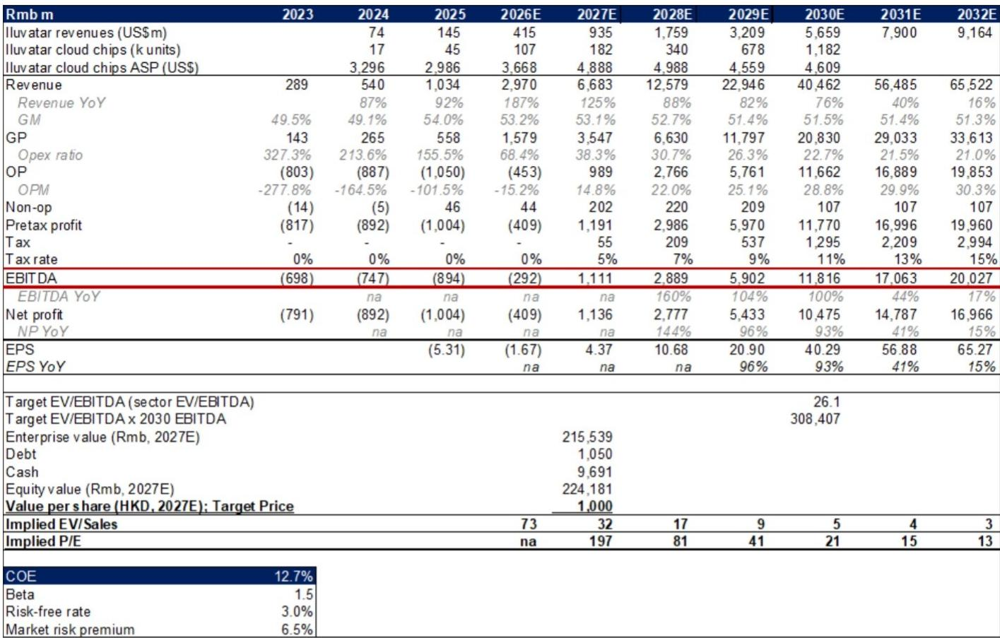
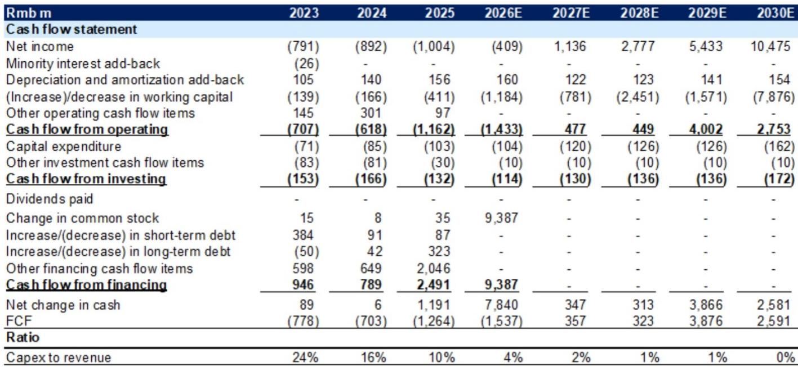
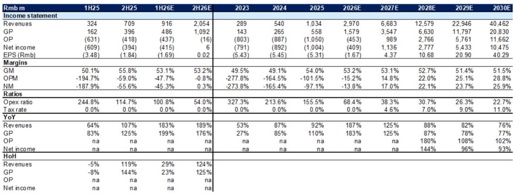

# GS：中国AI基础设施研究投入上修37%-55%驱动本土芯片增长

GS在最新一份覆盖报告中提出一个核心判断：中国AI基础设施研究正处于加速上行阶段，而本土芯片供应商的份额提升才刚刚开始。报告以一家本土GPU芯片设计公司为样本，展示了这一逻辑如何落地——其收入预计在2025-2030年间以108%的年复合增速增长，芯片出货量将从2025年的4.5万片攀升至2030年的超过100万片。

这一判断的支撑来自三个可观测的变量：中国主要云服务商的AI基础设施研究投入被GS大幅上修，2026至2028年的预测分别上调37%、44%和55%；本土生态系统正在从芯片、服务器、网络到基础模型和应用全面扩展；以及产品组合持续向更高性能的训练和推理芯片迁移。

## 1. 中国云厂商AI基础设施研究投入上修，是本土芯片需求最直接的领先指标

GS在6月发布的全球服务器TAM报告中，已经将中国主要云服务商的AI基础设施研究投入预测大幅上调。这份报告进一步确认，字节跳动、腾讯、阿里巴巴、百度四家的投入趋势是驱动本土AI芯片出货量的核心变量。

报告认为，中国AI应用的渗透正在加速，这将反过来推动更多基础设施研究。2025年，全球领先的AI芯片供应商在中国仍占据超过50%的市场份额，这意味着本土供应商存在显著的替代空间。对于一家2025年在本土供应商中出货量排名前七的公司而言，这一市场结构本身就是增长空间。

> **KC评论：** 50%以上的市场份额由非本土供应商占据，这个数字比很多人想象的要高。它说明本土替代不是已经完成，而是刚刚开始。GS上修基础设施研究投入预测的动作，本质上是认为中国云厂商的研究意愿和节奏比市场此前预期的更强。

## 2. 产品迁移和客户扩展，是这家公司从“能出货”到“能放量”的关键

报告详细拆解了这家公司的产品路线。其旗舰训练芯片TG系列面向大规模模型训练场景，已经进入研究机构、云计算中心和基础模型开发商；ZK系列则聚焦云端和边缘推理，覆盖企业AI、大模型生产级部署、视频分析等场景。

更重要的是，其软件栈兼容x86和ARM架构，客户从主流生态迁移的成本较低。这一点在竞争激烈的本土市场中，可能是比硬件参数更关键的差异化因素。客户数量从2022年的22家增长到2025年底的340家，覆盖互联网、AI大模型、科研、资金、教育等多个垂直领域，说明产品已经跨过了早期验证阶段。

报告预计其GPU板卡出货量在2025-2030年间以92%的年复合增速增长，到2030年超过100万片。这一增速假设的核心前提是：产品持续迭代（如预计2027年推出的TG Gen 5）、客户基础继续扩大，以及本土云服务商的大规模采购。

## 3. 竞争格局不是不确定性，而是验证市场处于早期高增长阶段的证据

市场对本土AI芯片供应商最普遍的担忧是竞争激烈。但报告提出了一个不同的视角：中国AI芯片市场本身处于强劲增长阶段，竞争激烈恰恰说明市场空间足够大，而非零和博弈。

从财务数据看，这家公司目前仍处于亏损状态，2025年净亏损约10亿元人民币。但GS预计其将在2027年实现盈利，净利润达到11.4亿元，2028年进一步增长至27.8亿元。毛利率从2025年的54%逐步提升至2028年的约53%，基本稳定。真正驱动利润改善的，是收入规模从2025年的10.3亿元跃升至2028年的125.8亿元——规模效应在芯片设计这类高固定成本、低边际成本的商业模式中，是利润释放的核心杠杆。

> **KC评论：** 2027年实现盈利这个时间点，与TG Gen 5芯片的预计推出时间重合。这意味着GS对盈利拐点的判断，很大程度上建立在下一代产品能否如期交付并放量上。这是整个预测链条中最需要跟踪的节点。

## 4. 估值框架的核心假设：高增长能否兑现

报告给出的估值基于2030年EV/EBITDA折现，隐含的假设是2027-2029年间收入年复合增速达到85%。这一增速假设并非凭空而来——它建立在芯片出货量从4.5万片到100万片的增长路径上，而这一路径又依赖于中国云厂商基础设施研究投入的持续上行和本土替代的推进。

不确定性因素同样明确：市场竞争可能比预期更激烈，地缘政治可能限制公司使用全球领先的代工厂，中国AI基础设施研究可能慢于预期。这三个不确定性中，任何一个出现实质性变化，都会影响整个增长叙事的可信度。

对于关注中国AI产业链的读者而言，这份报告提供了一个可复用的观察框架：跟踪中国主要云服务商的基础设施研究投入趋势，监测本土芯片供应商的客户数量和产品迭代节奏，以及关注地缘政治对供应链的实际影响。这三个维度合在一起，才能判断“中国AI基础设施研究投入上行周期”这一判断是否仍在轨道上。

For informational purposes only. Portions may be generated,translated,summarized,or edited with AI assistance based on source materials and may contain omissions or errors. Please verify independently. This is not investment,legal,tax,accounting,or other professional advice.

For informational purposes only. Portions may be generated,translated,summarized,or edited with AI assistance based on source materials and may contain omissions or errors. Please verify independently. This is not investment,legal,tax,accounting,or other professional advice.

