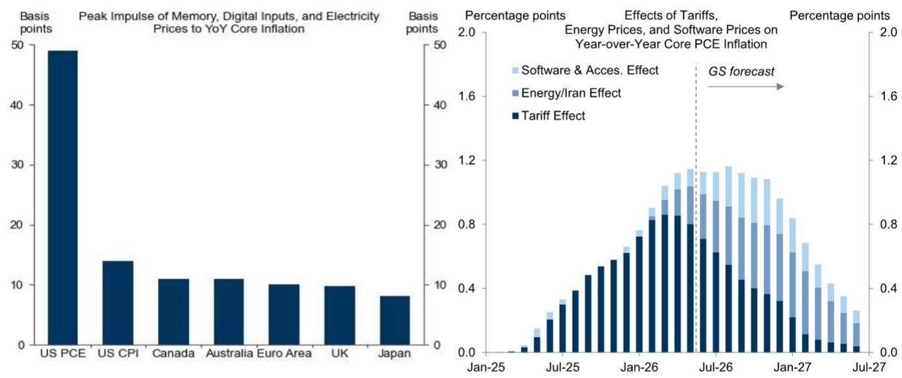
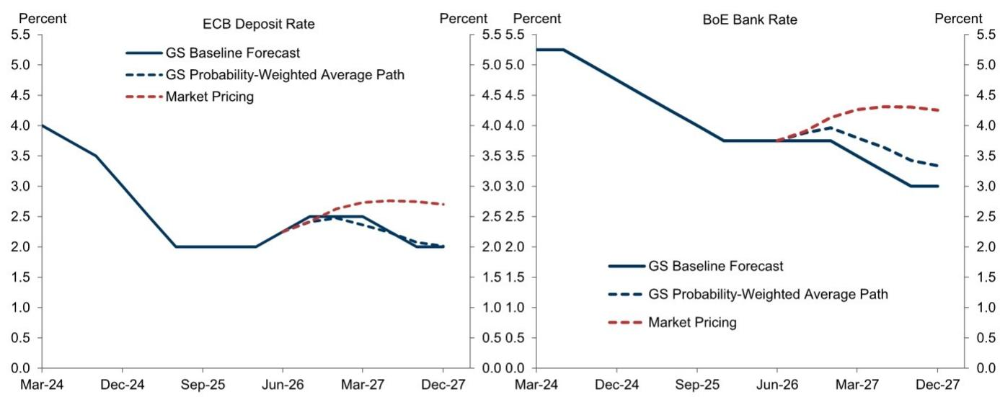
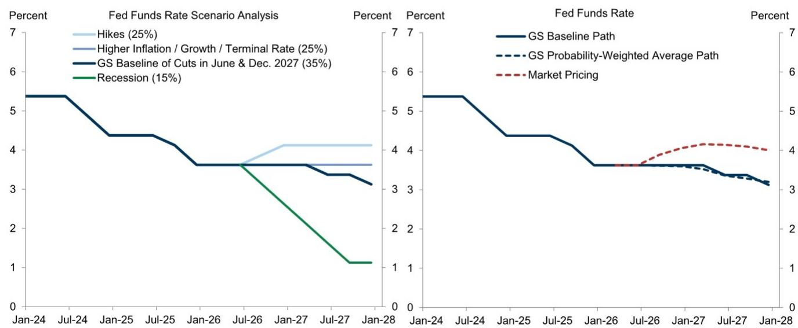

# GS：GS全球展望，地缘升级推油价，但通胀降温才是真正主线

中东局势再度升温，布伦特原油期货路径已突破GS此前对2026年第四季度每桶80美元和2027年每桶75美元的预测。但这份由首席宏观环境学家Jan Hatzius执笔的全球展望报告，其核心判断并非单纯看多油价。报告真正想传递的信号是：即便能源价格反弹，全球除美国以外的核心通胀仍在持续节奏变化，美国核心PCE可能高估了真实通胀水平，而美联储在7月会议上升息的可能性已基本消失。换句话说，地缘不确定性推升油价是短期扰动，通胀趋势性降温才是中期市场定价的主线。

## 1. 油价不确定性虽偏向上行，但供需两端都存在快速逆转的可能

报告明确指出，油价预测不确定性“双向存在但净偏向上行”。上行不确定性来自对油轮和中东基础设施的进一步攻击，可能将价格推回至冲突激烈时期每桶100美元以上的区间。但节奏变化不确定性同样不可忽视：在最近一轮升级之前，海湾地区的出口流量曾迅速恢复，这意味着一旦局势缓和，价格可能急剧回落。GS对油价的基准判断仍是中期回落，只是时间节点被推后。

> **KC评论：** 报告对油价的分析并非单向看多，而是强调“双向不确定性”。读者应关注的是，油价对通胀预期和央行政策路径的传导，而非押注油价本身的方向。

## 2. 美国核心PCE可能是“统计噪音”，全球其他地区的通胀已接近目标

报告提供了一个关键比较视角：G10除美国以外的核心通胀（无论是传统的剔除食品能源定义还是修剪均值指标）今年持续节奏变化，目前仅为2.1%。而美国核心PCE仍在3.3%左右。GS认为，这种背离并非美国宏观环境过热，而是核心PCE本身存在测量偏差——软件和配件、研究管理服务等类别的价格调整方法可能高估了真实通胀。此外，美国还受到关税等 idiosyncratic 冲击的影响。报告预计，随着这些临时性因素的消退，美国核心PCE同比增速将在2027年节奏变化至接近2%。

## 3. 美国劳动力市场“略低于正常水平”，但失业率上升可能是统计噪音

6月非农就业数据弱于预期，GS将美国潜在就业增长预估从一个月前的13万下调至7.3万。但报告同时指出，失业率升至4.2%主要由劳动参与率的“可疑大幅下降”驱动，预计未来几个月将出现逆转。更值得关注的是，GS的工资追踪指标已节奏变化至3.4%，低于与2%通胀目标一致的4%增速（假设生产率趋势为2%）。这意味着劳动力市场正在朝着美联储希望的方向冷却，而非失速。

## 4. 美联储7月加息概率已归零，但政策沟通面临新挑战

通胀数据改善“实际上已经扑灭了7月FOMC会议加息的可能性”。后续会议加息虽非不可能，但需要通胀显著上升或失业率显著低于预期。报告提出了一个更具前瞻性的问题：在没有点阵图的情况下，如果政策需要在某个时点调整方向，美联储主席Warsh将不得不比首次新闻发布会和国会听证会时更详细地解释委员会的宏观环境展望和反应函数，以防止资金条件过度波动。这实际上是在提示市场：未来美联储的沟通成本将显著上升。

## 5. 中国增长仍在调整但政策空间仍在，出口依赖是主要脆弱性

中国第二季度GDP同比增长4.3%，低于预期。报告指出，宏观环境活动高度分化：出口量和工业生产强劲，但进口量、房地产和消费支出持续仍在调整。预计 policymakers 将在7月政治局会议上加大宽松 rhetoric，并动用剩余财政缓冲来稳定研究和增长。但GS已将2026年全年增长预估下调至4.6%，并强调对出口的依赖意味着中国容易受到中东等地缘冲击引发的全球增长冲击。这一判断实际上将中国增长前景与中东局势、全球贸易周期绑定在了一起。

## 6. 市场定价与宏观现实之间存在裂痕，权益策略建议转向防御

报告对AI的长期宏观环境影响保持乐观，但认为“从估值角度看，市场已经领先于宏观”。GS权益策略师因此提到三个主题来度过近期不确定性：提供消费体验的公司、具有异常强劲的持续盈利增长、ROE和资产负债表的公司，以及并购标的。利率策略师认为市场定价了过多的紧缩，但只要中东升级不确定性仍是首要关注点，这一局面就不会改变。外汇策略师看好套利交易，同时预期人民币将继续升值。信用策略师预计利差将温和走阔，部分原因是AI相关债务发行需要被市场吸收。而在能源之外，大宗商品策略师认为央行购金的重新加速应有助于黄金价格反弹，尽管短期面临能源和利率市场的不确定性。

> **KC评论：** 报告在资产配置层面的核心矛盾是“宏观好于市场定价，但估值已经提前反映”。权益从AI主题转向防御和质量，债券认为市场过度定价紧缩，黄金则依赖央行行为而非通胀叙事。这些判断背后共同的逻辑是：地缘不确定性是暂时的，通胀和利率的节奏变化趋势才是中期主线。

For informational purposes only. Portions may be generated,translated,summarized,or edited with AI assistance based on source materials and may contain omissions or errors. Please verify independently. This is not investment,legal,tax,accounting,or other professional advice.

For informational purposes only. Portions may be generated,translated,summarized,or edited with AI assistance based on source materials and may contain omissions or errors. Please verify independently. This is not investment,legal,tax,accounting,or other professional advice.

