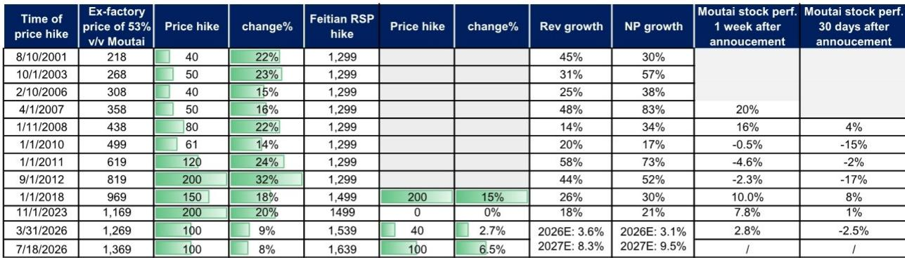
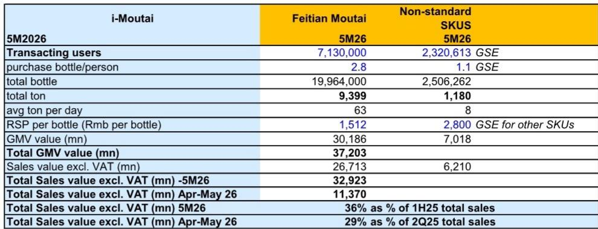
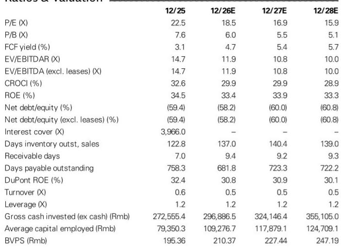

# GS：贵州茅台市场化计划-2026年7月飞天二次调价

7月17日，贵州茅台宣布飞天茅台出厂价和i茅台建议零售价再次上调，距离3月31日的调价仅隔不到四个月。GS在最新报告中指出，这是茅台历史上首次在一年内完成两轮核心产品调价——出厂价累计上调17%，建议零售价累计上调9%。这一节奏的转变，比调价幅度本身更值得关注。

过去二十年，茅台调价通常间隔数年，且多发生在行业上行周期。而2026年的两次调价，发生在行业库存调整尚未完全结束、需求恢复尚不明确的背景下。GS认为，这不仅是价格调整，更是公司主动管理渠道利润、强化品牌定价能力的一步。

> **KC评论：** 茅台一年两涨，打破了“调价必须等旺季、等批价倒挂缓解”的旧逻辑。报告隐含的判断是：茅台正在把定价权从“市场供需决定”转向“公司战略主导”。这张图（Exhibit 1）里历史调价后的报价表现并不一致，但这次的关键变量是调价频率本身，而非单次幅度。

## 1. 第二次调价覆盖更广，渠道价差正在被系统性地收窄

7月18日生效的调价方案中，飞天茅台出厂价从1,269元/瓶升至1,369元/瓶（+7.9%），i茅台建议零售价从1,539元/瓶升至1,639元/瓶（+6.5%）。但GS渠道调研显示，团购渠道的建议零售价已升至1,719元/瓶，KA/电商直供出厂价也同步上调至1,529元/瓶。1L装飞天茅台的建议零售价则上调4.8%至3,269元/瓶。

这意味着，本轮调价并非单一渠道的调整，而是覆盖批发、直销、团购、电商的全渠道价格体系重塑。GS估算，按批发渠道约30%、直销渠道约40%的比例分摊后，2026年营收增量约1.2%，利润增量约1.6%；到2027年，这一贡献将扩大至约3%的营收和4%以上的利润。

## 2. 批发价在调价后不跌反涨，市场消化能力超出预期

调价消息公布后的周末，飞天茅台批发价出现正反馈。原箱飞天从1,650元/瓶升至1,720元/瓶，散瓶从1,630元/瓶升至1,680元/瓶，分别上涨约70元和50元。GS认为，这一走势验证了3月调价后市场反馈的延续性，也说明渠道库存和终端需求对价格上移的承接力比预期更强。

报告特别提到，i茅台在2026年4-5月的销售额约110亿元，占2025年第二季度营收的约30%，且5月活跃交易用户达713万。这一数据表明，直销渠道的消费者基础已经足够支撑更高定价，而不再完全依赖批发渠道的价格传导。

## 3. 调价节奏加快，背后是公司对“市场化改革”的系统性推进

GS将本次调价列为“市场化计划”系列中的第五步。此前，公司已先后调整非标SKU的建议零售价、推出非标产品的寄售模式、以及3月的飞天调价。这些动作的共同逻辑是：通过价格工具主动调节渠道利润分配，而非被动等待市场出清。

从财务模型看，GS将2026-2028年的飞天均价上调1%-3%，但维持销量预测不变。2026年营收和净利润增速预期分别为3.9%和3.1%，2027年则有望加速至8%和9%。这一增速差异，主要来自调价在2027年实现全年贡献，以及直销占比持续提升带来的结构性利润改善。

> **KC评论：** 报告的核心观察框架是“调价频率 x 渠道覆盖 x 市场反馈”的三维验证。过去市场习惯用批零价差判断茅台定价空间，但GS这次强调的是：公司正在用更频繁、更精细的价格调整，把定价权从二级市场拿回自己手中。2027年8-9%的利润增速预期，建立在调价全年兑现、而非销量扩张的基础上。

## 4. 对行业观察者的启示：定价权的定义正在被重写

茅台一年两涨，对白酒行业的意义不止于一家公司的利润表。它提出了一个更根本的问题：在需求增速节奏变化、库存周期拉长的环境下，头部品牌能否通过主动定价策略维持甚至扩大利润空间？

GS的报告没有直接回答这个问题，但它提供了一套可复用的分析框架：调价频率是否加快、渠道覆盖是否完整、市场反馈是否正向。这三个维度，同样适用于评估其他高端消费品类的定价能力变化。

对于关注消费品定价逻辑的读者而言，茅台2026年的两次调价，或许比任何一次单次调价都更具信号意义——它标志着行业龙头从“稀缺溢价”向“主动管理溢价”的范式切换。

For informational purposes only. Portions may be generated,translated,summarized,or edited with AI assistance based on source materials and may contain omissions or errors. Please verify independently. This is not investment,legal,tax,accounting,or other professional advice.

For informational purposes only. Portions may be generated,translated,summarized,or edited with AI assistance based on source materials and may contain omissions or errors. Please verify independently. This is not investment,legal,tax,accounting,or other professional advice.

