## 市场观察

[点击此处收听每周播客]

## AI/动量因子调整进入成熟阶段；通胀读数见顶；企业盈利提供支撑

- 过去几周，多个AI相关板块表现面临挑战。自上月高点以来，韩国市场下跌25%，SOX指数下跌20%，三星、美光等个股跌幅在20%至50%之间。Mag-7的相对价格近期趋于稳定，但年内表现仍落后于整体市场。AI风险篮子年初至今相对表现落后超过20%。我们支持下半年市场轮动和广度扩大的观点——参见我们6月中旬的市场更新报告。我们对超大规模企业资本支出激增的货币化前景保持中期关注，并继续对软件、商业服务和媒体等AI替代板块持审慎看法——参见我们的年度展望。轮动和动量因子调整的初期阶段往往会导致整体市场波动性增加。

- 尽管如此，我们并不预期这些轮动会导致市场持续走弱。令人鼓舞的是，尽管如上所述许多权重股出现超过20%的回调，但MSCI全球指数迄今仍维持在历史高点1-2%的范围内。动量因子已回吐了年内的大部分涨幅，技术面持仓状况变得不那么极端。我们认为，鉴于盈利增长前景持续强劲以及估值支撑增强，各类AI相关板块不应在相对价格上长期下跌。特别是，半导体板块应会很快开始获得买盘支撑。

- 上图显示，半导体板块的相对价格与相对盈利之间正在出现越来越大的差距。我们的观点是，基本面可能仍将保持建设性，因为有意义的产能增加预计在2028年之前不会出现，因此目前定价一个拐点还为时过早。随着半导体RSI指标快速接近超卖区域，动量因子的过度部分已在很大程度上得到释放，如果超大规模企业的资本支出指引保持强劲，我们认为参与者应在夏季重新关注这一领域。

- 另外，正如我们所预期的，最新数据显示通胀读数已开始见顶。这反过来可能导致债券回报表现下降，减轻央行保持鹰派立场的压力，甚至可能导致美元走弱，所有这些都有利于市场领导地位的扩大。通胀仍对布伦特原油价格和伊朗局势的发展保持敏感。自3月下半月以来，我们一直主张利用地缘政治驱动的回调来增加配置，并将继续这样做。波动性可能持续存在，但我们认为通胀预期不会脱锚，通胀远期指标保持良好，与2022年的差异仍然显著，尤其是在劳动力市场动态、工资增长和情绪方面。

- 区域方面，我们注意到欧元区每股盈利修正已连续15周加速，实际上已完全弥合了与美国的差距，这是自2025年1月以来的首次。除非伊朗冲突在下半年持续升级，否则我们认为欧元区盈利可能保持上升趋势。

- 最后，早期第二季度业绩表现强劲。尽管存在一些显著的回落，主要是在科技领域，但总体而言，美国和欧洲市场对业绩超预期的股价反应是积极的——见底部图表。进入业绩期时，预期门槛一直在上升，这并不常见——参见我们的第二季度预览——但我们认为财报季最终将为整体市场带来信心。在我们上周的预览中，我们特别强调了半导体和银行板块可能交出强劲业绩，这应为半导体板块提供底部支撑，并已推动银行板块走高。

## 市场策略

Mislav Matejka, CFA AC
(44-20) 7134-9741
mislav.matejka@JPM.com
JPM Securities plc

Prabhav Bhadani, CFA
(44-20) 7742-4404
prabhav.bhadani@JPM.com
JPM Securities plc

Nitya Saldanha, CFA
(44 20) 7742 9986
nitya.saldanha@jpmchase.com
JPM Securities plc

Karishma Manpuria, CFA
(91-22) 6157-4115
karishma.manpuria@jpmchase.com
JPM India Private Limited

Anamil Kochar, CFA
(91-22) 6157-5179
anamil.kochar@jpmchase.com
JPM India Private Limited

我们的观点是市场将出现轮动……尽管如此，我们认为半导体板块将在持续强劲的盈利交付下很快找到底部……

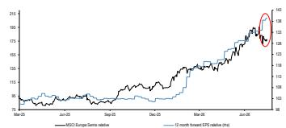  
……我们仍然认为通胀将回落，这反过来将缓解利率压力……

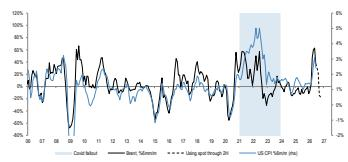  
……第二季度业绩迄今表现强劲……存在一些显著的回落，尤其是在科技领域，但总体而言，市场对业绩超预期的股价反应是积极的

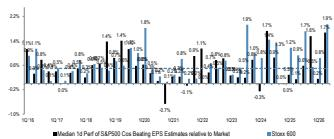  
来源：JPM, Bloomberg Finance L.P., Datastream

## 目录

AI/动量因子调整进入成熟阶段；通胀读数见顶；企业盈利提供支撑。3
附录。11
市场策略关键观点与驱动因素。13
首选标的。15
资金流向概览。16
技术指标。18
表现。19
盈利。20
估值。22
经济、利率与汇率展望。24
行业、区域与资产类别配置。25

# AI/动量因子调整进入成熟阶段；通胀读数见顶；企业盈利提供支撑

AI相关股票在过去几周面临挑战……
图1：KOSPI年初至今表现
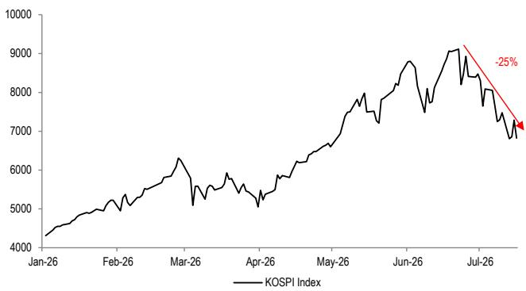

## 来源：Bloomberg Finance L.P.

多种AI相关股票在过去几周出现了显著回调。主要由主要存储芯片企业驱动的Kospi指数自近期高点下跌25%。该指数的剧烈波动触发了侧车机制，这是一种程序化交易限制，当期货价格波动超过预设阈值时会暂停某些自动化交易。其他存储芯片股如美光也下跌了30%。

科技股的调整可能由多种原因驱动。有消息称Meta可能考虑出售其计算资源和模型的访问权限，这被视为该公司意图将其基础设施货币化并保持利用率灵活性的迹象。这引发了对过度建设风险的担忧，质疑未来超大规模企业的资本支出以及AI芯片和内存额外需求何时会实现。此外，有报道称苹果一直在权衡从中国供应商购买内存的可能性，这加剧了对如果中国产能提升，现有韩国企业的定价能力和利润率可能受到威胁的担忧。

图2：SOX指数年初至今表现
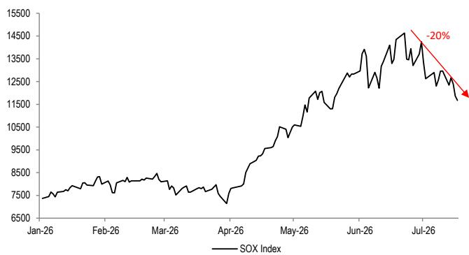  
来源：Bloomberg Finance L.P.
SOX指数自高点以来也下跌了20%。

图3：Mag-7相对标普500指数年初至今表现
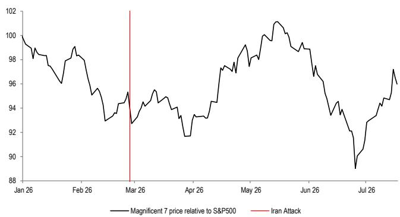  
来源：Bloomberg Finance L.P.  
Mag-7的相对价格近期趋于稳定，但年内表现仍落后于整体市场。
图4：美国和欧洲AI风险篮子自2025年1月以来相对市场表现

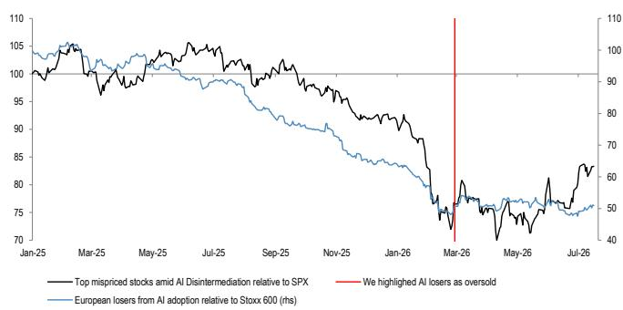  
来源：Bloomberg Finance L.P.

AI风险篮子年初至今相对表现继续落后超过20%。我们仍对AI替代板块（包括软件、商业服务和媒体）持审慎看法。

图5：LLM Token价格
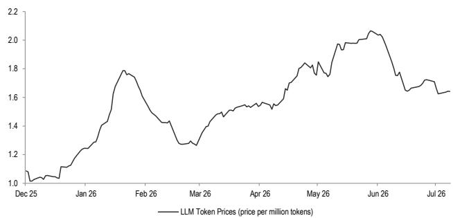  
来源：Bloomberg Finance L.P.  
对Token效率日益关注的担忧，以及关于中国AI实验室（如Moonshot）缩小与美国技术差距的消息，也可能对这些股票构成压力。

图6：费城半导体指数：与200日移动均线的距离
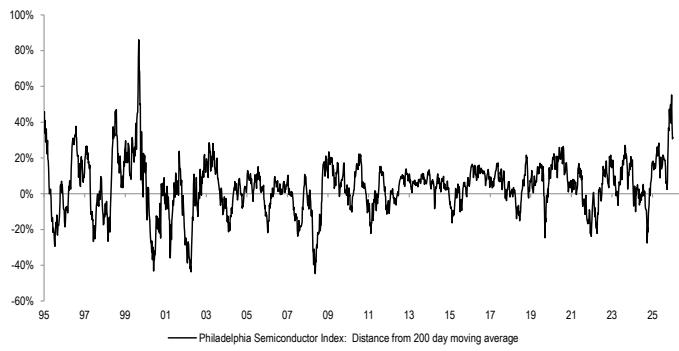  
来源：Bloomberg Finance L.P.  
虽然基本面的一些变化也在起作用，但回调的大部分可能由技术面因素驱动。直到上周，芯片股的飙升已将持仓指标推至1999-2000年以来的最高水平。

图7：SOX RSI
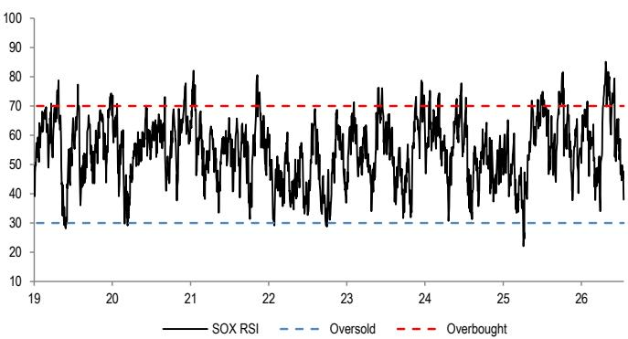  
来源：Bloomberg Finance L.P.

SOX RSI正接近“超卖”阈值。
图8：VKOSPI vs VIX
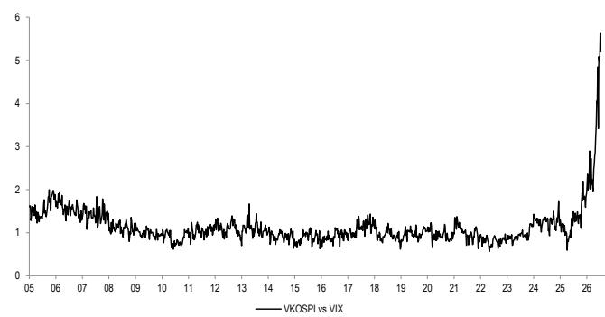  
来源：Bloomberg Finance L.P.

此外，杠杆ETF的快速增长，特别是单只股票杠杆ETF的推出，加剧了韩国股票市场的波动性。

……我们支持轮动交易……

图9：欧洲和美国周期股vs防御股年初至今表现
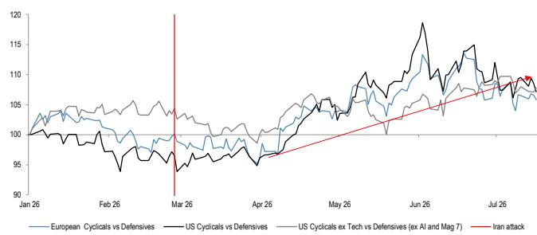  
来源：Datastream, Bloomberg Finance L.P.

周期板块表现优于防御板块，在欧洲领先5%，在美国领先7%。我们认为这一趋势将在下半年持续，受到健康的盈利交付和建设性的宏观背景支撑。

图10：MSCI欧洲消费子板块年初至今相对表现
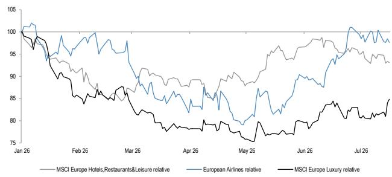

## 来源：Datastream

在周期板块中，消费领域是相对少见显著滞后的领域，但近期已显示出参与反弹的迹象。多个消费子板块在过去几个月已从低点回升。

……尽管如此，我们不预期这些轮动会导致市场持续走弱……持仓调整似乎已基本完成……

图11：MSCI全球指数年初至今表现
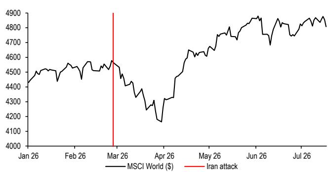  
来源：Bloomberg Finance L.P.  
令人鼓舞的是，尽管许多权重股出现大幅回调，但MSCI全球指数仍接近历史高点。

图12：标普500动量因子多空组合
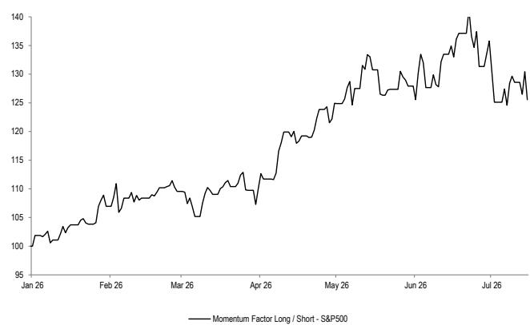  
来源：Bloomberg Finance L.P.  
动量因子在今年6月之前表现强劲，现已回吐了年内的大部分涨幅。

图13：美国战术持仓监测：持仓水平
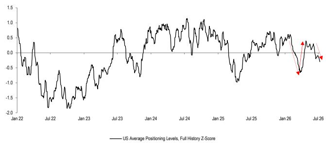  
来源：JPM Positioning Intelligence  
与此同时，技术面持仓已变得不那么极端。

图14：Mag 7相对市盈率
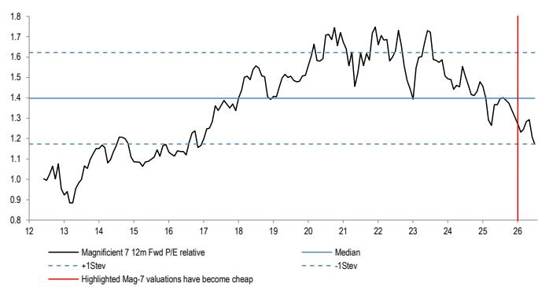  
来源：IBES  
Mag7集团目前的相对市盈率已低于一个标准差。

……许多关键基本面驱动因素仍然存在
图15：AI资本支出——过去12个月
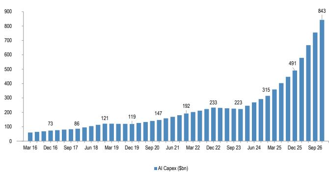  
来源：JPM. Equity Strategy & Quantitative Research

我们的科技分析师维持对该板块的积极看法，驱动因素包括：(1) 半导体在科技价值链中的关键作用，(2) 在所有应用中日益增长的内容需求顺风机会，以及(3) 结构性盈利能力/自由现金流的改善，所有这些因素仍然完好。重要的是，半导体行业收入的长期增长正受到数据中心资本支出加速增长的强劲顺风放大。他们预计这波支出将持续到2026年以后，使整个半导体价值链受益。

图16：DRAM价格
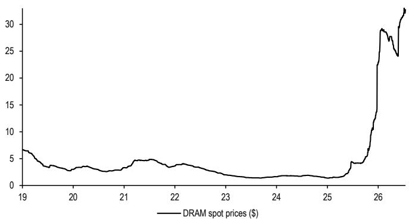  
来源：Bloomberg Finance L.P.

尽管近期对存储芯片股的信心有所动摇，但我们注意到DRAM价格仍保持高位。我们的全球科技团队指出，结构性DRAM/NAND供需紧张现在将延续到2028年，这与美光最近修订的关于供需紧张将持续到2027年以后的预期一致，因为AI/服务器驱动的需求激增和HBM优先化使传统DRAM和NAND供应保持紧张。

图17：DRAM收入
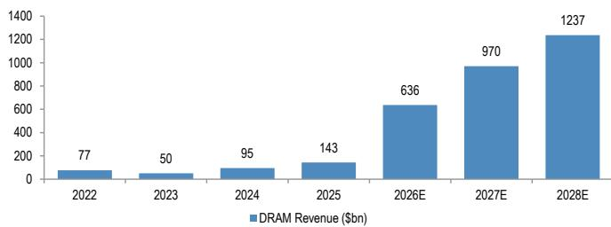  
来源：JPM.

该团队预计，这种供需紧张将在未来三年内带来健康的DRAM和NAND收入增长。

图18：MSCI欧洲半导体相对表现——价格与12个月远期每股盈利
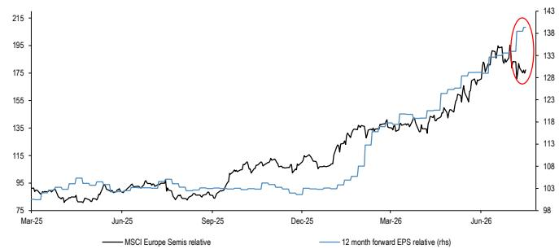  
来源：IBES, Datastream

有趣的是，半导体板块的相对价格与相对盈利之间正在出现越来越大的差距，尽管盈利持续强劲，但半导体股票已经回落。在基本面保持强劲的情况下，我们认为参与者应在夏季增加对该领域的关注。

通胀见顶有利于扩大交易

图19：美国通胀
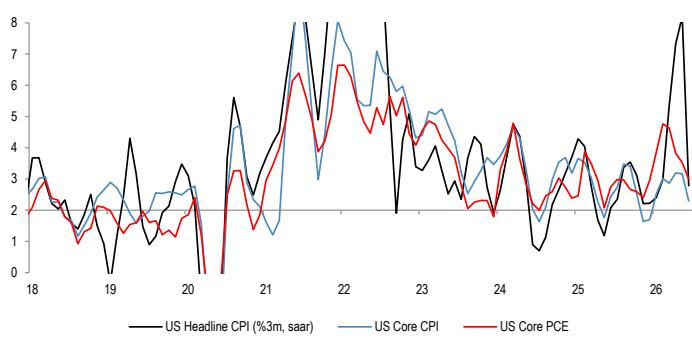  
来源：JPM.

正如我们所预期的，最新数据显示通胀读数已开始见顶。美国整体CPI按三个月季节性调整年化率计算，已从5月的8.2%降至6月读数的2.8%，而欧元区的连续通胀同样有所放缓。

图20：布伦特原油 vs CPI
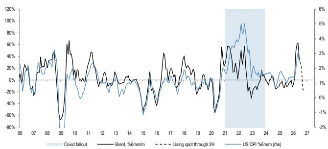  
来源：JPM, Bloomberg Finance L.P.

这得益于布伦特原油价格环比下跌约25%的机械性影响，其对整体CPI的传导现在已在数据中显现。

如果油价保持在当前水平，第一季度/第二季度能源冲击的基数效应将在下半年机械性地推动整体CPI走低。这对扩大交易至关重要，因为它应有助于实际可支配收入，减轻债券回报表现的上行压力，并削弱央行继续收紧政策的理由。

表1：伊朗冲突前 vs 2022年

<table><tr><td>类别</td><td>伊朗冲突前</td><td>2022年</td></tr><tr><td>美国CPI</td><td>放缓（目前3.5%）</td><td>高企且加速（2022年6月峰值9.1%）</td></tr><tr><td>美国核心CPI</td><td>放缓（目前2.6%）</td><td>高企且加速（2022年6月峰值6.6%）</td></tr><tr><td>工资增长</td><td>放缓</td><td>高企且加速</td></tr><tr><td>ISM制造业</td><td>53.3（三年高点，改善中）</td><td>57.4（下降中）</td></tr><tr><td>欧元区天然气价格峰值变动</td><td>108%</td><td>389%</td></tr><tr><td>战略储备响应</td><td>4亿桶</td><td>1.827亿桶</td></tr><tr><td>欧洲央行政策利率</td><td>从2%开始加息至2.25%</td><td>从-0.5%开始加息</td></tr><tr><td>美联储政策利率</td><td>维持在3.75%</td><td>从0.25%开始加息</td></tr></table>

来源：JPM, Bloomberg Finance L.P.

我们看到与2022年模板存在巨大差异。这次工资增长正在走低，企业不太可能表现出持续的定价能力，通胀预期仍然保持良好锚定。

图21：通胀预期
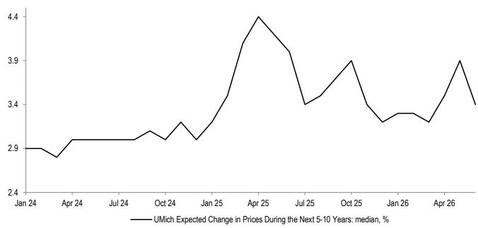  
来源：Bloomberg Finance L.P., NY Fed

在整个冲突驱动的能源冲击期间，长期通胀预期一直保持良好。

图22：美国5年5年通胀远期
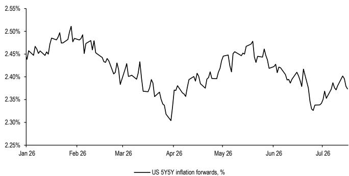  
来源：Bloomberg Finance L.P.

美国5Y5Y通胀远期一直保持在25个基点的范围内，从未突破2.60%。这是与2022年的一个关键区别，当时通胀预期显示出脱锚的迹象。我们认为，这使央行有灵活性比当前市场定价的更不鹰派，这反过来支撑市场倍数，并有利于向落后的周期性领域轮动。

图23：联邦基金期货与美国2年期债券回报表现
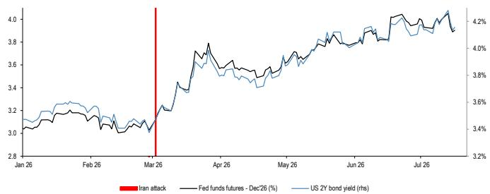  
来源：Bloomberg Finance L.P.

通胀见顶应反过来导致债券回报表现下降，减轻央行保持鹰派立场的压力，并可能导致美元走弱。我们注意到，美国2年期回报表现已开始从近期高点小幅走低，并认为6月份发生的鹰派重新定价可能被证明是本轮周期的高点。市场仍在定价自冲突升级以来美联储约90个基点的紧缩，我们认为这过高，并将逐渐被消化。

我们继续利用地缘政治驱动的回调来增加配置

图24：MSCI全球指数年初至今表现
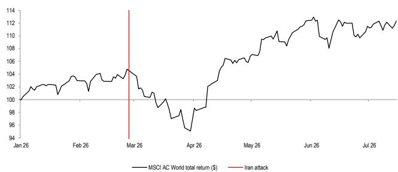

## 来源：Datastream

自3月下半月以来，我们一直主张利用地缘政治驱动的回调来增加市场敞口，并将继续这样做。伊朗冲突仍然动荡，最近几天再次升级。即便如此，我们认为市场越来越善于将地缘政治风险视为暂时性的，特别是因为双方都有强烈的动机去缓和局势。波动性可能持续存在，但我们不认为这是减少整体市场敞口的理由。

表2：美伊战争关键时间线

<table><tr><td>日期</td><td>事件</td><td>MSCI全球指数 +1周变动</td><td>MSCI全球指数 +1月变动</td></tr><tr><td>2月28日</td><td>美国和以色列对伊朗境内的战略军事和领导目标发动了协调一致的联合打击，杀死了最高领袖阿亚图拉·阿里·哈梅内伊。</td><td>-3.7%</td><td>-8.6%</td></tr><tr><td>3月1日</td><td>伊朗以广泛的导弹和无人机袭击美国基地和海湾基础设施作为报复，导致全球油价大幅飙升。</td><td>-3.7%</td><td>-5.7%</td></tr><tr><td>4月8日</td><td>最初商定了一个脆弱的为期两周的停火协议，以允许人道主义走廊并重新开放区域航运通道。</td><td>2.9%</td><td>7.2%</td></tr><tr><td>4月22日</td><td>特朗普无限期延长与伊朗的停火协议</td><td>-0.4%</td><td>3.8%</td></tr><tr><td>6月3日</td><td>临时休战破裂，导致严重升级，包括伊朗袭击科威特国际机场。</td><td>-3.8%</td><td>-0.6%</td></tr><tr><td>6月15日</td><td>在巴基斯坦斡旋的密集外交努力之后，唐纳德·特朗普总统宣布与伊朗达成协议，永久终止所有战线的军事行动。</td><td>-0.5%</td><td>-0.3%</td></tr><tr><td>6月17日</td><td>特朗普总统和伊朗总统马苏德·佩泽什基安正式签署谅解备忘录以结束战争，设立了60天的窗口期来解决核问题和制裁条款。</td><td>-1.5%</td><td>0.6%</td></tr><tr><td>7月7日</td><td>伊朗被指控在海峡袭击了三艘船只。美国以打击数十个目标并恢复对伊朗石油销售的制裁作为回应</td><td>0.0%</td><td>-</td></tr><tr><td>7月8日</td><td>特朗普宣布停火结束，但谈判可以继续</td><td>1.3%</td><td>-</td></tr><tr><td>7月12日</td><td>美国军方称，在伊朗对海峡一艘集装箱船的袭击导致一名船员失踪后，其打击了伊朗境内超过140个目标。</td><td>-</td><td>-</td></tr></table>

来源：Bloomberg Finance L.P., JPM

每一次连续的地缘政治冲击都产生了较小的回调，随后是相对快速的复苏，这与风险是暂时性的观点一致。我们相信最新的事件将遵循同样的模式。

## 早期第二季度业绩表现强劲

图25：标普500公司每股盈利和销售超预期情况
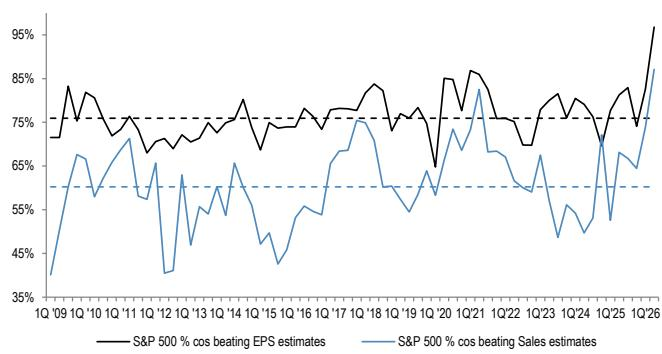  
来源：Bloomberg Finance L.P.

早期第二季度业绩表现强劲，股价反应积极。在已报告的公司中，超预期率约为97%，略高于76%的长期平均水平。

图26：Stoxx600公司每股盈利和销售超预期情况
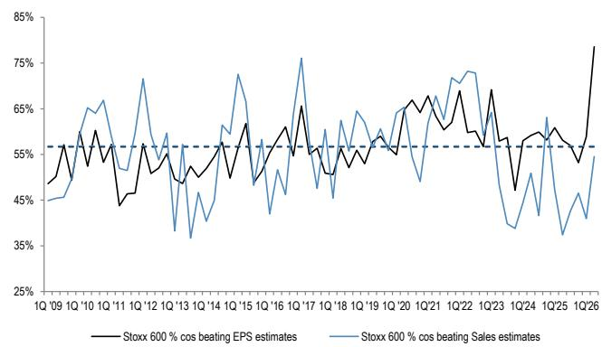  
来源：Bloomberg Finance L.P.  
即使在欧洲，盈利超预期情况也远高于历史平均水平。

图27：标普500和Stoxx600公司每股盈利超预期后的中位数1日表现
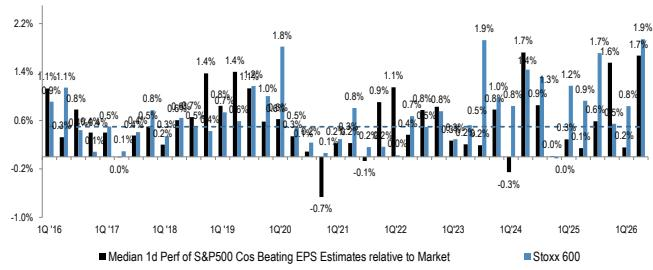  
来源：Bloomberg Finance L.P.  
令人鼓舞的是，市场对盈利超预期的股价反应非常积极。

表3：标普500公司财报日表现

<table><tr><td>公司名称</td><td>公司代码</td><td>日期</td><td>超预期幅度</td><td>表现，%</td><td>相对标普500</td></tr><tr><td>General Mills Inc</td><td>GIS US</td><td>7月1日</td><td>19.0%</td><td>8.5%</td><td>8.7%</td></tr><tr><td>FactSet Research Systems Inc</td><td>FDS US</td><td>7月1日</td><td>2.2%</td><td>6.7%</td><td>6.9%</td></tr><tr><td>PepsiCo Inc</td><td>PEP US</td><td>7月9日</td><td>0.1%</td><td>-3.3%</td><td>-4.1%</td></tr><tr><td>Delta Air Lines Inc</td><td>DAL US</td><td>7月10日</td><td>3.6%</td><td>-1.8%</td><td>-2.2%</td></tr><tr><td>Wells Fargo &amp; Co</td><td>WFC US</td><td>7月14日</td><td>17.0%</td><td>-2.7%</td><td>-3.1%</td></tr><tr><td>JPM Chase &amp; Co</td><td>JPM US</td><td>7月14日</td><td>34.4%</td><td>2.5%</td><td>2.1%</td></tr><tr><td>BofA Corp</td><td>BAC US</td><td>7月14日</td><td>7.3%</td><td>1.9%</td><td>1.5%</td></tr><tr><td>Fastenal Co</td><td>FAST US</td><td>7月14日</td><td>0.6%</td><td>-2.8%</td><td>-3.2%</td></tr><tr><td>GS Group Inc/The</td><td>GS US</td><td>7月14日</td><td>44.8%</td><td>9.0%</td><td>8.6%</td></tr><tr><td>Citi Inc</td><td>CUS</td><td>7月14日</td><td>15.1%</td><td>-5.3%</td><td>-5.7%</td></tr><tr><td>M&amp;T Bank Corp</td><td>MTB US</td><td>7月15日</td><td>14.8%</td><td>2.8%</td><td>2.4%</td></tr><tr><td>Elevance Health Inc</td><td>ELV US</td><td>7月15日</td><td>20.6%</td><td>-8.5%</td><td>-8.9%</td></tr><tr><td>Blackrock Inc</td><td>BLK US</td><td>7月15日</td><td>9.9%</td><td>6.6%</td><td>6.2%</td></tr><tr><td>Johnson &amp; Johnson</td><td>JNJ US</td><td>7月15日</td><td>1.2%</td><td>-2.7%</td><td>-3.1%</td></tr><tr><td>Bank of New York Mellon Corp/T</td><td>BNY US</td><td>7月15日</td><td>10.4%</td><td>5.1%</td><td>4.7%</td></tr><tr><td>PNC Financial Services Group I</td><td>PNC US</td><td>7月15日</td><td>6.1%</td><td>0.9%</td><td>0.5%</td></tr><tr><td>United Airlines Holdings Inc</td><td>UAL US</td><td>7月15日</td><td>7.5%</td><td>0.5%</td><td>0.1%</td></tr><tr><td>MS</td><td>MS US</td><td>7月15日</td><td>18.3%</td><td>0.4%</td><td>0.0%</td></tr><tr><td>Progressive Corp/The</td><td>PGR US</td><td>7月15日</td><td>0.1%</td><td>-9.4%</td><td>-9.8%</td></tr><tr><td>Cintas Corp</td><td>CTAS US</td><td>7月15日</td><td>1.5%</td><td>4.4%</td><td>4.0%</td></tr><tr><td>JB Hunt Transport Services Inc</td><td>JBHT US</td><td>7月15日</td><td>10.1%</td><td>8.0%</td><td>8.5%</td></tr><tr><td>UnitedHealth Group Inc</td><td>UNH US</td><td>7月16日</td><td>30.4%</td><td>1.2%</td><td>1.7%</td></tr><tr><td>Citizens Financial Group Inc</td><td>CFG US</td><td>7月16日</td><td>4.3%</td><td>4.6%</td><td>5.1%</td></tr><tr><td>General Electric Co</td><td>GE US</td><td>7月16日</td><td>8.4%</td><td>-4.1%</td><td>-3.5%</td></tr><tr><td>US Bancorp</td><td>USB US</td><td>7月16日</td><td>5.7%</td><td>1.6%</td><td>2.1%</td></tr><tr><td>Intuitive Surgical Inc</td><td>ISRG US</td><td>7月16日</td><td>11.9%</td><td>3.4%</td><td>3.9%</td></tr><tr><td>Abbott Laboratories</td><td>ABT US</td><td>7月16日</td><td>2.7%</td><td>10.7%</td><td>11.2%</td></tr><tr><td>State Street Corp</td><td>STT US</td><td>7月16日</td><td>9.4%</td><td>-0.5%</td><td>0.0%</td></tr><tr><td colspan="4">盈利超预期公司1日中位数表现</td><td>1.6%</td><td>1.7%</td></tr><tr><td colspan="4">盈利未达预期公司1日中位数表现</td><td>-</td><td>-</td></tr><tr><td colspan="4">盈利超预期公司1日平均表现</td><td>1.5%</td><td>1.4%</td></tr><tr><td colspan="4">盈利未达预期公司1日平均表现</td><td>-</td><td>-</td></tr></table>

来源：JPM, Bloomberg Finance L.P.

在我们上周的预览中，我们特别强调了半导体和银行板块可能交出强劲业绩，有助于市场表现。早期的数据证实了这一观点。台积电的业绩显示订单势头持续，并对2027年产能计划发表了积极评论，而银行板块则报告了有韧性的净利息收入和强劲的投行业务收入。我们预计随着未来几周大部分业绩的公布，这一模式将持续。

表4：Stoxx600公司财报日表现

<table><tr><td>公司名称</td><td>公司代码</td><td>日期</td><td>超预期幅度</td><td>表现，%</td><td>相对Stoxx 600</td></tr><tr><td>WIHLBORGS FASTIG</td><td>WIHL SS</td><td>7月6日</td><td>1.0%</td><td>3.5%</td><td>3.9%</td></tr><tr><td>TRYG A/S</td><td>TRYG DC</td><td>7月10日</td><td>-11.6%</td><td>0.3%</td><td>0.2%</td></tr><tr><td>GJENSIDIGE FORSI</td><td>GJF NO</td><td>7月13日</td><td>5.9%</td><td>2.1%</td><td>2.1%</td></tr><tr><td>KONGSBERG GRUPP</td><td>KOG NO</td><td>7月13日</td><td>8.7%</td><td>-6.8%</td><td>-6.8%</td></tr><tr><td>SAGAX AB-B</td><td>SAGAA SS</td><td>7月13日</td><td>20.8%</td><td>2.2%</td><td>2.2%</td></tr><tr><td>ADDTECH AB-B SH</td><td>ADDTB SS</td><td>7月14日</td><td>2.7%</td><td>1.2%</td><td>1.0%</td></tr><tr><td>MYCRONIC AB</td><td>MYCR SS</td><td>7月14日</td><td>20.0%</td><td>15.3%</td><td>15.1%</td></tr><tr><td>DNB BANK ASA</td><td>DNB NO</td><td>7月14日</td><td>0.6%</td><td>-0.8%</td><td>-1.0%</td></tr><tr><td>FASTIGHETS-B SHS</td><td>BALDB SS</td><td>7月14日</td><td>-10.9%</td><td>-1.7%</td><td>-1.8%</td></tr><tr><td>AVANZA BANK HOLD</td><td>AZA SS</td><td>7月14日</td><td>3.9%</td><td>4.0%</td><td>3.9%</td></tr><tr><td>ERICSSON LM-B</td><td>ERICB SS</td><td>7月14日</td><td>-9.4%</td><td>-12.6%</td><td>-12.8%</td></tr><tr><td>LIFCO AB-B</td><td>LIFCOB SS</td><td>7月14日</td><td>2.7%</td><td>3.0%</td><td>2.8%</td></tr><tr><td>AKER BP ASA</td><td>AKRBP NO</td><td>7月15日</td><td>-8.4%</td><td>-0.6%</td><td>-0.7%</td></tr><tr><td>AXFOOD AB</td><td>AXFO SS</td><td>7月15日</td><td>-3.2%</td><td>-14.9%</td><td>-15.0%</td></tr><tr><td>ELISA OYJ</td><td>ELISA FH</td><td>7月15日</td><td>0.5%</td><td>-5.4%</td><td>-5.5%</td></tr><tr><td>ASML HOLDING NV</td><td>ASML NA</td><td>7月15日</td><td>10.8%</td><td>-0.4%</td><td>-0.5%</td></tr><tr><td>CASTELLUM AB</td><td>CAST SS</td><td>7月15日</td><td>5.6%</td><td>2.0%</td><td>1.9%</td></tr><tr><td>STOREBRAND ASA</td><td>STB NO</td><td>7月15日</td><td>20.4%</td><td>5.4%</td><td>5.3%</td></tr><tr><td>SEB AB-A</td><td>SEBA SS</td><td>7月15日</
