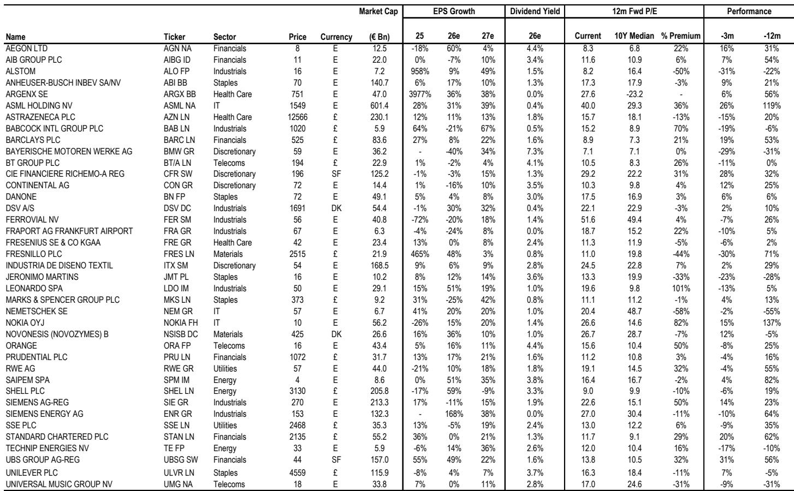
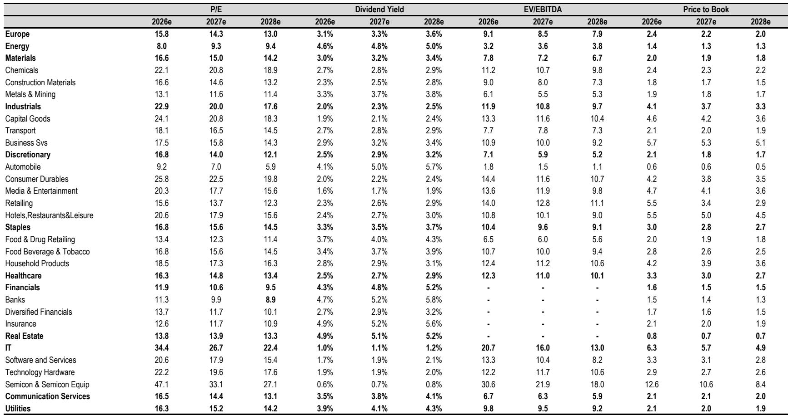
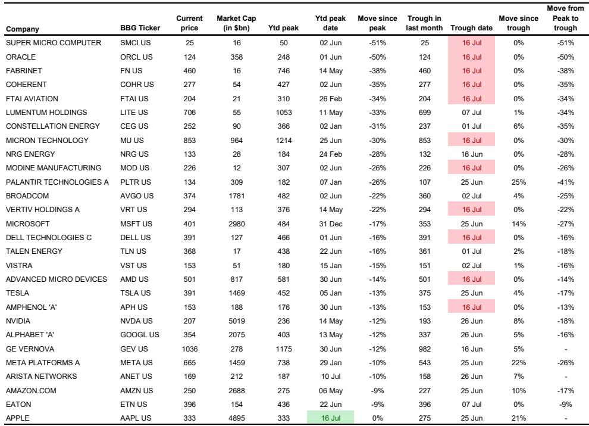

# 半导体行业观察：技术性调整而非基本面逆转

费城半导体指数较高点回落20%，韩国综合指数下跌25%，美光、三星等知名公司市值在短短数周内缩水20%至50%。对许多观察者而言，这似乎预示着主导市场两年的AI主题正面临结构性转折。然而，这一判断可能并不准确。此轮调整更多是技术性事件，主要由极端持仓、单只股票杠杆ETF放大波动以及动量因子自然回调所驱动，且回调过程已大部分完成。推动半导体行业上行的基本面因素依然稳固，价格走势与盈利现实之间的差距已相当显著，反而可能提供了值得关注的入场时机。

当前值得关注的是，资金从AI赢家向滞后周期股的轮动正在成熟，而非逆转。尽管科技权重股出现调整，但MSCI全球指数仍维持在历史高点1-2%的范围内，这表明资金是在轮动而非全面撤离。通胀正接近峰值，债券回报表现开始小幅下行，第二季度财报季整体呈现积极态势。若将此次技术性调整误判为基本面恶化，可能错失周期下一阶段的机遇。

## 半导体调整源于持仓过度，而非需求恶化

当前市场最关键的事实是：半导体价格下跌的同时，其盈利仍在持续增长。以欧洲半导体为例，其价格相对表现与盈利相对表现之间的差距已达到多年来的最大值。这种背离是持仓驱动型调整的典型特征，而非需求驱动型崩溃。直到上周，芯片股持仓指标已达到1999-2000年科技泡沫以来的水平。SOX指数的相对强弱指标正接近超卖区域，动量因子已回吐年内大部分涨幅。

触发此次调整的是一系列消息面因素，引发了关于超大规模企业资本支出纪律的讨论。有报道称Meta可能将其计算资源货币化，以及苹果可能从中国供应商采购内存，这些消息催生了关于过度建设风险和定价能力削弱的叙事。这些问题确实存在，但它们关乎的是周期的时点和形态，而非周期本身。根据多家分析机构的评估，DRAM和NAND的结构性供需紧张将持续到2028年，这与美光自身修正后的预期（紧张状况延续至2027年以后）一致。有意义的新增产能要到2028年之后才能到位，这意味着市场正在提前定价一个半导体制造时间线无法支撑的拐点。

单只股票杠杆ETF的快速增长，尤其是在韩国市场，为下行提供了机械性的放大效应。当动量在散户和杠杆产品积累了大量多头仓位的市场中逆转时，调整速度会远超基本面所能解释的范围。这正是当前发生的情况。

## 向周期股的轮动具有建设性，而非破坏性

AI和动量因子的调整，恰逢市场领导地位向周期板块扩散。年内至今，周期股在欧洲跑赢防御类股5%，在美国跑赢7%。在周期板块内部，此前明显滞后的消费类股正显示出参与迹象。这种轮动正是健康成熟周期的特征，并且得到了科技板块以外盈利修正改善的支持。

欧元区盈利修正已连续15周加速，自2025年1月以来首次完全弥合了与美国的差距。这并非暂时的追赶，而是反映了欧洲公司盈利轨迹的真实改善，得益于欧元走弱、能源成本企稳以及货币政策正常化的滞后效应。除非伊朗冲突在下半年持续升级，否则欧洲盈利很可能保持上升趋势，为轮动的持续提供基础。

市场对第二季度财报的整体反应是积极的。科技股中出现了明显的回落，因为过高的预期设置了较高的门槛，但总体而言，美国和欧洲市场对超预期财报的股价反应是正面的。财报前的门槛在上升，这不同寻常，表明市场已开始消化部分乐观情绪。财报季很可能为更广泛的市场提供信心，半导体和银行板块尤其有望交出为各自行业提供支撑的业绩。

## 通胀见顶，改变宏观背景

通胀见顶是当前宏观环境中被低估的发展。美国三个月年化季调CPI从5月的8.2%降至6月的2.8%。欧元区的环比通胀同样在减速。这在一定程度上是机械性的——布伦特原油季度环比下跌约25%，对整体CPI的传导已在数据中显现——但方向是明确的。

这对市场扩散交易的影响是实质性的。更低的通胀减轻了债券回报表现的上行压力，降低了央行维持鹰派立场的必要性，并支持实际可支配收入。美国两年期回报表现已开始从近期高点小幅回落，6月出现的鹰派重新定价可能是本轮周期的高点。自伊朗冲突升级以来，市场仍在定价约90个基点的额外加息，这相对于通胀轨迹而言是过度的，很可能会被逐步消化。

与2022年通胀冲击的差异是显著且关键的。本次工资增长在减速而非加速。企业定价能力在减弱。长期通胀预期在整个冲突驱动的能源冲击中保持良好，美国5Y5Y通胀远期从未突破2.60%。2022年，通胀预期显示出脱锚迹象，迫使央行采取激进紧缩。这种动态目前不存在。这给了央行比当前市场定价更灵活的鹰派立场空间，从而支撑估值倍数，并促进向滞后周期板块的轮动。

## 应对轮动的决策框架

当前市场环境要求观察者区分三种不同的状态，每种状态需要不同的应对。

第一种状态是AI重仓股的技术性调整。适当的应对是增加而非减少半导体头寸。基本面驱动因素——数据中心资本支出的长期增长、2028年前的结构性供应紧张、以及盈利相对于价格的改善——依然稳固。技术性持仓过度已基本消化，RSI正接近超卖区域。进一步技术性下行的风险存在，但错失基本面复苏的风险更大。

第二种状态是向周期股的轮动。适当的应对是关注周期板块，尤其是在盈利修正加速的欧洲。此前滞后的消费类股正显示出参与迹象，提供了有吸引力的入场点。通胀见顶通过降低进一步货币紧缩的风险来支持这一轮动，而紧缩会不成比例地损害周期股。

第三种状态是地缘政治风险管理。伊朗冲突仍存在变数，可能再次升级。然而，市场对地缘政治冲击的反应模式是一致的：最初的下跌之后是反弹，因为市场将其视为暂时性风险。双方都有强烈的缓和动机，战略石油储备的应对规模也大于2022年。适当的应对是利用地缘政治驱动的下跌来增加头寸，而非减少。

## 盈利支撑比技术性上限更可靠

对半导体和更广泛市场持建设性态度的最后一个理由是，第二季度财报季提供了技术性调整无法突破的基本面支撑。早期结果强劲，市场对超预期财报的整体股价反应是积极的。财报前门槛上升这一不寻常的动态意味着，在正常环境下会获得回报的超预期表现，在某些个股中遭遇了回落，但这是健康怀疑态度的表现，而非系统性疲弱。

半导体和银行是最有可能交出超预期业绩的两个板块。对于半导体而言，超大规模企业资本支出持续、供应条件紧张以及向高价值产品（如HBM）的组合改善，共同构成了强劲的盈利顺风。对于银行而言，高利率的滞后效应和贷款增长的改善仍在向盈利传导。在AI重仓股技术性调整期间，这两个板块为更广泛的市场提供了基本面锚点。

市场正处于一个过渡阶段，旧的领导板块正在调整，新的领导板块仍在确立之中。这带来了波动和不适，但并未形成看空理由。MSCI全球指数在其最大成分股出现20-50%回撤的情况下仍接近历史高点，这不是脆弱的迹象，而是市场在轮动而非崩溃的信号。能够区分技术性噪音和基本面信号的观察者会发现，半导体行业的调整创造的是机会，而非警示。

仅供参考。部分内容可能基于源材料通过AI辅助生成、翻译、总结或编辑，可能存在遗漏或错误。请独立核实。本文不构成任何专业建议。

