# 美国关税影响追踪：未来两周洛杉矶港进口量呈现波动

**美国关税影响追踪**：过去一周，从中国出发前往美国的满载船舶数量环比下降（-19%），同比下降（-25.5%）。数据显示，进入洛杉矶港的TEU（标准箱）数量将在下周转为正值（环比+3%），此前一周为-6%的环比变动，随后两周将出现-7%的环比下降（同比预计分别为-7%和持平）。我们需要关注的是7月份的数据变化趋势，这可能反映出托运人如何决定补货、旺季可能何时开始（以及今年春季是否出现了提前的旺季航运），以及在不确定的地缘政治背景下，较低的有效关税税率如何影响进口决策。

贸易不确定性在全球贸易中仍然普遍存在，尤其是在近期最高法院裁决以及随后政府根据第122条宣布新关税之后（参见我们的宏观团队评估）。我们认为，这种不确定性可能对全球货运产生两方面的短期至中期影响。首先，由于贸易不确定性上升，且政府尚未披露在第122条关税150天到期后将如何行动，这可能会影响中长期货运规划。其次，更短期的影响是，那些目前有效关税税率较低的国家可能会增加对美国的出口。我们注意到，这可能需要一段时间才能在数据中体现出来，尤其是对于中国大陆的货运而言，因为制造业和航运在春节后恢复较晚。

Jordan Alliger +1(212)357-4913 | jordan.alliger@gs.com GS & Co. LLC

Paul Stoddard  
+1(801)744-3761 |  
paul.x.stoddard@gs.com  
GS & Co. LLC

Andrzej Tomczyk, CFA
+1(212)357-4445 |
andrzej.tomczyk@gs.com
GS & Co. LLC

**上周报告的主要观察：**

中国货运流量（截至7月16日当周）显示，从中国到美国的满载船舶数量环比下降（-19%），同比下降-25.5%（前一周为-10%）。

- Port Optimizer的环比数据显示，洛杉矶港的进口量预计将增加+3% TEU（7月24日），而早期读数显示两周后可能下降-7%；同比来看，洛杉矶港的进口量预计将转为-7%的负增长，两周后则保持不变。

西海岸的铁路多式联运量同比增长+4%，此前一周为+13%。

海运集装箱运价环比下降-6%；上周运价同比上涨+204%。我们预计，由于持续的地缘政治事件可能导致全球运力发生变化，未来几周市场可能仍会出现一些波动。

- 西海岸的卡车可用运力上周环比增加（+25%），同比也呈正值（+1%）；西海岸的卡车即期运价（不含燃油）同比上涨+69%。

## 追踪器说明：

**我们每周发布的内容**：高频数据，用于帮助评估关税对全球供应链的持续影响以及随之而来的货运流量变化（例如，从中国出发前往美国的预期船舶）。虽然我们认为我们的数据集具有代表性，但我们计划在获得新的数据系列时定期添加。

需要认识到，周度数据可能存在波动，且因时间节点不同而包含相当多的噪音——但我们仍然认为，综合来看这些数据，或许在数周的基础上观察，可以为关税相关趋势提供参考信息。

**2026年贸易与运输情景路线图——从第一版和第二版修订而来**：随着我们走过2025年的最后阶段进入2026年，能否找到利润和收益的底部并最终看到收益上调周期，归结为一个因素：数量增长，并适当向高利润的企业对企业、商业和/或制造业货运倾斜。近期卡车运输板块报价表现改善，或许与这样一种观点有关：货运量（就整车运输而言，即运力）可能确实处于一个更稳定的阶段，有望在2026年的某个时候出现改善。

关税不确定性导致需求提前释放——加上托运人在决定生产和/或订购多少库存产品时的犹豫不决——是2025年大部分时间运输板块整体表现不佳的原因之一，这也直接印证了我们的观点，即我们可能会看到低于季节性的旺季航运需求（针对第四季度报告）。

尽管如此，我们仍然对周期复苏前景持积极看法——尽管底部迄今尚未明确出现——我们注意到，从中长期来看，有几个因素最终可能刺激2026年出现有利且全面的货运量拐点。

利率调整周期通常对运输板块有利（参见《利率调整与运输板块》）；研究团队预测2026年将有一次调整（12月），2027年3月还有一次，加上2025年的三次调整。

■ 尽管关税不确定性依然存在，但我们已于2026年4月2日度过了“解放日”——这可能为托运人提供了一个更一致的规划框架。

■ 多家公司宣布增加对美国制造业的投资——包括苹果、英伟达、IBM、辉瑞、强生等公司——这应有助于增加国内货运流量。

通过《一项大而美的法案》恢复的奖金折旧政策，可能激励资本重新投资于企业。

虽然关税部署具有破坏性，但由此产生的任何回流或近岸外包都将提振美国制造业，这也应有助于增加国内货运流量。

■ 随着公司可能寻求“中国+1”或“中国+2”战略，物流模式的转变和供应链采购的变化可能带来长期的全球贸易机会。

## 关于运输类公司的观察：

我们去年上调了卡车运输公司的评级（参见我们的上调评级报告），因为我们相信衰退的可能性已经降低，且消费者保持相对韧性。虽然像EXPD和CHRW这样的货运代理可能受益于波动性和海关经纪服务需求的激增，但我们注意到海运运价的同比比较将面临挑战。如果红海重新开放，可能会进一步增加有效运力。

- 其他可能受益的领域包括包裹运输公司（UPS和FDX——均给予积极评级），它们拥有快速循环物流和空运服务，以及庞大的全球网络，可以帮助托运人调整供应链。

## 高频周度数据

我们追踪周度（以及部分日度）数据，以尽可能实时地了解贸易量、需求和定价。我们注意到，这些数据在短期内大多波动较大，并且随着我们获得更多数据，往往能显示出随时间发展的趋势，但也反映了贸易流的波动性。因此，我们建议不要根据周度数据得出结论，但鉴于动态的贸易环境，关注数据的周度变化可能是有帮助的。以下是我们追踪的、我们认为与贸易和美国货运运输高度相关的高频数据点。

从中国到美国的满载集装箱船舶上周（7/10-7/16）同比下降-25.5%，而前一周（7/3-7/9）为-10%。最近一周船舶数量环比下降-19%，此前一周为-10%。

从中国到美国的TEU上周（7/10-7/16）同比下降-26%，而前一周（7/3-7/9）为-7%。环比来看，来自中国大陆的TEU变化为-18%。

**图表3：TEU保持波动**  
每日从中国到美国的TEU  
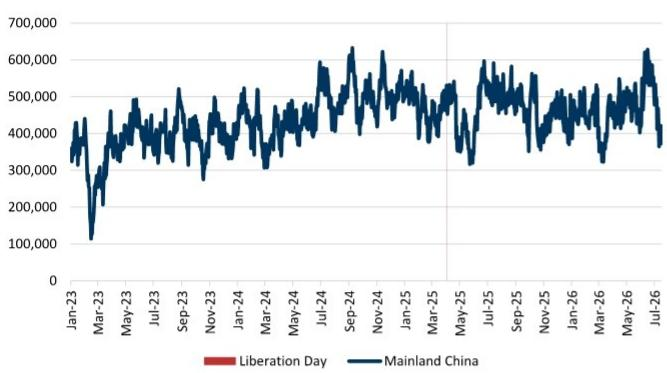  
数据截至2026年7月16日。代表离开中国前往美国的船舶在15天滚动期内的集装箱总运量，以20英尺标准箱（TEU）计量。反映正在使用的航运能力，与船舶数量无关。离开中国的干货船在驶离中国水域时被监测。数据集筛选了过去15天内离开且报告目的地为美国的船舶。注意：数据可能会进行修订。  
**图表4：最近一周TEU增长放缓**  
每日从中国到美国的TEU，同比

来源：彭博

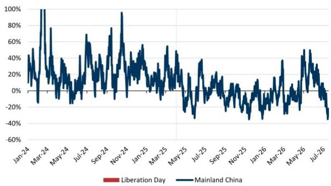

数据截至2026年7月16日。代表离开中国前往美国的船舶在15天滚动期内的集装箱总运量，以20英尺标准箱（TEU）计量。反映正在使用的航运能力，与船舶数量无关。离开中国的干货船在驶离中国水域时被监测。数据集筛选了过去15天内离开且报告目的地为美国的船舶。注意：数据可能会进行修订。

来源：彭博

**图表5：第28周中国至美国船舶和TEU环比下降**  
每周平均TEU和从中国到美国的船舶数量

<table><tr><td colspan="8">彭博中国至美国6周仪表盘 每周平均TEU和船舶数量</td></tr><tr><td>周</td><td>22</td><td>23</td><td>24</td><td>25</td><td>26</td><td>27</td><td>28</td></tr><tr><td>2026年船舶</td><td>54</td><td>65</td><td>68</td><td>69</td><td>64</td><td>57</td><td>46</td></tr><tr><td>环比</td><td></td><td>20.2%</td><td>4.6%</td><td>2.5%</td><td>-8.0%</td><td>-10.1%</td><td>-19.4%</td></tr><tr><td>2025年船舶</td><td>50</td><td>58</td><td>64</td><td>70</td><td>65</td><td>64</td><td>62</td></tr><tr><td>2025年环比</td><td></td><td>15.1%</td><td>11.7%</td><td>8.7%</td><td>-7.4%</td><td>-1.8%</td><td>-2.2%</td></tr><tr><td>2026年同比</td><td>7.7%</td><td>12.4%</td><td>5.3%</td><td>-0.6%</td><td>-1.3%</td><td>-9.7%</td><td>-25.5%</td></tr><tr><td>2026年TEU</td><td>448,568</td><td>537,355</td><td>581,875</td><td>557,474</td><td>536,168</td><td>476,766</td><td>389,719</td></tr><tr><td>环比</td><td></td><td>19.8%</td><td>8.3%</td><td>-4.2%</td><td>-3.8%</td><td>-11.1%</td><td>-18.3%</td></tr><tr><td>2025年TEU</td><td>398,319</td><td>459,259</td><td>532,618</td><td>559,219</td><td>525,660</td><td>510,667</td><td>524,435</td></tr><tr><td>2025年环比</td><td></td><td>15.3%</td><td>16.0%</td><td>5.0%</td><td>-6.0%</td><td>-2.9%</td><td>2.7%</td></tr><tr><td>2026年同比</td><td>12.6%</td><td>17.0%</td><td>9.2%</td><td>-0.3%</td><td>2.0%</td><td>-6.6%</td><td>-25.7%</td></tr></table>

第28周 2026年7月10日至7月16日；注意：数据可能会进行修订。

来源：彭博

**中国大陆的满载船舶和TEU增长 vs. 亚洲（除中国大陆）到美国**：就满载船舶而言，中国大陆平均同比下降-26%，而亚洲（除中国大陆）同比下降-25%。就TEU而言，中国大陆平均同比下降-22%，而亚洲（除中国大陆）平均同比下降-28%。我们使用中国大陆、越南、韩国、台湾地区和日本的总和作为亚洲对美出口的代理指标。

**图表6：中国大陆和亚洲（除中国大陆）：中国大陆和亚洲（除中国大陆）的船舶数量同比下降**  
每日从亚洲（除中国大陆）和中国大陆到美国的满载集装箱船舶数量，同比

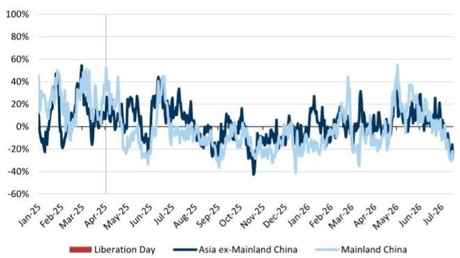  
亚洲（除中国大陆）包括越南、韩国、台湾地区和日本 数据截至2026年7月16日  
**图表7：上周中国大陆和亚洲（除中国大陆）的TEU增长同比放缓**  
每日从亚洲（除中国大陆）和中国大陆到美国的TEU，同比

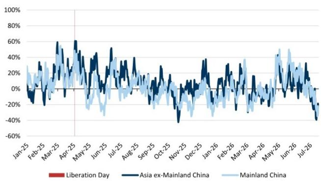  
亚洲（除中国大陆）包括越南、韩国、台湾地区和日本 数据截至2026年7月16日  
来源：彭博  
来源：彭博

中国主要港口周度吞吐量在截至7月12日的一周内环比下降-15%（最新可用数据），此前一周为环比下降-5%。吞吐量同比下降-11%，前一周为+5%。

**图表8：最近一周中国港口活动环比下降-15%，同比下降-11%**  
中国主要港口周度集装箱吞吐量

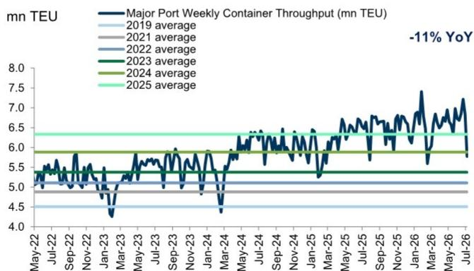  
注：标签显示最新周度同比数据，涵盖2026年7月6日至7月12日  
截至2026年7月12日的周度数据。由我们的亚洲分析师Herbert Lu、Simon Cheung和Dorothy Wong整理

从中国/东亚到美国西海岸的海运集装箱运价上周环比下降-6%，同比上涨+204%。我们预计，由于持续的地缘政治事件可能导致全球运力变化，考虑到潜在的附加费以及今年旺季开始较早，未来几周市场可能出现一些波动。

**图表9：海运运价环比下降-6%，前一周为上涨+13%**  
中国/东亚到北美西海岸，美元/FEU  
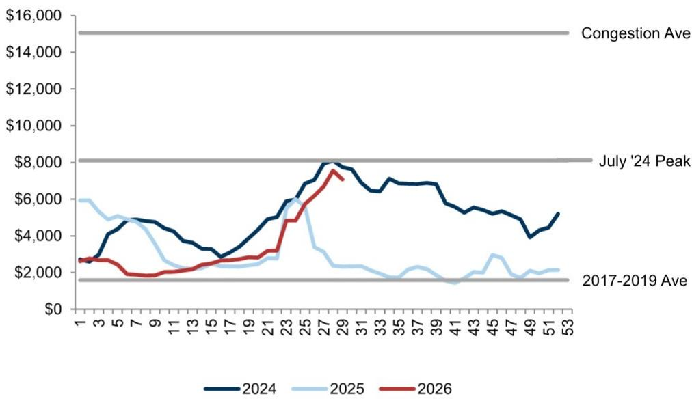  
截至2026年7月17日的周度运价  
来源：Freightos

- 最近一周洛杉矶港的计划TEU环比下降-6%，此前两周的环比变动分别为-5%和+4%。展望未来，本周的负向环比变动似乎将在下周转为+3%，然后在两周后下降至-7%。同比趋势预计下周TEU将下降-7%，两周后保持不变。

**图表10：计划TEU预计下周环比增加，两周后减少**  
洛杉矶港的计划TEU  
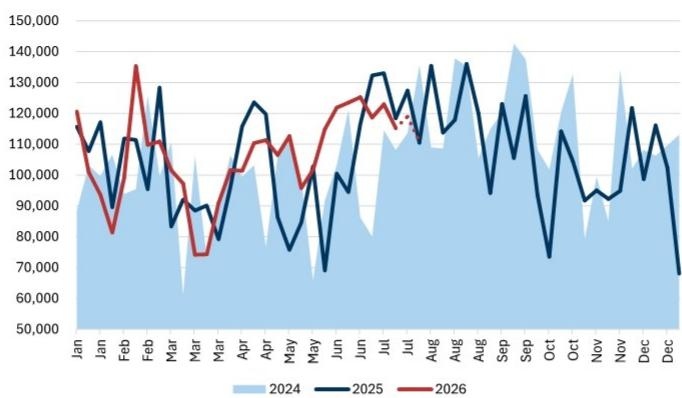  
截至2026年7月17日的每日更新周度数据 Port Optimizer数据包含截至7月31日当周的两周前瞻数据  
来源：Port Optimizer

**图表11：追踪过去四周及未来两周的运量**  
Port Optimizer 6周仪表盘

<table><tr><td colspan="8">Port Optimizer 6周仪表盘</td></tr><tr><td>日期</td><td>2026年6月19日</td><td>2026年6月26日</td><td>2026年7月3日</td><td>2026年7月10日</td><td>2026年7月17日</td><td>2026年7月24日</td><td>2026年7月31日</td></tr><tr><td>周</td><td>24</td><td>25</td><td>26</td><td>27</td><td>28</td><td>29</td><td>30</td></tr><tr><td>TEU</td><td>123,527</td><td>125,283</td><td>118,669</td><td>122,977</td><td>115,261</td><td>118,991</td><td>110,834</td></tr><tr><td>环比</td><td>不适用</td><td>1.4%</td><td>-5.3%</td><td>3.6%</td><td>-6.3%</td><td>3.2%</td><td>-6.9%</td></tr><tr><td>2025年环比</td><td>-6.0%</td><td>23.3%</td><td>13.6%</td><td>0.6%</td><td>-11.0%</td><td>7.6%</td><td>-13.3%</td></tr><tr><td>2026年同比</td><td>30.7%</td><td>7.5%</td><td>-10.3%</td><td>-7.6%</td><td>-2.7%</td><td>-6.6%</td><td>0.3%</td></tr><tr><td>船舶</td><td>22</td><td>23</td><td>23</td><td>22</td><td>23</td><td>21</td><td>21</td></tr><tr><td>环比</td><td>不适用</td><td>4.5%</td><td>0.0%</td><td>-4.3%</td><td>4.5%</td><td>-8.7%</td><td>0.0%</td></tr><tr><td>2025年环比</td><td>0.0%</td><td>17.6%</td><td>20.0%</td><td>8.3%</td><td>-7.7%</td><td>-12.5%</td><td>4.8%</td></tr><tr><td>2026年同比</td><td>29.4%</td><td>15.0%</td><td>-4.2%</td><td>-15.4%</td><td>-4.2%</td><td>0.0%</td><td>-4.5%</td></tr></table>

截至2026年7月10日的周度数据更新 Port Optimizer数据包含截至7月24日当周的两周前瞻数据

来源：Port Optimizer

**WorldACD每周货运趋势**：亚太地区至北美的重量和运价（截至7月9日；最新数据），两周对两周分别为-2%和-3%，前一周分别为-1%和+1%。重量的连续变动是需要关注的指标，以确定对快速循环物流的需求。我们继续关注海湾国家航空运力减少以及喷气燃料价格上涨对全球和区域运价的影响，同时注意到周度运价的可见性有限，并认识到一些机场航班有限恢复的动态情况。

西海岸（UNP/BNSF）的多式联运量最近一周同比增长+4%，前一周为+13%。

**西海岸不含燃油的整车即期运价**  
**图表13：西海岸多式联运车皮量同比增长+4%，前一周为+13%**  
西海岸多式联运车皮量  
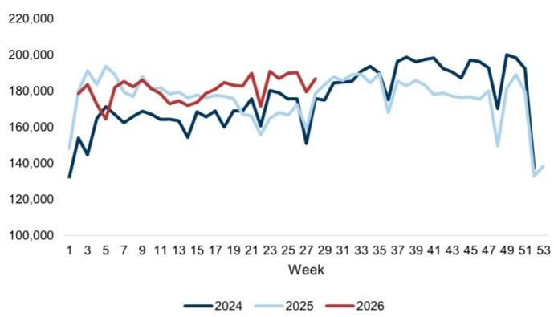  
截至2026年7月11日的周度多式联运车皮量  
来源：AAR

来自truckstop.com的西海岸不含燃油的整车即期运价最近一周环比下降-6%，同比上涨+69%。

■ 西海岸的卡车运力可用性指数环比上涨+25%，同比上涨+1%。

**图表14：上周西海岸运价同比上涨+69%**

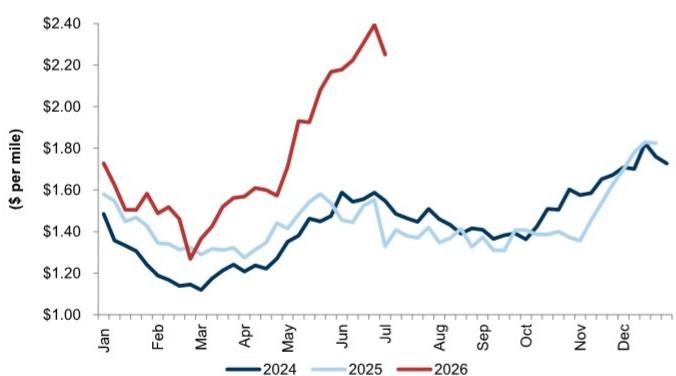  
截至2026年7月13日的周度数据

**图表15：上周西海岸卡车运力可用性同比上涨+1%**  
西海岸卡车运力可用性指数  
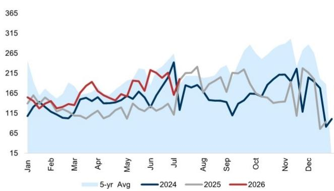  
截至2026年7月13日的周度数据

我们的供应链拥堵指数上周保持在'2'，瓶颈指数环比上涨+12%；整体流动性水平接近疫情前基线。

**图表16：根据我们的供应链拥堵指数，拥堵状况保持流动性，大致与疫情前水平相当**  
GS每周供应链拥堵指数，2020年2月至2026年7月  
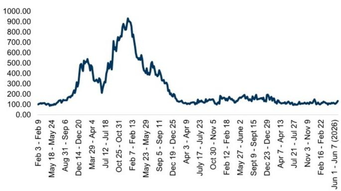  
截至2026年7月5日的周度数据  
来源：GS全球研究

## 滞后月度数据

我们纳入我们认为反映贸易政策对货运流量影响的月度数据。

三大港口（洛杉矶港、长滩港和奥克兰港）的运量从4月到5月同比增长+30%，环比增长+2.5%——低于+12%的历史季节性水平。

**图表17：5月西海岸运量较4月环比增长+2.5%，低于历史季节性水平**  
三大港口运量

<table><tr><td>2026年5月</td><td>同比%</td><td>环比%</td><td>5年同比%均值</td><td>5年环比%均值</td></tr><tr><td>长滩港</td><td>40.0%</td><td>7.4%</td><td>-0.9%</td><td>12.1%</td></tr><tr><td>洛杉矶港</td><td>26.2%</td><td>-2.3%</td><td>4.2%</td><td>12.9%</td></tr><tr><td>奥克兰港</td><td>5.7%</td><td>6.2%</td><td>2.6%</td><td>8.7%</td></tr><tr><td>三大港口总计</td><td>29.6%</td><td>2.5%</td><td>1.8%</td><td>12.0%</td></tr></table>

来源：洛杉矶港、长滩港、奥克兰港

**图表18：5月西海岸进口量同比增长+30%**  
三大港口运量同比  
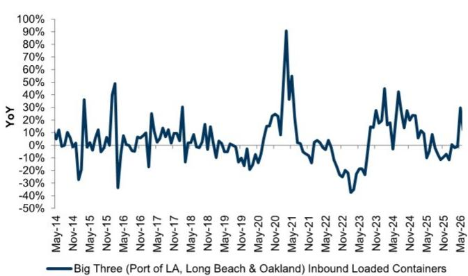  
来源：洛杉矶港、长滩港、奥克兰港

德鲁里从上海到洛杉矶的空运运价5月环比下降-2%，4月为上涨+25%。取决于地缘政治事件的发展，我们可能会看到6月运价随后上涨，因为航空运力被占用，加上喷气燃料价格上涨——有待观察。

**图表19：5月运价较4月环比下降-2%**  
德鲁里空运运价 上海到洛杉矶  
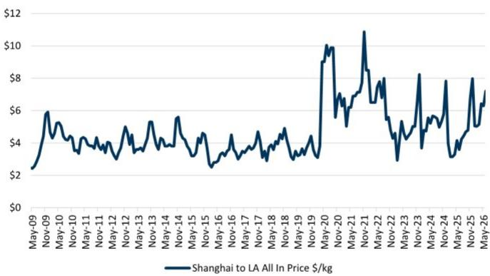

三大港口同比与彭博报告的中国、亚洲及亚洲（除中国）到美国TEU的月度同比增速显示出强相关性。

**图表20：三大港口增长通常跟随亚洲到美国TEU增长**  
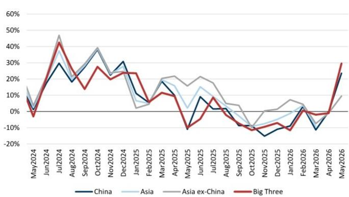  
中国和亚洲TEU同比数据截至2026年5月26日  
来源：彭博、洛杉矶港、长滩港、奥克兰港

我们估计，5月进口额可能同比增长约+48亿美元，而4月估计同比下降约-12亿美元（图表21）。此前从9月到1月均为下降。

□ 我们借鉴了去年10月码头工人罢工的类似分析（参见我们的码头工人影响报告）。根据美国运输统计局的数据，2022年海运贸易额约为2.3万亿美元。2022年美国前25大港口处理了4400万装载TEU，这意味着2022年每个装载集装箱（TEU）的平均价值约为52,000美元。按过去三年约3%的通胀率增长，每个集装箱的隐含价值约为57,000美元。将TEU的同比变化乘以每个TEU的价值，我们估算出月度进口价值的同比变化。

**图表21：我们估计5月水平同比上升**  
基于TEU同比变化和估计的每TEU价值的隐含贸易价值同比变化  
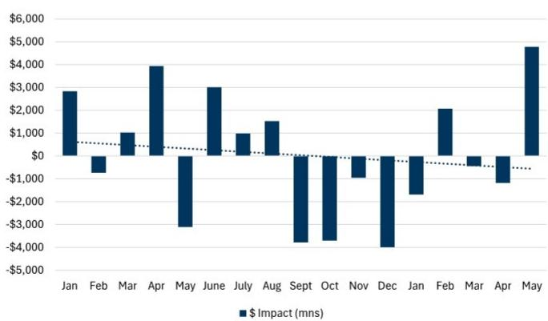  
来源：Port Optimizer、美国运输统计局（BTS）、GS全球研究

■ 物流经理指数库存水平扩张

□ 5月上游（B2B）库存扩张放缓至54.2，4月为57.9。

□ 5月下游（零售）库存扩张加快至57.8，4月为53.3。

## 图表22：LMI显示上游和下游均处于扩张状态

物流经理指数——库存水平扩张，上游（B2B）与下游（零售）受访者

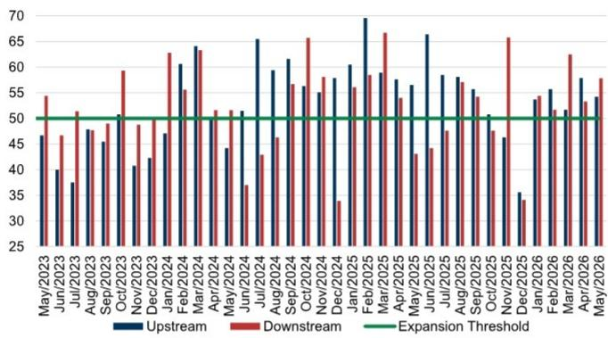  
来源：物流经理指数

■ 物流经理指数库存成本指数

□ 5月库存成本指数为84.1，4月为74.7，反映库存成本扩张加快。

图表23：5月库存成本较4月扩张加快
LMI库存成本指数  
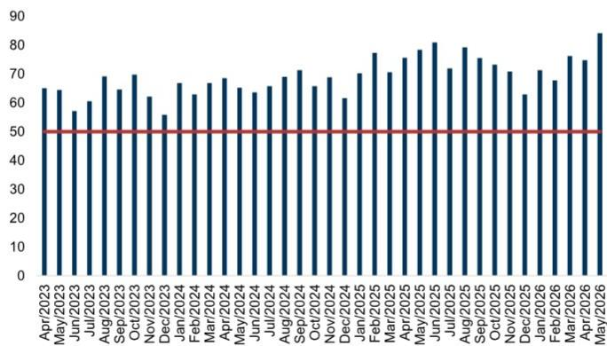  
来源：物流经理指数

- 零售商/制造商/批发商的库存销售比4月分别为1.09/1.50/1.19，低于3月的1.09/1.51/1.21。

图表24：库存销售比尚未出现如特朗普1.0时期那样的增长...

库存销售比：零售商（不含汽车及零部件经销商）

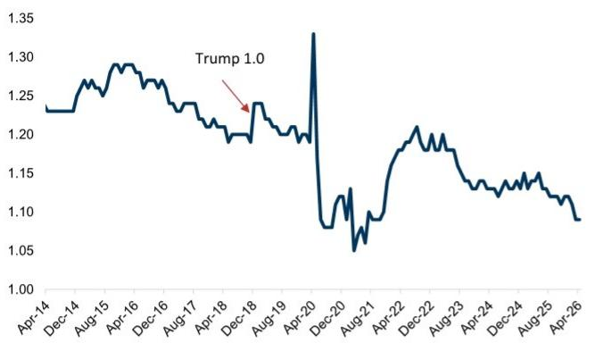  
来源：人口普查局

图表25：...制造商也是如此...
库存销售比 制造商  
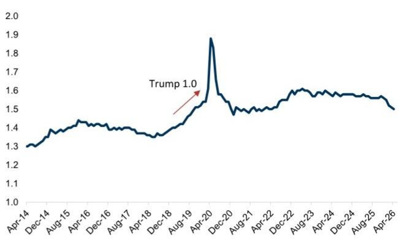  
来源：人口普查局

图表26：...而批发商也保持不变
库存销售比 批发商  
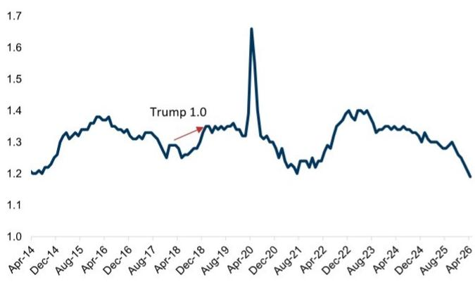  
来源：人口普查局

## 附录

## Reg AC

我们，Jordan Alliger、Paul Stoddard和Andrzej Tomczyk, CFA，特此证明本报告中表达的所有观点准确反映了我们对相关公司及其证券的个人观点。我们还证明，我们的薪酬中没有任何部分直接或间接与本报告中表达的具体建议或观点相关。

除非另有说明，本报告封面所列的个人是GS全球研究部门的分析师。

撰稿作者：Jordan Alliger GS & Co. LLC, Paul Stoddard GS & Co. LLC, Andrzej Tomczyk, CFA GS & Co. LLC。

除非另有说明，本报告撰稿作者披露中列出的个人是GS全球研究部门的分析师。

## GS因子概况

GS因子概况通过将一只股票的关键属性与市场（即我们的评级股票池）及其行业同行进行比较，提供该股票的研究背景。所描绘的四个关键属性是：增长、财务回报、倍数（例如估值）和综合（增长、财务回报和倍数的复合）。增长、财务回报和倍数是通过使用每只股票特定指标的标准化排名来计算的。然后将指标的标准化排名进行平均，并转换为相关属性的百分位数。每个指标的具体计算可能因财年、行业和地区而异，但标准方法如下：

增长基于股票的前瞻性销售增长、EBITDA增长和EPS增长（对于金融股，仅EPS和销售增长），百分位数越高表示增长性越强。财务回报基于股票的前瞻性ROE、ROCE和CROCI（对于金融股，仅ROE），百分位数越高表示财务回报越高。倍数基于股票的前瞻性P/E、P/B、价格/股息（P/D）、EV/EBITDA、EV/FCF和EV/债务调整后现金流（DACF）（对于金融股，仅P/E、P/B和P/D），百分位数越高表示股票交易倍数越高。综合百分位数计算为增长百分位数、财务回报百分位数和（100% - 倍数百分位数）的平均值。

财务回报和倍数使用GS分析师对未来至少三个季度后的财年末的预测。增长使用对未来至少七个季度后的财年与未来至少三个季度后的财年相比的输入（所有指标均基于每股）。

有关我们如何计算GS因子概况的更详细描述，请联系您的GS代表。

## M&A排名

在我们的全球覆盖范围内，我们使用M&A框架审视股票，考虑定性因素和定量因素（可能因行业和地区而异），以纳入某些公司可能被收购的可能性。然后我们分配一个M&A排名，作为对我们评级覆盖范围内的公司进行评分的方法，从1到3，其中1表示公司成为收购目标的高概率（30%-50%），2表示中等概率（15%-30%），3表示低概率（0%-15%）。对于排名为1或2的公司，按照我们的标准部门指南，我们将M&A组成部分纳入我们的目标价。M&A排名为3被视为不重要，因此不计入我们的目标价，并且可能在研究中讨论或不讨论。

## Quantum

Quantum是GS的专有数据库，提供详细的财务报表历史、预测和比率的访问。它可用于对单一公司进行深入分析，或在不同行业和市场的公司之间进行比较。

## 披露

## 评级和定价信息

联邦快递公司（积极评级，\$318.20）和联合包裹服务公司（积极评级，\$117.18）

## 评级/投行关系分布

GS研究全球股票覆盖范围

<table><tr><td rowspan="2"></td><td colspan="3">评级分布</td><td colspan="3">投行关系</td></tr><tr><td>积极</td><td>中性</td><td>消极</td><td>积极</td><td>中性</td><td>消极</td></tr><tr><td>全球</td><td>50%</td><td>34%</td><td>16%</td><td>65%</td><td>59%</td><td>43%</td></tr></table>

截至2026年7月1日，GS全球研究对3,104只股票进行了评级。GS将股票指定为各区域投资清单上的积极和消极；未如此指定的股票被视为中性。此类指定等同于FINRA规则要求的上述披露中的积极、中性和消极。请参阅下面的“评级、覆盖范围和相关定义”。投行关系图表反映了GS在过去十二个月内为每个评级类别中的相关公司提供投行服务的百分比。

## 监管披露

## 美国法律法规要求的披露

请参阅上述针对本报告中提及的公司的具体监管披露，以了解以下任何要求的披露：待定交易中的管理人或联合管理人；1%或以上的所有权；特定服务的报酬；客户关系类型；先前期间管理/联合管理的公开发行；董事职位；对于股票，做市和/或专家角色。GS可能作为本报告中讨论的发行人的债务证券（或相关衍生品）的本金进行交易或可能进行交易。

以下是额外要求的披露：所有权和重大利益冲突：GS政策禁止其分析师、向分析师报告的专业人员及其家庭成员持有分析师覆盖范围内任何公司的证券。分析师薪酬：分析师的薪酬部分基于GS的盈利能力，其中包括投行收入。分析师作为高管或董事：GS政策通常禁止其分析师、向分析师报告的人员或其家庭成员担任分析师覆盖范围内任何公司的高管、董事或顾问。非美国分析师：非美国分析师可能不是GS & Co. LLC的关联人员，因此可能不受FINRA规则2241或FINRA规则2242关于与相关公司沟通、公开露面以及交易分析师所覆盖证券的限制。

## 美国以外司法管辖区法律法规要求的额外披露

以下披露是相关司法管辖区要求的，除非已根据美国法律法规在上文作出。澳大利亚：GS Australia Pty Ltd及其关联公司不是澳大利亚的授权存款机构（该术语在1959年银行法（联邦）中定义），在澳大利亚不提供银行服务，也不从事银行业务。除非GS另有约定，本研究及其任何访问仅适用于澳大利亚公司法意义上的“批发客户”。在制作研究报告时，GS Australia全球研究部门的成员可能会参加由研究报告所涉及的公司和其他实体主办或组织的实地考察和其他会议。在某些情况下，如果GS Australia认为在实地考察或会议的具体情况下是适当和合理的，此类实地考察或会议的费用可能部分或全部由相关发行人承担。如果本文档的内容包含任何金融产品建议，则仅为一般性建议，由GS在未考虑客户的目标、财务状况或需求的情况下编制。客户在根据任何此类建议采取行动之前，应考虑该建议是否适合其自身的目标、财务状况和需求。某些GS Australia和New Zealand的利益披露以及GS的澳大利亚卖方研究独立性政策声明的副本可在以下网址获取：https://www.goldmansachs.com/disclosures/australia-new-zealand/index.html。巴西：有关CVM第20号决议的披露信息可在https://www.gs.com/worldwide/brazil/area/gir/index.html获取。在适用的情况下，根据CVM第20号决议第20条的定义，对本研究报告内容负主要责任的巴西注册分析师是本报告开头指定的第一作者，除非文本末尾另有说明。加拿大：此信息仅供您参考，在任何情况下都不应被解释为GS & Co. LLC为在加拿大购买证券而向加拿大读者发出的广告、要约或招揽。GS & Co. LLC未根据适用的加拿大证券法在任何加拿大司法管辖区注册为交易商，通常不被允许交易加拿大证券，并且可能被禁止在加拿大的某些司法管辖区销售某些证券和产品。如果您希望在加拿大交易任何加拿大证券或其他产品，请联系GS Canada Inc.（GS Group Inc.的关联公司）或其他注册的加拿大交易商。香港：可向GS (Asia) L.L.C.索取本研究中提及的所覆盖公司证券的进一步信息。印度：可从GS (India) Securities Private Limited获取本研究中提及的相关公司或公司的进一步信息，研究分析师 - SEBI注册号INH000001493，地址：10th Floor, Ascent-Worli, Sudam Kalu Ahire Marg, Worli, Mumbai-400 025, India，公司识别号U74140MH2006FTC160634，电话+91 22 6616 9000，传真+91 22 6616 9001。GS可能实益拥有本研究报告所涉及公司或公司1%或以上的证券（该术语在1956年印度证券合同（监管）法第2(h)条中定义）。SEBI的注册和NISM的认证绝不保证中介机构的业绩，也不向读者提供任何回报保证。GS (India) Securities Private Limited的合规官和读者投诉联系详情、年度合规审计报告副本以及其他相关信息和披露可在以下链接找到：

https://www.goldmansachs.com/worldwide/india/research-analyst。日本：见下文。韩国：除非GS另有约定，本研究及其任何访问仅适用于金融服务和资本市场法意义上的“专业读者”。可从GS (Asia) L.L.C., Seoul Branch获取本研究中提及的相关公司或公司的进一步信息。新西兰：GS New Zealand Limited及其关联公司在新西兰既不是“注册银行”也不是“存款接受者”（定义见1989年新西兰储备银行法）。除非GS另有约定，本研究及其任何访问适用于“批发客户”（定义见2008年金融顾问法）。某些GS Australia和New Zealand的利益披露副本可在以下网址获取：https://www.goldmansachs.com/disclosures/australia-new-zealand/index.html。俄罗斯：在俄罗斯联邦分发的研究报告不是俄罗斯立法中定义的广告，而是信息和分析，其主要目的不是推广产品，并且不提供俄罗斯评估活动立法意义上的评估。研究报告不构成俄罗斯法律法规定义的个人化建议，不针对特定客户，并且是在未分析客户的财务状况、概况或风险状况的情况下编制的。GS对客户或任何其他人基于本研究报告可能做出的任何决定不承担任何责任。新加坡：GS (Singapore) Pte.（公司编号：198602165W），受新加坡金融管理局监管，对本研究承担法律责任
