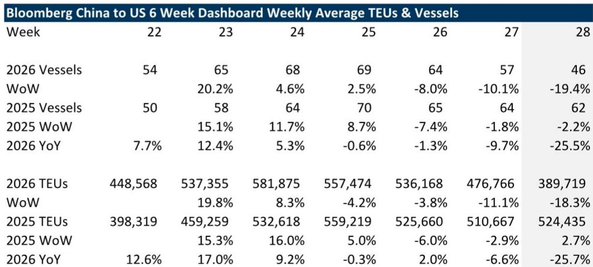
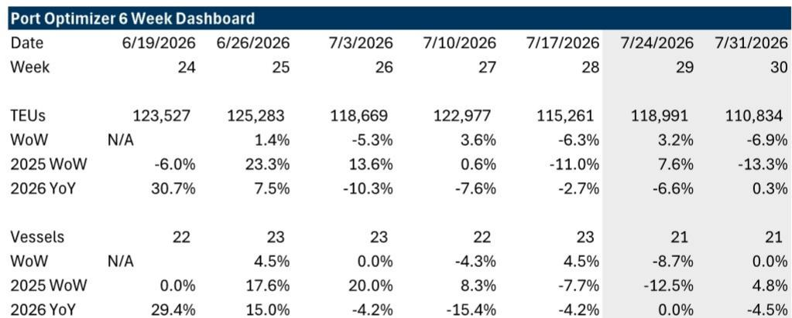

# GS：美国关税影响追踪-洛杉矶港进口未来两周先升后降

这份GS每周更新的关税影响追踪报告，提供了一个值得关注的短期信号：在经历连续数周的调整后，未来两周内，抵达洛杉矶港的集装箱量将出现一个短暂的环比回升，随后再次转负。这并非趋势反转，而更像是在高波动环境下的一个“喘息”窗口。报告的核心判断是，尽管贸易政策不确定性依然高企，但高频数据正在揭示一个更复杂的、由“抢运”与“观望”交替主导的供应链节奏。

## 1. 中国出发的货量正在加速仍在调整，但洛杉矶港的到港数据暗示了一个短暂的“补位”窗口

报告中最具即时性的证据来自两个相互印证的数据集。首先，从中国出发、驶往美国的满载集装箱船数量，在截至7月16日的一周内，同比大幅下降25.5%，环比也下降了19%。这已经是连续数周的下滑，且降幅在扩大。然而，洛杉矶港的“计划到港TEU”数据却呈现出一个不同的短期节奏：在刚刚过去的一周（7月17日当周）环比下降6%之后，下一周（7月24日当周）预计将环比回升3%，但再往后一周（7月31日当周）又将环比下降7%。

> **KC评论：** 这个“先反弹再回落”的短期节奏，很可能反映了部分货主在关税政策窗口期内的临时调整，而非需求的根本性改善。它更像是一个由“低有效税率”国家或地区（如越南、韩国）的出口替代，以及前期被压抑的订单释放共同作用下的短暂脉冲。真正的考验在于7月之后的货量走势，它将揭示零售商和制造商在库存策略上的真实选择。

## 2. 贸易政策的不确定性，正在从“一次性冲击”转向“持续性的规划难题”

报告明确指出，贸易不确定性依然是全球货运市场的核心变量。尤其值得关注的是，美国最高法院的裁决以及随后依据《122条款》宣布的新关税，其有效期仅为150天。这意味着，对于需要提前数月进行供应链规划的企业而言，他们面临的是一个“已知的未知”——150天后政策会如何演变？这种不确定性带来的直接后果是，中长期的货运规划变得极为困难。报告认为，一个更近期的潜在影响是，那些目前享受较低有效关税率的国家，可能会增加对美国的出口。但这个过程需要时间，尤其是在中国，由于今年春节较晚，制造业和航运的恢复节奏本已滞后。

## 3. 尽管短期数据波动剧烈，但GS对2026年的运输周期复苏保持“建设性”看法

报告并未因短期数据的波动而转向悲观。相反，它提出了一个中期观察框架，认为运输板块的盈利底部和升级周期，最终将取决于“货量增长”，尤其是高利润率的B2B、商业和制造业相关货流。报告列举了几个支撑这一判断的结构性因素：美联储的降息周期（GS宏观环境学家预测2026年12月还有一次降息）通常利好运输相关公司；2026年4月2日“解放日”关税一周年后，货主可能拥有更一致的“操作手册”；苹果、英伟达等公司宣布增加美国本土制造研究，将创造更多国内货运需求；以及“一揽子大美丽法案”中恢复的奖金折旧政策，可能激励企业资本再研究。

这些因素共同指向一个结论：尽管关税带来的短期冲击和不确定性仍在，但由“去库存”转向“再库存”的周期逻辑并未被破坏，只是被推迟了。报告认为，2026年下半年的货量能否出现一个“有意义的、全面的”拐点，是判断周期是否真正启动的关键。

这份报告的价值，在于它没有停留在对关税冲击的简单描述上，而是通过高频数据与中期框架的结合，为读者提供了一个观察供应链“应激反应”与“结构性调整”之间张力的窗口。对于关注全球贸易和物流的决策者而言，未来几周洛杉矶港的货量数据，以及7月之后中国出发货量的走势，将是验证上述判断的关键“路标”。

For informational purposes only. Portions may be generated,translated,summarized,or edited with AI assistance based on source materials and may contain omissions or errors. Please verify independently. This is not investment,legal,tax,accounting,or other professional advice.

