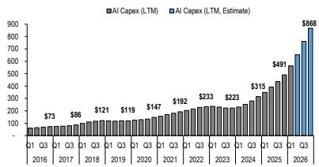
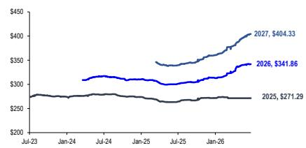
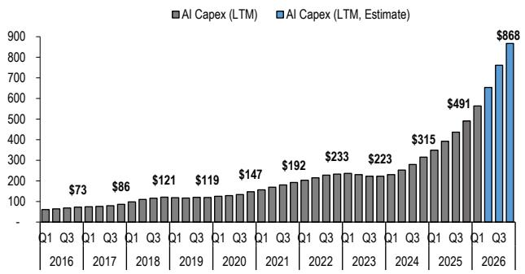
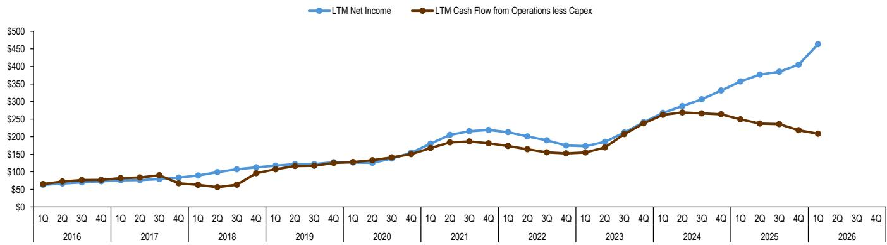
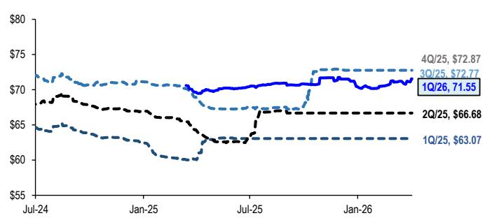
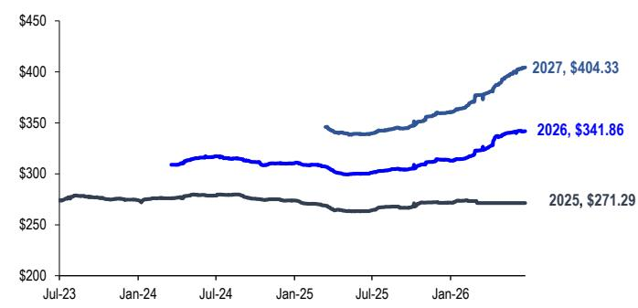

# 动量拥挤

## JPM

## 美国权益策略

超大规模企业 vs. AI硬件、AI资本支出与变现、动量回撤、第二季度财报

AI周期依然完整。本次财报季的核心主题仍围绕超大规模企业的资本支出指引，但市场更关注变现方面的具体证据。这包括增量应用场景，例如Meta出售过剩AI计算能力的举措。此外，Anthropic Mythos开发的潜在影响表明，安全担忧可能加速将工作负载迁移至云端平台的进程，涵盖私营部门及日益增长的公共部门，为云服务提供商、数据中心、半导体和企业软件创造了另一个长期支撑因素（参见《前沿AI提升安全成本》）。如果这些信号开始出现在前瞻性评论中，它们可能为超大规模企业的盈利和自由现金流曲线提供显著的增量支持。基于这一基本面背景、估值改善以及当前读者的持仓情况，中期来看，我们认为超大规模企业板块（即AI中游）相对于科技领域的其他部分具有更好的风险回报比，同时在软件领域（如网络安全）也存在精选机会，后者已成为一个重要的长期主题，我们在今年早些时候AI扰动担忧最严重时曾再次强调过这一点（参见报告）。

- 超大规模企业资本支出指引持续吸引大量关注的另一个原因是其对动量交易（即存储器和AI上游其他部分）的广泛影响。动量因子近期已从极端拥挤水平开始回撤。虽然持仓尚未完全出清，但进入财报季前的技术面看起来更为健康。然而，展望更远，动量因子的波动可能持续，原因包括对国内外即将到来的竞争性AI权益供应的担忧、远期资本支出曲线的斜率以及债务市场吸收这些融资的能力，以及潜在的突破性效率提升，还有与AI基础设施市场需求与供应平衡相关的终端利润率等更广泛的问题。

本次财报季的整体盈利背景依然积极但集中，预计第二季度盈利同比增长23%，由科技板块（英伟达和美光贡献约37%的总增长）领涨，剔除能源板块后增长19%，而营收预计同比增长12%。所有板块预计均将实现正营收增长，除医疗保健外所有板块预计均将实现正盈利增长。财报季的核心将在未来两周内到来，届时约52%市值的公司（包括四大超大规模企业）将发布财报，而英伟达及其他几家关键半导体公司将在稍后的8月中下旬发布财报。

- 第二季度超大规模企业的资本支出数据将再次成为AI基础设施建设的验证点，因为读者越来越寻求证据表明增量投资资本回报率能够证明持续的高支出水平是合理的。一致预期现在预计，到2026年底，与AI相关的资本支出将接近约8700亿美元（同比增长约77%），其中超大规模企业将贡献约7500亿美元。我们的互联网分析师对2026年的资本支出前景保持乐观，并已大幅上调了2027年的预测。对于明年，他们预测GOOGL的资本支出增长54%（约3000亿美元），AMZN增长42%（3000亿美元），META增长42%（约2000亿美元）。更多信息，请参阅我们分析师在此处的报告。这意味着未来4-6个季度的资本支出预期存在上行空间。如果这些公司能够通过更高的盈利指引来证明支出的合理性，随着数据中心投入使用，动量因子有可能更快地从“AI硬件”轮换回优质成长/超大规模企业（类似于2025年第一季度动量崩盘前看到的Mag-7/大盘股窄幅领涨格局）。

- 尽管资本支出增加对自由现金流造成压力，导致对债务和权益融资的依赖增加，但超大规模企业的基本面依然稳健。最初，这些公司主要通过内部产生的现金流为资本支出提供资金，但随着AI数据中心投资的加速，近年来债务发行量大幅增加。在五大超大规模企业中，总债务发行量已从2022年的约400-500亿美元（主要用于回购）增加到2026年的约1900亿美元（主要用于支持数据中心建设）。这导致读者越来越担心超大规模企业继续大规模进入债务市场的能力。然而，我们的信用研究团队认为这些担忧被夸大了，认为保险公司集中度限制尚未生效，高等级市场仍有大量容量吸收未来的发行，尽管随着供应预期的变化，利差可能会继续调整（参见《AI资本支出与成长烦恼》）。融资来源也开始向权益拓宽，GOOGL在6月筹集了850亿美元的权益，近期报告显示META正在评估类似的方案。重要的是，外部融资的增加似乎并未反映运营基本面的减弱。预计到2027年，运营现金流仍将超过9000亿美元，而FactSet的估计显示，到2030年，平均年化销售增长率为17%（过去5年平均为15%），同期净利润率保持在约26%的趋势水平之上（过去5年平均为20%）。实际上，市场似乎正在为AI数据中心的变现案例提供支持：今天的高资本支出最终应转化为更高的收入、更强的利润率和不断扩大的现金流。我们的基准情景是，超大规模企业将越来越多地指引AI变现，自由现金流最早可能在2027年开始回升。然而，更广泛和更持久的复苏可能要到2028年或更晚才会出现，特别是如果AI基础设施投资需要更多时间才能转化为有吸引力的投资资本回报率。

- 私人投资的按市值计价会计处理可能是第二季度更大的波动因素。第一季度盈利的支撑因素反映了非现金的私人公司持股重估（即Alphabet和Amazon持有的Anthropic），这些记录在公司利润表的“其他收入”项下。对于Mag7公司，这一项从2025年第一季度的约100亿美元增加到2026年第一季度的约360亿美元，我们估计第一季度约75美元的每股盈利中约有4美元来自这些标记。然而，考虑到私人AI公司的大部分估值重估发生在3月底之后，我们预计第二季度一次性收益的贡献会更大，反映了4月和5月私人估值的上升。尽管如此，由于私人市场估值快速变化以及持股比例的不确定性（最终取决于其他几个因素），精确的贡献难以量化。虽然这些非经常性收益（和亏损）通常被排除在一致预期和我们的估计之外，但主要数据提供商似乎将其包含在内，这使得未来几个季度每股盈利上调的质量更难评估。

- 预计盈利强劲，但增长仍高度集中。第二季度盈利预计同比增长23%，剔除能源板块后增长19%。这比年初的15%和4月1日的18%有所改善，意味着分别上调了8%和5%。营收预计同比增长12%。所有板块预计均将实现正营收增长，而除医疗保健（同比下降19%）外所有板块预计均将实现正盈利增长。值得注意的是，医疗保健板块预期的盈利收缩主要由少数公司驱动。剔除能源（同比增长122%）后，科技板块（同比增长64%）预计再次领涨盈利增长，仅英伟达和美光预计就贡献约37%的总增长。其他在盈利增长归因方面突出的公司包括XOM（约7%）、CVX（约6%）、AVGO（约6%）和GOOGL（约6%）。

AI资本支出（过去十二个月实际值 vs. 估计值）单位：十亿美元

来源：JPM权益策略与量化研究、彭博财经、FactSet。

标普500一致预期年度每股盈利

来源：JPM权益策略与量化研究、彭博财经、FactSet。

## 精选板块预览：

- AI资本支出超级周期仍是超大规模企业财报前的核心主题，且明显偏向积极。在整个板块中，关键波动因素是AI变现和回报，读者正在寻找云、广告和企业领域变现改善的证据，此外还有代币定价动态、前沿模型竞争（Claude、GPT-5.5/5.6、Grok 4.5、Muse Spark 1.1、Gemini 3.5），以及更波动的宏观背景，其中稳健的支出可能推动指引上调，即使消费者情绪疲软和军事活动重新活跃可能抑制部分第三季度展望。关键财报日期：Alphabet Inc（7/22）、Microsoft Corp（7/29）、Meta Platforms Inc（7/29）和Amazon.com Inc（7/31）。

- 半导体板块的技术面依然积极，受到AI需求增强和盈利持续上调的支持。该板块预计将交出又一个稳健的季度，第二季度业绩良好，第三季度评论积极，对2027年的更高预期延续了近期积极的盈利修正节奏。强劲的业绩可能有助于在近期约15%的回调后推动反弹，特别是需求信号持续增强，超大规模企业和AI实验室产能受限，代理型AI推理加速，以及超大规模企业数据中心资本支出预期走高。NVDA的Blackwell/Rubin框架和AVGO在2027财年实现超过1000亿美元AI收入的路径，已将需求可见性延伸至2027年之后，将讨论从AI需求是否真实转向供应链和电力供应能否跟上。除了加速器，AI的强势继续扩展到定制芯片、存储器、网络、半导体设备和EDA。抵消因素方面，消费者/客户端市场更为分化，存储器驱动的物料清单通胀对智能手机和PC需求构成压力，尽管更广泛的工业主导的周期性复苏仍在正轨。总体而言，今年半导体行业收入预计将增长30%以上（剔除存储器），首选敞口集中在高质量的AI和周期性复苏标的。关键财报日期：Nvidia Corp（8/26）、Broadcom Inc（9/4）和Micron Technology Inc（9/23）。

- 能源板块在第二季度盈利增长预期中占据较大份额，由雪佛龙和埃克森美孚领涨。尽管仅占标普500指数约4%的市值，一致预期显示能源板块贡献了该季度约23%的同比盈利增长，第二季度板块盈利预计同比增长约122%。这一强势主要归因于伊朗冲突后油价上涨，该季度增长预期年初为12%。与此一致，雪佛龙和埃克森美孚均有望实现比第一季度显著更强的季度业绩，反映了上游盈利对商品变现的更高杠杆和更好的运营表现，以及下游和炼油业务的反弹，因为利润率正常化且之前的阻力减弱。对于雪佛龙，焦点在于产量和运营率的改善以及下游恢复盈利。对于埃克森美孚，关键主题包括公司更新的调整后每股盈利框架以减少衍生品时间噪音，以及上游、能源产品和化学品业务的广泛环比改善。关键财报日期：ExxonMobil Holdings（7/31）和Chevron Corp（7/31）。

- 医疗保健是相对少见预计在第二季度实现负盈利增长的板块，尽管下降归因于少数公司。今年早些时候，我们对该板块的高增长领域变得更加积极（参见报告），普通读者的兴趣正在积累。特别是，它是AI应用的主要受益者之一，无论是从更高收入（加速药物发现过程）还是降低间接成本方面。鉴于其防御性且相对低配，该板块仍是我们首选的低波动板块。该板块在过去几周显著上涨，特别是生物技术和生命科学，原因是市场持续从投机性成长领域轮换出来。尽管如此，进入财报季，该板块将变得更加个股驱动，取决于第二季度盈利、指引更新或管线催化剂能否维持近期势头。在制药领域，第二季度的技术面看起来积极。板块内的趋势依然正面，大多数公司预计将超预期并上调指引，我们的分析师预计管理层评论不会引发促使读者轮换出该板块的担忧。生命科学工具的情绪也有所改善，尽管指引范围通常不假设终端市场有实质性复苏，近期的优异表现可能持续到第二季度财报，因为政策扰动的可能性较低，且需求趋势显示出改善迹象，这可能支持今年的一些上行空间，并为2027年提供更积极的基本面看法。关键财报日期：LLY（8/5）、ABBV（7/31）和MRK（8/4）。

- 航空航天与国防板块进入财报季时，商用航空的基本面势头更强，但国防在近期表现落后后技术面更为有利。商用航空重获一些动力，因为中东风险担忧开始消退，读者关注点回归生产复苏、售后市场实力和供应链执行改善，而国防则因资金轮换进入高增长股票、预算和中期不确定性增加、合同活动仍不均衡，以及读者权衡资本回报的潜在限制而落后。这为商用航空设定了更高的盈利门槛，为国防设定了较低的盈利门槛。短期内，这种格局可能使国防在稳健盈利或积极合同消息下表现优异，尽管任何挤压可能更多反映较轻的持仓和较低的估值，而非基本面前景的根本变化。商用航空仍有更强的底层故事，受到可见需求、生产正常化和售后市场增长的支持，但在近期反弹后上行空间可能更具选择性。请记住，国防情绪不太可能在拨款、2027财年预算路径和现金部署灵活性有更明确的信息之前决定性地转变，但长期背景仍然积极，因为地缘政治紧张局势持续存在，全球对武器和防御能力的需求强劲。

## 盈利记分卡：

- 超预期/未达预期。由于只有6%的标普500公司已发布财报，现在描绘该季度的全貌还为时过早。到目前为止，100%的公司盈利超预期（过去4个季度平均为78%，见图1），87%的公司营收超预期（过去4个季度平均为75%）。

- 惊喜/增长。迄今为止，标普500公司盈利惊喜为5.2%（过去4个季度平均为2.4%，剔除金融板块后为2.3%）。对于已发布财报的公司，第二季度营收增长远高于趋势水平，为17%，净利润增长为136%（剔除金融板块后约为137%）。

- 每股盈利修正。自财报季开始以来，每股盈利修正略有上升。第二季度每股盈利目前为81.75美元（同比增长23%），2026年全年每股盈利为341.86美元（同比增长26%），2027年每股盈利为404美元（同比增长18%）。

- 银行发布了稳健的财报，GS、美国银行、富国银行和Citi均超市场预期。业绩普遍受到强劲的交易和投行收入的支撑，同时管理层团队也指出贷款和存款增长稳健、持续的回购活动、稳定的资本比率、财富管理费复苏以及稳健的信用指标。公告后的股价表现和零售活动则表现不一。

图1：销售与盈利记分卡（基于当前成分股，自下而上汇总）

<table><tr><td rowspan="3"></td><td colspan="5">第二季度财报季</td><td colspan="4">惊喜百分比...</td><td colspan="4">超预期公司百分比...</td><td colspan="3">第二季度混合增长</td></tr><tr><td colspan="5">迄今已发布...</td><td colspan="2">营收</td><td colspan="2">净利润</td><td colspan="2">营收</td><td colspan="2">净利润</td><td colspan="3">已发布 + 估计</td></tr><tr><td>公司数</td><td>总数</td><td>占比</td><td>销售增长（同比）</td><td>盈利增长（同比）</td><td>平均（过去4季）</td><td>第二季度</td><td>平均（过去4季）</td><td>第二季度</td><td>平均（过去4季）</td><td>第二季度</td><td>平均（过去4季）</td><td>第二季度</td><td>销售增长（同比）</td><td>净利润（同比）</td><td>净利润（中位数）</td></tr><tr><td>标普500</td><td>31</td><td>500</td><td>6%</td><td>17.2%</td><td>135.6%</td><td>2.4%</td><td>5.2%</td><td>8.7%</td><td>22.3%</td><td>75%</td><td>87%</td><td>78%</td><td>100%</td><td>11.9%</td><td>22.6%</td><td>7.2%</td></tr><tr><td>Magnificent 7</td><td>0</td><td>7</td><td>0%</td><td>—</td><td>—</td><td>2.8%</td><td>—</td><td>16.4%</td><td>—</td><td>89%</td><td>—</td><td>93%</td><td>—</td><td>24.6%</td><td>30.1%</td><td>18.3%</td></tr><tr><td>剔除Mag 7</td><td>31</td><td>493</td><td>6%</td><td>17.2%</td><td>135.6%</td><td>2.3%</td><td>5.2%</td><td>5.9%</td><td>22.3%</td><td>75%</td><td>87%</td><td>78%</td><td>100%</td><td>10.1%</td><td>20.3%</td><td>7.1%</td></tr><tr><td>剔除金融</td><td>19</td><td>424</td><td>4%</td><td>17.2%</td><td>136.6%</td><td>2.3%</td><td>3.5%</td><td>8.8%</td><td>22.4%</td><td>77%</td><td>84%</td><td>78%</td><td>100%</td><td>12.3%</td><td>25.9%</td><td>7.2%</td></tr><tr><td>周期性</td><td>22</td><td>251</td><td>9%</td><td>14.8%</td><td>14.4%</td><td>2.8%</td><td>5.7%</td><td>9.3%</td><td>38.9%</td><td>71%</td><td>86%</td><td>75%</td><td>100%</td><td>10.5%</td><td>19.9%</td><td>6.6%</td></tr><tr><td>能源</td><td>0</td><td>21</td><td>0%</td><td>—</td><td>—</td><td>3.9%</td><td>—</td><td>4.2%</td><td>—</td><td>69%</td><td>—</td><td>63%</td><td>—</td><td>22.3%</td><td>122.4%</td><td>33.5%</td></tr><tr><td>材料</td><td>0</td><td>26</td><td>0%</td><td>—</td><td>—</td><td>1.5%</td><td>—</td><td>6.2%</td><td>—</td><td>69%</td><td>—</td><td>62%</td><td>—</td><td>7.0%</td><td>27.6%</td><td>2.3%</td></tr><tr><td>工业</td><td>7</td><td>81</td><td>9%</td><td>14.8%</td><td>-16.6%</td><td>2.3%</td><td>1.5%</td><td>8.1%</td><td>4.8%</td><td>72%</td><td>100%</td><td>79%</td><td>100%</td><td>8.0%</td><td>8.1%</td><td>6.2%</td></tr><tr><td>可选消费</td><td>3</td><td>47</td><td>6%</td><td>1.8%</td><td>41.9%</td><td>2.4%</td><td>0.4%</td><td>17.1%</td><td>89.0%</td><td>81%</td><td>33%</td><td>76%</td><td>100%</td><td>7.8%</td><td>6.6%</td><td>4.1%</td></tr><tr><td>金融</td><td>12</td><td>76</td><td>16%</td><td>17.2%</td><td>-0.1%</td><td>3.3%</td><td>7.3%</td><td>8.4%</td><td>3.1%</td><td>66%</td><td>92%</td><td>58%</td><td>100%</td><td>9.2%</td><td>8.1%</td><td>8.3%</td></tr><tr><td>长久期/长期成长</td><td>5</td><td>153</td><td>3%</td><td>25.3%</td><td>242.3%</td><td>2.3%</td><td>5.2%</td><td>9.0%</td><td>23.7%</td><td>87%</td><td>80%</td><td>87%</td><td>100%</td><td>15.1%</td><td>28.0%</td><td>9.3%</td></tr><tr><td>科技</td><td>2</td><td>74</td><td>3%</td><td>52.1%</td><td>242.3%</td><td>3.2%</td><td>10.1%</td><td>7.6%</td><td>23.7%</td><td>92%</td><td>50%</td><td>94%</td><td>100%</td><td>34.2%</td><td>64.0%</td><td>22.5%</td></tr><tr><td>通信</td><td>0</td><td>20</td><td>0%</td><td>—</td><td>—</td><td>1.9%</td><td>—</td><td>17.1%</td><td>—</td><td>75%</td><td>—</td><td>65%</td><td>—</td><td>11.9%</td><td>7.2%</td><td>3.6%</td></tr><tr><td>医疗保健</td><td>3</td><td>59</td><td>5%</td><td>3.9%</td><td>—</td><td>2.0%</td><td>2.5%</td><td>4.2%</td><td>—</td><td>86%</td><td>100%</td><td>86%</td><td>—</td><td>4.8%</td><td>-19.0%</td><td>5.3%</td></tr><tr><td>债券替代</td><td>4</td><td>96</td><td>4%</td><td>9.5%</td><td>9.2%</td><td>1.5%</td><td>0.8%</td><td>4.3%</td><td>3.7%</td><td>68%</td><td>100%</td><td>73%</td><td>100%</td><td>7.9%</td><td>6.9%</td><td>6.9%</td></tr><tr><td>必需消费</td><td>4</td><td>34</td><td>12%</td><td>9.5%</td><td>9.2%</td><td>1.0%</td><td>0.8%</td><td>4.2%</td><td>3.7%</td><td>69%</td><td>100%</td><td>89%</td><td>100%</td><td>7.5%</td><td>4.8%</td><td>6.9%</td></tr><tr><td>REITs</td><td>0</td><td>31</td><td>0%</td><td>—</td><td>—</td><td>1.7%</td><td>—</td><td>10.1%</td><td>—</td><td>67%</td><td>—</td><td>68%</td><td>—</td><td>9.5%</td><td>-2.7%</td><td>-10.1%</td></tr><tr><td>公用事业</td><td>0</td><td>31</td><td>0%</td><td>—</td><td>—</td><td>3.2%</td><td>—</td><td>1.5%</td><td>—</td><td>68%</td><td>—</td><td>61%</td><td>—</td><td>9.0%</td><td>17.5%</td><td>10.4%</td></tr></table>

来源：JPM权益宏观研究、彭博财经、FactSet。

## AI基本面

图2：AI资本支出（过去十二个月实际值 vs. 估计值）

来源：JPM权益策略与量化研究、彭博财经、FactSet。

图3：超大规模企业利润表

<table><tr><td></td><td>2025年实际</td><td>2026年估计</td><td>2027年估计</td><td>2028年估计</td><td>2029年估计</td><td>2030年估计</td></tr><tr><td>销售</td><td>$1,690</td><td>$1,998</td><td>$2,343</td><td>$2,752</td><td>$3,149</td><td>$3,654</td></tr><tr><td>同比增长</td><td>15%</td><td>18%</td><td>17%</td><td>17%</td><td>14%</td><td>16%</td></tr><tr><td>销售成本</td><td>672</td><td>785</td><td>924</td><td>1,081</td><td>1,215</td><td>1,445</td></tr><tr><td>毛利润</td><td>1,018</td><td>1,213</td><td>1,419</td><td>1,671</td><td>1,934</td><td>2,209</td></tr><tr><td>毛利率</td><td>60%</td><td>61%</td><td>61%</td><td>61%</td><td>61%</td><td>60%</td></tr><tr><td>运营成本</td><td>339</td><td>371</td><td>376</td><td>362</td><td>734</td><td>776</td></tr><tr><td>EBITDA</td><td>679</td><td>842</td><td>1,043</td><td>1,309</td><td>1,200</td><td>1,433</td></tr><tr><td>折旧与摊销</td><td>218</td><td>279</td><td>363</td><td>486</td><td>219</td><td>237</td></tr><tr><td>营业利润</td><td>461</td><td>562</td><td>681</td><td>823</td><td>982</td><td>1,197</td></tr><tr><td>利息+税</td><td>55</td><td>52</td><td>115</td><td>142</td><td>158</td><td>183</td></tr><tr><td>净利润</td><td>406</td><td>510</td><td>566</td><td>681</td><td>824</td><td>1,014</td></tr><tr><td>增长</td><td>22%</td><td>26%</td><td>11%</td><td>20%</td><td>21%</td><td>23%</td></tr><tr><td>利润率</td><td>24%</td><td>26%</td><td>24%</td><td>25%</td><td>26%</td><td>28%</td></tr></table>

来源：JPM权益策略与量化研究、彭博财经、FactSet。

图4：超大规模企业净利润 vs. 自由现金流

来源：JPM权益策略与量化研究、彭博财经、FactSet。

## 标普500一致预期每股盈利

图5：标普500一致预期季度每股盈利

来源：JPM权益策略与量化研究、彭博财经、FactSet。

图6：标普500一致预期年度每股盈利

来源：JPM权益策略与量化研究、彭博财经、FactSet。

## 标普500盈利日历

图7：标普500盈利日历 — 第二季度财报季
标普500公司发布财报

<table><tr><td rowspan="2"></td><td colspan="8">标普500公司发布财报</td></tr><tr><td>第1周7月13-17日</td><td>第2周7月20-24日</td><td>第3周7月27-31日</td><td>第4周8月03-07日</td><td>第5周8月10-14日</td><td>第6周8月17-21日</td><td>第7周8月24-28日</td><td>第8周8月31-04日</td></tr><tr><td>能源</td><td>1</td><td>3</td><td>4</td><td>12</td><td>0</td><td>0</td><td>0</td><td>0</td></tr><tr><td>材料</td><td>0</td><td>5</td><td>13</td><td>6</td><td>2</td><td>0</td><td>0</td><td>0</td></tr><tr><td>工业</td><td>5</td><td>20</td><td>32</td><td>16</td><td>0</td><td>2</td><td>0</td><td>1</td></tr><tr><td>可选消费</td><td>0</td><td>13</td><td>11</td><td>10</td><td>1</td><td>4</td><td>3</td><td>1</td></tr><tr><td>必需消费</td><td>1</td><td>2</td><td>11</td><td>7</td><td>0</td><td>3</td><td>4</td><td>2</td></tr><tr><td>医疗保健</td><td>5</td><td>7</td><td>19</td><td>24</td><td>1</td><td>1</td><td>2</td><td>0</td></tr><tr><td>金融</td><td>18</td><td>20</td><td>21</td><td>13</td><td>0</td><td>1</td><td>0</td><td>0</td></tr><tr><td>科技</td><td>0</td><td>8</td><td>21</td><td>19</td><td>2</td><td>5</td><td>4</td><td>5</td></tr><tr><td>电信</td><td>1</td><td>6</td><td>4</td><td>9</td><td>0</td><td>0</td><td>0</td><td>0</td></tr><tr><td>公用事业</td><td>0</td><td>2</td><td>18</td><td>11</td><td>0</td><td>0</td><td>0</td><td>0</td></tr><tr><td>房地产</td><td>1</td><td>4</td><td>18</td><td>7</td><td>1</td><td>0</td><td>0</td><td>0</td></tr><tr><td>标普500</td><td>32</td><td>90</td><td>172</td><td>134</td><td>7</td><td>16</td><td>13</td><td>9</td></tr><tr><td>占总数的百分比</td><td>6%</td><td>18%</td><td>34%</td><td>27%</td><td>1%</td><td>3%</td><td>3%</td><td>2%</td></tr></table>

来源：JPM权益策略与量化研究、彭博财经、FactSet。

图8：标普500 — 7月20日至7月24日当周按市值划分的发布财报公司

<table><tr><td>代码</td><td>名称</td><td>日期</td><td>价格</td><td>市值</td><td>销售增长（2026/1C）</td><td>自04/01/26以来的估计变化</td><td>盈利增长（2026/1C）</td><td>自04/01/26以来的估计变化</td></tr><tr><td>SBUX</td><td>星巴克公司</td><td>7/20/26</td><td>$105.11</td><td>$122,335</td><td>3.9%</td><td>0.2%</td><td>0.9%</td><td>1.5%</td></tr><tr><td>DHR</td><td>丹纳赫公司</td><td>7/21/26</td><td>$200.79</td><td>$141,667</td><td>4.5%</td><td>-0.1%</td><td>2.0%</td><td>0.0%</td></tr><tr><td>CB</td><td>安达有限公司</td><td>7/21/26</td><td>$337.44</td><td>$137,589</td><td>7.0%</td><td>-0.2%</td><td>75.9%</td><td>0.7%</td></tr><tr><td>COF</td><td>第一资本金融公司</td><td>7/21/26</td><td>$208.89</td><td>$125,064</td><td>53.6%</td><td>-0.5%
