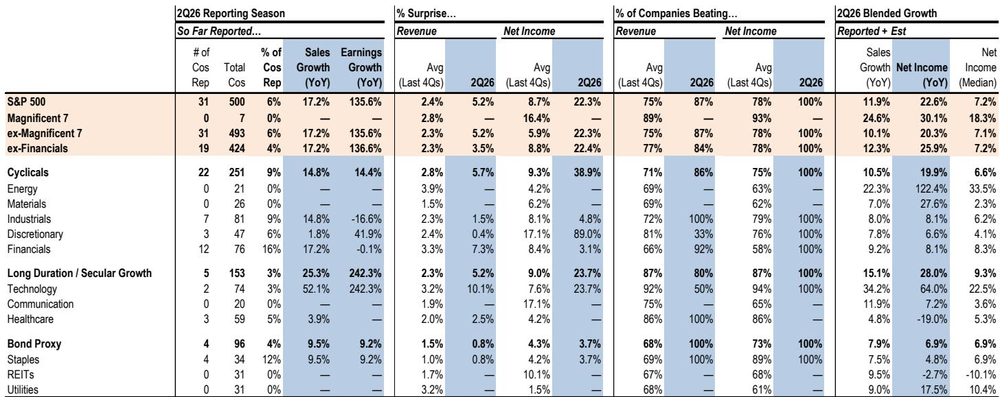
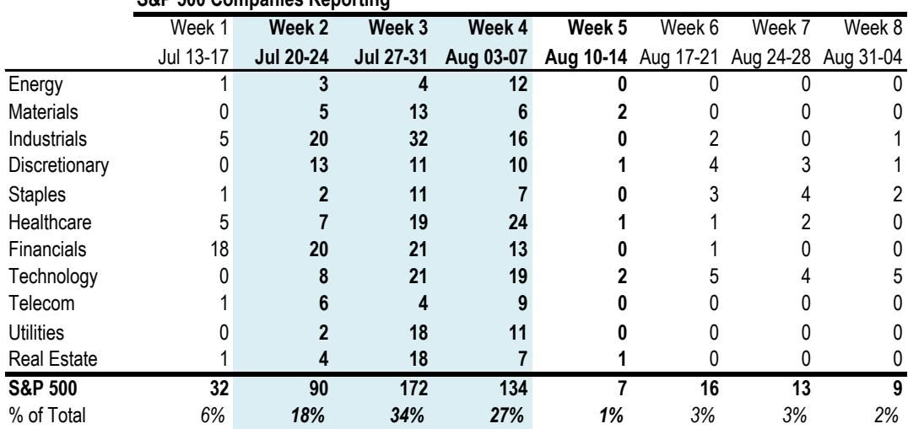
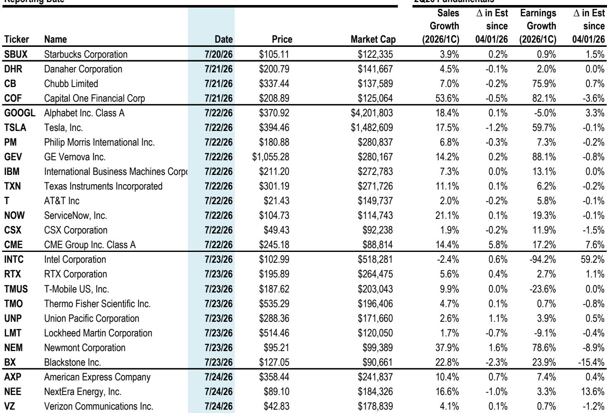

# JPM：美国市场策略，超大规模云厂商与AI硬件-资本开支

AI基础设施的叙事没有改变，但市场的关注点正在发生微妙的位移。JPM在最新发布的美国市场策略报告中指出，即将到来的二季度财报季，核心主题依然是超大规模云厂商的资本开支指引，但市场对“货币化”的追问正变得更加具体和迫切。报告认为，如果这些信号在管理层的前瞻评论中开始浮现，将可能为超大规模厂商的盈利和自由现金流曲线提供显著增量支撑。从中期看，该机构在科技板块内部更看好AI中游——即超大规模云厂商本身——相对于其他细分领域的不确定性回报比。

这一判断的底层逻辑并不复杂。AI研究已从“要不要投”进入“投了能赚回多少”的阶段。报告估算，市场共识预计到2026年底，与AI相关的资本开支将接近8700亿美元，同比增长约77%，其中超大规模厂商贡献约7500亿美元。JPM的互联网分析师团队对2027年的预测更为积极：谷歌资本开支预计增长54%至约3000亿美元，亚马逊和Meta分别增长42%至3000亿美元和2000亿美元。这些数字意味着，未来4-6个季度的共识预期存在上行空间。

> **KC评论：** 报告的核心图表之一是AI资本开支的长期实际值与预测值对比。读者需要留意的是，2027年的预测数字已经明显高于当前市场共识，这意味着如果超大规模厂商在财报中给出更高的资本开支指引，市场可能将其解读为需求信号而非过度投入。

## 1. 动量因子正在从拥挤中出清，但不确定性并未完全消散

另一个值得关注的信号是动量因子的近期表现。报告指出，动量因子已从极端拥挤的水平开始回落。虽然仓位尚未完全出清，但进入财报季前的技术面设置已经更为健康。然而，波动可能持续。报告列出了几个关键不确定性点：国内外竞争性AI公司供给的涌入、远期资本开支曲线的斜率、债务市场吸收融资的能力，以及潜在的效率突破对AI基础设施市场供需平衡和终端利润率的长期影响。

这些因素叠加在一起，意味着动量因子在AI硬件和超大规模厂商之间的轮动可能加速。报告特别提到，如果超大规模厂商能够通过更高的盈利指引来证明其资本开支的合理性，动量资金可能更快地从“AI硬件”轮动回“质量成长/超大规模厂商”——类似2025年一季度动量明显波动前那种由Mag-7主导的窄幅领先格局。

## 2. 融资结构变化：从内部现金流到债务与股权并举

超大规模厂商的基本面依然稳健，但资本开支对自由现金流的不确定性正在加大，这迫使其融资结构发生显著变化。报告数据显示，五家最大超大规模厂商的合计债务发行量已从2022年的约400-500亿美元（主要用于回购）攀升至2026年的约1900亿美元（主要用于数据中心建设）。这一变化引发了市场对债务市场承接能力的关注。

但JPM的信用研究团队认为这些关注被夸大了。他们指出，保险公司集中度限制尚未触及阈值，高评级市场仍有充足容量吸收未来发行，尽管随着供给预期的变化，利差可能继续调整。融资来源也在向股权端拓宽：谷歌在6月通过股权融资850亿美元，近期有报道称Meta也在评估类似方案。

重要的是，外部融资的增加并不反映运营基本面的变化。报告预计，到2027年，超大规模厂商的经营现金流仍将超过9000亿美元，而FactSet的预测显示，到2030年，其平均年化销售增速为17%，高于过去五年的15%均值，净利润率维持在约26%的较高水平。市场实际上已经在为AI数据中心的货币化前景定价：今天的资本开支最终应转化为更高的收入、更强的利润率和扩张的现金流。

> **KC评论：** 报告对自由现金流拐点的判断值得注意：基础情形下，超大规模厂商可能在2027年就开始看到自由现金流的改善，但更广泛、更持久的复苏可能要等到2028年或更晚。这取决于AI基础设施研究能否在合理时间内转化为有吸引力的投入资本回报率。

## 3. 二季度盈利增长集中度极高，能源与科技主导

从整体盈利格局看，二季度标普500盈利预计同比增长23%，科技板块是主要驱动力。但集中度极高：仅英伟达和美光两家公司就贡献了约37%的科技板块盈利增长。能源板块虽然市值仅占标普500约4%，却贡献了约23%的季度盈利增长，主要受伊朗冲突后油价上涨推动。

医疗保健是相对少见预计盈利负增长的板块，同比下降约19%，但报告指出这一调整主要由少数公司驱动。该板块仍是JPM最看好的低波动板块，原因在于其防御属性、相对低配的仓位，以及AI在药物发现和成本削减方面的潜在受益。

## 4. 观察框架：如何判断AI叙事是否在转向

对于希望跟踪这一轮财报季的读者，报告提供了一个可复用的观察框架。核心变量有三个：第一，超大规模厂商的资本开支指引是否继续上调，以及上调的幅度是否超出市场预期；第二，管理层是否开始提供更具体的AI货币化证据，例如Meta出售过剩AI计算能力这类增量用例；第三，自由现金流和融资结构的变化是否引发市场对回报率的重新评估。

报告特别提到，二季度财报中一个可能被忽视的变量是私人研究的按市值计价会计处理。一季度Mag-7的“其他收入”项从约100亿美元跃升至约360亿美元，其中约4美元/股的盈利来自私人公司持股的重估。由于大多数私人AI公司的估值重估发生在3月之后，二季度这一一次性收益的贡献可能更大。但报告提醒，这些非经常性损益通常被排除在共识和该机构的预测之外，而主要数据提供商似乎正在将其纳入，这使得未来几个季度盈利上修的质量更难评估。

这一细节本身就是一个信号：当市场开始为“非经常性收益”的可持续性争论时，AI叙事正在从“投多少”转向“赚多少”。

For informational purposes only. Portions may be generated,translated,summarized,or edited with AI assistance based on source materials and may contain omissions or errors. Please verify independently. This is not investment,legal,tax,accounting,or other professional advice.

