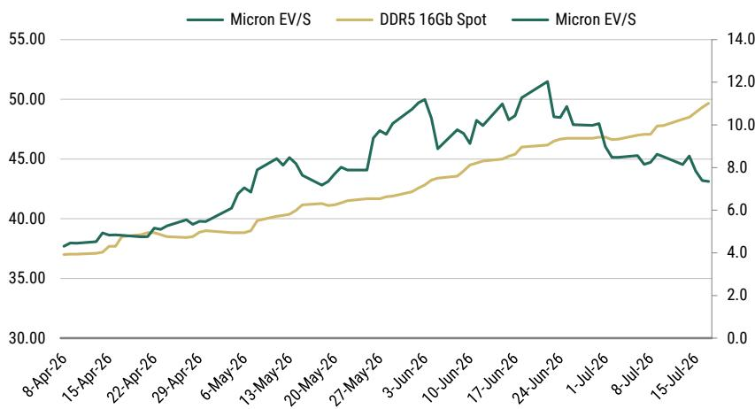
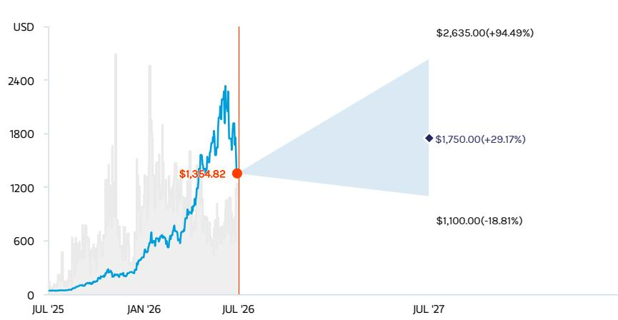
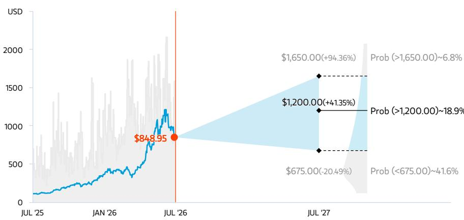

# 美国存储类公司近期调整，市场关注度提升

这是一个不同寻常的存储周期，数据中心需求是主要驱动因素——这意味着正如我们在四月份所看到的，其他领域存在一些可能具有误导性的混合信号。在我们覆盖的范围内，存储并非风险回报最优的领域——我们认为NVDA/AVGO更具优势——但差距正在迅速缩小。

## 核心要点

\- 近期的关注点——二阶导数放缓、资本支出上升、规格降级——在一个月前是可以预见的

但这不是一个正常的周期——存储是瓶颈，并且日益成为AI建设（以及代理型CPU建设）的关键瓶颈，而这些需求看起来具有持续性

结果是——短缺持续加剧，数据中心存储价格在第三季度环比上涨超过25%

\- 从某种程度上说，这比第二季度更高的涨幅有所放缓，但这一点早已显而易见

长期协议和规格降级可能会平抑周期的波动幅度（相对于过高的预期）——但会延长周期持续时间，从长期来看这对公司可能更有利

存储类公司持仓较为集中，鉴于本周期的不寻常性质，出现回调的时期似乎不可避免——但我们认为这种调整提供了关注机会。在一个完全由数据中心驱动的周期中，消费、PC、智能手机市场会出现混合信号，这些信号会在不同时间点影响现货市场和库存水平；我们认为，近期拖累相关公司的一些传闻主要来自这些市场领域。

但我们上周与数据中心领域的几位采购联系人进行了交流，该业务领域的短缺强度没有显示出缓解迹象。我们看到，从第二季度到第三季度，同类产品的价格至少上涨了25%，高于我们的预估和第三方预估。同样重要的是，关于存储短缺将在2027年及2028年进一步加剧的长期担忧依然强烈。相对于AI需求，存储供应不足，而且我们认为这种情况不会改变。

## 半导体

**北美行业观点：具有吸引力**

**图表1：DRAM估值倍数已大幅回调，现货价格持续走高**

但这是否是二阶导数的放缓？是的，当然，我们一再强调这是不可避免的。根据SIA数据，DRAM价格在第一季度环比上涨70%，第二季度超过40%。考虑到本季度存储收入已超过2000亿美元，而去年同期为460亿美元，延续这种势头几乎不可能——如果真的延续，将对需求造成破坏，因为DRAM收入将赶上云资本支出。所有人都知道这一点，并且在几周前价格达到高点时就已经知道。

长期协议是否会限制上行空间？我们的观点是，长期协议对公司很重要，但更多的是因为它们提供了我们调研所显示的证据，而不是因为它们在任何环境下都是严格的固定合同。也就是说，协议的结构在一定程度上旨在提供持续时间，但限制周期的波动幅度。长期协议并不能确保客户支付峰值价格，而是介于两者之间。

尽管如此，我们认为美光在财报电话会议上披露的“第二季度价格可能是近期部分已达成交易的上限”是一种相对保守的表述。根据我们的行业调研，这些交易可能是在一段时间前原则上达成的，法律签署等流程耗时较长，而现在正在达成的新交易将有更高的上限。

仍然可以说，长期协议是一种折中方案，为双方提供了一定的确定性和保护，它可能会让那些对近期盈利预期过高的人感到失望。

关于规格降级？我们最近注意到，我们认为英伟达已经相当实质性地削减了机架中的主要LPDDR5存储容量。此外，英伟达也谈到了需要推动更高的存储效率，因为代币每年增长10倍，远远超过存储供应的增长，这不仅仅是规格降级。可能需要对计算、工作和存储进行全面的重新设计，以优化存储限制。

这是一个可能在边际上抑制价格的因素。如果公司因为DRAM不足而无法出货，季度末的拍卖会对价格产生强大影响。但与此同时，我们的观点是，这提供了一个非常持久的周期视角，因为存储使用量肯定会随着供应而增长。

这些潜在行动背后的基本前提是，我们面临一个将持续数年的存储短缺，AI业务不会因为等待更多存储而停滞，我们会想办法应对。但那个长期的短缺才是关键信号。

更高的DRAM资本支出肯定会推动更多供应，但我们现在讨论的主要需求驱动力并非一个增长3-5%的PC、智能手机和服务器市场。基于处理器公司的评论，AI支出增长超过50%——可能远高于此——每年都变得更加重要，因为AI在整体中的占比越来越大。HBM4的复杂性将吸收产能，明年Rubin Ultra的内容量将弹性较高——但机架对低功耗DDR5的需求也非常旺盛，企业存储需求同样很高。

在NAND方面，资本支出一直出奇地温和；我们确实预计明年的支出会上升，但不会以扩大供应的方式进行。

我们的观点仍然是，从以往的周期中寻找卖出信号是不得要领的。存储不仅受到AI需求的约束——存储正日益成为AI需求的主要约束之一，与空间和电力并列。三年来，我们听到其他人提出这种观点，我们当时并不同意，因为DRAM供应显然存在闲置，但现在这种闲置已经消失。AI消耗了如此多的DRAM，以至于没有足够的留给其他领域，而且我们在各处都看到迹象表明它是一个真正的瓶颈。它正在阻碍PC和智能手机的制造。云客户正在为6周的加急订单支付高于预期第二季度价格的价格；我们认为这些客户支付溢价是为了在仓库中囤积存储吗？

在这里，持续时间在许多方面是最重要的讨论，而不是峰值盈利的幅度。持续数年且从当前运行率攀升的盈利，可能比一个非常强劲的年份更有利于高估值，而这里的大多数行动——长期协议、客户工程努力——都指向更强的持续时间。

因此，我们认为相关公司的调整创造了一个值得关注的时机。我们认为市场上最好的价值来自计算领域的公司，特别是NVDA和AVGO，但鉴于这种放缓，存储正在迅速追赶，我们认为这应该为相关公司提供一个良好的关注时机。

## 风险回报——SanDisk Corporation (SNDK.O)

NAND在云需求加速的背景下快速改善

## 目标价 1,750.00美元

我们假设28倍周期平均每股收益62.50美元（相对于我们对FY21-FY29平均56美元的预估）。随着行业动态改善以及eSSD需求带来持续的高盈利水平。28倍略低于我们对美光的周期平均倍数目标（28.5倍），因为较低的AI敞口被历史上更高的自由现金流转化率所抵消。

**共识目标价分布**

**风险回报图**

## 超配观点

AI需求正在改变NAND市场，并将周期峰值每股收益推至过去数倍的水平。在产能新增投资仍然有限以及AI需求驱动因素不断演变的背景下，我们看到盈利上调的长期空间。

**风险回报主题**

## 乐观情景

2,635.00美元

31倍周期平均每股收益85美元

## 基准情景

1,750.00美元

28倍周期平均每股收益62.50美元

## 保守情景

1,100.00美元

25倍周期平均每股收益44美元

## 风险回报——Micron Technology Inc. (MU.O)

预计多个季度的盈利上调，AI推动更高估值倍数

## 目标价 1,200.00美元

30倍周期平均每股收益40.00美元，相对于历史水平溢价，反映了AI领域的新机遇，与更广泛的半导体行业一致。

**共识目标价分布**

**风险回报图及期权隐含概率（12个月）**

## 超配观点

\- DRAM基本面处于未知领域，随着数据中心/AI市场持续上行，应继续改善
- AI方面的执行力被低估，我们预计美光在2026日历年将保持HBM份额，支持利润率并推动高于以往周期的估值倍数
- 周期持续性将是关键，供需可能在未来2-3年保持紧张

## 乐观情景

1,650.00美元

33倍周期平均每股收益50美元

## 基准情景

1,200.00美元

30倍周期平均每股收益40美元

## 保守情景

675.00美元

27倍周期平均每股收益25.00美元

## 估值方法与风险

## Broadcom Inc. (AVGO.O)

我们以28倍2027日历年度ModelWare每股收益17.92美元对AVGO进行估值。这大约是非GAAP每股收益19.59美元的26倍，与AI同行群体大致一致或略低。

## 上行风险

■ AI收入更强

■ 核心半导体业务更快复苏

■ VMware协同效应实现

## 下行风险

■ 网络份额被英伟达（Mellanox）抢占

■ ASIC芯片缺乏竞争力；客户转向竞争对手

■ VMware收购的执行

## NVIDIA Corp. (NVDA.O)

约22倍我们的2027日历年度每股收益预估13.08美元，与更广泛市场一致，相对于计算半导体同行（AMD/AVGO/INTC）有折价，因为高市场份额和毛利率在短期内限制了估值倍数扩张的空间。

## 上行风险

■ 训练和推理的增长推动数据中心收入

■ 基于GPU的AI PC获得 traction，游戏销售加速

■ 英伟达能够在中国收复失去的收入

## 下行风险

■ AI终端市场未如预期实现，客户大幅削减GPU采购

■ AMD重新成为可行的GPU竞争对手

■ 谷歌以外的云客户能够开发出有竞争力的定制硬件
