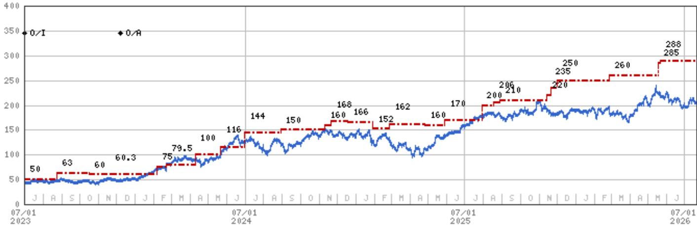
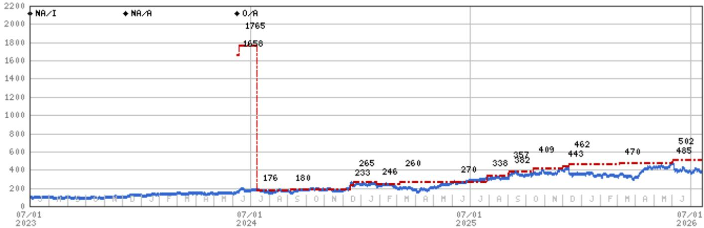
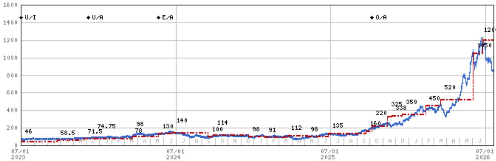

# MS：半导体-美国存储器报价回调带来观察窗口

这轮美国存储器公司报价回调，市场关注的是二阶导数节奏变化、资本开支上升、客户去规格化。这些担忧一个月前就可以预见，但真正的问题不是需求会不会减速，而是供给能不能跟上。MS最新报告的核心判断是：存储器已经从AI需求的受益者，变成了AI供给的瓶颈。数据中心内存价格三季度环比上涨至少25%，高于该机构和第三方预期。短缺没有缓解迹象，反而在加剧。

报告认为，用过去周期的经验来寻找偏谨慎信号，可能完全找错了方向。存储器不是被AI需求约束，而是正在成为AI需求的主要约束之一，和空间、电力并列。三年前，存储器供给还有余量，但现在这个余量已经消失。AI消耗的DRAM太多，以至于其他行业分不到足够的产能，PC和智能手机的出货都因此受到抑制。

> **KC评论：** 报告的核心论据来自对数据中心采购渠道的直接调研。客户愿意为六周加急订单支付高于二季度合同价的价格，这不是囤货行为，而是真实的产能挤兑。

## 1. 长协和去规格化不是在压低周期，而是在拉长周期

市场对长期协议和去规格化的担忧集中在“它们会压低价格峰值”。报告认为，这些动作的真正影响是改变周期的形状，而不是终结周期的方向。长期协议的本质是买卖双方在中间价位达成共识，为双方提供确定性和保护。它确实可能让那些对短期盈利有极高预期的读者失望，但它同时提供了更长的盈利可见度。

去规格化同样如此。英伟达削减了机架中LPDDR5的内存含量，同时也在推动更高效的内存使用策略。这些动作背后的前提是：存储器短缺将持续数年。与其让AI业务停下来等待更多存储器，不如在现有约束下优化。这种优化本身就在确认短缺的长期性。

## 2. 资本开支增加不会立刻缓解短缺

DRAM厂商确实在增加资本开支，但关键变量是需求结构的变化。AI支出的增速超过50%，且每年占比都在提高。HBM4的复杂性会吸收大量产能，Rubin Ultra将使内容弹性较高。同时，机架对低功耗DDR5的需求、企业存储的需求都在高位。

NAND的情况更极端。资本开支持续处于极低水平，明年预计会上升，但不足以实质性地扩大供给。报告认为，在AI需求面前，传统3-5%增长的PC、智能手机和服务器市场已经不是主要需求驱动力。

## 3. 周期持续性的价值可能超过周期振幅

报告提出了一个值得关注的框架：周期的持续时间可能比振幅更重要。连续数年从当前水平爬升的盈利，比一个极强的单年盈利更有利于支撑高估值。长期协议、客户工程优化、资本开支的克制，这些因素都在指向更强的持续性，而不是更高的峰值。

对于读者而言，这意味着需要调整评估存储器公司的方法。传统的周期峰值市盈率框架可能不再适用，更值得关注的是通过周期的盈利能力和持续时长。报告认为，存储器板块的拥挤度和这个周期的特殊性，使得回调不可避免，但每次回调都值得关注。

> **KC评论：** 报告将周期持续性置于振幅之上，这改变了估值逻辑。如果盈利能在高位维持数年，而不是一个尖峰后迅速回落，那么当前报价对应的隐含回报可能比表面看起来更有吸引力。这个框架同样适用于评估其他AI基础设施相关公司。

For informational purposes only. Portions may be generated,translated,summarized,or edited with AI assistance based on source materials and may contain omissions or errors. Please verify independently. This is not investment,legal,tax,accounting,or other professional advice.

For informational purposes only. Portions may be generated,translated,summarized,or edited with AI assistance based on source materials and may contain omissions or errors. Please verify independently. This is not investment,legal,tax,accounting,or other professional advice.

