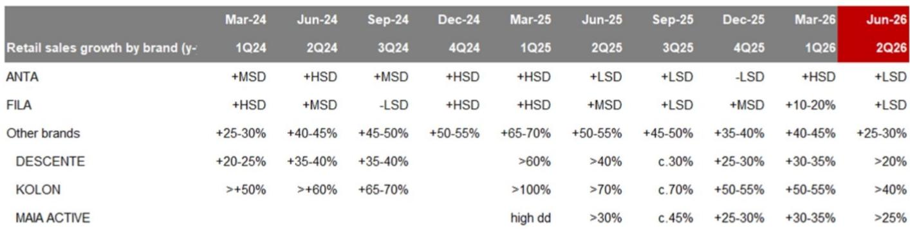
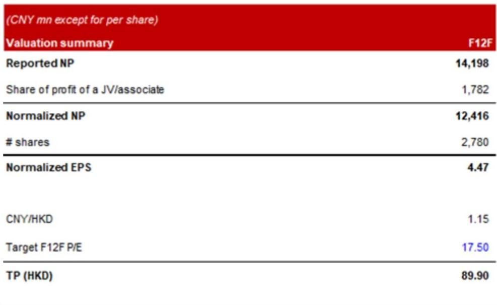
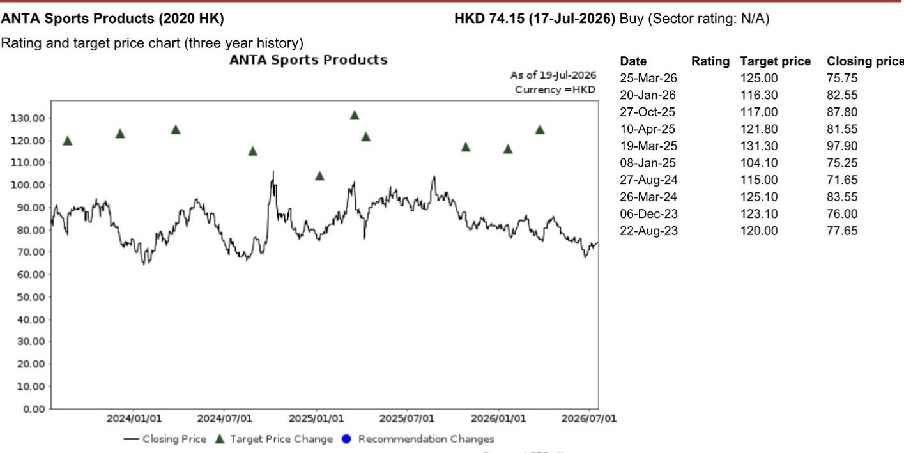

# NOM：安踏体育，行业节奏变化下的韧性表现

安踏体育7月17日披露的第二季度运营数据，透露了一个与市场普遍感受略有不同的信号。当同行普遍面临销售动能环比走弱时，安踏核心品牌和FILA品牌分别录得低个位数同比增长，其他品牌则实现了25%至30%的增速。这份NOM研报的核心判断是：安踏的多品牌策略和运营调整正在发挥作用，使其在行业整体减速中展现出超出平均水平的韧性。

二季度安踏核心品牌和FILA的增速虽然较一季度有所回落，但横向对比，其表现仍跑赢了运动服饰板块。NOM认为，这反映了安踏多品牌组合的抗压能力。上半年整体来看，安踏核心品牌和FILA均实现中个位数增长，其他品牌增速达到35%至40%，全年销售目标仍在轨道上。

> **KC评论：** 季度环比节奏变化是事实，但关键不是相对增速，而是相对同行是否跑赢。NOM用“跑赢板块”作为判断依据，而非单纯看数字高低。这张图（Fig. 1）展示的季度零售趋势对比，是理解安踏当前市场位置的核心材料。

## 1. 运营调整正在多个品牌层面落地

面对运动服饰行业整体增速节奏变化和细分赛道竞争加剧，安踏在过去几个季度做了一系列针对性调整。NOM在报告中列举了几个具体动作：安踏核心品牌更换CEO、安踏SV和超级安踏门店重新定位、沈阳和上海开出安踏Market大店模式，以及狼爪品牌的新店和新产品逐步铺开。

这些调整的效果已经开始显现。报告指出，自2025年三季度以来的产品和渠道调整后，安踏核心品牌在2026年二季度的线上销售录得双位数同比增长。这意味着，安踏在守住大众市场份额方面取得了阶段性成果。与此同时，DESCENTE和KOLON等品牌凭借训练和户外场景的定位，仍保持稳健增长。

## 2. 估值压缩后，市场定价已反映大部分不确定性

，对应17.5倍的未来12个月预期市盈率。这个倍数较此前有所降低，主要反映了整个运动服饰板块的估值调整。但值得注意的是，安踏当前交易在15.1倍的FY26F市盈率，这一水平在NOM看来已具备吸引力。

估值压缩的背后，是市场对行业增速节奏变化、竞争加剧的定价。NOM认为，安踏在板块中的领先地位和稳定的增长轨迹，仍支撑其相对李宁约35%的估值溢价。但报告也明确列出了三个主要不确定性：国内外竞争加剧、销售增长低于预期、宏观环境弱于预期。

## 3. 多品牌组合的结构性优势仍在

安踏的品牌矩阵覆盖了从大众到高端的完整价格带。NOM在报告中强调，这种结构性的增长机会是安踏长期价值的基础。安踏核心品牌通过运营调整守住大众市场，FILA在时尚运动领域保持稳定，DESCENTE和KOLON则受益于训练和户外赛道的增长。

从财务数据看，安踏的营收从FY24的708亿元增长至FY25的802亿元，NOM预计FY26将达到866亿元。净利润方面，正常化净利润从FY24的117亿元增至FY25的124亿元，FY26预计为124亿元。这些数字本身并不惊艳，但在行业整体节奏变化的背景下，能够维持增长本身已是一种能力。

对于关注运动服饰赛道的决策者而言，安踏这份报告提供了一个观察框架：当行业增速从高增长转向中低增长时，企业的运营调整速度和品牌组合的抗压能力，比短期增速数字更能说明问题。NOM维持安踏作为板块首选，核心逻辑正是基于这一判断。

For informational purposes only. Portions may be generated,translated,summarized,or edited with AI assistance based on source materials and may contain omissions or errors. Please verify independently. This is not investment,legal,tax,accounting,or other professional advice.

For informational purposes only. Portions may be generated,translated,summarized,or edited with AI assistance based on source materials and may contain omissions or errors. Please verify independently. This is not investment,legal,tax,accounting,or other professional advice.

