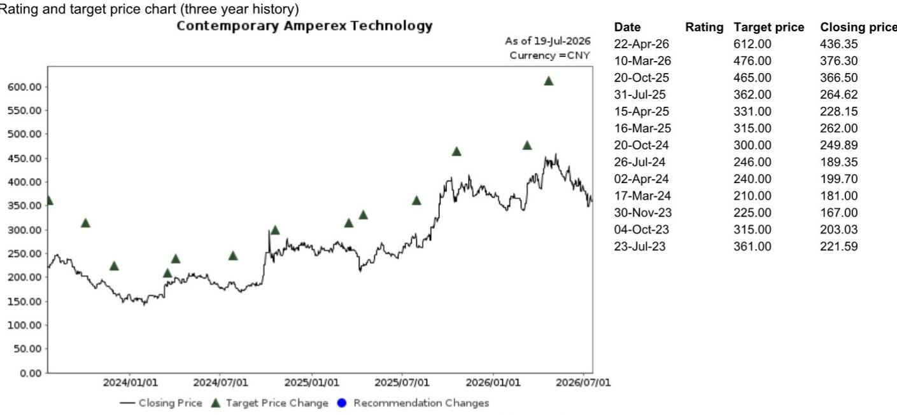

# 行业观察：中国拟对锂电池征收消费税

2026年7月17日，中国财政部、海关总署和税务总局联合宣布，自2026年9月1日起对锂电池等电池产品征收2%的消费税，2027年9月1日起升至4%。钠离子电池、固态电池、燃料电池以及部分新型太阳能电池则享受至2028年底的免税期。

这份快速解读的核心观察是：政策本身并不意外，对行业头部企业影响可控，但二线厂商的利润空间将被进一步压缩。

## 1. 每辆车增加400-500元成本，对整车制造影响有限

据估算，以电池电芯价格400元/kWh计算，2%的消费税对应每kWh增加约7元成本。按60kWh的电池包计算，每辆电动车成本上升约400-500元。相对于整车制造成本，这一增量并不显著。

报告特别指出，这一政策是在今年早些时候电动车购置税减免和出口增值税退税逐步退出之后推出的，市场对此已有预期。政策节奏并非突然，而是税收优惠退坡的延续。

> **观察评论：** 400-500元的单车成本增量，在整车BOM中占比极低。真正需要关注的不是成本本身，而是谁有能力消化、谁必须自己扛。

## 2. 头部企业可转嫁成本，二线厂商面临更大利润不确定性

研究认为，以宁德时代为代表的头部电池企业受影响有限。这些公司可以通过向下游客户传导成本，或进一步优化生产成本来对冲影响。但二线电池厂商议价能力较弱，可能面临更大的利润率不确定性。

这一观察的逻辑基础是：在电池行业产能过剩、价格竞争激烈的背景下，成本转嫁能力取决于客户粘性和规模效应。头部企业拥有更强的定价权和更优的成本结构，而二线厂商在价格战中本就承压，新增的消费税将进一步影响其利润空间。

## 3. 新技术路线获得政策豁免，出口导向型厂商受益

政策明确将钠离子电池、固态电池、燃料电池以及钙钛矿、叠层和砷化镓太阳能电池列为免税对象，免税期覆盖2026年9月至2028年底。研究认为，电池制造商中，出口业务占比高、以及在新兴技术路线（如钠离子和固态电池）上有布局的企业将受益。

这一政策设计传递的信号清晰：政策有意引导产业向下一代技术转型，同时保护在海外市场有竞争力的企业。对于仍在技术迭代期的企业，税收豁免提供了额外的研发窗口。

## 4. 一个可复用的观察框架：成本冲击的传导链条

面对类似的行业性成本政策，可以沿三条线评估影响：一是成本增量占终端产品价值的比重，判断是否足以改变消费行为或企业研究决策；二是产业链各环节的议价能力分布，判断成本由谁承担；三是政策是否包含技术路线或企业规模的差异化条款，判断哪些企业可能获得结构性优势。

在锂电池案例中，成本增量小、头部企业议价能力强、新技术路线获得豁免，这三个条件叠加，使得政策对行业整体影响有限，但对竞争格局的加速分化作用值得持续跟踪。

For informational purposes only. Portions may be generated,translated,summarized,or edited with AI assistance based on source materials and may contain omissions or errors. Please verify independently. This is not investment,legal,tax,accounting,or other professional advice.

For informational purposes only. Portions may be generated,translated,summarized,or edited with AI assistance based on source materials and may contain omissions or errors. Please verify independently. This is not investment,legal,tax,accounting,or other professional advice.

