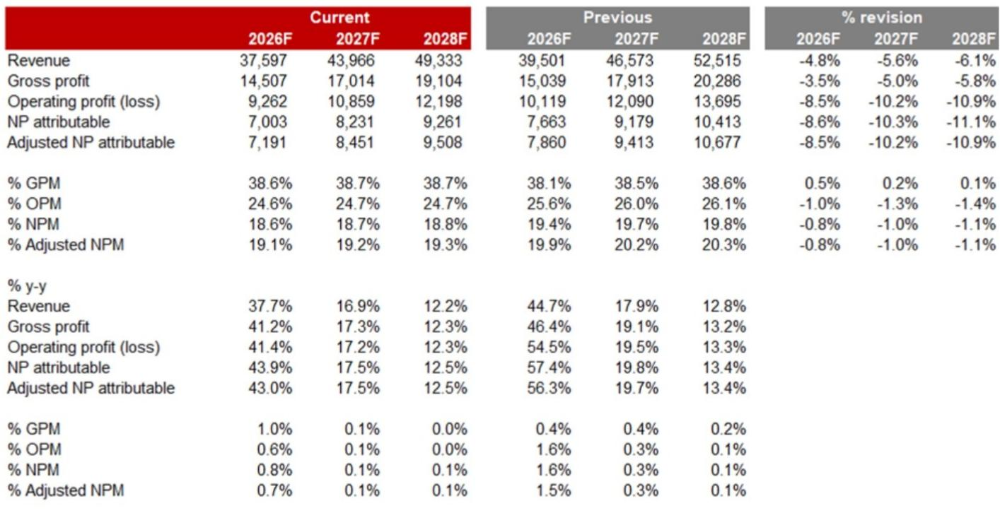
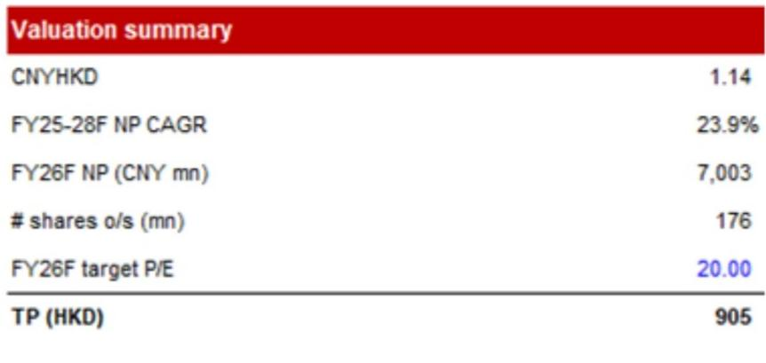
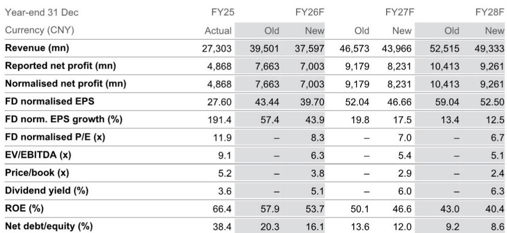

# 黄金价格波动，而非品牌弱势，才是老铺黄金溢价定位的真正考验

老铺黄金在2025财年实现营收273亿元人民币，同比增长221%，巩固了其作为中国增长最快的高端珠宝品牌之一的地位。然而，过去十二个月，公司报价下跌了59.4%，且2026财年第二季度的销售正受到金价下跌的影响。市场正在将商品周期与品牌轨迹混为一谈。这是一个战略性的误判。

核心矛盾很直接：老铺的长期价值主张取决于建立消费者对其作为持续高端品牌的认知，但其近期收入对黄金现货价格异常敏感。当金价下跌时，消费者会推迟购买，公司的营收增长随之放缓。这造成了一个困惑期，短期盈利修正掩盖了结构性进展。对于严肃的研究者而言，问题不在于公司能否在金价下跌中生存，而在于其在此期间进行的品牌建设投入能否转化为更宽的护城河。

管理层已在2026财年第二季度采取积极措施以刺激需求，包括提供更具吸引力的回馈和赠品、推出价格亲民的新产品，以及为部分商场的更高层级客户提供针对性推广。这些措施已取得令人满意的初步效果，并将在本财年下半年推广至更多门店。运营层面的应对是合理且经过考量的。风险不在于管理不善，而在于市场对一个暂时受宏观变量影响的营收模式缺乏耐心。

## 金价下跌造成暂时性营收逆风，掩盖了运营基本面的改善

第二季度最直接的数据点是，销售受到了金价下跌带来的逆风。这不是传统意义上的需求问题。消费者并非拒绝老铺的工艺或品牌认同。他们是在基础商品变得更便宜时，理性地推迟非必需珠宝的购买。黄金珠宝的购买心理部分带有研究驱动性质：买家将金价下跌视为等待更低入场点的信号，即使产品的设计和品牌溢价保持不变。

这一动态反映在分析师的修正预测中。2026财年预测营收已从395亿元人民币下调至376亿元人民币，降幅约为4.8%。2026财年正常化净利润下调了8.6%，从76.6亿元人民币降至70.0亿元人民币。盈利修正幅度大于营收修正，这表明公司可能正通过促销活动吸收部分利润率压力，尽管预计2026财年毛利率仍将保持韧性，从2025财年的37.6%上升至38.6%。

市场已基本消化了此次销售放缓。公司报价在过去十二个月下跌59.4%，三个月内下跌44.6%，表明市场共识已转向反映较低的近期预期。机会在于区分周期性的商品逆风与结构性的品牌弱势。所有证据都指向前者。

## 门店升级与精品店扩张是对消费者认知的直接投入，而不仅仅是产能扩张

老铺正利用当前销售较为疲软的时期，加速推进在需求高峰期难以执行的运营改进。公司已对深圳万象天地、上海国金中心商场和上海恒隆广场的门店进行了搬迁和扩建。这些并非例行翻新，而是战略性升级，旨在扩大服务区域，为客户提供差异化的购物体验。

其逻辑与高端品牌建设一致。在高端珠宝领域，实体零售环境是价值主张的核心部分。更大、设计更佳的店铺能提供更多私密咨询空间、更好的产品展示以及更强的专属感。这些升级也向业主和商场运营方传递信号：老铺是长期的主力租户，这有助于随时间推移改善租赁条款和位置获取。

这些投入的时机也至关重要。在金价疲软时期，建设和翻新成本可能更可预测，且对销售的干扰也较小，因为基准线已经较低。到金价企稳或回升时，这些升级后的门店将全面运营，使老铺能够以显著改善的零售网络抓住随后的需求增长。

这是一种典型的逆周期投入策略。风险在于这些升级未能转化为更高的转化率或平均交易价值。但分析师对老铺长期增长轨迹的信心，以及公司在提升消费者认知方面稳步推进的举措，表明其正在执行经过验证的策略，而非盲目尝试。

## 毛利率韧性是品牌价值依然稳固的最重要信号

修正预测中最具揭示性的数据点之一是毛利率轨迹。尽管面临营收逆风及2026财年第二季度采取的促销措施，管理层预计毛利率将从2025财年的37.6%提升至2026财年的38.6%，并在2027财年和2028财年维持在38.7%的水平。当一个品牌失去定价权时，不会出现这种情况。

如果老铺正经历真正的需求侵蚀，公司将需要更大幅度地降价，这将压缩毛利率。相反，毛利率的提升表明促销活动是有针对性且暂时的，核心产品定价依然稳固。公司提供的是回馈和赠品，而非永久性降价。它正在扩大对更高层级客户的支持，而非向大众市场打折。

毛利率的韧性也反映了产品组合向更高价值产品的转变。老铺推出价格亲民新品的策略并非为了稀释品牌，而是为了扩大新客户的入门点，同时保持核心系列的溢价定位。随着时间的推移，这可以拓宽客户漏斗，而不会侵蚀旗舰产品的平均售价。

对于研究者而言，毛利率趋势是衡量品牌健康状况最可靠的单一指标。只要利润率保持稳定或改善，金价带来的营收波动就只是一个时机问题，而非结构性问题。

## 评估金价周期中老铺黄金的决策框架

当前情况可以提炼为一个三因素决策框架，以区分周期性噪音与结构性价值。

第一个因素是金价走向。分析师指出，若金价在未来几个季度企稳，资本市场对老铺销售的悲观情绪可能会减弱。这是最不确定的变量，也是公司最无法控制的变量。认为金价接近周期底部的研究者，会将当前的营收疲软视为暂时的低谷。而那些预期金价将持续下跌的人，则需要模拟更大幅度的营收下调。

第二个因素是门店升级的完成速度。深圳和上海的三家旗舰店升级是最明显的近期催化剂。如果这些门店在重新开业后的两到三个季度内显示出客流和转化率的改善，运营逻辑将得到验证。分析师未提供具体时间表，但促销措施在2026财年下半年向更多门店的推广，表明管理层预计升级周期将在本财年下半年加速。

第三个因素是盈利修正轨迹。分析师已将2026至2028财年的营收预测下调5-6%，并将目标估值倍数从22.5倍下调至20.0倍。这一倍数压缩反映了对盈利增长预测的放缓，而非对商业模式的信心丧失。相较于当前350港元的报价，隐含的上行空间仍为158.6%。问题在于，随着金价企稳和升级门店开始贡献业绩，市场是否会重新评估公司价值。

最严谨的方法是独立监测这三个因素。金价企稳将消除主要的营收逆风。成功的门店升级将确认品牌投入的逻辑。盈利预期的企稳或上升将触发估值倍数的重新评估。在未来两到四个季度内，这三个条件均有可能实现。

## 下行风险是金价长期下跌，而非品牌战略失败

分析师指出了三个关键下行风险：金价出现任何显著走弱、高于预期的时尚风险，以及弱于预期的宏观环境。第一个和第三个风险相互关联。更弱的宏观环境可能会进一步压低金价，对老铺的销售形成双重逆风。

时尚风险是最被低估的变量。老铺的设计美学独具特色，并推动了其快速崛起，但消费者对珠宝的品味可能迅速转变。随着公司规模扩大，其在保持核心特色的同时更新产品线的能力将受到考验。当前推出价格亲民的新品是一种合理的对冲，但如果过度，也存在稀释品牌专属性的风险。

资产负债表提供了一定的缓冲。净负债权益比预计将从2025财年的38.4%下降至2026财年的16.1%，并且公司在经历了因营运资金积累导致的两年负自由现金流后，预计从2026财年开始产生正自由现金流。股息率预计在2026财年达到5.1%，到2028财年升至6.3%。对于耐心的研究者而言，下行风险部分被具有吸引力且不断增长的收益流所补偿。

最重要的分析纪律是避免将金价周期与品牌周期混为一谈。老铺收入对金价的敏感性是其商业模式的一个机械特征，而非消费者不满的反映。公司的门店升级、利润率韧性以及有针对性的促销策略，都表明管理团队理解周期性噪音与结构性衰退之间的区别。市场当前的悲观情绪，可能正在为那些能够看淡未来两个季度销售波动的人创造一个观察窗口。

*仅供参考。部分内容可能基于源材料通过AI辅助生成、翻译、总结或编辑，可能存在遗漏或错误。请独立核实。本文不构成任何专业建议。*

仅供参考。部分内容可能基于源材料通过AI辅助生成、翻译、总结或编辑，可能存在遗漏或错误。请独立核实。本文不构成任何专业建议。

