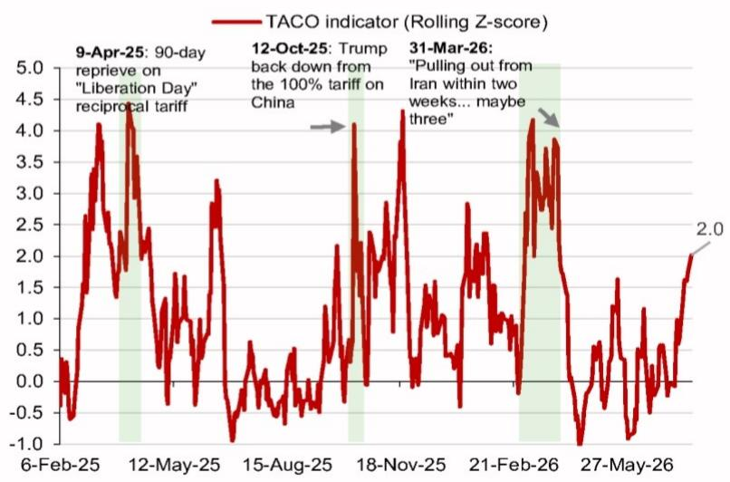

20 July 2026

Foreign Exchange - Asia ex-Japan

## 区域观察指标上升但短期变化可能性不大

我们的区域观察指标已升至2.0个标准差，这与近期中东地区相关事件有关。

## 研究分析师

## 亚洲外汇策略

Craig Chan - NSL
craig.chan@NOM.com
+65 6433 6106

## Wee Choon Teo - NSL

weechoon.teo@NOM.com +65 6433 6107

Vicky Chen - NSL

vicky.chen1@NOM.com

+65 6433 6540

## Manthan Shingala - NSL

manthan.shingala1@NOM.com

+65 6433 6427

图1：我们的区域观察指标自7月6日以来有所上升，近期达到2.0个标准差的高位  
  
来源：Bloomberg, NOM.

- 自7月7日以来，中东地区相关方之间再次出现互动，距离6月17日签署谅解备忘录仅三周。自7月7日相关事件报道以来，能源价格稳步上升，这促使相关方在7月8日宣布备忘录失效，随后出现一系列互动以及霍尔木兹海峡的实际通行受限。上周末，相关方官员也表示备忘录实际上已被搁置（Bloomberg, 7月18日）。

- 我们的区域观察指标显示，相关方采取进一步行动的压力正在增加。该指标从7月6日的约0个标准差升至今日的2.0个标准差，主要受近期油气价格上涨推动。

- 然而，短期内发生重大变化的可能性不大。相关方并未撤回其此前关于可能采取行动的表述（Bloomberg, 7月14日）。我们估算，在其他条件不变的情况下，若油气价格立即上涨10%，该指标将升至约3.2个标准差。

## 附录A-1

本报告由NOM新加坡有限公司（NSL）编制。

关于NOM集团实体详情，请参阅免责声明。

## 分析师认证

我们，Craig Chan, Wee Choon Teo, Vicky Chen 和 Manthan Shingala，特此证明：(1) 本研究报告中所表达的观点准确反映了我们个人对相关标的证券或发行人的看法；(2) 我们的薪酬中没有任何部分直接或间接与本研究报告中的具体建议或观点相关；(3) 我们的薪酬中没有任何部分与NOM证券国际公司、NOM国际有限公司或任何其他NOM集团公司进行的任何特定投资银行业务交易挂钩。

## 重要披露

## 研究报告在线获取及利益冲突披露

NOM集团的研究报告可在www.NOMnow.com/research、Bloomberg、Capital IQ、Factset、LSEG上获取。

重要披露信息可访问 http://go.NOMnow.com/research/m/Disclosures 或向NOM证券国际公司索取。如您在访问网站时遇到任何困难，请发送电子邮件至 grpsupport@NOM.com 寻求帮助。

负责编写本报告的分析师的薪酬基于多种因素，包括公司的总收入，其中一部分来自投资银行业务。除非另有说明，本报告首页列出的非美国分析师未在FINRA规则下注册/具备研究分析师资格，可能不是NSI的关联人员，并且可能不受FINRA规则2241关于与所覆盖公司沟通、公开露面以及研究分析师账户持有证券交易的限制。

NOM全球金融产品公司（NGFP）、NOM衍生品产品公司（NDP）和NOM国际有限公司（NIplc）已在美国商品期货交易委员会和美国期货业协会注册为掉期交易商。NGFP、NDPI和NIplc通常从事掉期及其他衍生品交易，这些产品可能构成本报告的主题。

## 美国要求的额外披露

自营交易：NOM证券国际公司及其关联公司通常会作为自营交易商交易本研究报告所涉及的固定收益证券（或相关衍生品）。分析师与NOM证券国际公司其他人员的互动：NOM证券国际公司及其关联公司的固定收益研究分析师定期与销售和交易部门人员互动，以获取其各自覆盖领域的流动性和定价信息。

## 估值方法 - 固定收益

NOM的固定收益策略师通过提供交易建议来表达对证券价格和市场的看法。这些建议可以是相对价值建议、方向性交易建议、资产配置建议，或三者的结合。交易建议中包含的分析包括但不限于：

- 关于证券价格是否偏离其基础宏观或微观经济基本面的基本面分析。
- 价格变动的定量分析。
- 技术因素，如监管变化、市场风险偏好的变化、意外的评级行动、一级市场活动以及供需考量。

交易建议的时间框架是可变的。战术性想法的时间框架较短，通常少于三个月。战略性交易想法的时间框架较长，通常超过三个月。

为遵守欧盟市场滥用法规，NOM全球固定收益研究发布的评级分布如下：

52% 被授予买入（或同等）评级；其中50%的发行人曾接受NOM集团提供的实质性服务*。
0% 被授予中性（或同等）评级。
48% 被授予卖出（或同等）评级；其中50%的发行人曾接受NOM集团提供的实质性服务。截至2026年6月30日。

*根据欧盟市场滥用法规的定义
**如本报告末尾免责声明部分所定义的NOM集团

## 免责声明

本出版物包含由第1页确定的NOM集团实体准备的材料，并且（如适用）包含一位或多位NOM集团实体的贡献，其员工及其各自隶属关系在第1页或本出版物的其他地方指定。本文中使用的术语“NOM集团”指NOM控股公司及其关联公司和子公司，包括：(a) NOM证券有限公司（NSC）日本东京，(b) NOM金融产品欧洲有限公司（NFPE）德国，(c) NOM国际有限公司（NIplc）英国，(d) NOM证券国际公司（NSI）美国纽约，(e) NOM国际（香港）有限公司（NIHK）香港，(f) NOM金融投资（韩国）有限公司（NFIK）韩国（在韩国金融投资协会注册的NOM分析师信息可在KOFIA内联网 http://dis.kofia.or.kr 上找到），(g) NOM新加坡有限公司（NSL）新加坡（注册号197201440E，受新加坡金融管理局监管），(h) NOM澳大利亚有限公司（NAL）澳大利亚（ABN 48 003 032 513），受澳大利亚证券和投资委员会监管，并持有澳大利亚金融服务许可证号246412，(i) NOM证券马来西亚有限公司（NSM）马来西亚，(j) NIHK台北分公司（NITB）台湾，(k) NOM金融咨询与证券（印度）私人有限公司（NFASL）印度孟买（注册地址：Ceejay House, Level 11, Plot F, Shivsagar Estate, Dr. Annie Besant Road, Worli, Mumbai- 400 018, India；电话：91 22 4037 4037，传真：91 22 4037 4111；CIN号：U74140MH2007PTC169116，SEBI股票经纪活动注册号：INZ000255633；SEBI商人银行注册号：INM000011419；SEBI研究注册号：INH000001014 - 合规官：Pratiksha Tondwalkar女士，91 22 40374904，投诉电子邮件：investorgrievancesra@NOM.com 网页：链接

关于印度上市公司或由印度NFASL研究分析师撰写的报告：(i) 证券市场投资存在市场风险。投资前请仔细阅读所有相关文件。(ii) SEBI的注册和NISM的认证绝不保证中介机构的业绩或向读者提供任何回报保证。(iii) NFASL获取研究服务的条款和条件在NFASL网页上披露。

(I) NOM信托研究与咨询有限公司（NFRC）日本东京。(m) NOM东方国际证券有限公司（NOI）是NOM集团、东方国际（集团）有限公司和上海黄浦投资控股（集团）有限公司共同控股的合资企业。根据中华人民共和国法律（为本文件目的，不包括香港、澳门和台湾），NOI在中国境内获准提供证券研究和研究交流，并独立于NOM集团其他成员运营；特别是，NOI在中国证券中的权益不会向任何其他NOM集团实体披露或与其持仓合并，其他NOM集团实体在中国证券中的权益也不会向NOI披露或与其持仓合并。研究报告首页上NOI旁边的个人姓名表示该个人受雇于NOI，根据研究合作协议为NIHK提供研究协助。员工姓名旁边的“NSFSPL”表示该个人受雇于NOM结构化金融服务私人有限公司，根据公司间协议为某些NOM实体提供协助。研究报告首页上个人姓名旁边的“Verdhana”表示该个人受雇于PT Verdhana Sekuritas Indonesia，根据研究合作协议为NIHK提供研究协助，Verdhana和该个人均未在印度尼西亚境外获得许可。

本材料：(I) 仅供您个人参考，我们不寻求基于此材料采取任何行动；(II) 不应被解释为在任何司法管辖区出售或招揽购买任何证券的要约，如果此类要约或招揽在该司法管辖区是非法的；(III) 除与NOM集团相关的披露外，基于我们认为可靠的来源信息，但未经NOM集团独立核实。

除与NOM集团相关的披露外，NOM集团不保证、陈述或承诺（明示或暗示）本文件是公平、准确、完整、正确、可靠或适合任何特定目的或适销的，并且在法律/法规允许的最大范围内，不承担因使用本文件及相关数据而导致的任何行为（或决定不作为）的责任（无论是因疏忽或其他原因，以及全部或部分）。在法律/法规允许的最大范围内，NOM集团的所有保证和其他承诺特此排除，并且NOM集团不对因使用、误用或分发本材料或其中包含的信息或以其他方式与之相关而产生的任何损失（无论是因疏忽或其他原因，以及全部或部分）承担责任。

本材料中表达的观点或估计是截至原始发布日期当前的看法，并且其中包含的信息（包括观点和估计）如有更改，恕不另行通知。然而，NOM集团明确表示不承担任何更新或修订本文件的义务。本文中的任何评论或陈述均为作者本人的观点，可能与NOM集团内部其他方的观点不同。客户应考虑本报告中的任何建议或推荐是否适合其特定情况，并在适当时寻求专业建议，包括税务建议。NOM集团不提供税务建议。

在适用法律/法规允许的范围内，NOM集团及其高级职员、董事、员工和关联公司可能作为自营商、代理人或其他身份进行交易，或持有本文提及的发行人或证券的多头或空头头寸，或买卖基于这些证券、商品或工具或其期权或其他衍生工具。NOM集团公司也可能担任发行人金融工具的市场做市商或流动性提供者（根据英国适用法规的含义）。如果市场做市商活动符合美国或其他司法管辖区特定法律法规的定义，则将在具体的发行人披露中单独说明。

本文件可能包含从第三方获得的信息，包括但不限于信用评级机构的评级。NOM集团特此明确否认对从第三方获得的任何信息（包含在本材料中或以其他方式与之相关）的原创性、公平性、准确性、完整性、正确性、适销性或特定目的适用性所作的所有陈述、保证或承诺，并且不对因使用或误用任何从第三方获得的信息（包含在本材料中或以其他方式与之相关）而产生的任何直接、间接、附带、示范性、补偿性、惩罚性、特殊或后果性损害、成本、费用、法律费用或损失（包括收入或利润损失和机会成本）承担责任（无论是因疏忽或其他原因，以及全部或部分）。禁止以任何形式复制和分发第三方内容，除非事先获得相关第三方的书面许可。第三方内容提供者不（明示或暗示）保证任何信息（包括评级）的公平性、准确性、完整性、正确性、及时性或可用性，并且不对因使用或误用此类内容而产生的任何错误或遗漏（无论疏忽与否，无论原因如何）或结果负责。第三方内容提供者不提供任何明示或暗示的保证，包括但不限于任何适销性或特定目的适用性的保证。第三方内容提供者不对因使用或误用其内容（包括评级）而产生的任何直接、间接、附带、示范性、补偿性、惩罚性、特殊或后果性损害、成本、费用、法律费用或损失（包括收入或利润损失和机会成本）承担责任（无论是因疏忽或其他原因，以及全部或部分）。信用评级是意见陈述，而非事实陈述或购买、持有或出售证券的建议。它们不涉及证券的适合性或证券的投资目的适合性，不应被依赖为研究交流。本文件中的任何MSCI来源信息均为MSCI公司的专有财产。未经MSCI事先书面许可，不得为任何目的（包括创建任何金融产品和任何指数）全部或部分复制、转载、再传播、再分发或使用此信息及任何其他MSCI知识产权。此信息按“原样”提供。用户承担使用此信息的全部风险。MSCI、其关联公司以及任何参与或与计算或编译信息相关的第三方特此明确否认对本材料或其中包含的信息或以其他方式与之相关的任何原创性、公平性、准确性、完整性、正确性、适销性或特定目的适用性的所有陈述、保证或承诺。在不限制前述规定的情况下，MSCI、其任何关联公司或任何参与或与计算或编译信息相关的第三方在任何情况下均不对任何类型的任何损害承担责任（无论是因疏忽或其他原因，以及全部或部分）。MSCI和MSCI指数是MSCI及其关联公司的服务标志。

Russell/NOM日本股票指数的知识产权和其他权利属于NOM信托研究与咨询有限公司和FTSE Russell。NFRC和Russell不保证指数的公平性、准确性、完整性、正确性、可靠性、有用性、市场性、适销性或适用性，并且不对任何指数用户和/或其关联公司使用该指数所进行的商业活动或服务负责。

读者应将本文件视为其做出投资决策的单一因素，因此，本报告不应被视为识别或暗示与任何投资决策相关的所有直接或间接风险。NOM集团制作多种不同类型的研究产品，包括但不限于基本面分析和定量分析；一种研究产品中包含的建议可能因时间范围、方法论或其他原因而与其他类型研究产品中的建议不同。NOM集团以多种不同方式发布研究产品，包括在NOM集团门户网站上发布产品和/或直接分发给客户。不同的客户群体可能会根据其个人需求从研究部门获得不同的产品和服务。

本文中呈现的数字可能涉及基于过去表现的表现或模拟，这些并非未来或可能表现的可靠指标。如果信息包含对未来表现和业务前景的预期、预测或指示，此类预测可能不是未来或可能表现的可靠指标。此外，模拟基于模型和简化假设，这些假设可能过度简化且不能反映未来的回报分布。本文件中为说明目的而创建和发布的任何数字、策略或指数，无意用作欧盟基准法规定义的“基准”。某些证券受汇率波动影响，可能对投资的价值、价格或收入产生不利影响。

关于固定收益研究：建议分为两类：战术性，通常持续最多三个月；或战略性，通常持续6-12个月。然而，交易建议可能会根据情况变化随时进行审查。交易还提供了“止损”水平；如果触及，将自动关闭交易建议。建议中显示的价格和回报表现是在提交发布时获取的，基于当时的指示性Bloomberg、LSEG或NOM价格和回报表现。所示价格和回报表现不一定是交易建议可以实施的价格和回报表现。

本文所述的证券可能未根据1933年美国证券法注册，在这种情况下，除非已根据1933年法案注册，或符合1933年法案注册要求的豁免条件，否则不得在美国或向美国人士发售或出售。除非管辖法律另有规定，任何交易均应通过您所在司法管辖区的NOM实体执行。

本文件已获批准在英国作为投资研究由NIplc分发。NIplc由审慎监管局授权，并受金融行为监管局和审慎监管局监管。NIplc是伦敦证券交易所的成员。本文件不构成英国适用法规意义上的个人建议，也未考虑个人读者的特定投资目标、财务状况或需求。本文件仅针对英国适用法规意义上的“合格对手方”或“专业客户”，因此不得再分发给此类目的的“零售客户”。

本文件已获批准在欧洲经济区作为投资研究由NOM金融产品欧洲有限公司分发。NFPE是一家根据德国法律组织的有限责任公司，在法兰克福/美因河地区法院商业登记处注册，编号HRB 110223。NFPE由德国联邦金融监管局授权和监管。

本文件已由NIHK批准，NIHK受香港证券及期货事务监察委员会监管，由NIHK在香港分发。本文件仅针对香港适用法规意义上的“专业读者”，因此不得再分发给非此类目的的“专业读者”的人士。

本文件已获批准在澳大利亚由NAL分发，NAL在澳大利亚由ASIC授权和监管。

本文件也已获批准在马来西亚由NSM分发。

在新加坡，本文件由NSL分发，NSL是根据《财务顾问法》（第110章）定义的豁免财务顾问，并受新加坡金融管理局监管。NSL可根据《财务顾问条例》第32C条规定的安排，分发其外国关联公司制作的此文件。本文件针对《证券与期货法》（第289章）定义的认可、专家或机构读者。如果本文件的接收者不是认可、专家或机构读者，NSL仅在法律要求的范围内对此类接收者承担本文件内容的法律责任。新加坡的接收者应就本文件引起或与之相关的事宜联系NSL。本文件旨在广泛分发。它未考虑任何特定个人的特定投资目标、财务状况或特殊需求。接收者在做出购买任何证券的承诺之前，应考虑其特定的投资目标、财务状况或特殊需求，包括根据其认为合适的方式，通过单独约定寻求独立财务顾问关于投资适合性的建议。除非1933年法案S条例的规定禁止，本材料在美国由美国注册经纪交易商NSI分发，NSI根据1934年美国证券交易法规则15a-6的规定对其内容负责。准备本文件的实体允许其在NOM集团内独立运营的关联公司向其客户提供此类文件的副本。

本文件未经批准分发给沙特阿拉伯王国“授权人士”、“豁免人士”或“机构”（由资本市场管理局定义）或阿拉伯联合酋长国的“市场对手方”或“专业客户”（由迪拜金融服务局定义）或卡塔尔国的“市场对手方”或“商业客户”（由卡塔尔金融中心监管局定义）以外的人士，具体由NOM沙特阿拉伯、NIplc或NOM集团任何其他成员（视情况而定）决定。除非由授权人士，否则不得将本文件或其任何副本直接或间接带入、传输或分发到沙特阿拉伯、阿联酋或卡塔尔，或分发给沙特阿拉伯境内的“授权人士”、“豁免人士”或“机构”或阿联酋的“市场对手方”或“专业客户”或卡塔尔的“市场对手方”或“商业客户”以外的任何人。未能遵守这些限制可能构成违反阿联酋、沙特阿拉伯或卡塔尔法律。

关于涉及台湾上市公司或由台湾研究分析师撰写的报告：

本文件仅供参考。您应独立评估投资风险，并自行承担投资决策的全部责任。未经NOM集团书面授权，不得复制或引用本报告的任何部分。根据台湾《证券商受托买卖有价证券管理规则》和/或其他适用法律或法规，您不得向他人（包括但不限于关联方、关联公司和任何其他第三方）提供本报告，或从事任何可能涉及利益冲突的与本报告相关的活动。关于NOM国际（香港）有限公司台北分公司无法执行的证券/工具的信息仅供参考，不应被解释为建议或招揽交易此类证券/工具。

本材料不得在印度尼西亚境内分发，或传递给印度尼西亚共和国领土内的人士，或印度尼西亚公民（无论其住所或所在地）或印度尼西亚的实体或居民，如果这构成印度尼西亚共和国法律下的公开发售。本文提及的证券不得在印度尼西亚发售或出售给印度尼西亚公民（无论其住所或所在地）或印度尼西亚的实体或居民，如果这构成印度尼西亚共和国法律下的公开发售。

研究报告首页上NOI旁边的个人姓名表示本文件是NOI在中国发布的研究报告的翻译版本。在所有其他情况下，本文件由未在中国获得提供证券研究许可的NOM集团或其子公司或关联公司（统称“离岸发行人”）编制。本研究报告未经批准或旨在在中国境内分发。相关的A股分析（如有）并非为位于或注册于中国的任何人制作。接收者不应依赖本研究报告中包含的任何信息做出投资决策，离岸发行人不对此承担任何责任。未经NOM集团成员事先书面同意，不得以任何形式或任何方式（I）复制、影印、复印或复制本材料的任何部分；或（II）再传播、再发布或再分发本材料。如果本文件通过电子传输方式（例如电子邮件）分发，则无法保证此类传输是安全或无错误的，因为信息可能被拦截、损坏、丢失、销毁、延迟到达或不完整，或包含病毒。因此，发送方不对本文件内容中可能因电子传输而产生的任何错误或遗漏承担责任（无论是因疏忽或其他原因，以及全部或部分）。如需验证，请索取硬拷贝版本。

NOM集团通过其合规政策和程序（包括但不限于利益冲突、中国墙和保密政策）以及维护中国墙和员工培训来管理与研究报告制作相关的利益冲突。

如需获取有关本文件中所含任何研究交流制作中使用的方法或模型的更多信息，请联系首页列出的NOM研究分析师。披露信息可根据要求提供，披露信息可在NOM披露网页上获取：

版权所有 © 2026 NOM新加坡有限公司，新加坡。保留所有权利。
