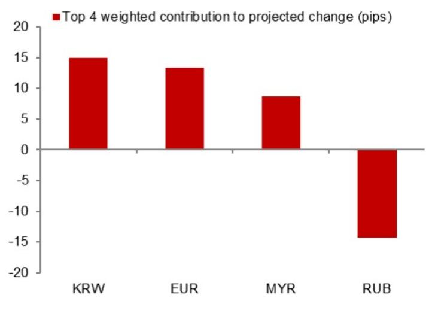
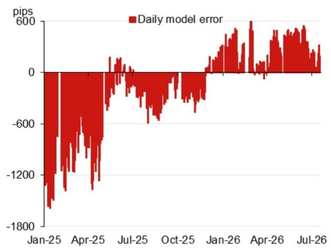

# 宏观观察：亚洲（除日本）汇率动态

**模型参考值：6.7824**

模型参考值：6.7824，此前为6.7934（较前次官方收盘价有所调整）。

含逆周期因子的模型参考值：6.7862。

## 研究团队

亚洲汇率策略
Craig Chan - NSL
Wee Choon Teo - NSL
Vicky Chen - NSL
Manthan Shingala - NSL

图1：隔夜贡献权重前四的变化（不含逆周期因子）

来源：NOM

图2：近期模型误差（不含逆周期因子调整）

来源：Bloomberg, NOM

图3：每日变化

来源：Bloomberg, NOM

图4：事件日历

| 日期 | 事件 | 地点 | 备注 |
|------|------|------|------|
| 2026年7月17-20日 | 2026世界人工智能大会（WAIC） | 中国上海 | 据中国外交部消息，中国国家主席习近平将出席开幕式并发表主旨演讲 |
| 2026年7月下旬 | 政治局经济工作会议 | 中国 | 会议通常包含经济工作部署 |
| 2026年8月中旬 | 央行2026年第二季度货币政策报告 | | |
| 2026年9月24日 | 中国国家主席对美国进行国事访问 | 美国华盛顿特区 | |
| 2026年9月下旬 | 央行货币政策委员会会议 | | |
| 2026年10月1-7日 | 国庆黄金周假期 | 中国 | |

来源：Bloomberg, NOM

## 附录A-1

本报告由NOM Singapore Ltd. (NSL)编制。

详见NOM集团实体免责声明。

## 分析师声明

我们，Craig Chan、Wee Choon Teo、Vicky Chen和Manthan Shingala，特此声明：(1) 本研究报告中所表达的观点准确反映了我们对相关标的的个人看法；(2) 我们的薪酬中没有任何部分与本研究报告中表达的具体观点直接或间接相关；(3) 我们的薪酬中没有任何部分与NOM集团任何成员进行的特定交易相关。

## 重要披露

## 研究报告在线获取及利益冲突披露

NOM集团研究报告可通过www.NOMnow.com/research、Bloomberg、Capital IQ、Factset、LSEG获取。

重要披露信息可在线查阅或向NOM Securities International, Inc.索取。

编制本报告的分析师的薪酬基于公司总收入等因素，其中一部分来自相关业务活动。除非另有说明，本报告列出的非美国分析师未在FINRA规则下注册/合格为研究分析师。

NOM Global Financial Products Inc. (NGFP)、NOM Derivative Products Inc. (NDP)和NOM International plc. (NIplc)已在商品期货交易委员会和国家期货协会注册为掉期交易商。

## 美国要求的额外披露

主要交易：NOM Securities International, Inc及其关联公司通常作为固定收益证券（或相关衍生品）的主要交易方。

## 估值方法 - 固定收益

NOM的固定收益策略师通过提供交易建议来表达对证券价格和市场的看法。这些建议可以是相对价值建议、方向性交易建议、资产配置建议或三者的组合。交易建议中包含的分析包括但不限于：

- 关于证券价格是否偏离其基本面因素的基础分析
- 价格变动的定量分析
- 技术因素，如监管变化、市场风险偏好变化、评级行动、一级市场活动和供需因素

交易建议的时间框架可变。战术性建议时间框架较短，通常少于三个月。战略性交易建议时间框架较长，通常超过三个月。

## 免责声明

本出版物包含由NOM集团实体编制的材料。术语"NOM集团"指NOM Holdings, Inc.及其关联公司和子公司。

本材料：(I) 仅供您个人参考，我们不基于此材料招揽任何行动；(II) 不构成在任何司法管辖区出售或招揽购买任何证券的要约；(III) 除与NOM集团相关的披露外，基于我们认为可靠的来源信息，但未经NOM集团独立验证。

除与NOM集团相关的披露外，NOM集团不保证、不代表或承诺本文件的公平性、准确性、完整性、正确性、可靠性或适用于任何特定目的。

本文件中的观点或估计为截至原始发布日期的最新观点，信息（包括其中包含的观点和估计）可能随时更改，恕不另行通知。

NOM集团及其高级职员、董事、员工和关联公司，在适用法律和/或法规允许的范围内，可能作为主要方、代理人或其他方式交易，或持有多头或空头头寸，或买卖本文提及的发行人或证券的证券、商品或工具。

本文件可能包含从第三方获得的信息。NOM集团特此明确否认对从第三方获得的任何信息的原创性、公平性、准确性、完整性、正确性、适销性或适用于特定目的的所有陈述、保证或承诺。

读者应将本文件视为做出投资决策的单一因素，本报告不应被视为识别或建议与任何投资决策相关的所有直接或间接风险。

本文呈现的数字可能涉及过往表现或基于过往表现的模拟，这些并非未来或可能表现的可靠指标。

对于固定收益研究：建议分为两类：战术性（通常持续最多三个月）或战略性（通常持续6-12个月）。然而，交易建议可能随时根据情况变化进行审查。

本文所述的证券可能未根据美国1933年证券法注册。

本文件已获批准在英国作为投资研究由NIplc分发。NIplc由审慎监管局授权，并由金融行为监管局和审慎监管局监管。

本文件已获批准在欧洲经济区作为投资研究由NOM Financial Products Europe GmbH ("NFPE")分发。

本文件已获NIHK批准在香港分发。

本文件已获批准在澳大利亚由NAL分发。

本文件也已获批准在马来西亚由NSM分发。

在新加坡，本文件由NSL分发。

本文件未获批准在沙特阿拉伯、阿联酋或卡塔尔向特定人士以外的人士分发。

本材料不得在印度尼西亚分发。

版权所有 © 2026 NOM Singapore Ltd., Singapore。保留所有权利。
