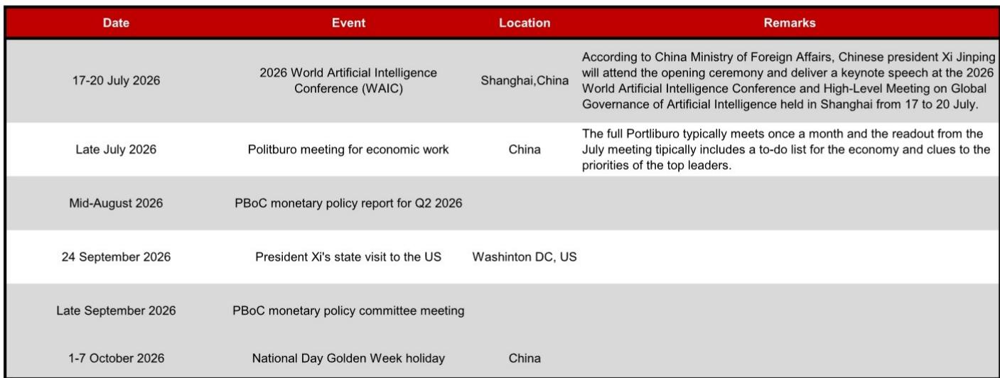
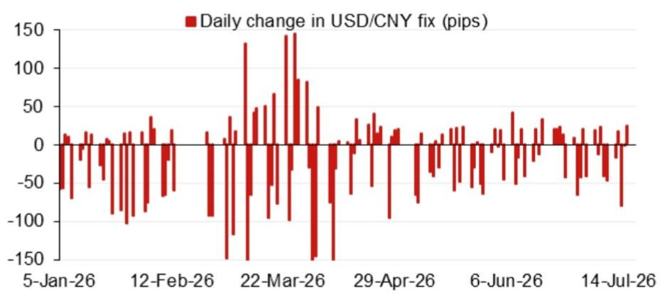

# NOM：美元/人民币中间价模型-预测值下调110基点

NOM亚洲外汇策略团队最新发布的每日中间价预测模型显示，其对美元/人民币中间价的预测值从上一日的6.7934下调至6.7824，下调幅度为110个基点。更值得关注的是，在计入逆周期因子后，预测值调整为6.7862，较前一日实际中间价低72个基点。这一组数字表明，模型捕捉到的短期定价信号正在趋于温和，而非市场此前可能预期的持续走弱。

报告没有给出方向性判断，但模型本身的变化已经提供了足够的信息。逆周期因子对预测值的修正幅度从上一日的正贡献转为负向，说明模型认为官方定价在短期内有空间向更均衡的水平回归。这种调整并非趋势性逆转，而是一种更精细的节奏管理。

## 1. 模型误差的收敛意味着定价预期正在重新校准

NOM模型同时披露了近期预测误差的变化。从图2展示的误差序列来看，模型在没有逆周期因子调整的情况下，其预测值与实际中间价之间的偏差正在收窄。误差收敛本身是一个信号：市场定价与模型隐含的均衡水平之间的差距在缩小，中间价的形成机制正在更有效地吸收隔夜信息。

误差的缩小并不意味着方向性判断的确认，而是说明定价预期正在经历一轮重新校准。对于关注人民币定价节奏的观察者而言，误差序列的走向比单日预测值本身更具参考价值。当误差从发散转向收敛，通常意味着市场对官方定价意图的理解正在趋于一致。

## 2. 隔夜贡献的权重分布指向外部因素的边际影响减弱

模型将预测变化分解为四个主要隔夜贡献因子。从图1的权重分布来看，贡献最大的因子并未指向单一外部冲击，而是呈现分散化特征。这种分散化本身是一个值得注意的信号：当外部因素对定价的影响趋于均衡而非集中时，中间价调整的驱动力更多来自内部节奏而非外部不确定性。

> **KC评论：** 隔夜贡献的分散化意味着，短期内人民币中间价的调整更多是技术性修正，而非对某一外部事件的应激反应。对于观察者而言，关注点应从“外部事件是否触发调整”转向“内部节奏如何消化既有信息”。

## 3. 未来两个月的事件日历为定价节奏提供了可追踪的锚点

报告附录中的事件日历虽然不构成预测依据，但为理解定价节奏提供了时间框架。7月17日至20日的世界人工智能大会、7月下旬的宏观环境工作会议、9月24日中国领导人对美国的国事访问，这些事件在时间上形成了明确的序列。

宏观环境工作会议通常会在7月给出下半年宏观环境工作的优先序，而9月的国事访问则可能涉及更广泛的议题沟通。这两个事件之间，中间价的定价节奏很可能保持与政策信号同步的克制状态。报告没有直接关联这些事件与汇率走势，但事件本身的密度和性质已经为观察者提供了一个可追踪的锚点。

## 4. 逆周期因子的使用方式正在回归更传统的信号功能

逆周期因子在本轮调整中的使用方式值得单独关注。模型显示，计入逆周期因子后的预测值较前一日实际中间价低72个基点，而上一日该因子对预测值的影响方向相反。这种方向性变化表明，逆周期因子正在从“对冲不确定性”模式切换为“平滑节奏”模式。

当逆周期因子从单向对冲转向双向平滑时，其信号功能反而更强。它不再只是应对不确定性的工具，而是成为定价节奏的调节器。对于市场参与者而言，逆周期因子方向的变化比幅度变化更具信息含量。

---

这份报告的核心价值不在于单日预测值的精确性，而在于它提供了一个可量化的框架，用以追踪中间价定价的微观节奏。模型误差的收敛、隔夜贡献的分散化、事件日历的序列以及逆周期因子方向的变化，这四个信号合在一起指向一个判断：人民币中间价的定价正在进入一个更克制、更注重节奏管理的阶段。

For informational purposes only. Portions may be generated,translated,summarized,or edited with AI assistance based on source materials and may contain omissions or errors. Please verify independently. This is not investment,legal,tax,accounting,or other professional advice.

For informational purposes only. Portions may be generated,translated,summarized,or edited with AI assistance based on source materials and may contain omissions or errors. Please verify independently. This is not investment,legal,tax,accounting,or other professional advice.

