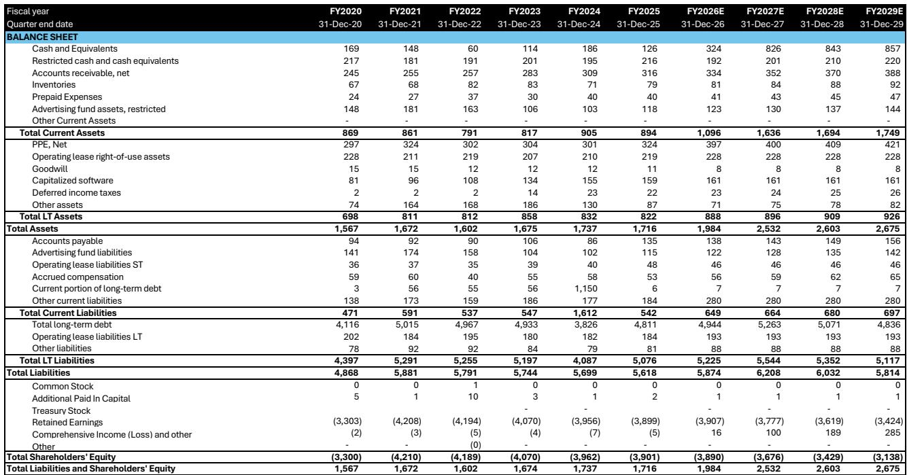
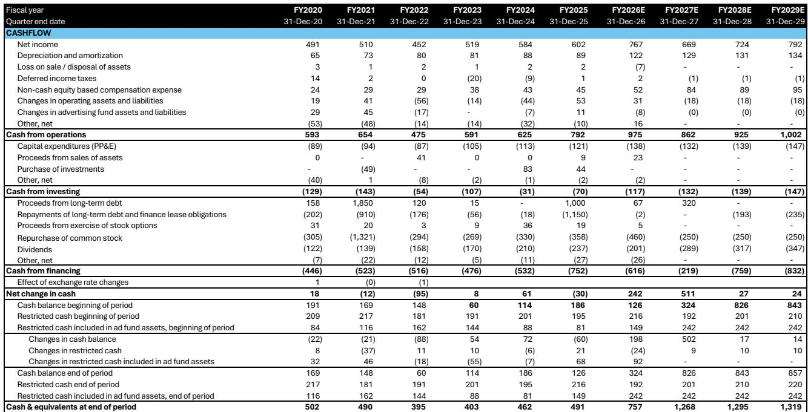
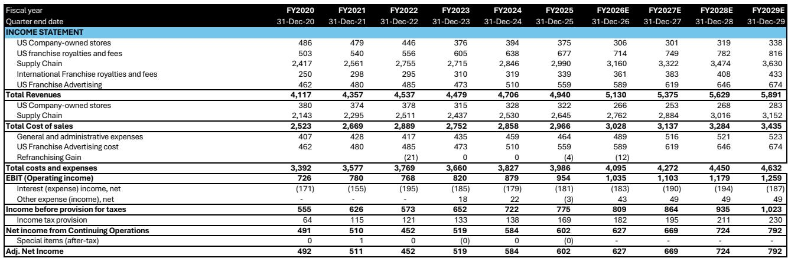

# Domino's 2Q26 Results Reveal a Business That Is Stabilizing, Not Yet Recovering, and the Second Half Demands Execution It Has Not Recently Shown

Domino's reported a 0.1% U.S. same-store sales increase for the second quarter of 2026, a result that, by almost any historical standard, is modest. Yet the company's valuation reacted positively, because the market had braced for negative territory. The company generated meaningful order-count growth across both delivery and carryout, dispelling the fear that transaction volumes were contracting. That alone was enough to trigger relief. But relief is not a strategy, and the quarter's details reveal a business that has stopped deteriorating without having established a credible path back to its long-term algorithm.

The central tension is now clear. Domino's has stabilized the top line through a combination of loyalty program engagement, aggregator partnerships, and a World Cup tailwind, but it has done so while average ticket continues to shrink. The company's own management acknowledged that the Premium Series and Slice Sauce platform failed to resonate with customers, creating a drag that the lapping of last year's successful Stuffed Crust launch only amplified. The result is a business that is adding transactions but losing pricing power, a dynamic that compresses franchisee profitability and raises the bar for the second half.

Maintaining the full-year low-single-digit same-store sales guidance now requires a low- to mid-single-digit exit rate in the second half. That is a material acceleration from a first half that was broadly flat. And it depends on a new product launch that management describes as "unlike anything previously offered at Domino's," a claim that elevates expectations precisely when the company's recent product execution has been its weakest link. The question is not whether Domino's can generate a short-term comp bump. The question is whether it can convert that bump into a sustainable growth trajectory before the second half's execution burden becomes unsustainable.

## Order-Count Growth Has Returned, But It Has Come at the Expense of Ticket and Franchisee Profitability

The most encouraging data point from the quarter was the meaningful order-count growth across both delivery and carryout. After several quarters in which the market questioned whether Domino's was losing relevance in a QSR environment where transaction trends were largely unchanged, the company demonstrated that its core demand base remains intact. Carryout comps rose 1.1%, and even delivery, which declined 0.7%, showed enough transaction momentum to suggest the channel is not in structural decline.

However, the composition of that growth matters more than the aggregate. Average ticket was the primary headwind, pressured by the lapping of the Stuffed Crust launch from the prior year and the weak consumer response to the Premium Series and Slice Sauce. Management expects this ticket drag to moderate in the third quarter as the prior-year comparison becomes less difficult, but that is a mechanical argument, not a strategic one. The underlying issue is that Domino's has not yet demonstrated an ability to drive both transaction growth and ticket expansion simultaneously. The company is effectively trading volume for value, and that trade has direct consequences for franchisee economics.

Franchisees benefit from supply-chain volumes and royalties when order counts rise, but their unit-level profitability depends on ticket size. When ticket drag persists, the benefit of higher transactions is diluted. This is precisely why Domino's modestly lowered its U.S. net unit growth outlook from 175-plus stores to approximately 175 stores, citing macroeconomic pressure and weaker franchisee profitability. A single-store reduction may seem trivial, but the signal is important: franchisees are becoming more cautious about committing capital to new units when the current operating model is generating traffic without pricing power. If this dynamic persists, it will constrain the very store growth that has been Domino's primary retail sales driver.

## The Aggregator Channel Is a Net Positive, But Its Incrementality and Profit Profile Require Careful Monitoring

Domino's now holds the leading pizza brand position on both Uber Eats and DoorDash, and management indicated that aggregator orders are approximately 50% incremental to the business. That is a powerful statistic. It means that half of the volume coming through third-party platforms represents new transactions that would not have occurred through Domino's own channels. The company has also maintained premium pricing on aggregators in an effort to achieve profit-报告观点economics for franchisees, and its orchestration agent optimizes order timing to preserve product quality.

These are all positive developments, but they do not eliminate the structural tension between first-party and third-party channels. Domino's first-party digital channel has historically been a high-margin, data-rich asset that gave the company direct control over customer relationships and promotional economics. Every order that migrates from first-party to aggregator, even if partially offset by new volume, represents a shift toward lower-margin economics and reduced customer data ownership.

The key debate is whether the incremental volume, customer acquisition, and future frequency opportunities generated through aggregators are sufficient to offset any migration from the company's higher-margin first-party channels. The 50% incrementality figure suggests that the net effect is positive today, but that calculus depends on the retention and lifetime value of aggregator-acquired customers. If those customers remain primarily aggregator users, the long-term margin structure of Domino's delivery business will be permanently lower than its historical baseline. Management's confidence in aggregator economics is understandable, but the burden of proof remains on demonstrating that aggregator customers graduate to higher-frequency, higher-margin first-party ordering over time.

## The Upcoming Product Launch Is the Most Important Single Event of the Year, and Recent Execution Gives Reason for Caution

Management has signaled that a "new" and "unique to Domino's" pizza will launch within the next six weeks, potentially establishing a new consumption occasion. The language is deliberately ambitious: this is not a line extension or a limited-time offer. It is positioned as something that addresses an unmet consumer need and expands occasions without disrupting core menu usage. The report's authors raise the possibility of a square personal pizza or a protein pizza, but the specifics are less important than the strategic burden this product now carries.

Because Domino's maintained its full-year guidance despite a soft first half, the second half is now disproportionately dependent on this launch. The company needs it to drive both transaction growth and ticket expansion simultaneously, a combination it has not achieved in recent quarters. And the recent track record for product execution is not reassuring. The Premium Series and Slice Sauce did not resonate with consumers, and management acknowledged that the disconnect between consumer testing and actual market results was larger than expected.

Domino's does not typically test products in the market before full launch, relying instead on consumer studies that have historically shown a high correlation with actual results. But management itself noted that consumer preference cycles are becoming shorter and trend relevance is more difficult to maintain. This raises a structural question: if the company's testing methodology is calibrated to a slower-moving consumer environment, it may systematically overestimate the appeal of products that lack social proof or real-world visibility. A single product failure can be dismissed as a tactical error. A pattern of testing-to-market disconnects suggests a need to rethink the innovation process itself. The upcoming launch will be an important test of whether management has internalized that lesson.

## International Operations Face a Multi-Year Reset, and the DPE Turnaround Will Not Be Quick

International same-store sales declined 0.1% in the quarter, with Domino's Pizza Enterprises identified as the primary drag. DPE remains focused on improving franchisee profitability by removing unprofitable promotional transactions, a strategy that will create a traffic headwind at least through the fall and likely into 2027. The report lowers its international same-store sales forecast to 1.5% for fiscal 2027, reflecting the view that DPE may need to reset to a lower but more sustainable growth profile.

The incoming DPE CEO, Andrew Gregory, brings roughly 30 years of restaurant industry experience, primarily at McDonald's. That is a credible appointment, but it does not change the fundamental math. DPE's strategy of pruning low-margin volume in favor of higher-quality transactions is correct in principle, but it creates a period of negative operating leverage during which fixed costs are spread over a smaller revenue base. The company will need to demonstrate that the volume sacrificed is genuinely unprofitable and that the retained business can grow faster as a result. That process takes quarters, not months, and the international segment will be a drag on overall company performance for at least the next 12 to 18 months.

Meanwhile, China and India continue to perform relatively well, but they are not large enough to offset the DPE headwind. The international story is increasingly a single-story narrative: the pace and effectiveness of the DPE turnaround will determine whether Domino's can return to its long-term algorithm of 3% international same-store sales growth and 925 net new units per year. The current trajectory suggests that algorithm is not achievable in fiscal 2026 or 2027.

## A Decision Framework for Assessing Domino's Recovery

For investors trying to evaluate whether the current valuation, at approximately 18x forward earnings, represents an entry point or a value trap, the following framework organizes the key variables into a structured assessment. The framework has three dimensions: demand stability, pricing power, and franchisee health. Each dimension must improve simultaneously for the stock to re-rate meaningfully.

**Demand stability** is the dimension where Domino's has made the most progress. Order-count growth is positive across both channels, aggregator partnerships are expanding the customer base, and the loyalty program is increasing engagement frequency. The risk here is low, but the upside is capped because transaction growth alone, without ticket expansion, produces low same-store sales growth. The key metric to monitor is whether order-count growth accelerates or decelerates in the second half, particularly after the World Cup tailwind fades.

**Pricing power** is the dimension where Domino's has the most to prove. The Premium Series and Slice Sauce failures suggest that the company cannot simply layer premium-priced items onto the menu and expect customers to trade up. The upcoming product launch must demonstrate that Domino's can introduce a higher-ticket item that customers perceive as genuinely incremental, not as a price increase disguised as innovation. The key metric is average ticket growth in the third and fourth quarters, excluding the mechanical benefit of lapping the Stuffed Crust launch.

**Franchisee health** is the dimension that determines the sustainability of the entire model. The reduction in the unit growth outlook, however modest, signals that franchisees are feeling pressure. Improving unit-level economics requires both transaction growth and ticket expansion, because higher volumes alone do not compensate for lower margins per order. The key metric is franchisee profitability trends, which are not directly disclosed but can be inferred from store opening intentions and royalty revenue growth relative to same-store sales.

If all three dimensions improve in the second half, the current valuation will look attractive in retrospect. If only one or two improve, the stock will remain range-bound as the market waits for the missing piece. And if none improve, the guidance for low-single-digit same-store sales growth will prove unachievable, triggering a downward revision that the current multiple does not reflect.

## The Second Half Is a Prove-Me Moment, and the Bar Is Higher Than It Appears

Domino's enters the second half with a better demand trajectory than it had three months ago, but with a narrower margin for error. The company has used up its benefit of the doubt. Management has acknowledged execution failures, maintained guidance that requires acceleration, and placed the weight of the second half on a single product launch that has not yet been tested in the market.

The report's authors describe the current valuation as embedding a very negative outlook on the QSR industry and on the stock, and they believe that an 18x forward multiple creates a compelling entry point if delivery returns to stable growth. That conditional is the entire debate. Domino's is not an expensive stock today, but it is not a cheap stock either. It is a stock that is pricing in a recovery without evidence that the recovery has begun. The second half will determine whether that pricing is prescient or premature.

*For informational purposes only. Portions may be generated, translated, summarized, or edited with AI assistance based on source materials and may contain omissions or errors. Please verify independently. This is not investment, legal, tax, accounting, or other professional advice.*

For informational purposes only. Portions may be generated, translated, summarized, or edited with AI assistance based on source materials and may contain omissions or errors. Please verify independently. This is not investment, legal, tax, accounting, or other professional advice.

