# European Utilities & Clean Energy

# District Cooling: Europe's heatwaves are testing the network - and reinforcing its growth potential

Bartlomiej Kubicki
+49 69 717 4418
bartlomiej.kubicki@bernsteinsg.com

Thibault Dujardin, CFA
+33 1 58 98 59 16
thibault.dujardin@bernsteinsg.com

Abdessamad Raghibi, Ph.D.
+212 5 22 86 79 41
abdessamad.raghibi@bernsteinsg.com

Jorge Alonso Suils
+34 915 893 913
jorge.alonso@bernsteinsg.com

Rory Graham-Watson
+44 20 7676 7093
rory.graham-watson@bernsteinsg.com

Ken-Ree Choong
+44 20 7676 8243
ken-ree.choong@bernsteinsg.com

## Specialist Sales

Gareth Williams
+44 20 7762 5256
gareth.b.williams@bernsteinsg.com

As Western Europe faces its third heatwave since May, demand for cooling solutions has come into sharp focus, with sales of fans and air conditioners surging. Less obvious, however, is the pressure extreme temperatures are placing on district cooling infrastructure. Against this backdrop, we take a closer look at the district cooling sector - how these systems work, their key advantages and limitations, and their long-term growth prospects. We also examine the positioning of two leading French utilities active in this market, Engie and Veolia.

A rapidly growing global market. According to Fortune Business insights, the global district cooling market was valued at \$31.2bn in 2025 and is expected to expand at an 8.0% CAGR between 2026 and 2034. The Middle East and Africa currently represent the largest market, accounting for 42% of global market. North America and Asia-Pacific account for 26% and 25% of the market respectively, while Europe remains significantly underpenetrated at just 7%.

French district cooling output is expected to more than double by 2030. France currently delivers approximately 0.9TWh of district cooling annually, but national targets call for output to exceed 2TWh by 2030, before reaching 2.5-3.0TWh by 2035. The market remains fragmented, with leading operators including Engie, Dalkia (EDF), Idex, Coriance and Veolia.

Could Europe accelerate district cooling expansion? Recent heatwaves have highlighted both the strategic importance and the capacity constraints of existing networks. As extreme weather events become more frequent, we believe policymakers and operators may accelerate investment programs aimed at expanding cooling capacity, improving network resilience, and supporting the decarbonisation of urban cooling demand.

District cooling expansion offers a growing opportunity for both Engie and Veolia, although the activity remains relatively modest within the context of their overall operations. While neither company provides detailed standalone disclosure for district cooling, Veolia's District Heating & Cooling Networks division generated approximately €7.2bn of revenue in 2025, representing around 16% of group revenue. We estimate that district cooling accounts for only 20–25% of this activity. Likewise, Engie's Local Energy Infrastructures business generated €8.8bn of revenue in 2025, equivalent to roughly 12% of group revenue. Despite its currently limited contribution, the development and expansion of cooling projects suggests a favourable long-term growth trajectory for both companies.

On our European coverage, we reiterate our Outperform rating with a €40.0 TP for Veolia, as well as our Market Perform rating and €29.4 TP for Engie. We also reiterate our Outperform rating with a 2.10 AED TP for Dubai Central Cooling Systems company Empower.

## BERNSTEIN TICKER TABLE

<table><tr><td rowspan="2"></td><td colspan="4">17 Jul 2026</td><td rowspan="2">TTMRel.</td><td colspan="4">Adjusted EPS</td><td colspan="3">Adjusted P/E (x)</td></tr><tr><td>Rating</td><td>Cur</td><td>Closing Price</td><td>Price Target</td><td>Cur</td><td>2025A</td><td>2026E</td><td>2027E</td><td>2025A</td><td>2026E</td><td>2027E</td></tr><tr><td>ENGL.FP (Engie)</td><td>M</td><td>EUR</td><td>26.86</td><td>29.40</td><td>22.5%</td><td>EUR</td><td>1.96</td><td>1.97</td><td>2.18</td><td>13.7</td><td>13.6</td><td>12.3</td></tr><tr><td>VIE.FP (Veolia)</td><td>O</td><td>EUR</td><td>37.51</td><td>40.00</td><td>6.0%</td><td>EUR</td><td>2.25</td><td>2.42</td><td>2.67</td><td>16.7</td><td>15.5</td><td>14.1</td></tr><tr><td>EMPOWER.UH (Empower)</td><td>O</td><td>AED</td><td>1.61</td><td>2.10</td><td>(34.9)%</td><td>AED</td><td>0.10</td><td>0.10</td><td>0.11</td><td>16.2</td><td>15.6</td><td>14.6</td></tr><tr><td>EDME</td><td></td><td></td><td>1,587.83</td><td></td><td></td><td></td><td></td><td></td><td></td><td></td><td></td><td></td></tr><tr><td>ASIAX</td><td></td><td></td><td>1,866.01</td><td></td><td></td><td></td><td></td><td></td><td></td><td></td><td></td><td></td></tr></table>

O - Outperform, M - Market-Perform, U - Underperform, NR - Not Rated, CS - Coverage Suspended  
EMPOWER.UH estimate is Reported EPS; EMPOWER.UH valuation is Reported P/E (x);  
Source: Bloomberg, Bernstein estimates and analysis.

## INVESTMENT IMPLICATIONS

On our European coverage, we reiterate our Outperform rating with a €40.0 TP for Veolia, as well as our Market Perform rating and €29.4 TP for Engie. We also reiterate our Outperform rating with a 2.10 AED TP for Dubai Central Cooling Systems company Empower.

## DETAILS

As Western Europe faces its third heatwave since May, demand for cooling solutions has come into sharp focus, with sales of fans and air conditioners surging (link). Less obvious, however, is the pressure extreme temperatures are placing on district cooling infrastructure. Against this backdrop, we take a closer look at the district cooling sector - how these systems work, their key advantages and limitations, and their long-term growth prospects. We also examine the positioning of two leading French utilities active in this market, Engie and Veolia. For context, please also find the initiation report on Dubai Central Cooling Systems Empower covered by Abdessamad Raghibi.

## PARIS'S DISTRICT COOLING NETWORKS HAVE BEEN PUT TO THE TEST

On 23 June, during the second heatwave of the season, the operator of La Défense's district cooling network - the system that supplies cooling to the office towers of Paris's main business district - warned that the network would no longer be able to operate under normal conditions. "We had built up ice reserves throughout the weekend, reaching 100% of our storage capacity in preparation for the week. Yesterday, we used nearly two-thirds of that capacity," explained Olivier Fleck, site director of Idex La Défense. "The problem is that we're consuming more ice than we have time to replenish overnight." As reported by Le Figaro, the system relies on large ice-storage tanks to provide additional cooling capacity during periods of peak demand. Chilled water is then circulated through an extensive pipe network serving connected office buildings, which use it for their own air-conditioning systems. However, the exceptional heat has pushed the system beyond its design limits. By Thursday, the temperature of the water supplied to buildings was expected to rise from its normal 4.5°C to around 7.5°C, reducing cooling performance across the network. "It's going to become increasingly difficult. The equipment was not designed for heat of this magnitude," Fleck said. High humidity is adding to the challenge, further reducing the efficiency of the cooling towers, which were not engineered for such operating conditions.

Similar pressures are emerging elsewhere in the capital. 'Fraîcheur de Paris', the operator of the city's central district cooling network, also warned that the system was approaching its capacity limits. While no major disruptions have been reported, the network has been operating at full capacity for roughly two weeks. "No network today is designed to withstand a heatwave that is both this intense and this prolonged," noted Clémence Penin in charge of institutional relations. To maintain service, the operator temporarily increased the temperature of its chilled water by around 3°C.

Beyond managing the current heatwave, network operators are considering how to prepare for increasingly frequent and severe heat events. "There will probably be other periods of extreme heat this summer. How can we anticipate these heatwaves, which are likely to become more frequent? That's the question we'll need to address after the summer, and then decide whether additional investments are required," said Stéphane Dauphin, Regional Director at Idex. Potential solutions under consideration include expanding cooling production capacity, reports Radio France. Les Echos also published an article in mid-July on district cooling networks, highlighting them as a rapidly expanding low-carbon solution for addressing extreme heat. The article noted that, for now, these activities still represent only a small portion of Engie's and Veolia's businesses. However, Veolia confirmed that around 100 district heating and cooling network projects are currently underway.

Europe facing three consecutive heatwaves. Europe has endured an extraordinary succession of heatwaves this year. According to the EU's Copernicus Climate Change Service, June 2026 was the hottest June on record in Western Europe and the second warmest worldwide. The June heatwave followed an exceptionally intense episode in May and was quickly succeeded by another heatwave in early July. Temperatures reached unprecedented levels across several European countries, breaking monthly and all-time records, while the prolonged extreme heat led to severe health impacts and increased heat-related deaths.

EXHIBIT 1: June 2026 was the warmest June on record for western Europe (anomalies in surface air temperature for June 2026)  
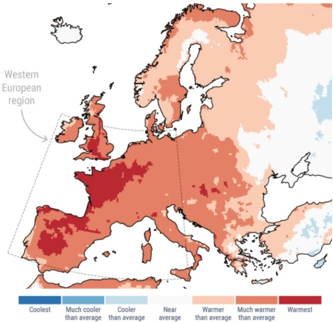  
Source: Copernicus Climate Change Service

EXHIBIT 2: Daily surface air temperature for western Europe  
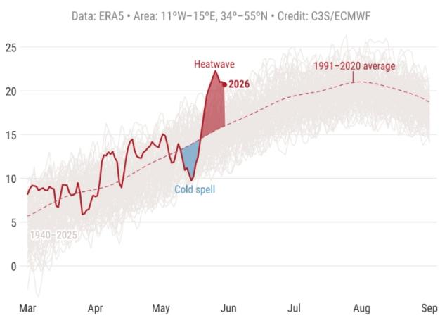  
Source: Copernicus Climate Change Service

## HOW DOES A DISTRICT COOLING SYSTEM (DCS) WORK?

As highlighted by the International Energy Agency (IEA), district cooling relies on the centralized production of chilled water, which is distributed to end users through a closed-loop underground piping network. Chilled water is circulated by pumps from the district cooling (DC) plant to connected buildings, then at each customer site, cooling is transferred to the building's internal system through an Energy Transfer Station (ETS), before returning to the DC plant where it is chilled once again and recirculated throughout the network. District cooling systems can utilize a wide range of energy sources and technologies, including natural ‘free-cooling’ sources, such as seawater, or recovered from industrial processes; as well as compression chillers; and absorption chillers. Thermal energy storage - typically in the form of chilled water or ice storage - is often incorporated to manage peak cooling demand during hot periods. By shifting cooling production to off-peak hours, these storage solutions can provide valuable flexibility to the electricity grid. Compared with conventional standalone electricity-driven equipment, district cooling can achieve energy efficiency levels that are typically five to ten times higher.

EXHIBIT 3: General scheme of a district cooling system  
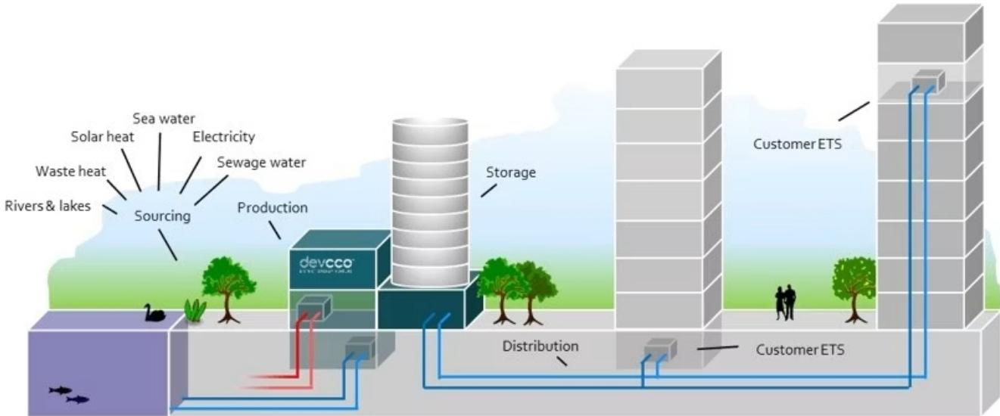  
Source: IEA, Devcco - District Energy Venture

District cooling systems typically supply chilled water to customers at temperatures of approximately 5-7°C, with return water temperatures generally ranging between 12-16°C, depending on local conditions and requirements.

Thermal energy storage systems capitalize on periods when cooling demand is below the daily average, typically during nighttime. During these periods, the plant uses available capacity to cool return water - typically at around $15^{\circ}$ C - back to the supply temperature of approximately $6^{\circ}$ C and store it in the form of chilled water or ice. When cooling demand rises above average levels, often during the afternoon peak, the stored cooling energy is discharged, supplying chilled water to the network and reducing the need for additional chiller capacity. This approach helps optimize plant utilization.

EXHIBIT 4: The general principle of DC operation  
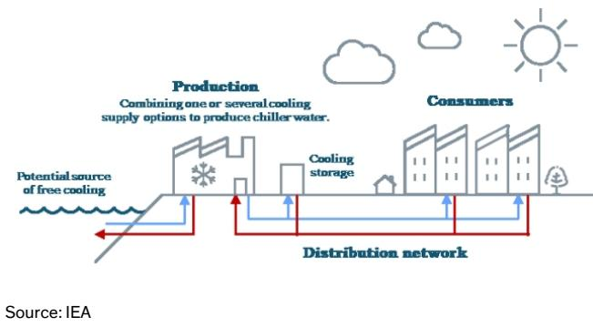

DC (District Cooling) vs AC (Air Conditioning): DC delivers a coefficient of performance (COP) 6.5 versus COP 3.0 for AC. In simple terms, DC delivers more than double the cooling for the same amount of electricity. Power use is 25% lower than best-in-class conventional systems and 50% lower than average conventional systems.

EXHIBIT 5: District cooling reduces annual electricity consumption in new developments by 45% to 86% depending on the type of technology used  
AC vs District Cooling Power Demand (kW/ton)  
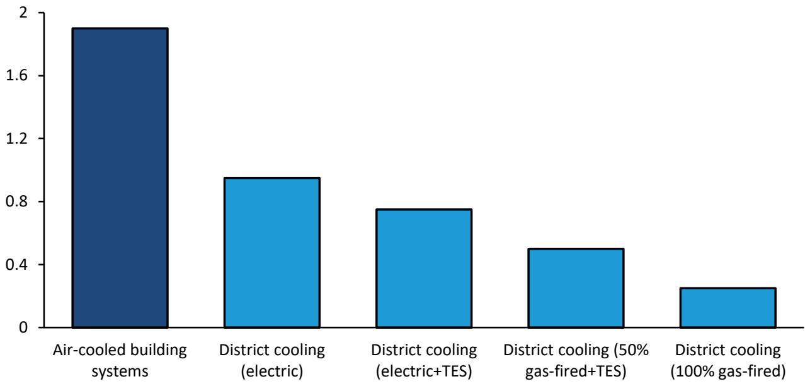  
Source: District Cooling Best Practice Guide, Bernstein analysis

District cooling can help reduce peak demand and mitigate the urban heat island effect. According to an International Energy Agency (IEA) report, district cooling systems can reduce electricity consumption compared with conventional cooling solutions (see Exhibit 6) thanks to energy efficiency. The IEA also notes that district cooling networks often incorporate thermal energy storage, such as chilled water, ice or slurry. Storage can reduce installed cooling capacity requirements and increase the amount of time systems operate at optimal load factors, thereby improving overall efficiency. It also provides greater operational flexibility by allowing chilled water to be produced when electricity prices are lower. In our view, these characteristics can help reduce peak power demand, thereby limiting the need for additional generation capacity and grid investments.

Furthermore, the IEA highlights that conventional air-conditioning systems move heat from buildings and release it into the surrounding environment. In some cities, this process can increase nighttime temperatures by more than $1^{\circ}$ C, exacerbating the urban heat island effect. By contrast, we note that the development of DC can help mitigate the heat island effect, for instance via heat exchange with rivers or seawater.

EXHIBIT 6: Power consumption before and after conversion to district cooling  
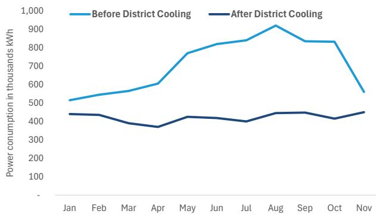

EXHIBIT 7: Illustration of the heat island effect  
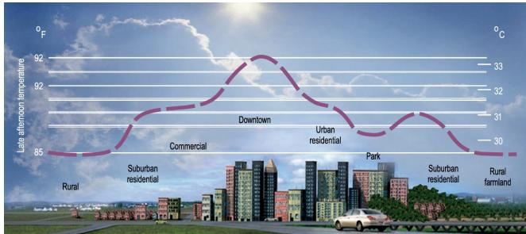  
Source: LBNL (2013), Heat Island Group, http://heatisland.lbl.gov/

## Source: IEA

Business model: According to the IEA, business models for district energy systems are typically highly project-specific, reflecting local market conditions, regulatory frameworks, and stakeholder objectives. Public sector involvement is common and can take various forms, including acting as policymaker, planner, regulator, customer, or investor. In many cases, municipalities or public authorities also hold partial or full ownership stakes in district energy infrastructure. From a contractual perspective, district cooling business models can generally be categorized into concession and non-concession structures.

A brief history of district cooling: Although the origins of district cooling can be traced back to the early 19th century, the technology was not implemented on a practical scale until 1889, when the Colorado Automatic Refrigerating Company commissioned the first ammonia-based district cooling system in Denver. Cooling was generated by an absorption chiller with a capacity of approximately 105kW and distributed through a three-pipe distribution network. The system supplied refrigeration to a cold-storage warehouse with a volume of roughly 1,400 m $^{3}$ . The first commercial District Cooling systems were installed in the USA in non-residential areas near cities in the 1960s.

## Overview of the global district cooling market

According to Fortune Business insights, the global district cooling market was valued at \$31.2bn in 2025 and is projected to grow from \$33.2bn in 2026 to \$61.5bn by 2034, representing a CAGR of 8.0% over the forecast period. The Middle East & Africa region accounted for the largest share of the market in 2025, representing 41.5% of global market, reflecting the region's high cooling needs and growing urban infrastructure. In the United States, the district cooling market is expected to expand significantly, with market size projected to increase from \$6.4bn in 2026 to approximately \$10.0bn by 2032. Growth is expected to be driven by rising demand for space cooling, and supportive renewable energy policies and incentives. The commercial segment dominates the market, accounting for 72.4% of total demand in 2026, well ahead of residential and industrial uses.

EXHIBIT 8: Global district cooling market size  
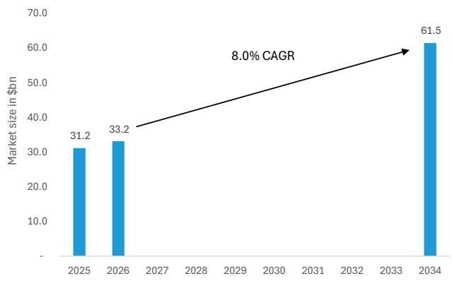  
Source: Fortune Business Insights

EXHIBIT 9: District cooling market in 2025, regional breakdown  
  
According to the study, Latin America represents 0.1% of global revenue Source: Fortune Business Insights

## Overview of European district cooling market

According to Euroheat & Power, district cooling sales in Europe reached 3.3TWh in 2024, representing a 3.1% increase year-on-year. Over the 2019-2024 period, district cooling infrastructure grew at an average annual rate of 24.7% across reporting countries. Looking ahead, further growth is expected mainly in markets such as Austria, France, Norway, and Sweden. Based on projects currently under development and existing government targets, district cooling supply in Europe is projected to reach approximately 4.5TWh by 2030. In France, the government forecasts that district cooling could supply between 2.5 and 3.0TWh annually by 2035. Spain also presents significant untapped. Barcelona, for example, hosts several district cooling networks. In 2025, Veolia and Enagás commissioned an innovative project that recovers waste cold from the Enagás liquefied natural gas (LNG) terminal and injects it into Barcelona's district cooling network. The project is expected to expand over time.

For context, according to Eurostat, energy for heating and cooling makes up around half of the EU's total gross final energy consumption.

EXHIBIT 10: District cooling sales (2024), in GWh  
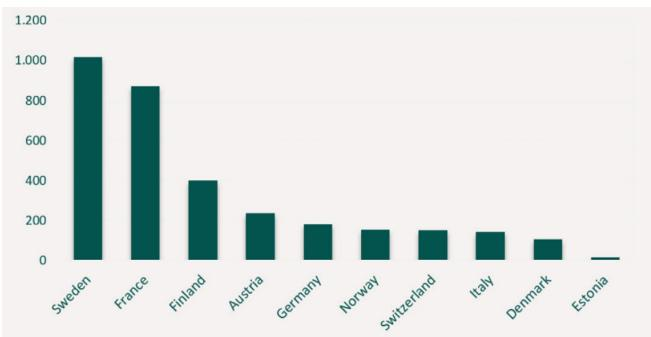  
Source: Euroheat & Power

EXHIBIT 11: District cooling trench length (2024), in km  
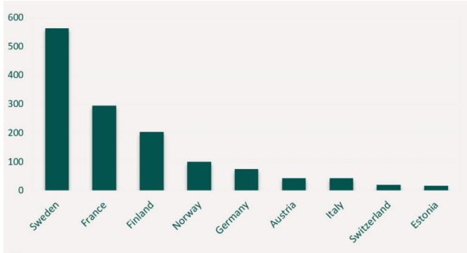  
Source: Euroheat & Power

European district heating market: By comparison, Europe has approximately 16,000 district heating networks, which supplied around 495.6TWh of heat in 2024, representing a 1.2% year-on-year decline. Germany and Poland are the largest district heating markets by heat supplied, followed by Sweden, Finland and Denmark. Distribution networks extended over 201,500km across Europe in 2024, up approximately 0.8% from the previous year and 8.4% (+15,675 km) compared with 2019.

Total installed district heating capacity in Europe remained broadly stable at approximately 283GWth in 2024. Germany is the largest market, with 49GWth of installed capacity, followed by Poland (42.1GWth), the Czech Republic (37.9GWth), France (27GWth), Denmark (26GWth), Finland (23.8GWth), and Austria (12GWth).

EXHIBIT 12: District heating sales for selected countries (2024), in GWh/y  
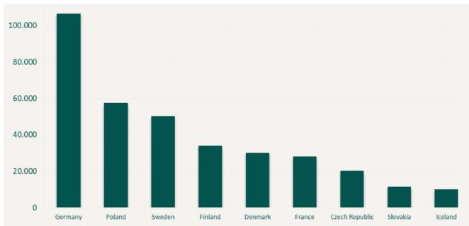  
Source: Euroheat & Power

## French district cooling market

According to FEDENE (the French Federation of Energy Services), France has 49 district cooling networks, representing a total of 294km of pipelines. These systems consume approximately 0.25TWh of energy and deliver 0.87TWh of cooling to 1,841 buildings.

Under France's multi-year energy programme (PPE), cooling delivered through district cooling networks is targeted to reach 2TWh by 2030, implying more than a doubling of current volumes. The programme envisages further growth thereafter, with cooling deliveries expected to increase to between 2.5 TWh and 3 TWh by 2035. This implies a 15% CAGR over 2024-2030, followed by a CAGR between 5% and 8% over 2030-2035.

The main operators in France are (link):

\- Engie: The company operates 22 district cooling networks in France and Monaco, including Paris center ‘Fraicheur de Paris’ 438MW cooling network (more details in the dedicated section below).

\- Dalkia: EDF's energy services subsidiary, Dalkia operates multiple district cooling networks throughout France, including part of La Défense (89MW) Paris business district; and Lyon (52MW).

\- Idex: A privately owned energy services company backed by Antin Infrastructure Partners. The company operates six district cooling networks in France; including the La Défense cooling network (114MW, link), which serves Paris' largest business district; Nice; and Annecy.

\- Coriance: Established in 1998 by Gaz de France, Coriance was sold as part of the antitrust remedies associated with the GDF–Suez merger (now Engie). The company is currently owned by Vauban Infrastructure Partners and Caisse des Dépôts. Coriance operates several district cooling networks in France, including Toulouse and Laval.

\- Veolia: The company is also active in France, for instance at Paris Saclay campus (more details in the dedicated section below).

EXHIBIT 13: French district cooling networks  
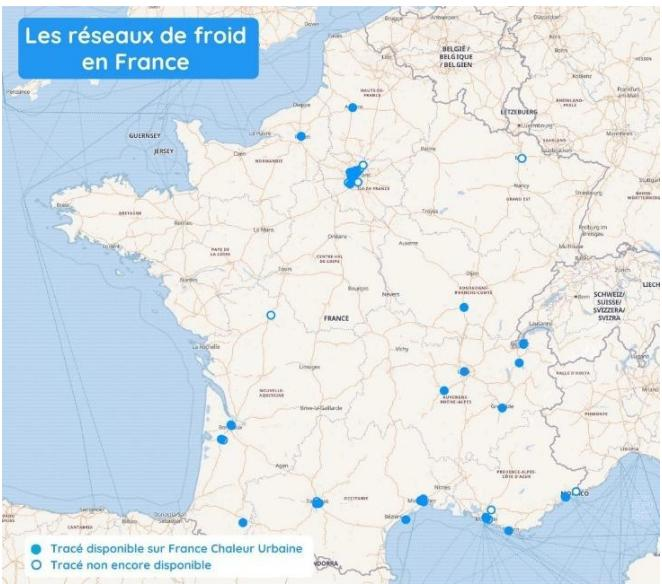

EXHIBIT 14: Evolution of French district heating energy delivered in TWh  
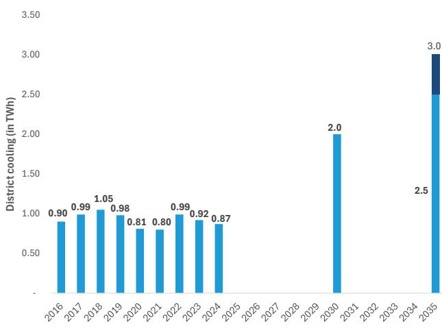  
Source: FEDENE  
Source: FEDENE

By comparison, the district heating sector is significantly more developed in France, with 1,041 networks spanning 7,942km of pipelines, consuming 36.1TWh of energy and supplying 32.3TWh of heat to 52,439 buildings.

French multi-year energy programme (PPE3) sets ambitious targets for district heating and cooling networks to support France's energy transition commitments. The programme targets 52.7TWh of heat delivered through district heating networks by 2030, with renewable and recovered energy accounting for 75% of the mix (equivalent to 39.5TWh). By 2035, the objective rises to at least 68TWh of heat delivered, with renewable and recovered energy representing 80% of the total, corresponding to a minimum target of 54.5TWh (see Exhibit 16).

EXHIBIT 15: French district heating networks  
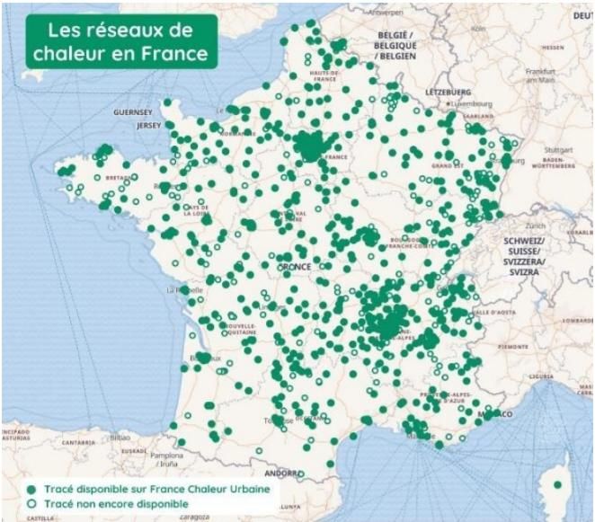  
Source: FEDENE

EXHIBIT 16: Evolution of French district heating energy delivered in TWh  
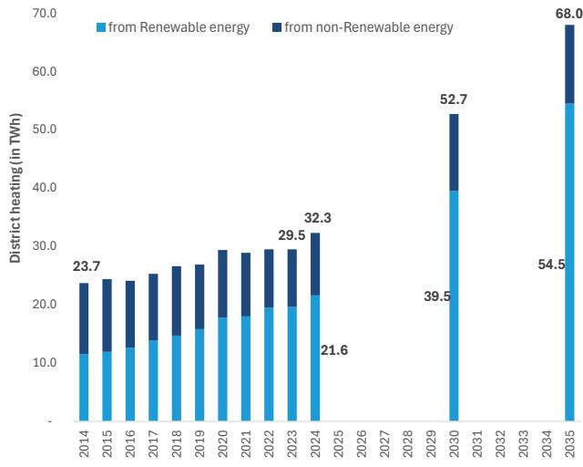  
Source: FEDENE

## WHAT IS ENGIE AND VEOLIA EXPOSURE TO DISTRICT COOLING NETWORKS?

Veolia: District cooling is part of Veolia's ‘District Heating & Cooling’ business, which generated €7.24bn of revenue (16.3% of total revenues) and €1.09bn of EBITDA (15.4% of total) globally in 2025. This activity sits within Veolia’s Energy segment, and is one of its strongholds, and, according to the company’s financial statements, is primarily located in Central and Eastern Europe. Veolia presents itself has the n°2 in district heating and cooling in Europe.

Our understanding, however, is that Veolia's operations in Central and Eastern Europe (notably Poland, Germany, Hungary and the Czech Republic) are predominantly focused on district heating rather than cooling. We therefore estimate that district cooling accounts for c.20-25% of the District Heating & Cooling business, with the bulk of the activity concentrated in Asia (Hong Kong, Singapore) and the Middle East (United Arab Emirates, Bahrain), and to a lesser extent in Europe (including Spain and France). Veolia also maintains a presence in France. For example, the group was awarded the Paris-Saclay district heating and cooling network contract in 2023. Nevertheless, its domestic footprint remains relatively limited following the disposal of its stake in Dalkia France in 2014.

EXHIBIT 17: Bahrain bay district cooling network  
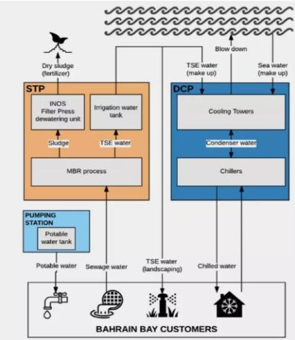  
Water usage optimization The potable water received from the municipality is sub-distributed to the customers. The used water returns to the STP to be converted into treated sewage effluent (TSE) and dry sludge. The treated water is sent back to the customers to irrigate their landscaping. As for the excess of TSE, it goes to the makeup of the DCP cooling system.  
Source: Veolia

Potential interest in Dalkia? During its post-1H25 roadshow in Paris in August 2025, Veolia was asked whether it would be interested in acquiring Dalkia, EDF's district heating subsidiary, amid reports that EDF was evaluating strategic options for the business. As a reminder, Dalkia was jointly owned by EDF and Veolia until 2014, when the two groups agreed to separate their respective assets. Veolia declined to comment but stressed that the current GreenUp strategy does not include major M&A transactions. Any large opportunity would have to meet several criteria, including being: a) value accretive, and b) linked to 'booster' or 'stronghold' activities, but with a higher threshold for the latter. That said, Veolia indicated that it has proved its agility, with €1bn disposed in 2024 and €2.2bn acquired in 2025 year-to-date.

Cold recovery from LNG regasification terminals. Veolia has developed an urban cooling network that use waste cold generated during the regasification process at Enagás' LNG terminal in the Port of Barcelona. The system recovers residual cold energy, generating approximately 131GWh of energy annually. In a conventional regasification process, liquefied natural gas (LNG) arrives by ship at around -160°C and is warmed using seawater to convert it back into gaseous natural gas for distribution. Through a new regasification solution this residual cold is recovered and re-injected into Barcelona district cooling network.

Engie. District cooling activities are housed within Engie's ‘Local Energy Infrastructures’ (LEI) business unit (formerly Energy Solutions), which develops and operates decentralized energy systems. In 2025, LEI generated €8.83bn of revenue, including €5.47bn in France and €2.96bn in the rest of Europe, and delivered €939m of EBITDA (6% of total EBITDA) and €482m of EBIT (5% of total EBIT). Engie describes itself as theworld’s leading district cooling operator and the third-largest district heating operator, with 11.7GW of heat production capacity across 256 heating networks and 4.4 GW of cooling capacity across 116 district cooling networks worldwide (link).

\- Engie operates 22 district cooling networks in France and Monaco, including systems serving central Paris, Marseille (Thassalia) and other major urban areas (see Exhibit 19). Through its subsidiary Fraîcheur de Paris, the group operates the largest district cooling network in Europe, supplying cooling to a number of buildings, including the Louvre Museum, Paris City Hall, the French National Assembly, and Forum des Halles, as well as schools, hospitals and nursing homes.

\- Internationally, Engie operates 6 district cooling networks in Southeast Asia (Philippines, Malaysia and Singapore) and 102 networks across the Gulf region (UAE, Saudi Arabia, Qatar and Oman). For instance, the group has exposure to the sector through its $40\%$ stake in Tabreed (National Central Cooling Company PJSC), a UAE-based district cooling utility (link).

Source: Engie  
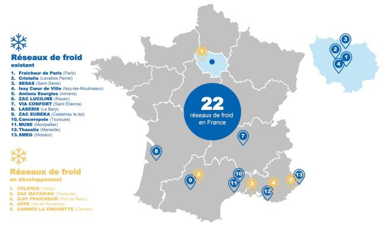

EXHIBIT 18: Engie: EBIT of Local Energy Infrastructures (in €m)  
EXHIBIT 19: Engie operates 22 district cooling networks in France and Monaco.  
  
Source: Engie

## Engie manages Paris district cooling system since 1991

The company 'Fraîcheur de Paris' (which translates as "the freshness of Paris") is responsible for producing, storing, and distributing cooling energy across the French capital. It serves cooling to a wide range of customers, including hotels, department stores, office buildings, and museums (Louvre, Grand Palais, ...). It succeeded Climespace, an Engie subsidiary that had held the concession since 1991. 'Fraîcheur de Paris' is owned by Engie (85%) and RATP Solutions Ville (15%).

According to company disclosures, Fraîcheur de Paris develops and operates one of Europe's largest district cooling networks and the 11th largest worldwide with 438MW of capacity. Its infrastructure includes 120km of underground pipelines serving 924 customers across Paris. The company delivers approximately 493GWh of cooling energy, generates €114m in revenue, and invested €51.2m in 2024 to expand and modernize the network.

A €2.4bn contract over 20-years. In December 2021, the City of Paris renewed the concession for its district cooling network for twenty years with Engie, which had already been the concessionaire since 1991. Engie partnered with the RATP, the Paris public transport operator. The Engie-RATP consortium won the contract against Dalkia (a subsidiary of EDF) partnered with Veolia, and Coriance. The total value of the contract, which runs until 2042, is estimated at €2.4bn. The new concessionaires have committed to building an additional 158km of network over the period. This expansion will allow Fraîcheur de Paris to provide cooling to more than 300 buildings such as hospitals, retirement homes, nurseries, schools, and metro stations. The statement from the new joint venture highlights: “As a result, Europe’s largest district cooling network will nearly triple in length over 20 years: 20 new production plants and 10 storage installations will be built to serve more than 3,000 subscribers”. According to a 2019 study conducted for the City of Paris, cooling demand was estimated at 2-3TWh per annum at the time and is projected to increase to 3.5-4TWh per annum by 2050 (link, link).

■ Revenue ◆ Connected Capacity (M RT)

EXHIBIT 20: Paris district cooling network  
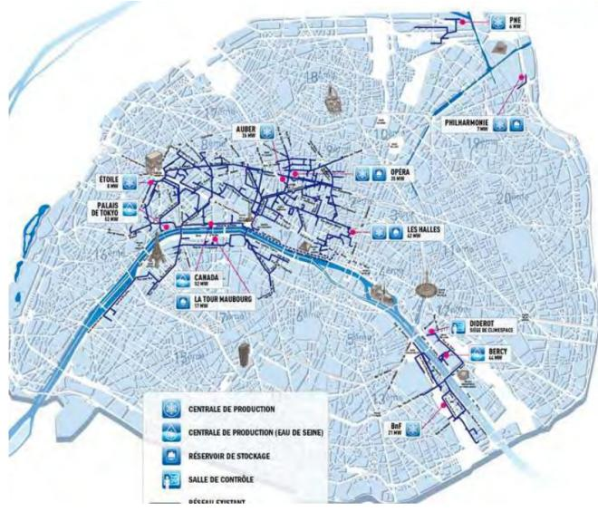  
Source: Ville de Paris

EXHIBIT 21: Potential network extension  
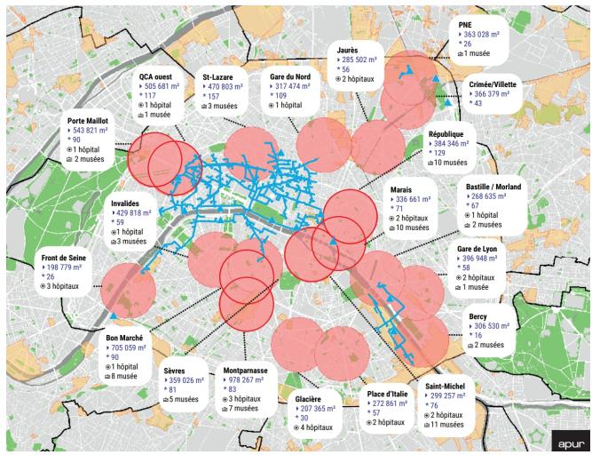  
Source: Ville de Paris

## EMPOWER - 85% DC MARKET SHARE IN DUBAI

Established in 2003 as a Dubai-government-backed district cooling utility and listed on the Dubai Financial Market in November 2022, Empower operates a regulated, infrastructure-like platform with c.80% market share in Dubai. The business is supported by \~25-year average contracted revenues and 1.97mn RT of contracted capacity, translating into high earnings visibility and high customer stickiness.

Operating quality is reflected in c.49% adjusted EBITDA margins, long asset lives of 30–50 years, and \~99.9% reliability, underpinning predictable cash generation, distributions, and sustained return visibility.

EXHIBIT 22: A 3.2m RT master-plan pipeline provides a clear runway for revenue growth as contracted capacity converts to connected assets

Empower Revenue/Connected Capacity  
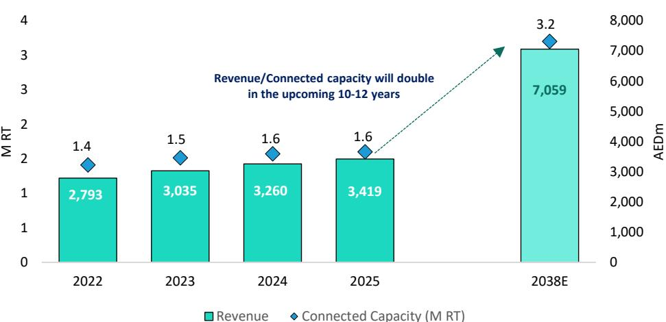  
Source: Company reports; Bernstein analysis & estimates

An attractive pricing formula. Empower's revenue model combines a fixed demand charge (AED750/RT/year) linked to contracted capacity, and a variable consumption charge (AED0.568/RT/hour) tied to actual cooling delivered. This implies a revenue floor (40% of total revenue) and a variable component (60%) that fluctuates with consumption. In addition, a fuel surcharge protects against power price volatility (Utilities remained controlled at 40-43% of revenue). This combination underpins

a sustainable 48-50% EBITDA margin.

EXHIBIT 23: A regulated pricing mix of fixed (40%) and variable (60%) charges  
![](images/4a
