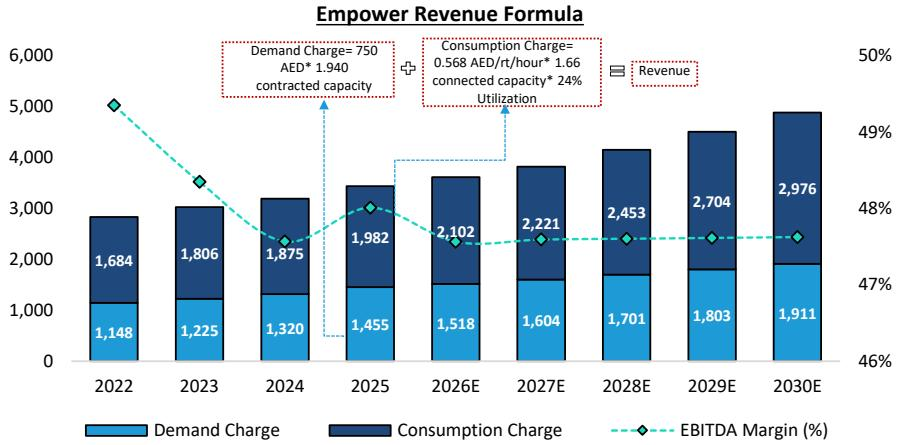
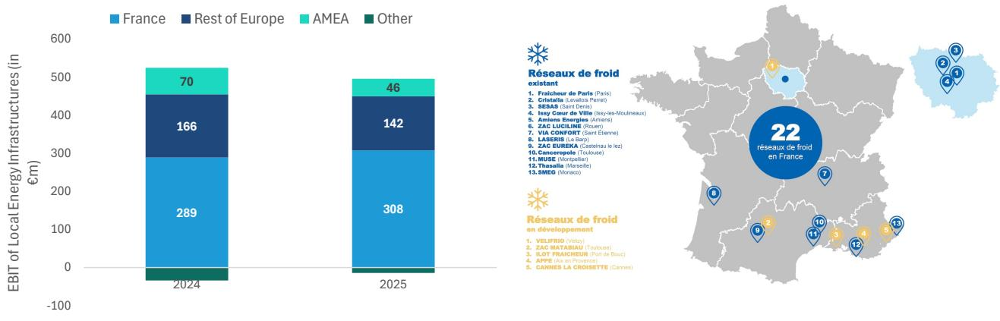

# Bernstein：网络安全数据与主题变化观察

2026年6月，西欧经历了有记录以来最热的六月，连续第三次热浪将区域供冷基础设施推至极限。巴黎拉德芳斯商务区的区域供冷运营商在6月23日发出警告：系统已无法在正常条件下运行。冰储罐在周末储备了100%的容量，但一天内就消耗了近三分之二，夜间无法补足。这一事件并非孤例——巴黎市区网络“Fraîcheur de Paris”同样报告系统已满负荷运行约两周，不得不将供水温度临时提高约3摄氏度。Bernstein在最新研报中指出，极端天气正在测试现有网络的承载上限，同时也为这一低碳冷却方案提供了加速扩张的窗口。

## 1. 全球区域供冷市场预计以8%的年复合增速扩张至2034年

根据Fortune Business Insights数据，2025年全球区域供冷市场规模为312亿美元，预计2026至2034年间将以8.0%的年复合增长率扩张，2034年达到615亿美元。中东和非洲目前是最大市场，占全球份额的42%；北美和亚太分别占26%和25%；欧洲仅占7%，渗透率显著偏低。报告认为，欧洲的追赶空间最大。法国已设定明确目标：当前年供冷量约0.9太瓦时，计划2030年弹性较高至超过2太瓦时，2035年达到2.5至3.0太瓦时。目前法国市场仍较分散，主要运营商包括Engie、Dalkia（EDF旗下）、Idex、Coriance和Veolia。

> **KC评论：** 欧洲7%的渗透率与中东42%的差距，并非技术或气候差异所致，更多反映的是政策推动力度和城市基础设施规划节奏。法国2030年弹性较高的目标，是观察欧洲区域供冷能否加速的关键锚点。

## 2. 区域供冷能效是传统空调的两倍以上，且有助于缓解城市热岛效应

Bernstein在报告中对比了两种方案：区域供冷的能效比（COP）为6.5，传统空调约为3.0。这意味着同等电力消耗下，区域供冷提供的冷量超过两倍。与最佳传统系统相比，区域供冷可降低25%的电力使用；与平均水平相比，降幅可达50%。此外，区域供冷系统通常配备热能储存（冷水或冰储），可在夜间电价低谷时制冰，白天高峰时释放，从而降低电网峰值负荷。报告还引用了国际能源署的发现：传统空调将建筑热量排向室外，可使城市夜间温度升高超过1摄氏度，加剧热岛效应；而区域供冷通过河流或海水换热，有助于缓解这一问题。

## 3. 极端天气暴露网络容量瓶颈，运营商开始评估追加研究

巴黎案例揭示了区域供冷系统的一个结构性短板：设备设计并未考虑当前这种强度和持续时间的极端高温。Idex区域总监Stéphane Dauphin在报道中表示，夏季过后需要决定是否需要额外研究。潜在方案包括扩大制冷产能。报告指出，Veolia已确认约有100个区域供热和供冷项目正在推进中。对于Engie和Veolia而言，区域供冷目前占其整体业务的比例仍然较小——Veolia的区域供热与供冷网络部门2025年收入约72亿欧元，占集团收入的16%，其中供冷估计仅占该部门的20%至25%；Engie的本地能源基础设施业务收入88亿欧元，约占集团收入的12%。但报告认为，供冷项目的持续扩张意味着两家公司面临有利的长期增长轨迹。

> **KC评论：** 当前区域供冷对Engie和Veolia的收入贡献有限，但极端天气正在将这一业务从“边缘补充”推向“战略必要”。读者更应关注的是：运营商是否会在2026年夏季后启动实质性资本开支计划，以及法国2030年目标能否如期落地——这将是判断该赛道从政策口号转向真实增长的关键节点。

For informational purposes only. Portions may be generated,translated,summarized,or edited with AI assistance based on source materials and may contain omissions or errors. Please verify independently. This is not investment,legal,tax,accounting,or other professional advice.

For informational purposes only. Portions may be generated,translated,summarized,or edited with AI assistance based on source materials and may contain omissions or errors. Please verify independently. This is not investment,legal,tax,accounting,or other professional advice.

