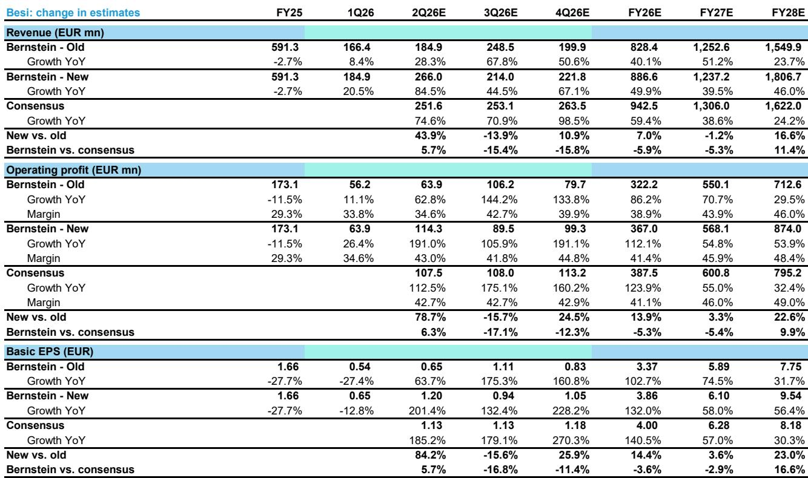
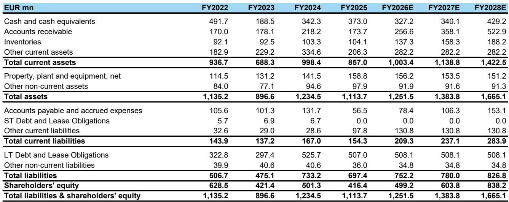
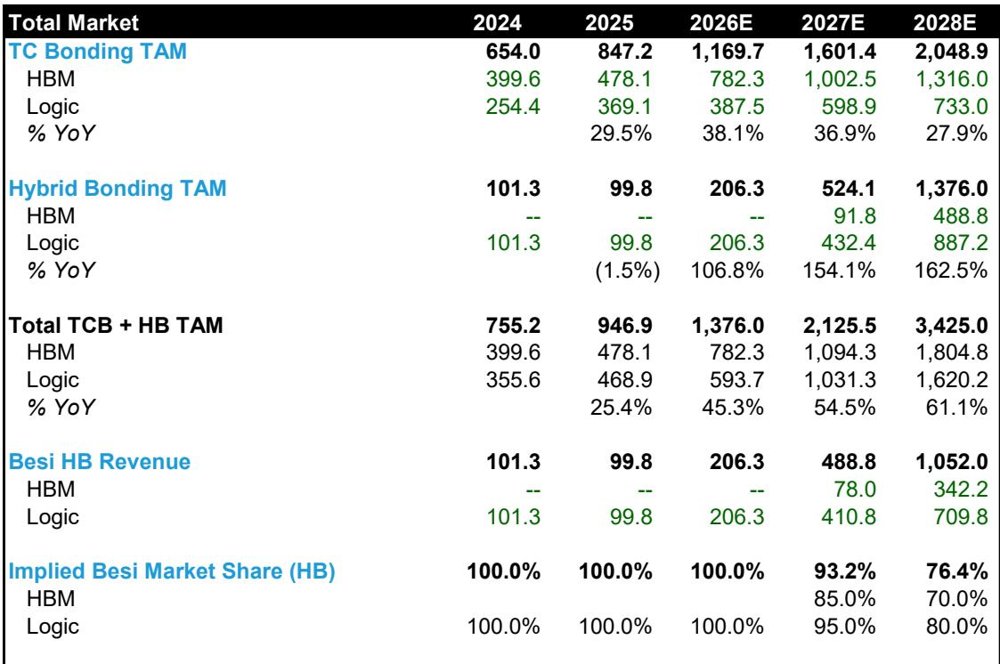

# Bernstein：混合键合从逻辑芯片向HBM存储渗透

混合键合正从逻辑芯片的明确趋势走向HBM存储的渐进渗透。Bernstein最新报告上调了混合键合设备市场预测，认为2028年该市场将增长至约14亿美元，较此前预期更为乐观。这一判断的核心驱动力来自台积电在系统级集成芯片封装上的产能扩张，以及英特尔从2027年起恢复混合键合产能建设。

报告指出，逻辑芯片领域采用晶圆对晶圆混合键合的趋势已经清晰。台积电的SolC产能预计将从2025年的1万片/月增长至2028年的8.5万片/月，增幅约8倍。这一扩张服务于AMD、苹果、谷歌和英伟达的芯片需求。Bernstein测算，每增加1千片/月的SolC产能，大约需要5至6台混合键合设备。基于此，该机构预计逻辑芯片用混合键合设备市场规模在2028年将达到8.87亿美元，较2025年增长约8倍。

> **KC评论：** 混合键合在逻辑芯片中的采用已从实验阶段进入规模化部署。台积电AP7和AP8产线的建设节奏，是判断设备出货量的关键指标。报告认为产能强度会随时间下降，意味着早期设备需求可能更集中。

HBM存储领域的混合键合采用时间表仍存在不确定性。三星可能在2027年的HBM4E中率先采用混合键合，但仅限于16层堆叠中的1层。如果HBM4E最终仅采用12层堆叠，混合键合的引入可能推迟至2028年的HBM5。报告预测2028年HBM用混合键合设备市场规模为4.89亿美元，出货量130台。与逻辑芯片不同，HBM每千片/月产能仅需约2至3台键合设备，设备密度不到逻辑芯片的一半。

## 1. 台积电SolC产能预计2028年达8万片/月

Bernstein认为台积电是混合键合产能扩张的核心推动者。目前台积电的混合键合设备主要部署在AP6产线，约65台。随着AP7和AP8产线逐步投产，预计到2028年台积电的混合键合设备保有量将达到约440台。产能扩张分三个阶段推进：首先是SolC封装应用，其次是高性能计算芯片部署，最后是更广泛的晶圆级多芯片模块采用。

报告特别提到，英伟达的Feynman GPU、博通的3.5D封装以及Groq的LPU都将成为混合键合需求的重要来源。AMD的Instinct GPU和3D V-Cache架构已经是混合键合的大规模量产案例。

## 2. 英特尔预计2027年重启混合键合产能扩张

英特尔已通过Foveros Direct 3D平台部署了混合键合架构，目前保有约30台设备。Clearwater Forest是英特尔首款采用混合键合连接CPU芯片与基底芯片的主要处理器。但报告指出，由于Diamond Rapids可能推迟至2027年，英特尔在2026年的产能扩张幅度有限，真正的增长将从2027年开始。预计到2028年，英特尔的混合键合设备保有量将达到约65台。

> **KC评论：** 英特尔在混合键合上的节奏与台积电不同。其现有设备主要用于内部产品验证，大规模采购要等到Clearwater Forest和Diamond Rapids的量产爬坡。这一时间差可能影响2026年的设备出货结构。

## 3. HBM混合键合采用呈现渐进特征

与逻辑芯片的明确趋势不同，HBM领域的混合键合采用更为谨慎。报告列出三个制约因素：JEDEC可能放宽HBM高度标准至约900微米、HBM4E可能停留在12层堆叠、三星和SK海力士正在开发新的散热方案。这些因素使得当前的热压键合方案仍能满足大部分需求。

但长期来看，层数增加和I/O通道从2048扩展至4096将推动部分层转向混合键合。三星预计率先采用，SK海力士和美光随后跟进。报告预计2028年HBM混合键合渗透率约为15%，对应的设备市场规模为4.89亿美元。热压键合设备出货量预计在2028年后开始下降。

## 4. 贝西预计2028年混合键合收入约11亿美元

Bernstein假设贝西在2028年混合键合市场占有76%份额，其中逻辑芯片80%、HBM70%。按每台设备均价375万美元计算，贝西的混合键合收入约为11亿美元，对应约281台设备出货量。该机构将贝西2028年每股盈利预测上调23%，较市场共识高出16.6%。

对于迪斯科，报告认为其真正增长来自混合键合对切割和研磨设备的高洁净度要求。从2027年起，NAND CBA键合、背面供电网络和晶圆对晶圆混合键合将成为新的需求驱动力。

**观察框架：** 混合键合设备市场的判断可拆解为三个变量：台积电SolC产能扩张速度、HBM层数标准变化、以及英特尔产品路线图的执行节奏。这三个变量决定了设备出货的时间分布和总量上限。

For informational purposes only. Portions may be generated,translated,summarized,or edited with AI assistance based on source materials and may contain omissions or errors. Please verify independently. This is not investment,legal,tax,accounting,or other professional advice.

For informational purposes only. Portions may be generated,translated,summarized,or edited with AI assistance based on source materials and may contain omissions or errors. Please verify independently. This is not investment,legal,tax,accounting,or other professional advice.

