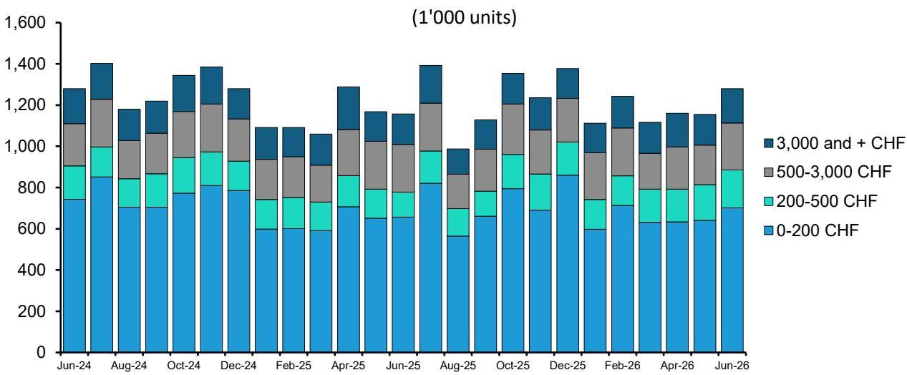
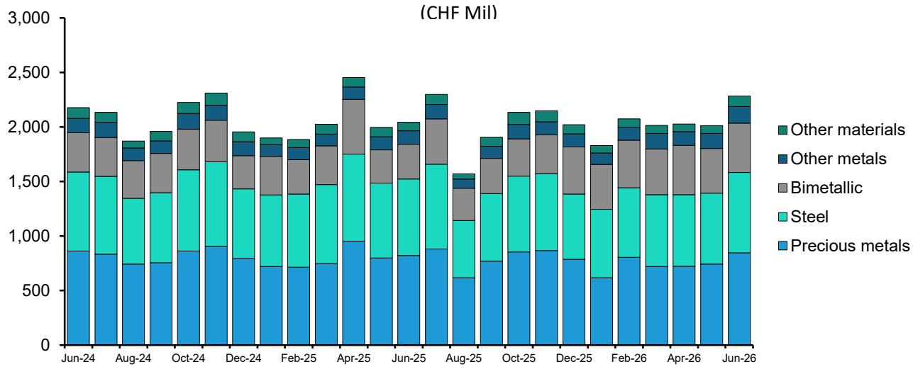
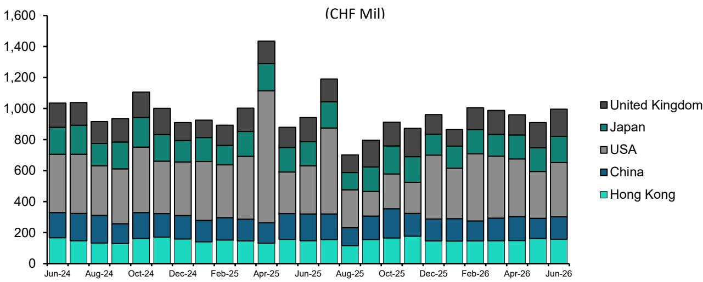

# Bernstein：消费品牌数据与主题变化观察

全球奢侈品需求是否正在走出低谷，Bernstein最新发布的瑞士手表出口数据提供了一个观察窗口。2026年6月，瑞士手表出口额同比增长11.2%，但这一数字背后存在结构性扭曲：调整两个额外工作日后，实际增速仅为1.1%。更关键的是，当月对法国出口增长103.5%，而法国更多扮演物流中转角色，并非终端需求真实反映。剔除法国后，出口增速降至5.6%，日历调整后则为-4%。

这份报告的核心判断是：全球手表需求正走在一条逐步调整的轨道上，美国市场是主要驱动力，大中华区仍在调整，中东出现阶段性反弹但可持续性存疑。Bernstein认为，在宏观不确定性和短期资金博弈叠加的背景下，行业复苏路径仍存在反复可能。

## 1. 美国与英国市场维持双位数增长，成为需求支柱

6月美国市场瑞士手表进口增长12.7%，英国增长12.2%。英美市场对瑞士手表的强劲需求延续了年初以来的势头，成为全球手表出口回暖的主要支撑。Bernstein指出，英美消费者对高端腕表的购买意愿保持稳定，这与两地宏观环境相对平稳、消费信心未出现大幅波动有关。

相比之下，中东市场6月增长23.8%，部分原因是对3-4月因地区冲突损失的出口进行补回。整个二季度中东地区增速为1.4%，较一季度的-5%有所改善。但报告谨慎表示，目前尚无法判断这一增长是批发商对游客回归的短期乐观预期，还是本地需求的实质性改善。

> **KC评论：** 中东数据的反弹幅度虽然亮眼，但报告明确将其归因于“补回”而非“新增需求”。读者在跟踪这一区域时，需要关注三季度数据能否持续，而非单月数字。

## 2. 大中华区持续调整，中国内地消费者转向海外价差套利

大中华区仍是瑞士手表出口最仍在调整的区域。6月对中国内地出口下降16.5%，对香港出口增长6.9%，合并计算大中华区整体下降约5.7%，较上月-9.4%有所收窄。Bernstein认为，中国内地消费者对价格高度敏感，正大量转向香港、日本、韩国等汇率优势明显的市场购买手表，以获取汇率驱动的价差收益。6月对日本出口增长8.8%，也印证了这一趋势。

这种“消费外流”现象并非短期波动。报告暗示，只要人民币汇率与主要旅游目的地货币之间存在明显价差，中国内地消费者就会继续选择境外购买，这对内地市场的瑞士手表销售构成持续影响。

## 3. 价格带分化明显，200-500瑞士法郎区间异军突起

按价格带划分，6月表现最突出的是200-500瑞士法郎区间，出口数量和价值分别增长51.3%和54.1%。Bernstein指出，这一价格带的高增长与Swatch与爱彼联名款“Royal Pop”在5月发布有关，该产品定价恰好落在200-500瑞士法郎区间。低于200瑞士法郎的手表增长6.8%（数量）和9.9%（价值），高于3000瑞士法郎的高端表增长12%和14.2%，而500-3000瑞士法郎的中端区间则出现-1.3%和-4.7%的调整。

从12个月滚动数据看，出口数量同比增长2.9%，其中200-500瑞士法郎区间以6%的增速领跑。这一价格带的活跃度反映了两个趋势：一是联名款等营销手段对入门级市场的拉动效果显著；二是中端市场（500-3000瑞士法郎）正面临来自上下两端的挤压，消费者要么升级到高端，要么降级到入门。

## 4. 行业复苏路径仍存变数，Bernstein倾向防御性配置

Bernstein在报告的“研究含义”部分明确指出，全球奢侈品需求的复苏轨迹仍不确定。两个波动源同时存在：一是消费者在脆弱宏观环境和紧张地缘政治下的需求波动；二是短期资金在奢侈品板块的多空博弈，放大了报价的涨跌幅度。

在此背景下，Bernstein建议采取更防御性的姿态，核心配置集中在两类标的：一是“公允价值附近的高质量公司”，历峰集团因其珠宝业务的强劲势头和领导地位成为首选，Brunello Cucinelli也因其品质和均值回归潜力被看好；二是“自我修复故事”，包括LVMH（介于高质量与自我修复之间，迪奥复兴和成本效率是正面因素）、Burberry（转型一周年后品牌势能和全价销售率改善）和Ferragamo（处于转型早期，管理层正着手解决品牌、品类和零售网络问题）。

这份报告为观察全球奢侈品行业提供了一个从数据到策略的完整框架：出口数据揭示需求结构，价格带分化反映消费行为变化，而Bernstein的配置建议则是对行业周期位置的判断。对于关注这一领域的读者而言，美国市场的持续性、大中华区的底部位置以及中东数据的可持续性，将是未来几个季度需要持续跟踪的关键变量。

For informational purposes only. Portions may be generated,translated,summarized,or edited with AI assistance based on source materials and may contain omissions or errors. Please verify independently. This is not investment,legal,tax,accounting,or other professional advice.

For informational purposes only. Portions may be generated,translated,summarized,or edited with AI assistance based on source materials and may contain omissions or errors. Please verify independently. This is not investment,legal,tax,accounting,or other professional advice.

