Global Memory

# Korea Memory Export Tracker (Jun): Strong HBM in 2Q26, esp. for Samsung

Mark Li

+852 2123 2645

mark.li@bernsteinsg.com

Edward Hou, CFA

+852 2123 2623

edward.hou@bernsteinsg.com

Yipin Cai, CFA

+852 2123 2669

yipin.cai@bernsteinsg.com

We track the Korea export data as it is a good early indicator for Samsung's & SK hynix's HBM revenue in the same quarter, and update this tracker with the Jun data. Details of our methodology can be found in our prior note. The dataset can be downloaded at this link.

Overall HBM export was very strong, up 46% QoQ vs. Mar, & set another record high. Jun data grew 45% MoM on seasonality & more importantly up 46% QoQ. Overall 2Q26 exports increased by 39% QoQ.

Data suggested Samsung 2Q26 HBM growth could beat our estimates. Export from S. Chungcheong Province (where Samsung packages HBM) grew 2x MoM, and was stronger than expected. Overall 2Q26 was up 75% QoQ. Regression predicts Samsung's 2Q26 HBM revenue to rise by 89% QoQ to US\$6.7B, above our model.

Export for SK hynix stayed robust. Jun export from N. Chungcheong & Icheon recovered by 11% MoM and was up 5% QoQ. Regression predicts SK hynix 2Q26 HBM revenue to grow 25% QoQ to US\$7.6B, in line with our forecast.

Data suggests a continued ramp of HBM4 at Samsung. As HBM has much higher dollar value per weight, we track “value per weigh” as it may be directionally suggestive of HBM price change. Jun “value per weight” grew another 30% MoM for Samsung but remained largely flattish for SK hynix. We believe this was likely driven by a continued ramp of Samsung’s HBM4 rather than a broad HBM price hike. The trend over the past few months has been generally positive for Samsung but flattish or declining for SK hynix.

Data shows HBM price has been insulated from the volatility of conventional memory price. Conventional memory price surged, but HBM price, as suggested by value per weight, largely stayed in the same range as before, as indicated by SK hynix's data.

Export to Malaysia bounced back sharply. It surged to US\$1.1B in Jun, mainly thanks to a recovery of exports from Samsung. And generally export to Malaysia has been growing meaningfully over the past few quarters. No sign of HBM export to destinations other than Taiwan & Malaysia, and also no sign that Samsung or SK hynix was producing HBM at a location that we don't track. Our methodology thus remains robust.

Overall Jun data suggested robust HBM growth for 2Q26, with a notable sign of HBM4 ramp at Samsung. Between the two, Samsung appeared to be stronger & ahead of our forecast, while SK hynix was in line. We also maintain that Samsung is improving its position in HBM4 & should gain more momentum in 2H26. On the other hand, HBM price being resetting now should trigger an upward revision for 2027.

Conventional memory price rise will continue in 3Q26 and HBM price increase should also bring earnings revision. We see continued price increase in 3Q27 & also HBM price hike in 2027 to lead to more earnings revision. We remain structurally constructive on Samsung, SK hynix & Micron but negative on KIOXIA on China competition (see our sector update). Our detailed SOTP valuation also finds KIOXIA over-valued.

BERNSTEIN TICKER TABLE

<table><tr><td rowspan="2"></td><td colspan="4">20 Jul 2026</td><td rowspan="2">TTMRel.</td><td colspan="4">Reported EPS</td><td colspan="3">Reported P/E (x)</td></tr><tr><td>Rating</td><td>Cur</td><td>Closing Price</td><td>Price Target</td><td>Cur</td><td>2025A</td><td>2026E</td><td>2027E</td><td>2025A</td><td>2026E</td><td>2027E</td></tr><tr><td>005930.KS (SEC- Samsung)</td><td>O</td><td>KRW</td><td>251,500</td><td>440,000</td><td>247.4%</td><td>KRW</td><td>6,611.53</td><td>48,393</td><td>77,273</td><td>38.0</td><td>5.2</td><td>3.3</td></tr><tr><td>005935.KS (SEC-Pref - Samsung)</td><td>O</td><td>KRW</td><td>169,200</td><td>374,000</td><td>180.8%</td><td>KRW</td><td>6,611.53</td><td>48,393</td><td>77,273</td><td>25.6</td><td>3.5</td><td>2.2</td></tr><tr><td>SMSN.LI (Samsung)</td><td>O</td><td>USD</td><td>4,200.00</td><td>7,350.00</td><td>226.8%</td><td>USD</td><td>116.15</td><td>812.39</td><td>1,290.80</td><td>36.2</td><td>5.2</td><td>3.3</td></tr><tr><td>000660.KS (SK hynix)</td><td>O</td><td>KRW</td><td>1,841,000</td><td>3,300,000</td><td>557.0%</td><td>KRW</td><td>60,341</td><td>395,677</td><td>568,862</td><td>30.5</td><td>4.7</td><td>3.2</td></tr><tr><td>MU (Micron)</td><td>O</td><td>USD</td><td>848.95</td><td>1,300.00</td><td>623.7%</td><td>USD</td><td>8.29</td><td>67.39</td><td>158.99</td><td>102.5</td><td>12.6</td><td>5.3</td></tr><tr><td>285A.JP (KIOXIA)</td><td>U</td><td>JPY</td><td>52,110</td><td>40,000</td><td>2087.2%</td><td>JPY</td><td>1,014.00</td><td>10,013</td><td>9,656.84</td><td>51.4</td><td>5.2</td><td>5.4</td></tr><tr><td>ASIAX</td><td></td><td></td><td>1,865.18</td><td></td><td></td><td></td><td></td><td></td><td></td><td></td><td></td><td></td></tr><tr><td>EM</td><td></td><td></td><td>1,732.38</td><td></td><td></td><td></td><td></td><td></td><td></td><td></td><td></td><td></td></tr><tr><td>SPX</td><td></td><td></td><td>7,457.69</td><td></td><td></td><td></td><td></td><td></td><td></td><td></td><td></td><td></td></tr></table>

O - Outperform, M - Market-Perform, U - Underperform, NR - Not Rated, CS - Coverage Suspended

MU estimate is Adjusted EPS; MU valuation is Adjusted P/E (x);

Source: Bloomberg, Bernstein estimates and analysis.

## INVESTMENT IMPLICATIONS

Samsung Electronics: We rate Samsung Electronics Outperform with price target of KRW 440,000.

SK hynix : We rate SK hynix Outperform with price target of KRW 3,300,000.

## DETAILS

Korea Customs Service has released export data for Jun. As our previous note found, the export data for certain memory products bears close correlation with HBM revenues of Samsung and SK hynix. We hence track the monthly data to provide investors a preview on HBM revenues from the two companies in the same quarter. Details of our methodology can be found in the previous note. You may also download the export data at this link.

Export data suggests Samsung's 2Q26 HBM revenue likely was notably ahead of our estimates thanks to a very robust Jun. SK hynix HBM revenue is indicated to grow healthily and in line with our expectation, but notably slower than Samsung.

\- Jun Korea total multichip memory export to Taiwan and Malaysia was up strongly by 45% MoM, & reached another record high of US\$6.2B. Jun data was up 46% QoQ (vs. Mar) and also up 119% YoY (Exhibit 1). For all of 2Q26, export was up significantly by 39% QoQ. As we analyzed before, multichip memory export to Taiwan and Malaysia tracked closely with HBM revenues of Samsung and SK hynix and therefore the Jun data indicated strong and accelerating momentum into 2Q26.

\- If we focus on the export from S. Chungcheong Province, where Samsung's back-end fabs are and likely where its HBM is packaged, Jun export surged to US\$3.4B, doubling from May. And we also note that Jun single month export by Samsung surpassed that of SK hynix, for the first time since HBM exports took off in early 2024 (Exhibit 2). Overall 2Q26 export grew by 75% QoQ, which is notably stronger than our forecast of 51% growth for Samsung HBM in 2Q26 (Exhibit 3). According to the regression using historical data, Apr-Jun data suggested US\$6.7B in HBM revenue for Samsung in 2Q26, notably ahead of our estimate of US\$5.4B by 25%, and represented 89% QoQ growth (Exhibit 4). If we run the regression using only data points from 1Q25, the Apr-Jun data would also suggest roughly US\$6.7B in HBM revenue for 2Q26 (Exhibit 5). Samsung's HBM export monthly seasonality indeed was more backend loaded in 2Q26 compared to the previous few quarters, with 55% of export coming from Jun. Though we note that 2Q and 3Q25 seasonality was also very backend loaded and we wonder if 3Q26 will follow a similar pattern (Exhibit 6). Overall Samsung's HBM growth momentum was faster than expected in 2Q26, primarily supported by a very strong Jun. This also aligns with Samsung's guidance that HBM4 ramp should accelerate meaningfully into 2H26, & we hence remain positive on Samsung's HBM share gain this year (see Samsung 1Q26 earnings takeaway).

\- For SK hynix, we have identified that its HBM export should come nearly all from N. Chungchoeng Province and Icheon City, where its wafer fabs are. Jun export data rose by 11% MoM and 5% QoQ (vs Mar) (Exhibit 7). Overall 2Q26 export was up by 19% QoQ, quite close to our current forecast of 25% growth in HBM revenue in 2Q26 by hynix (Exhibit 8). Regression also finds that the export value suggests US\$7.6B HBM revenue by hynix in 2Q26, exactly in line with our forecast (Exhibit 9). Monthly seasonality of hynix's exports continued to be relatively balanced compared to Samsung's backend loaded one (Exhibit 10). All things considered, data indicated that SK hynix HBM is likely to grow healthily and in line with our estimates, but notably slower than Samsung.

EXHIBIT 1: Being a close proxy for HBM shipment, Korea multichip memory export to Taiwan and Malaysia reached a historical high at USD 6.2B in Jun 2026.  
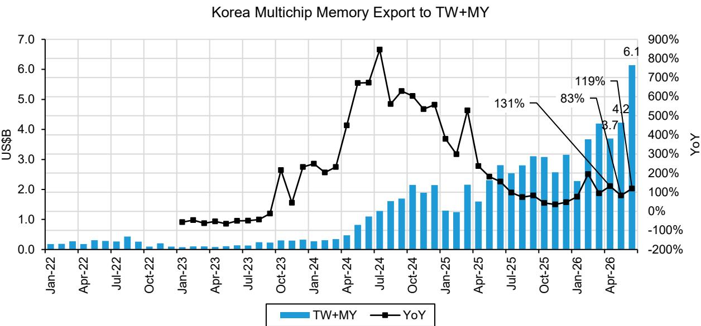  
Source: Korea Custom Service, KITA, company reports, Bernstein estimates and analysis

EXHIBIT 2: Export from S. Chungcheong was up 93% MoM and 75% QoQ vs. Mar.  
Multichip Memory Export from S. Chungcheong to TW+MY vs Samsung HBM Revenue  
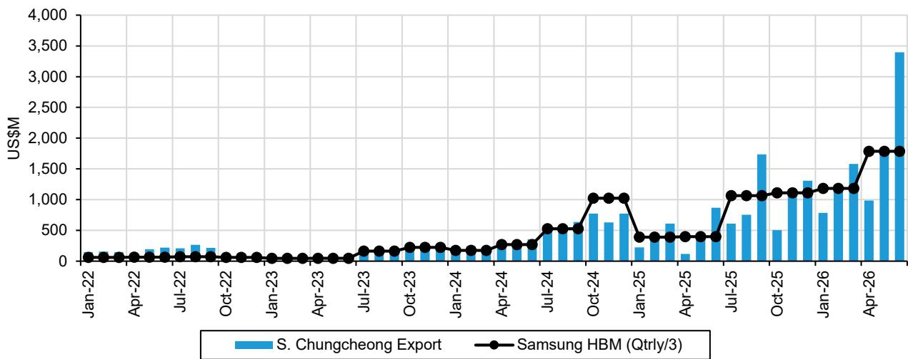  
Samsung HBM revenue in 2Q26 is Bernstein estimate  
Source: Korea Custom Service, KITA, company reports, Bernstein estimates and analysis

Qtrly Samsung HBM Revenue vs. Qtrly Multichip Memory Export from S. Chungcheong to TW+MY (1Q25-1Q26)

Qtrly Samsung HBM Revenue vs. Qtrly Multichip Memory Export from S. Chungcheong to TW+MY (1Q23-1Q26)

EXHIBIT 3: Export from S.Chungcheong was up 75% QoQ in 2Q26.  
Samsung HBM Revenue vs. Multichip Memory Export from S. Chungcheong to TW+MY  
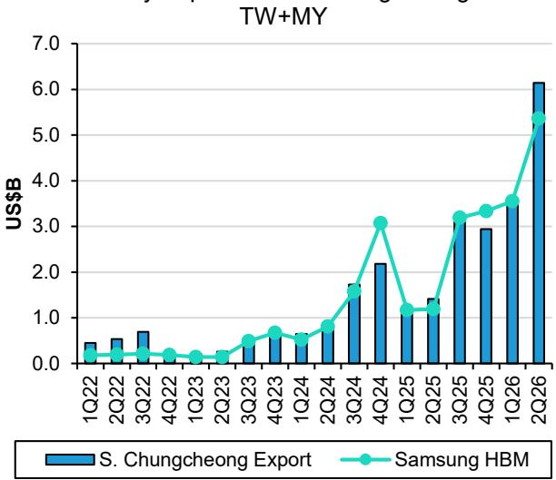  
Samsung HBM revenue in 2Q26 is Bernstein estimates
Source: Korea Custom Service, KITA, company reports and Bernstein analysis

EXHIBIT 4: This suggests US\$6.7B and 89% QoQ growth for Samsung 2Q26 HBM revenue, ahead of our expectation.  
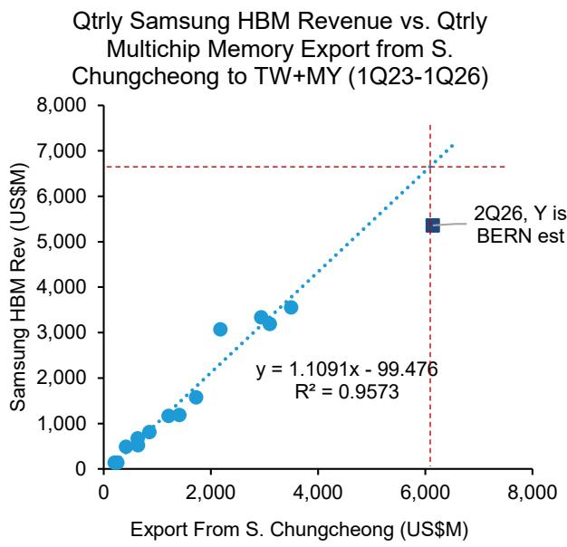  
Source: Korea Custom Service, KITA, company reports and Bernstein analysis

EXHIBIT 5: If we use only the data from recent quarters, Jun data would also suggest Samsung to have US\$6.7B in 2Q26 HBM sales.  
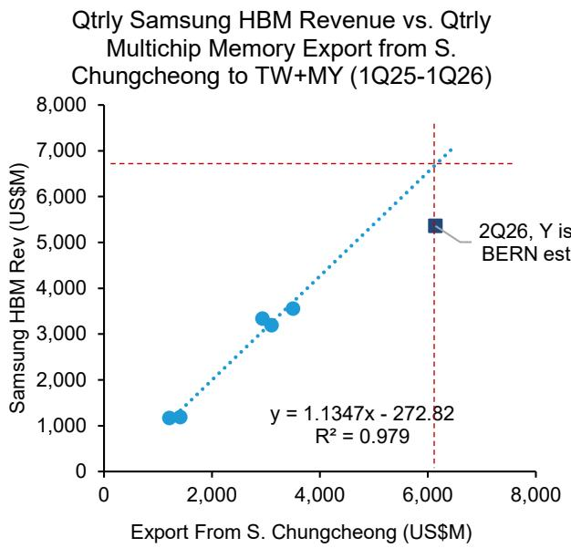  
Source: Korea Custom Service, KITA, company reports and Bernstein analysis

EXHIBIT 6: Monthly seasonality of export from S. Chungcheong has been more back-end loaded.  
S. Chungcheong Multichip Memory Export to TW+MY Monthly Seasonality Within Quarter  
  
Source: Korea Custom Service, KITA and Bernstein analysis

EXHIBIT 7: Export from N. Chungcheong and Icheon was up 11% MoM in Jun.  
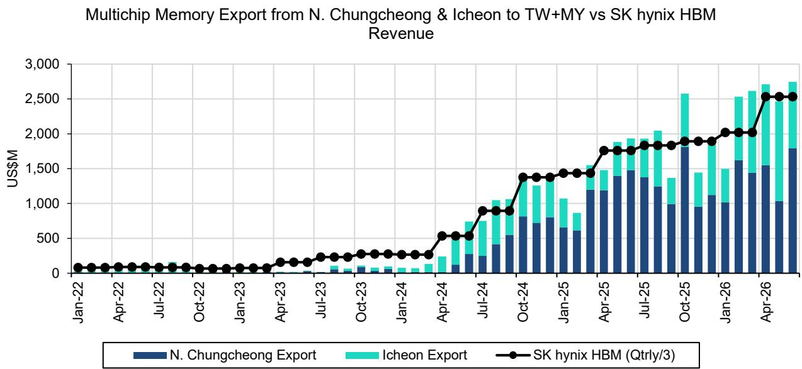  
SK hynix HBM revenue in 2Q26 is Bernstein estimate  
Source: Korea Custom Service, KITA, company reports, Bernstein estimates and analysis

EXHIBIT 8: Export from N.Chungcheong and Icheon was up by 19% QoQ in 2Q26.  
SK hynix HBM Revenue vs. Multichip Memory Export from N. Chungcheong & Icheon to TW+MY  
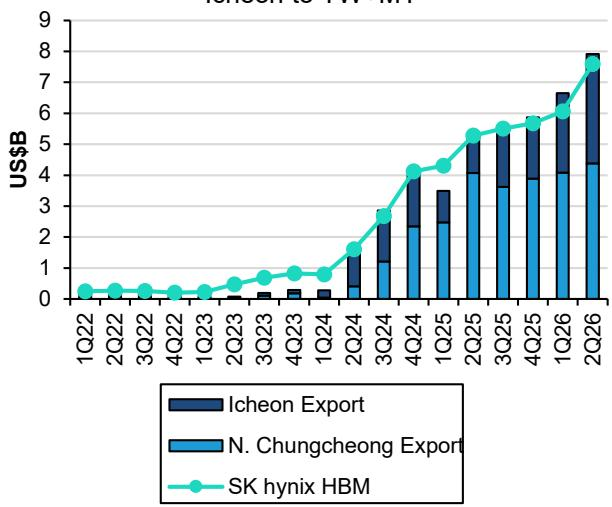  
SK hynix 2Q26 HBM revenue is Bernstein estimate
Source: Korea Custom Service, KITA, company reports and Bernstein analysis  
EXHIBIT 9: This indicates US\$7.6B HBM revenue in 2Q26 for SK hynix, which is in line with our expectation.  
Qtrly SK hynix HBM Revenue vs. Qtrly Multichip Memory Export from N. Chungcheong & Icheon to TW+MY (1Q23-1Q26)

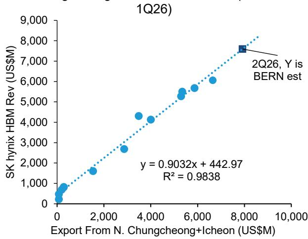  
Source: Korea Custom Service, KITA, company reports and Bernstein analysis

EXHIBIT 10: Monthly seasonality for N. Chungcheong + Ichoen remained much more balanced compared to Samsung.  
N. Chungcheong + Icheon Multichip Memory Export to TW+MY Monthly Seasonality Within Quarter  
  
Source: Korea Custom Service, KITA and Bernstein analysis

## Samsung's export value per weight surged further in Jun likely thanks to rising HBM4 shipment.

\- Export value per weight for Korea multichip memory loosely correlates with HBM ASP, though it likely is only directionally indicative and not significant enough to make precise estimates. For Jun, export value per weight remained largely flattish MoM for N. Chungcheong+Ichoen (proxy for SK hynix). But data for S. Chungcheong (proxy for Samsung) continued surging very strongly in Jun by another 30% MoM and cumulatively by 70% vs Apr (Exhibit 11). This, along with surge in monthly export, could likely be related to rising HBM4 shipment, which should command notably higher value per weight than HBM3E. Samsung guided its HBM4 to cross over prior generations in 3Q26 and the data in the past two months indeed

S. Chungcheong Export N. Chungcheong Export + Icheon Export Other Provinces

suggests good progress toward that.

\- Looking at the data over the past several months, we find the trend remained positive for S. Chungcheong (hence Samsung). The notable increase in the recent months suggests beginning of volume shipment of HBM4. On the other hand, there was no sign of HBM4 shipment for SK hynix, as trend for N. Chungcheong+Icheon (i.e. SK hynix) has been downward or at best flattish since mid 2025.

\- Another important observation is while the price of conventional memory has been rising quickly, the data suggested that of HBM has been much steadier. Export value per weight from S.Chungcheong indeed grew but that's due to mix improvement from HBM4, rather than a general HBM price hike. The blended average even fell when we consider SK hynix's larger scale in HBM and the falling value per weight trend for the company. That said, we believe that suppliers and customers are negotiating the HBM contracts and prices for 2027 now. We expect this to trigger an upward revision for 2027 earnings, and this will also support memory stock prices in the near term.

EXHIBIT 11: Samsung's export value per weight continued to surge in Jun, probably indicating growing HBM4 shipment.

Korea Multichip Memory Export Value per Weight to TW+MY  
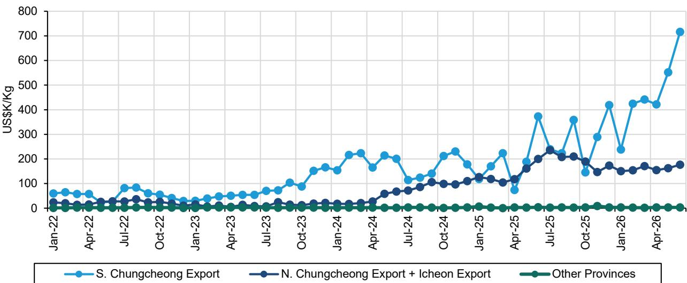  
Source: Korea Custom Service, KITA and Bernstein analysis

Export to Malaysia rebounded seasonally and generally has been growing at meaningful paces over the past few quarters. It likely suggested continued interest in EMIB, but we also wonder why the increase happened so early. Besides that we found no sign of new HBM packaging sites in Korea or new export destination countries.

\- Korea total multichip memory export to all countries was US\$12.7B in Jun, up by 32% MoM & up 48% QoQ, thanks to both growth in HBM and also surging prices of conventional memory. Taiwan and Malaysia accounted for 48% of the total export, down slightly QoQ from 49% in Mar, as conventional memory export value to other destinations grew faster with price increase (Exhibit 12). Looking at export value per weight chart, Taiwan remained notably higher than other countries, confirming Taiwan was still the primary destination of HBM export from Korea in Jun. Value per weight to Malaysia increased further in May & hence still strongly indicated presence of HBM. So far Taiwan and Malaysia remained the only destinations where we see very high export per weight, and therefore very likely HBM export (Exhibit 13). Export value per weight to Hong Kong and China Mainland was mixed, with China dipping and Hong Kong still growing. While we observe some increase in value per weight in regions other than Taiwan and Malaysia, we still assume it was due to rising conventional memory prices, and not due to HBM shipment, as Samsung and SK hynix likely exported considerable amounts of mobile memory packages to these regions & memory packages are categorized as multichip memory too (Exhibit 14). And it also supports conventional memory enjoys rapidly rising prices and commands better revenue and profit per wafer than HBM now.

\- Export to Malaysia bounced back sharply by 231% MoM to \~US\$1.1B in Jun, probably largely on seasonality. Average run rate in the last 6 month was to US\$0.55B, compared to US\$3.5B for exports to Taiwan. We understand that Malaysia is home to Intel's high-end packaging facilities, where some high-end server CPUs equipped with HBM are packaged with EMIB. Separately we picked up a growing customer interest in EMIB, and we note Intel is set to bring online a new advanced packaging fab into production this year as well (link). However, even if customers decide to adopt, we believe any volume production should be 1-2 years from now, and wonder why HBM export to Malaysia took place so early. All in all the export to Malaysia is worth continued monitoring.

\- Rebound in export to Malaysia was mainly attributable to Samsung, and apparently driven by seasonality as well. Though overall Samsung's export to Malaysia grew robustly in 2Q26 (Exhibit 15). Export from SK hynix's facilities recovered a bit in Jun but overall remained more or less flattish (Exhibit 16). Broadly the export to Malaysia has been growing quickly and has benefited Samsung more and has been one of the reasons behind Samsung's HBM revenue growth. It also supports Samsung's broadening customer recognition in HBM.

\- For the origin of export, Jun data showed that S. Chungcheong, N. Chungcheong and Ichoen continued to account for almost all of multichip memory export to Taiwan & Malaysia (Exhibit 17). So it does not appear either Samsung or SK hynix has started packaging HBM in other locations within Korea.

\- Overall, all the data above suggested that HBM export continued to concentrate in mostly Taiwan and to a lesser degree Malaysia. However, we'd like to point out the limitations to our methodology. One is if either of them moves any HBM packaging outside of Korea, it will not be picked up by this export data. We however don't think this is happening soon. Secondly, if any of their HBM shipment is consumed (i.e. packaged into another product) within Korea, it will also not be reflected in our analysis either. We think this second limitation may become more relevant as Amkor (AMKR US, not covered) has small volume of CoWoS-like production in Korea already and may increasingly do more in the future.

EXHIBIT 12: Multichip memory includes mobile DRAM & NAND packages too, and most of the export went to Hong Kong/China & Vietnam prior to 2024 as most of smartphone production is in those regions. Since 2024 the export to Taiwan has been rising very quickly due to a surge in HBM export to Taiwan for CoWoS packaging there. And in recent months we also saw an increase in the export to Malaysia.

Korea Multichip Memory Export by Destination  
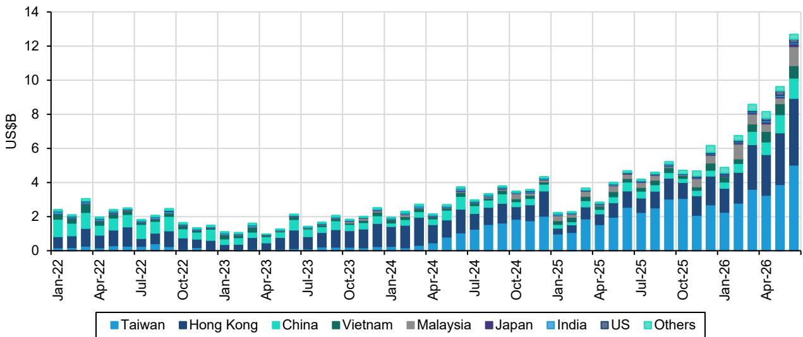  
Source: Korea Custom Service, KITA and Bernstein analysis

EXHIBIT 13: Value per weight continued to indicate that HBM was likely primarily exported to Taiwan and Malaysia in Jun.  
Korea Multichip Memory Export Value per Weight  
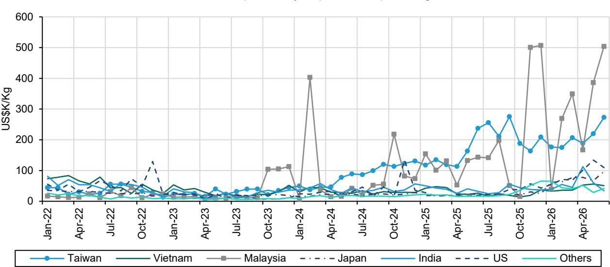  
Source: Korea Custom Service, KITA and Bernstein analysis

EXHIBIT 14: Value per weight rose for export to Hong Kong in Jun but dipped for China. We assume the changes were due to conventional memory increase instead of HBM shipment.  
Korea Multichip Memory Export Value per Weight To Hong Kong and China Mainland  
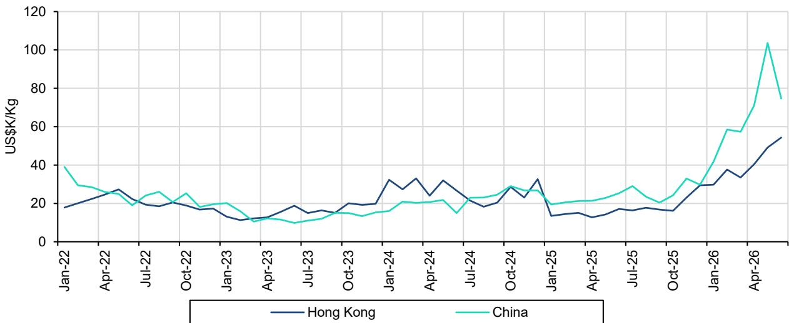  
Source: Korea Custom Service, KITA and Bernstein analysis

EXHIBIT 15: S. Chungcheong HBM export to Malaysia rebounded very sharply in Jun partially thanks to seasonality, but overall has been growing notable over the past few quarters.  
Multichip Memory Export From S.Chungcheong to TW+MY  
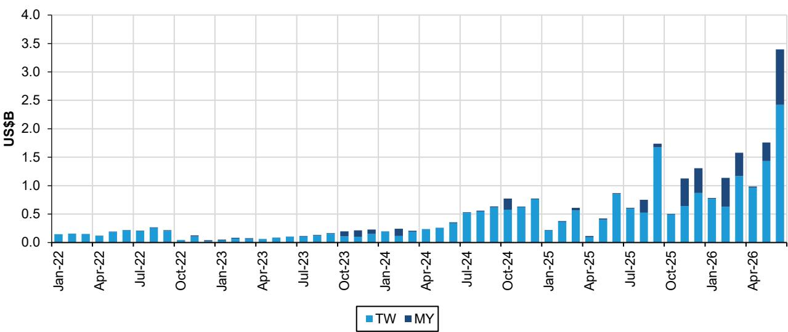  
Source: Korea Custom Service, KITA and Bernstein analysis

EXHIBIT 16: SK hynix HBM export to Malaysia recovered MoM in Jun but in generally remained limited compared to Samsung.  
Multichip Memory Export From N.Chungcheong & Icheon to TW+MY  
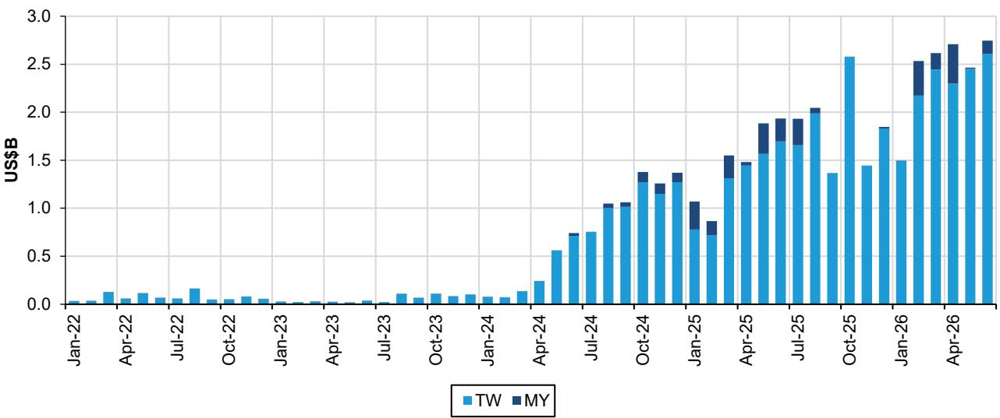  
Source: Korea Custom Service, KITA and Bernstein analysis

EXHIBIT 17: S. Chungcheong, N. Chungcheong and Ichoen continued to account for almost all of multichip memory export to Taiwan & Malaysia.  
Korea Multichip Memory Export to TW+MY  
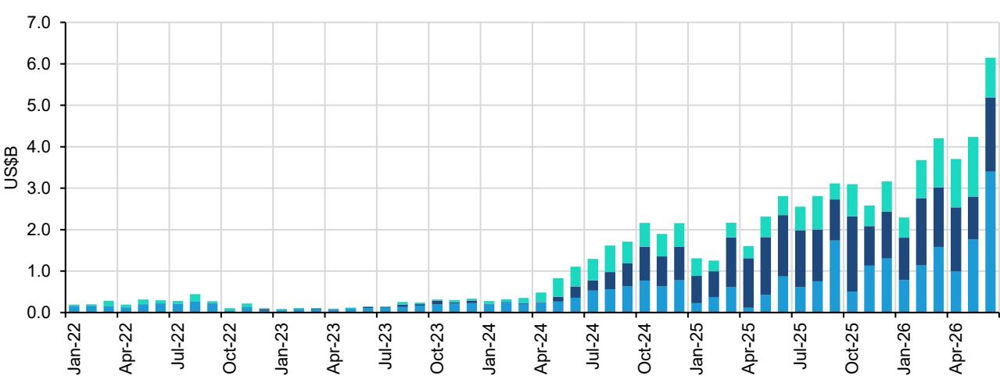  
■ S. Chungcheong Export ■ N. Chungcheong Export ■ Icheon Export ■ Other Provinces  
Source: Korea Custom Service, KITA and Bernstein analysis

## Overall Jun data came in very strong especially for Samsung and indicated faster-than-expected HBM revenue growth for Samsung in 2Q26, and also continued ramp up of HBM4.

\- In summary, Jun data came in very strong, partially driven by seasonality. Data was much stronger for Samsung and, through regression analysis, suggests 89% QoQ growth in HBM revenue in 2Q26 for Samsung and 25% growth for SK hynix. The sharp growth by Samsung was likely partially contributed by growing volume shipment of HBM4, which was supported by continued surge in its export value per weight in Jun, and was also meaningfully ahead of our current forecast. For SK hynix the predicted growth was more or less in line with expectation. Overall HBM demand momentum stays very robust despite slower progress in Rubin. Export to Malaysia also bounced back and generally has been growing at meaningful paces over the past few quarters.

\- For the stocks, price increases in conventional memory & earnings revision on HBM prices reflecting shortage will provide a near-term support to share prices. Mid-to-long term, we will be on the lookout for the emergence and upcoming IPO of CXMT & YMTC to better assess their structural threat, especially in NAND as China can advance technologies and capacity of NAND without EUV. We caution investors of cyclical risks but remain structurally constructive on DRAM and on Samsung, SK hynix and Micron (see Global Memory: Memory becoming a burden of AI too?). For KIOXIA, our recent detailed SOTP valuation (KIOXIA: All parties come to an end - Underperform) finds KIOXIA over-valued and we maintain our structural negative stance on it.

## I. REQUIRED DISCLOSURES

References to "Bernstein" or the "Firm" in these disclosures relate to the following entities: Bernstein Institutional Services LLC (April 1, 2024 onwards), Bernstein & Co., LLC (pre April 1, 2024), Bernstein Autonomous LLP, BSG France S.A. (April 1, 2024 onwards), Bernstein (Hong Kong) Limited 盛博香港有限公司, Bernstein (Canada) Limited, Bernstein (India) Private Limited (SEBI registration no. INH000006378), Bernstein (Singapore) Private Limited, Bernstein Japan KK (サンフォード・C・バーンスタイン株式会社) and analysts employed by SG Africa Technologies & Services to produce Bernstein under a Global Services Agreement in place between Bernstein and SG.

Bernstein is part of a joint venture between SG (SG) and AllianceBernstein, L.P. (AB). Unless specifically noted otherwise, for purposes of these disclosures, references to Bernstein's “affiliates” relate to both SG and AB and their respective affiliates.

## VALUATION METHODOLOGY

## Samsung Electronics Co Ltd

We value Samsung Electronics with 6.2x of forward 5Q-8Q EPS of KRW71,172 and arrive at price target of KRW 440,000 for its common shares, KRW374,000 for preferred shares, and US\$7,350 for GDR.

## SK Hynix Inc

We value SK hynix with 6.2x of forward 5Q-8Q EPS of KRW536,158 and arrive at price target of KRW3,300,000.

## Micron Technology Inc

We value Micron with 7.7x of forward 5Q-8Q EPS of US\$169.8 and arrive at price target of US\$1,300.

## KIOXIA Holdings Corp

We value KIOXIA with 4.1x of 1-year forward EPS of ¥9,810 and arrive at price target of ¥40,000.

## RISKS

## Samsung Electronics Co Ltd

The biggest downside risk to our target price is an earlier end of favorable pricing environment, which can be a result of weaker demand or higher supply. Investor sentiment and hence the valuation rewarded by investors is also a risk. China's progress in memory, especially in NAND, is a downside risk too.

## SK Hynix Inc

The biggest downside risk to our target price is an earlier end of favorable pricing environment, which can be a result of weaker demand or higher supply. Investor sentiment and hence the valuation rewarded by investors is also a risk. China's progress in memory, especially in NAND, is a downside risk too.

## Micron Technology Inc

The biggest downside risk to our target price is an earlier end of favorable pricing environment, which can be a result of weaker demand or higher supply. Investor sentiment and hence the valuation rewarded by investors is also a risk. China's progress in memory, especially in NAND, is a downside risk too.

## KIOXIA Holdings Corp

Upside risk to our target price include 1) stronger than expected NAND demand growth, which likely would lead to better NAND pricing and hence company earnings, 2) favorable policy support from Japanese government such as capex subsidies, and 3) better than expected cost reduction

## RATINGS DEFINITIONS, BENCHMARKS AND DISTRIBUTION

## EQUITY RATINGS DEFINITIONS

## Bernstein brand

The Bernstein brand rates stocks based on forecasts of relative performance for the next 12 months versus the S&P 500 for stocks listed on the U.S. and Canadian exchanges, versus the Bloomberg Europe Developed Markets Large and Mid Cap Price Return Index EUR (EDME) for stocks listed on the European exchanges and emerging markets exchanges outside of the Asia Pacific region, versus the Bloomberg Japan Large and Mid Cap Price Return Index USD (JPL) for stocks listed on the Japanese exchanges, and versus the Bloomberg Asia ex-Japan Large and Mid Cap Price Return Index (ASIAX) for stocks listed on the Asian (ex-Japan) exchanges -unless otherwise specified.

The Bernstein brand has three categories of ratings:

\- Outperform: Stock will outpace the market index by more than 15 pp

• Market-Perform: Stock will perform in line with the market index to within +/-15 pp

• Underperform: Stock will trail the performance of the market index by more than 15 pp

Coverage Suspended: Coverage of a company under the Bernstein brand has been suspended. Ratings and price targets are suspended temporarily, are no longer current, and should therefore not be relied upon.

Not Rated: A rating assigned when the stock cannot be accurately valued, or the performance of the company accurately predicted, at the present time. The covering analyst may continue to publish research reports on the company to update investors on events and developments.

Not Covered (NC) denotes companies that are not under coverage.

Bernstein brand stock ratings are based on a 12-month time horizon.

## Autonomous brand – common stocks

The Autonomous brand rates common stocks as indicated below. As our benchmarks we use the Bloomberg Europe 600 Financials Price Return Index (E600BK) and Bloomberg Europe Dev Mkt Financials Large and Mid Cap Price Ret Index EUR (EDMFI) index for developed European banks and Payments, the Bloomberg Europe 600 Insurance Price Return Index (E600IN) for European insurers, the S&P 500 and S&P Financials for US banks and Payments coverage, S5LIFE for US Insurance, the S&P Insurance Select Industry (SPSIINS) for US Non-Life Insurers coverage, and the Bloomberg Emerging Markets Financials Large, Mid and Small Cap Price Return Index (EMLSF) for emerging market banks and insurers and Payments. Ratings are stated relative to the sector (not the market).

The Autonomous brand has three categories of common stock ratings:

\- Outperform (OP): Stock will outpace the relevant index by more than 10 pp

\- Neutral (N): Stock will perform in line with the market index to within +/-10 pp

• Underperform (UP): Stock will trail the performance of the relevant index by more than 10 pp

Coverage Suspended: Coverage of a company under the Autonomous research brand has been suspended. Ratings and price targets are suspended temporarily, are no longer current, and should therefore not be relied upon.

Not Rated: A rating assigned when the stock cannot be accurately valued, or the performance of the company accurately predicted, at the present time. The covering analyst may continue to publish research reports on the company to update investors on events and developments.

Those denoted as ‘Feature’ (e.g., Feature Outperform FOP, Feature Under Outperform FUP) are our core ideas.

Not Covered (NC) denotes companies that are not under coverage.

Autonomous brand common stock ratings are based on a 12-month time horizon.

## Autonomous brand – preferred stocks

The Autonomous brand has three categories of preferred stock ratings:

\- Outperform (OP): The total return of the preferred instrument is expected to outperform preferred securities of other issuers operating in similar sectors or rating categories over the next six months.

\- Neutral (N): The total return of the preferred instrument is expected to perform in line with preferred securities of other issuers operating in similar sectors or rating categories over the next six months.

\- Underperform (UP): The total return of the preferred instrument is expected to underperform preferred securities of other issuers operating in similar sectors or rating categories over the next six months.
