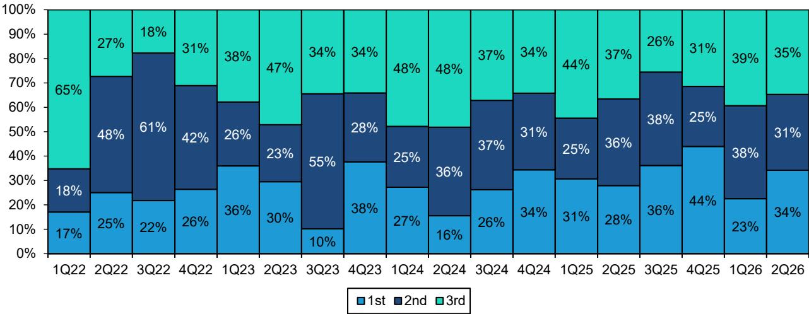
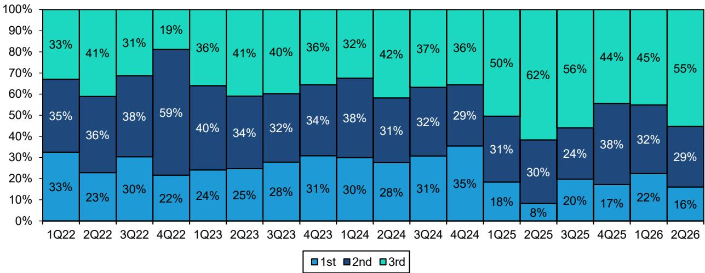

# Bernstein：HBM与存储行业技术应用观察

韩国海关6月出口数据为HBM行业提供了一个罕见的实时观测窗口。Bernstein通过追踪特定品类和地区的出口数据，发现三星电子在HBM领域的增长势头明显快于此前预期，而SK海力士的表现基本符合市场预测。这份基于韩国海关月度数据的报告，揭示了HBM4产品在三星的加速导入，以及HBM定价与常规存储价格之间正在出现的分化。

报告的核心判断是：三星二季度HBM收入可能达到67亿美元，环比增长89%，较Bernstein此前预测高出25%。这一增长主要由6月单月出口数据大幅跳升驱动，而非季度内均匀分布。

## 1. 三星HBM出口数据显著超出预期

Bernstein将韩国忠清南道（三星HBM封装所在地）的多芯片存储出口数据作为其HBM收入的先行指标。6月，该地区对台湾和马来西亚的出口额飙升至34亿美元，环比弹性较高。这是自2024年初HBM出口启动以来，三星单月出口首次超过SK海力士。

整个二季度，忠清南道的出口环比增长75%，远高于Bernstein此前对三星HBM收入51%的环比增长预测。回归模型显示，4月至6月的出口数据对应三星二季度HBM收入约67亿美元，较模型预测的54亿美元高出约25%。值得注意的是，三星HBM出口的月度季节性在二季度呈现明显的后置特征，55%的出口集中在6月，这与2024年二、三季度的模式类似。

> **KC评论：** 出口数据的后置季节性意味着，仅凭4月和5月的数据可能低估三星当季HBM表现。读者在跟踪月度数据时，需要将这种季度内的不均匀分布纳入观察框架，而非简单线性外推。

## 2. SK海力士HBM增长稳健但节奏更均衡

与三星不同，SK海力士的HBM出口主要来自忠清北道和利川市（其晶圆厂所在地）。6月，该地区出口环比增长11%，同比增长5%。整个二季度出口环比增长19%，接近Bernstein对SK海力士HBM收入25%环比增长的预测。

回归模型显示，出口数据对应SK海力士二季度HBM收入约76亿美元，与预测完全一致。与三星的后置季节性不同，SK海力士的月度出口分布更为均衡。两家公司在HBM增长节奏上的差异，反映了各自产品组合和客户结构的区别。

## 3. 出口单位价值变化暗示HBM4在三星开始放量

报告引入了一个方向性指标——“单位重量出口价值”，该指标与HBM平均售价存在松散关联。6月，三星（忠清南道）的单位价值环比再增30%，4月以来累计增长70%。Bernstein认为，这更可能由HBM4出货占比提升驱动，而非整体HBM涨价。三星管理层此前指引HBM4将在三季度超越前代产品，近两个月的数据表明这一进程正在推进。

相比之下，SK海力士的单位价值自2025年中以来持平或走低，目前没有迹象显示其HBM4已开始出货。这一差异表明，三星在HBM4的客户导入和量产进度上可能正在追赶。

报告同时指出，HBM价格并未受到近期常规存储价格快速上涨的影响。SK海力士的单位价值数据表明，HBM价格基本维持在原有区间。但Bernstein认为，当前供应商与客户正在谈判2027年HBM合同，预计这将触发2027年盈利预期的上修。

## 4. 对马来西亚出口反弹反映HBM应用场景扩展

6月，韩国对马来西亚的多芯片存储出口大幅反弹至约11亿美元，环比增长231%，主要由三星贡献。马来西亚是英特尔高端封装设施的所在地，部分配备HBM的高端服务器CPU在此通过EMIB技术进行封装。报告观察到客户对EMIB的兴趣正在增长，但认为任何量产可能仍需1-2年时间，因此对当前出口的提前增长保持关注。

整体来看，HBM出口仍高度集中于台湾和马来西亚两个目的地。报告未发现三星或SK海力士在韩国境内其他地点开始HBM封装，也未发现新的出口目的地。这验证了其基于地区出口数据的追踪方法仍然有效。

For informational purposes only. Portions may be generated,translated,summarized,or edited with AI assistance based on source materials and may contain omissions or errors. Please verify independently. This is not investment,legal,tax,accounting,or other professional advice.

For informational purposes only. Portions may be generated,translated,summarized,or edited with AI assistance based on source materials and may contain omissions or errors. Please verify independently. This is not investment,legal,tax,accounting,or other professional advice.

