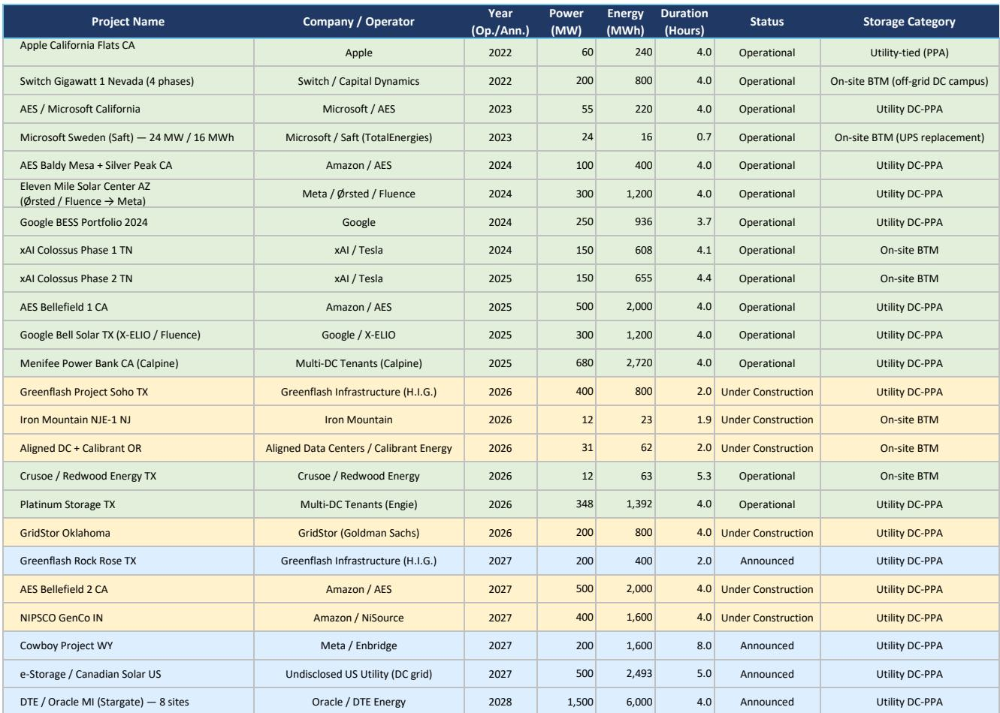
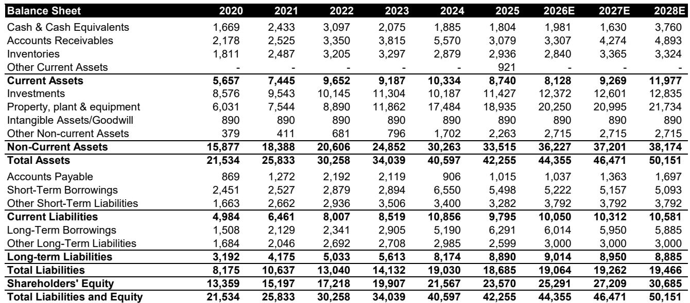
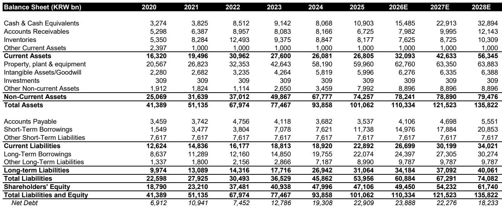

# Bernstein：电池储能数据与主题变化观察

美国数据中心正在成为电池储能需求增长最快的下游场景之一。Bernstein在最新发布的全球储能报告中指出，数据中心电池的平均配置时长已升至约5小时，在建项目中24%采用离网模式，规划项目中这一比例达到39%。部分超大规模运营商已将储能时长提升至8小时。

报告将美国数据中心电力容量假设从41GW上调至2030年的103GW，由此推算的累计电池需求达到277GWh。年度数据中心电池需求将从当前的5GWh增长至2030年的66GWh，增幅约10倍。电池容量与数据中心装机容量的比值（GWh/GW）将从0.3升至2.7倍，而新项目的这一乘数已达到4至8倍，意味着后续需求仍有上行空间。

## 1. 数据中心储能时长上升，离网项目驱动增量

报告基于超过20个已公布的美国数据中心项目进行了逐项梳理。运营中的项目储能时长集中在4小时左右，而2024年后宣布的新项目普遍在4至8小时区间。以Meta与Enbridge合作的Cowboy项目为例，其储能时长达到8小时，远高于早期项目。

从应用场景看，电池在数据中心内承担三种角色：集中式UPS、分布式BBU和储能系统（ESS）。前两者时长极短（低于0.25小时），而ESS的时长正在拉长。报告估计，与太阳能配套的数据中心购电协议（PPA）所需的储能时长将从2024年的约5小时升至2030年的8小时以上。

> **KC评论：** 数据中心储能时长上升的核心驱动力不是技术本身，而是供电模式的变化。当数据中心从电网取电转向“光伏+储能”自供电，储能时长就必须覆盖夜间或无光时段。这一逻辑与大型工商业用户侧储能的演进方向一致。

## 2. 美国电池总需求上调至486GWh，ESS占比七成

报告将美国整体电池需求预测上调15%，至2030年的486GWh，对应22%的年复合增长率。其中约70%的增量来自储能系统（ESS），预计从2025年的49GWh增长至2030年的266GWh。

当前美国ESS产能有限，约为36GWh，但报告预计今年将增至102GWh，主要推动力来自部分电动车工厂向储能产线转换。这一产能释放节奏与数据中心建设周期存在时间差，可能影响短期供应匹配。

## 3. 韩国电池厂商受益于关税壁垒与ESS增长，但利润率仍是关键变量

报告认为，韩国电池厂商在美国市场具备结构性优势。美国对华电池关税壁垒和本土化补贴政策，为LGES、三星SDI等企业创造了竞争缓冲。三星SDI对ESS的敞口更大，其电池销售中近半来自储能，电动车占比相对较低。

但利润率问题尚未解决。报告指出，扣除税收优惠后，韩国电池厂商的利润率仍接近盈亏平衡。尽管管理层指引称2026年下半年利润率有望转正，市场对此仍有分歧。美国电动车需求年初至今下降25%，继续对短期利润率构成不确定性。

## 4. 估值回落但入场时机仍需等待

经过近期调整，韩国电池厂商的远期估值已回落至更具吸引力的区间。2027年EV/EBITDA约为12倍，2030年约为5倍。报告测算，LGES和三星SDI在当前报价基础上分别约有10%和30%的上行空间。

但报告同时指出，AI数据中心资本开支的可持续性存在不确定性。超大规模云服务商的年中财报可能提供更清晰的指引。在利润率拐点确认之前，报告认为仍有更好的入场时机。

> **KC评论：** 数据中心储能需求增长路径相对清晰，但电池厂商的利润兑现节奏取决于两个变量：一是AI资本开支能否维持当前增速，二是电动车需求何时企稳。这两个因素都将在未来两个季度内得到更多信号。

For informational purposes only. Portions may be generated,translated,summarized,or edited with AI assistance based on source materials and may contain omissions or errors. Please verify independently. This is not investment,legal,tax,accounting,or other professional advice.

