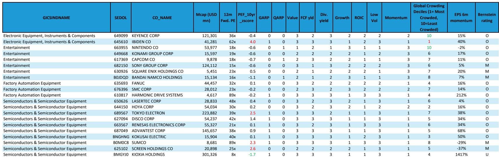
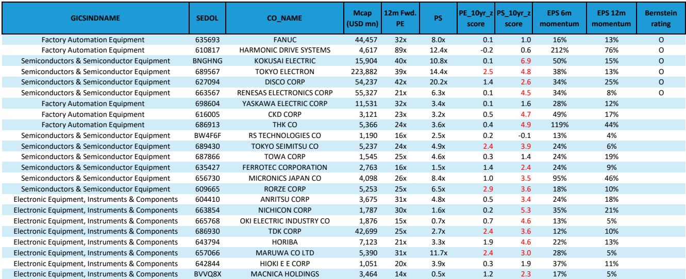
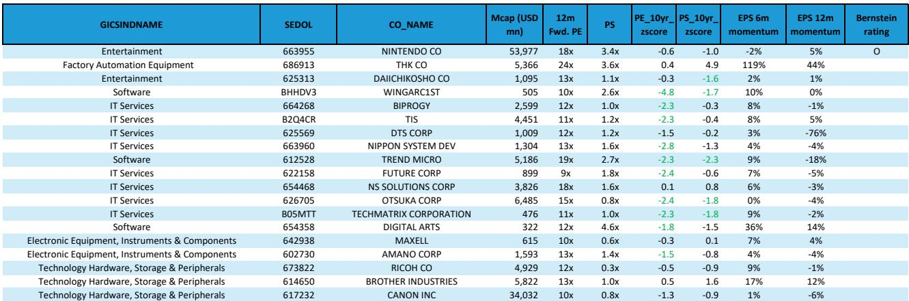

# Bernstein：研究主题与行业变化观察

日本科技板块在2026年上半年呈现极端分化。截至6月30日，等权重口径上涨14%，市值加权口径上涨60%，大型股主导了涨幅。半导体、工厂自动化和电子设备三个子板块大幅跑赢，而IT服务、软件和娱乐则持续承压。7月以来，资金开始从领涨板块流向落后板块，但Bernstein认为，这一轮动需要更有选择性地参与，而非全面切换。

报告的核心判断是：领涨板块的估值和情绪已处于极端水平，而落后板块的估值已回落至有吸引力的区间。但两者之间尚未出现明确的盈利或估值拐点，因此轮动的基础并不稳固。

## 1. 板块估值分化已至历史极端水平

日本科技板块整体市盈率为18.2倍，低于十年均值0.2个标准差，相对市场溢价21%，接近历史均值。但市销率已升至2.5倍，较五年均值高出2.6个标准差，较十年均值高出2.9个标准差。这意味着板块的盈利增长正在支撑估值，但收入端的价格已经非常昂贵。

具体来看，估值最贵的五分之一公司组合，其市销率溢价已从十年均值167%收窄至86%。2021年该组合的市销率峰值曾达到7.5倍，目前为4.6倍。报告认为，领涨板块的估值虽然已从高点回落，但相对水平仍然不低。

> **KC评论：** 市盈率看起来便宜，但市销率处于历史高位，说明市场对盈利增长有极高预期。一旦盈利增速节奏变化，估值不确定性会迅速显现。

## 2. 盈利上调周期接近峰值，但相对市场仍有空间

日本科技板块的盈利预期已升至历史最高水平。相对数值上看，上调空间可能有限。但相对整个市场而言，板块仍处于盈利上调周期，这意味着资金从科技板块流向其他板块的动力尚未形成。

报告特别指出，2026年上半年表现最好的子板块——半导体、工厂自动化和电子设备——其盈利预期已经非常充分，而落后板块如IT服务、软件和娱乐，则经历了极端的下调。这种分化意味着，落后板块的盈利预期可能已经触底，但能否反转仍需观察。

## 3. 因子层面：动量与GARP主导，质量与低波大幅跑输

2026年以来，只有动量因子和GARP因子在日本科技板块中产生了正超额收益。质量和低波动因子则大幅跑输。报告认为，动量因子目前仍有盈利支撑，估值也并非泡沫状态（与亚洲除中国科技板块不同），但盈利上调的幅度已接近极端水平，反转不确定性正在上升。

与此同时，高股息因子的持续跑输，与板块内部分公司稳健的盈利和估值支撑并不一致。报告因此建议，对动量因子的暴露应更加谨慎，同时关注落后板块中盈利动能正在改善的公司。

## 4. 子板块轮动已在7月发生，但需有选择

7月的数据显示，资金开始从半导体、工厂自动化等领涨板块流向IT服务、软件和娱乐。报告认为这一轮动有持续的基础，但需要更有选择性。原因在于，领涨板块的估值和情绪虽然极端，但盈利基本面仍然强劲；落后板块的估值虽然便宜，但盈利拐点尚未确认。

报告特别提到，日本科技板块内部的子板块离散度虽然不如亚洲除中国科技板块那么极端，但AI/科技主题在整个区域的高度相关性，意味着类似的轮动不确定性可能也会在其他市场出现。

## 5. 工厂自动化：2026年是加速年，Keyence为首选

报告对日本工厂自动化板块的展望最为明确。2025年是需求拐点年，全球工厂自动化需求恢复增长。2026年是加速年，预计全球需求将实现两位数增长，驱动力来自美国和欧洲的加速、日本的改善以及中国的持续强劲。

报告的首选标的是Keyence。尽管财报后市场预期已大幅上调，但仍比Bernstein的FY3/27每股盈利预测低6%。报告认为，估值和市场预期都对Keyence有利，下一轮估值重估的催化剂将是营收增长的加速，预计在2026年12月季度达到25%的同比增长峰值。

> **KC评论：** 工厂自动化是报告中最具确定性的子板块。但需注意，中东局势仍是宏观不确定性，可能影响资本开支节奏。报告认为这一不确定性会逐步缓解，但并未完全排除。

## 6. 半导体：AI需求驱动资本开支，设备商受益更确定

日本半导体板块在经历大幅上涨后已出现回调。报告认为，AI需求正在推动存储和先进逻辑的资本开支预期，前端和后端设备商均受益。但设备商的确定性更高，因为它们受益于DRAM、先进逻辑和中国资本开支的长期周期。

具体来看，东京电子、Kokusai和Screen受益于涨价和利润率扩张；DISCO和Advantest受益于结构性后端采用；Lasertec则受益于英特尔资本开支和EUV渗透率提升。Renesas被看好，因为AI电力需求正在推动功率半导体需求增长。Ibiden和Hoya的基本面也较为扎实。

## 7. 视频游戏：估值已跌至多年低位，但催化剂仍需等待

日本视频游戏板块近期出现反弹，与半导体情绪的极端释放同步。报告认为这一反弹是迟到的，因为板块估值已跌至多年低位。Capcom拥有2027年较强的新游戏阵容之一，GTA VI在11月的发布可能成为全球视频游戏资本配置的清算事件。Konami在世界杯后可能减少变现力度，但盈利增长仍将显著超出市场预期。

报告的整体框架是：在领涨板块估值和情绪极端、落后板块估值便宜但盈利拐点未确认的背景下，读者需要从全面押注转向有选择的公司配置。工厂自动化和半导体设备是确定性较高的方向，视频游戏则提供了估值修复的潜在机会，但需要等待催化剂。

For informational purposes only. Portions may be generated,translated,summarized,or edited with AI assistance based on source materials and may contain omissions or errors. Please verify independently. This is not investment,legal,tax,accounting,or other professional advice.

For informational purposes only. Portions may be generated,translated,summarized,or edited with AI assistance based on source materials and may contain omissions or errors. Please verify independently. This is not investment,legal,tax,accounting,or other professional advice.

