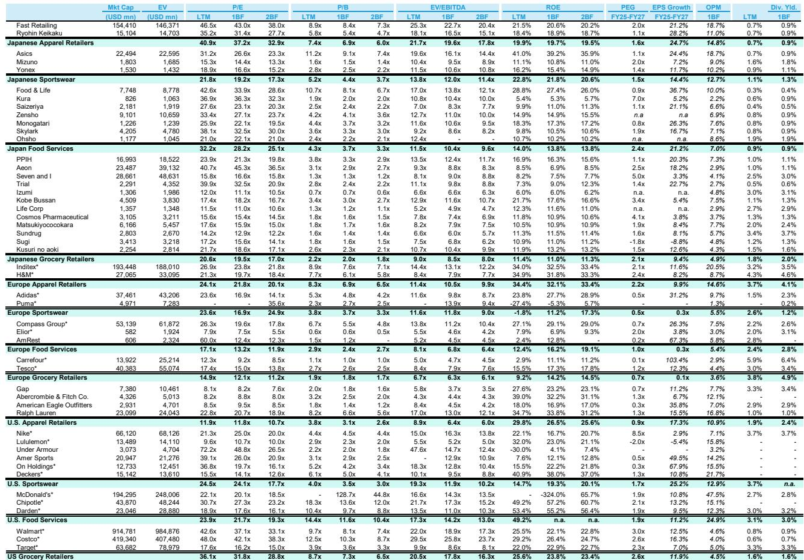
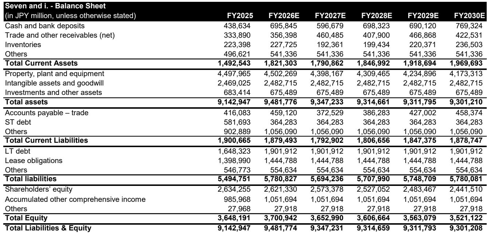
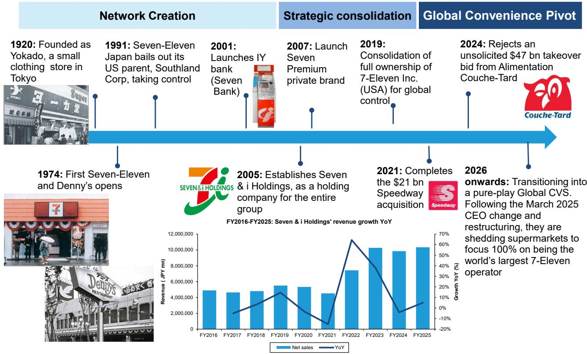

# Bernstein：研究主题与行业变化观察

Seven & i Holdings 在一周内完成了两笔方向相反的交易。这家日本零售巨头从软银牵头的财团获得至多 3000 亿日元（约 19 亿美元）资金，这笔钱并非用于收购，而是用于防御收购。六天后，它又拿出数百亿日元，观点偏积极波兰最大便利店连锁 Zabka 的两位数股权。Bernstein在最新深度报告中指出，这两笔交易并非可选项，而是必需品——Seven & i 的客流量仍在变化，北美业务尚未完成转型，而管理层现在又增加了第三个大洲的运营负担。

报告认为，Seven & i 的价值不在于增长，而在于其控制权本身的可出售性。节奏变化不确定性被 ACT 此前每股 2700 日元（区间 1900-2000 日元）的收购记忆所托底，上行则依赖伊藤忠商事等潜在买家回归，以及软银提供的条件性上限。但新股份发行、资本流出，叠加 2 万亿日元的回购计划，管理层需要向股东证明这些数字加总后成立。Bernstein给予 Seven & i 市场表现评级。

## 1. 客流量持续变化，提价掩盖了门店空置

Seven & i 日本便利店业务一季度客流量同比下降 0.9%。报告指出，提价暂时维持了营收数字，但门店实际交易笔数在减少。与此同时，销售管理费用（SG&A）的膨胀已经打破了加盟模式原本的运营杠杆——这意味着每增加一笔收入，固定成本占比反而更高，而非更低。

> **KC评论：** 客流量负增长叠加费用刚性，是便利店加盟模式最不愿看到的组合。报告没有直接说，但隐含的判断是：如果提价空间用尽，Seven & i 的利润表会面临双重影响。

## 2. 北美业务仍是未改造的燃油生意

报告对 Seven & i 北美业务的描述直白：它仍然是一个“未改革的燃油业务”。管理层此前承诺的美国市场转型计划进度落后于时间表。在已经需要同时管理日本、北美和欧洲（通过 Zabka）三个市场的情况下，Seven & i 的全球运营团队被认为“板凳深度不足”——这是报告原文的表述。

## 3. 软银的算盘：用便利店做 AI 试验场

对于软银，这笔交易几乎不动用其现金储备。报告认为，软银获得的真正价值在于孙正义“物理 AI”架构中缺失的一层：一个拥有 22000 家门店的实验室，AI 可以在日常运营中接受规模化测试。软银评级为跑赢大盘。

## 4. Zabka 获得 CVS 运营经验与更轻的 PE 持仓

对于 Zabka，这笔交易几乎全是利好。它获得了全球最大便利店运营商的运营经验，为其国际扩张计划提供了背书，同时 PE 持仓不确定性减轻（自由流通股比例升至 52%）。Bernstein给予 Zabka 跑赢大盘评级。

三家公司在同一周完成了同一场测试：Seven & i 必须证明自己能同时执行防御和增长；Zabka 无论结果如何都能获得运营支持；软银几乎不花钱就拿到了一个真实世界的 AI 测试场景。

For informational purposes only. Portions may be generated,translated,summarized,or edited with AI assistance based on source materials and may contain omissions or errors. Please verify independently. This is not investment,legal,tax,accounting,or other professional advice.

For informational purposes only. Portions may be generated,translated,summarized,or edited with AI assistance based on source materials and may contain omissions or errors. Please verify independently. This is not investment,legal,tax,accounting,or other professional advice.

