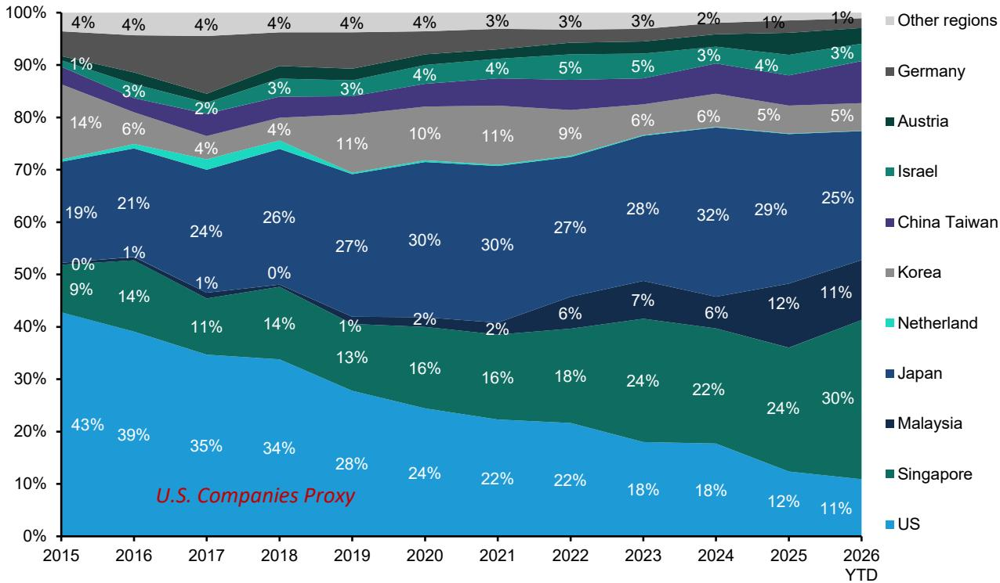
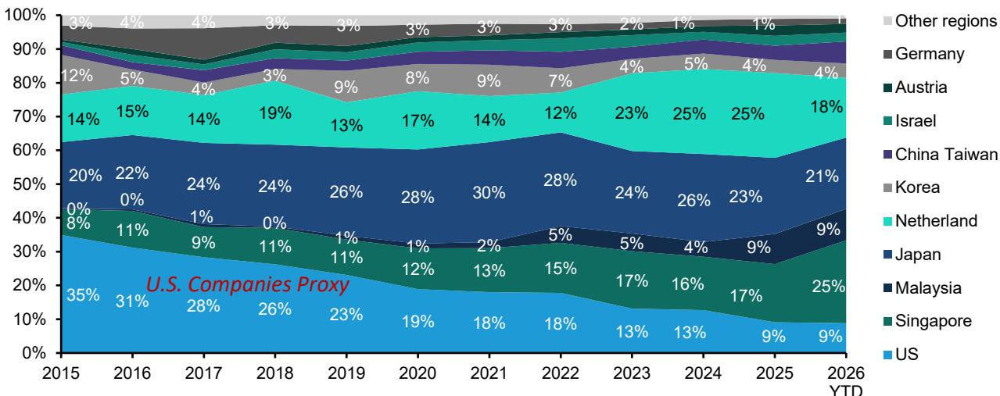
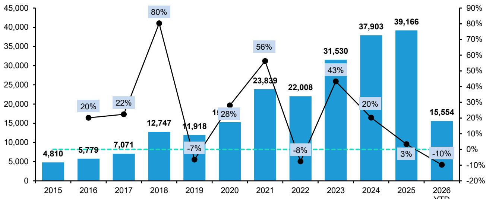

# Bernstein：全球半导体资本设备-中国WFE进口追踪-2026年6月

中国海关数据显示，2026年6月晶圆制造设备（WFE）进口总额为34亿美元，环比增长57%，同比微增1%。这一数字略高于2025年月均32亿美元的水平。Bernstein在最新一期中国WFE进口追踪报告中指出，上半年累计进口160亿美元，同比下降10%，主要影响来自光刻设备（上半年累计同比下降18%）和干法刻蚀设备（同比下降14%）。但6月单月数据表明，进口正在逐步恢复，尤其是光刻设备已从4月的低点回升至接近2025年月均水平。

报告认为，下半年中国WFE进口有望进一步回暖，存储类设备进口预计将明显走强。这一判断基于对设备类型、进口来源地和主要厂商收入关联度的多维度分析。

## 1. 光刻设备进口6月环比增长196%，但二季度仍同比下降

6月光刻设备进口额为8.42亿美元，环比增长196%，同比增长8%。然而，整个二季度的光刻进口环比下降24%，同比下降9%。Bernstein模型估算，二季度ASML在中国市场的系统销售收入约为10.2亿欧元，环比下降14%，同比下降32%，中国区收入占ASML总系统销售的比例约为16%，略高于ASML实际报告的14%。

ASML在二季度业绩会上重申，预计2026财年中国区收入占比将从2025年的33%降至20%。Bernstein认为，中国市场需求在未来几年仍将保持稳健，驱动力来自持续强劲的产能扩张研究，尤其是先进逻辑芯片领域。ASML近期计划在未来两年将DUV产能扩大30%，这一举措进一步支持了该机构的判断。

> **KC评论：** 光刻设备进口的月度波动较大，单月环比数据容易受发货节奏影响。二季度整体同比下降9%更能反映当前供应端的实际约束。ASML的产能扩张计划意味着，即便中国区收入占比下降，相对金额仍可能维持较高水平。

## 2. 进口来源地结构变化：美国供应商通过东南亚渠道发货

从进口来源地看，2026年上半年美国、马来西亚和新加坡三地合计进口份额为43%，高于2025年的35%和2024年的33%。日本份额为21%，低于2025年的23%和2024年的26%。荷兰份额为18%，低于2025年和2024年的25%。

排除光刻设备后，来自新加坡和马来西亚的进口自2021年以来逐步上升，而来自美国的直接进口份额下降。Bernstein认为，这一趋势很可能反映了美国供应商选择从其在东南亚的生产基地向中国发货，而非直接从美国本土出货。例如，应用材料在新加坡设有制造基地。

## 3. 主要设备厂商的中国区收入关联度：各家表现分化

Bernstein利用中国海关进口数据与主要设备厂商的季度收入建立回归模型，估算各公司在中国市场的收入变化。

对于泛林半导体，6月数据（3个月相关性）显示其6月季度中国区收入环比下降约24%，中国区收入占比约为23%，与管理层关于中国区收入环比下降的表述方向一致。

对于应用材料，6月数据（2个月相关性）显示其7月季度中国区收入环比增长约29%，中国区收入占比约为30%。管理层未对7月季度中国区收入给出具体指引，但表示全年中国业务将持平或略有增长。

对于科磊，6月数据（3个月相关性）显示其6月季度中国区收入环比增长约23%，中国区收入占比约为28%。管理层未提供具体指引，但表示今年中国WFE增速将慢于整体WFE。

对于东京电子，回归模型显示其中国区收入同比增长7%，环比增长19%，隐含中国区收入占比约为30%。对于国际电气，模型显示中国区收入同比增长37%，环比增长86%，隐含中国区收入占比约为44%。对于迪斯科，模型显示中国区收入同比下降45%，环比下降71%，隐含中国区收入占比约为16%。对于爱德万测试，模型显示中国区收入同比增长26%，环比下降13%，隐含中国区收入占比约为15%。

> **KC评论：** 不同厂商的中国区收入走势分化明显，这与各家的产品组合、客户结构和供应能力直接相关。光刻和刻蚀类设备进口恢复节奏不同，导致ASML和泛林半导体的中国区收入趋势出现差异。国际电气的高增长则反映了NAND存储领域产能恢复的迹象。

## 4. 设备类型进口结构：光刻占比下降，沉积和刻蚀占比上升

从设备类型看，2026年上半年光刻设备进口占比降至19%，低于2025年的27%和2024年的28%。沉积设备占比升至26%，干法刻蚀设备占比升至21%，均高于2025年水平。过程控制设备和其他设备也呈现增长。

这一结构变化表明，中国在光刻设备进口受限的情况下，正在加大对沉积、刻蚀等非光刻环节的设备采购力度。Bernstein认为，这与中国本土设备厂商在部分领域的份额提升趋势一致。该机构覆盖的中微公司、北方华创和拓荆科技均被给予跑赢行业评级，认为它们将受益于中国WFE国产替代进程中的加速份额获取。

For informational purposes only. Portions may be generated,translated,summarized,or edited with AI assistance based on source materials and may contain omissions or errors. Please verify independently. This is not investment,legal,tax,accounting,or other professional advice.

For informational purposes only. Portions may be generated,translated,summarized,or edited with AI assistance based on source materials and may contain omissions or errors. Please verify independently. This is not investment,legal,tax,accounting,or other professional advice.

